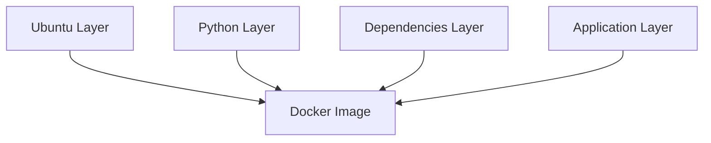
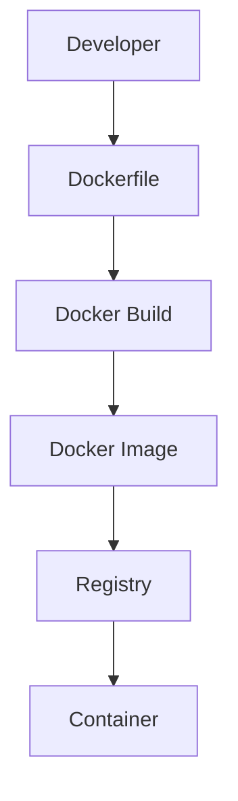
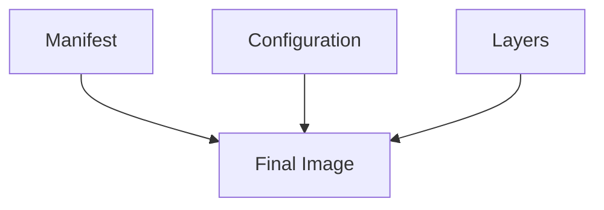
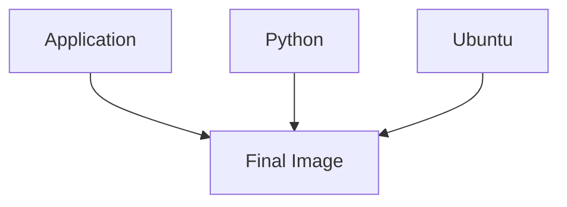
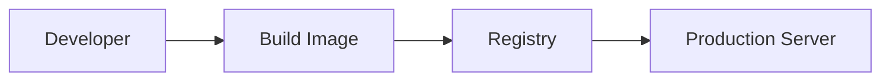
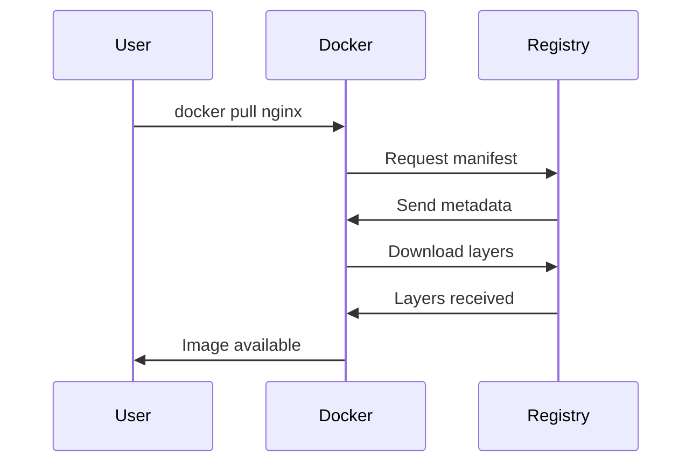
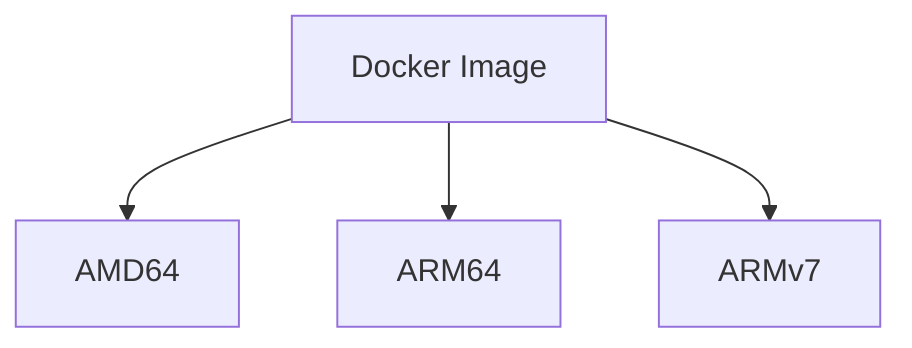
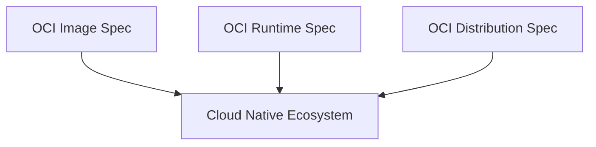
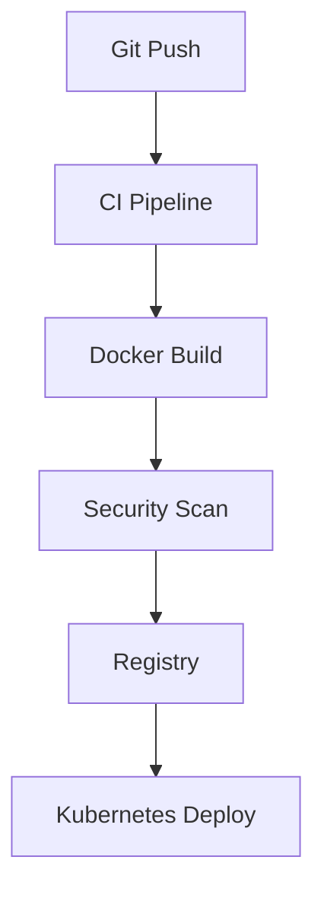

# Docker Images

> "Docker Images are not containers. Docker Images are immutable blueprints that describe reproducible software environments."

---

# Why This File Exists

Most beginners think:

```bash
docker pull nginx
```

downloads a container.

Wrong.

It downloads an image.

Then:

```bash
docker run nginx
```

creates a container from that image.

This distinction is one of the most important concepts in cloud infrastructure.

---

# The Biggest Misconception

Many people visualize:

```text
Docker Image

=

Container
```

Wrong.

The relationship is:

```text
Docker Image

↓

Container

↓

Running Process
```

A container is born from an image.

---

# Mental Model 1: Blueprint vs House

Imagine constructing a house.

Blueprint:

```text
Design

Materials

Instructions

Structure
```

House:

```text
Actual building
```

Docker equivalent:

```text
Docker Image

↓

Container
```

---

# Mental Model 2: Recipe vs Meal

Recipe:

```text
Ingredients

Instructions
```

Meal:

```text
Cooked food
```

Docker:

```text
Image

↓

Container
```

---

# Mental Model 3: Git Repository Analogy

Git repository:

```text
Code Snapshot
```

Docker Image:

```text
Infrastructure Snapshot
```

---

# The Official Definition

> A Docker Image is an immutable, layered, read-only artifact that contains everything necessary to run an application.

---

# What Does An Image Contain?

A Docker image may contain:

```text
Base OS

Runtime

Libraries

Dependencies

Environment Variables

Application Code

Configuration

Metadata
```

---

# The Biggest Mental Model

Think of images as:

```text
Portable Operating Environments
```

not

```text
Portable Applications
```

---

# Evolution Of Software Packaging

## Era 1

Install manually.

```text
Install Ubuntu

↓

Install Python

↓

Install Libraries

↓

Install App
```

Problem:

Inconsistent.

---

## Era 2

Virtual Machines.

```text
VM Snapshot
```

Heavy.

---

## Era 3

Docker Images.

```text
Lightweight

Immutable

Portable

Layered
```

---

# Docker Image Architecture



---

# Explain This Diagram

Every image is a stack of layers.

Example:

```dockerfile
FROM ubuntu

RUN apt install python3

COPY app.py .

CMD python3 app.py
```

Layers:

```text
Ubuntu

↓

Python

↓

Application
```

Combined into one image.

---

# Images Are Immutable

Immutable means:

```text
Cannot be changed
```

You do NOT update images.

You create new images.

Old thinking:

```text
Update server
```

Modern thinking:

```text
Build new image
```

---

# Infrastructure Evolution

```text
Mutable Infrastructure

↓

SSH Server

↓

Install Packages

↓

Modify Server

↓

Configuration Drift
```

Modern:

```text
Immutable Infrastructure

↓

Build Image

↓

Deploy Image

↓

Destroy Old System
```

Huge improvement.

---

# Image Lifecycle



---

# Step By Step Explanation

Developer:

```text
Writes Dockerfile
```

↓

Docker:

```text
Builds image
```

↓

Registry:

```text
Stores image
```

↓

Runtime:

```text
Creates container
```

---

# Image Anatomy

Image contains:

```text
manifest.json

config.json

layer.tar

metadata
```

---

# Simplified Architecture



---

# What Is A Manifest?

Manifest is the index.

It contains:

```text
Layer locations

Checksums

Architecture

Metadata
```

Think:

```text
Table Of Contents
```

---

# What Is Config?

Contains:

```text
Entrypoint

Environment Variables

Working Directory

Command

User

Labels
```

---

# What Are Layers?

Layers are filesystem changes.

Example:

```dockerfile
FROM ubuntu

RUN apt update

RUN apt install python3

COPY app.py .
```

Produces:

```text
Layer 1 Ubuntu

Layer 2 apt update

Layer 3 Python

Layer 4 Application
```

---

# Layer Visualization



---

# Image IDs

Every image gets:

```text
SHA256 Hash
```

Example:

```text
sha256:e7a38c...
```

Why?

Content addressing.

---

# Why Hashes Matter

If anything changes:

```text
Code

Dependencies

Libraries
```

Hash changes.

This ensures integrity.

---

# Image Tags

Example:

```bash
nginx:latest

nginx:1.27

python:3.12
```

Tag format:

```text
repository:tag
```

---

# Important Production Rule

Never rely on:

```text
latest
```

Bad practice.

Always use:

```text
Explicit versions
```

Example:

```text
node:22.5

postgres:17.1
```

---

# Where Images Live

Images live inside registries.

Examples:

```text
Docker Hub

GitHub Container Registry

AWS ECR

Google Artifact Registry

Azure Container Registry

Harbor
```

---

# Registry Architecture



---

# Docker Pull Flow



---

# Where Images Are Stored Locally

Linux location:

```bash
/var/lib/docker
```

Important directories:

```text
image/

overlay2/

containers/
```

---

# Multi Architecture Images

One image can support:

```text
amd64

arm64

armv7
```

Very important.

Example:

```text
Intel CPUs

Apple Silicon

Raspberry Pi
```

---

# Architecture Visualization



---

# OCI Standard

OCI = Open Container Initiative.

Defines standards for:

```text
Images

Runtimes

Registries
```

Without OCI:

Chaos.

---

# OCI Architecture



---

# Relationship With OverlayFS

Images are read-only.

Containers add:

```text
Writable Layer
```

Formula:

```text
Docker Image

+

Writable Layer

=

Container
```

---

# Relationship With Kubernetes

Kubernetes does NOT build images.

Kubernetes consumes images.

Flow:

```text
Image

↓

Pod

↓

Container
```

---

# CI/CD Relationship

Pipeline:



---

# Software Supply Chain

Modern infrastructure:

```text
Code

↓

Build

↓

Image

↓

Scan

↓

Sign

↓

Registry

↓

Deploy
```

Images are the center.

---

# Production Example

Microservices:

```text
Auth Service

Payment Service

Notification Service

Analytics Service
```

Each service:

```text
Own Repository

Own Image

Own Deployment
```

---

# Security Considerations

Images are major attack vectors.

Always scan images.

Threats:

```text
Outdated Packages

Secrets

Malware

Supply Chain Attacks
```

Tools:

```text
Trivy

Grype

Clair

Docker Scout
```

---

# Image Signing

Production images should be signed.

Tools:

```text
Cosign

Notary
```

Ensures:

```text
Integrity

Authenticity
```

---

# Multi Stage Builds

Bad:

```dockerfile
Build Tools

Compiler

Dependencies

Application

Everything inside image
```

Good:

```dockerfile
Builder Stage

↓

Final Stage
```

Smaller.

Safer.

---

# Performance Considerations

Optimize:

```text
Layer count

Image size

Caching

Base image choice
```

Avoid:

```text
Gigantic images
```

---

# Scaling Considerations

Thousands of containers mean:

Thousands of image downloads.

Optimization matters.

Strategies:

```text
Image caching

CDN

Regional registries
```

---

# Observability Considerations

Monitor:

```text
Image size

Pull time

Build time

Vulnerabilities

Layer growth
```

Useful commands:

```bash
docker images

docker image inspect

docker history

docker system df
```

---

# Common Mistakes

## Mistake 1

Thinking images are containers.

Wrong.

---

## Mistake 2

Using latest tag.

Bad.

---

## Mistake 3

Creating gigantic images.

Expensive.

---

## Mistake 4

Embedding secrets inside images.

Dangerous.

---

## Mistake 5

Skipping image scanning.

Production risk.

---

# Troubleshooting Guide

Image huge?

```bash
docker history image
```

Slow builds?

```text
Check layer ordering
```

Slow pulls?

```text
Check registry latency
```

Security issues?

```text
Scan images
```

---

# Engineering Mindset

Do not think:

```text
Docker Image = Snapshot
```

Think:

```text
Docker Image

=

Immutable

Layered

Portable

Reproducible

Deployable

Secure

Software Artifact
```

---

# Evolution Of Thinking

```text
Application

↓

Image

↓

Container

↓

Pod

↓

Cluster

↓

Cloud Native System
```

---

# Interview Questions

## Beginner

1. What is a Docker image?

2. What is the difference between an image and a container?

3. Why are images immutable?

4. Why are images layered?

5. What is a registry?

---

## Intermediate

6. Explain image lifecycle.

7. Explain image layers.

8. Explain manifests.

9. Explain image tags.

10. Explain OCI.

---

## Advanced

11. Explain software supply chains.

12. Explain image security.

13. Explain multi-architecture images.

14. Explain image optimization.

15. Explain CI/CD integration.

---

# Cheat Sheet

```text
Docker Image

=

Immutable Artifact


Contains:

OS

Runtime

Libraries

Application

Metadata


Lifecycle:

Dockerfile

↓

Build

↓

Image

↓

Registry

↓

Container


Production Rules:

✓ Immutable

✓ Versioned

✓ Scanned

✓ Signed

✓ Optimized

✓ Small

✓ Reproducible
```

---

# Final Thought

Containers are temporary.

Servers are temporary.

Clusters are temporary.

But images are the source of truth.

Modern infrastructure no longer deploys code.

**Modern infrastructure deploys images.**

That single shift changed the software industry forever.
