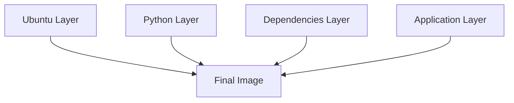
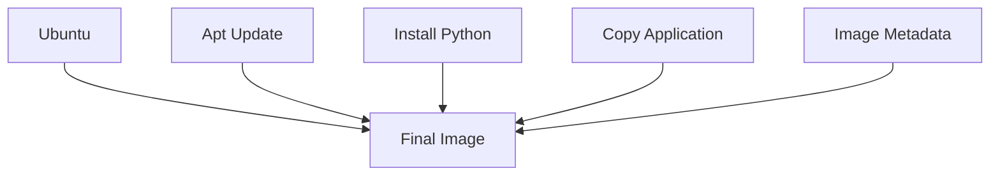
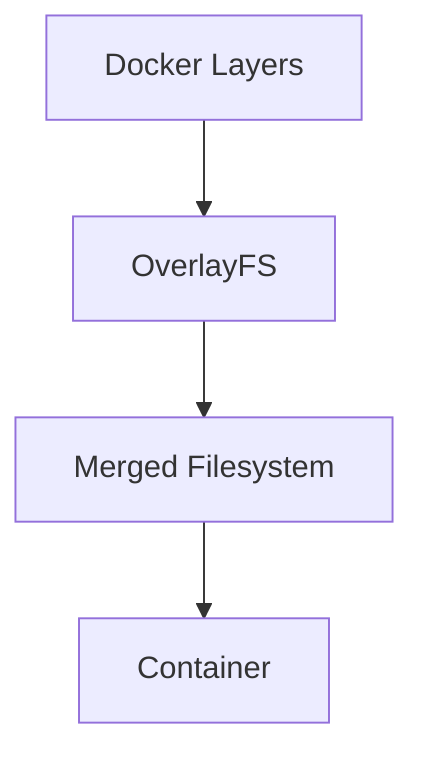
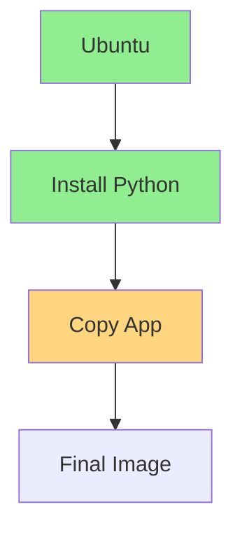
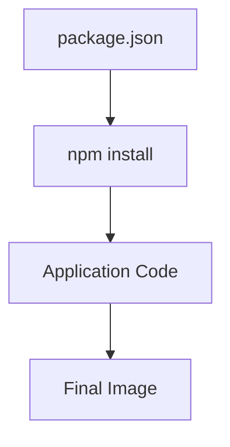
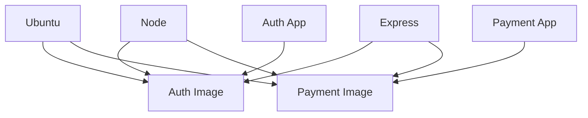
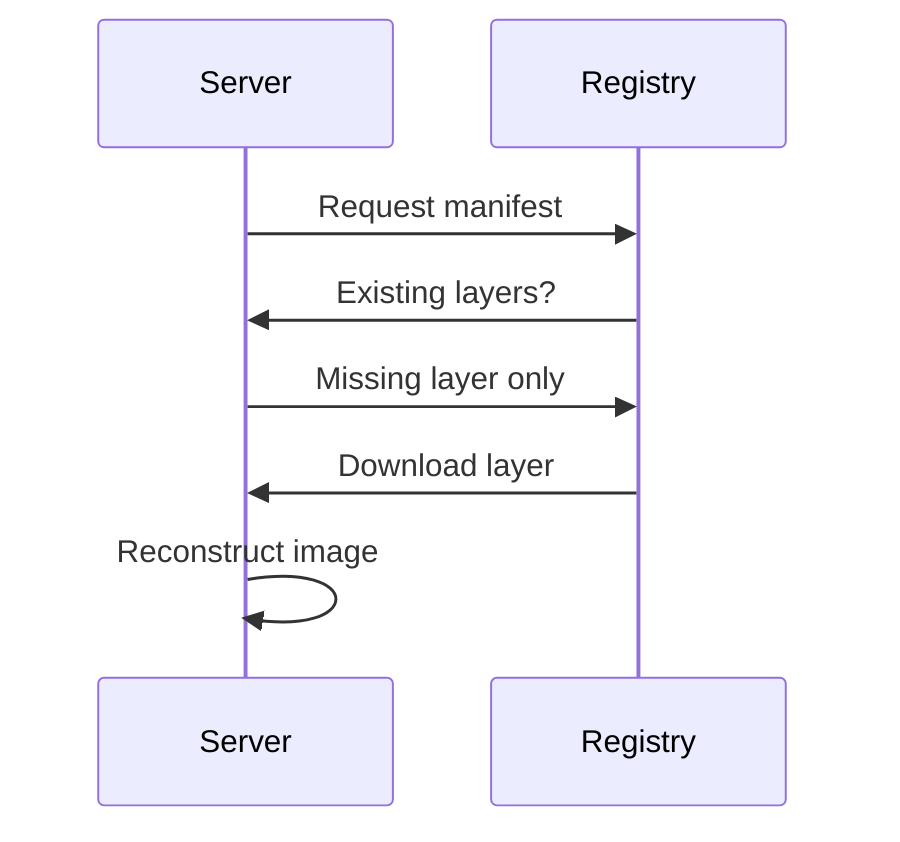
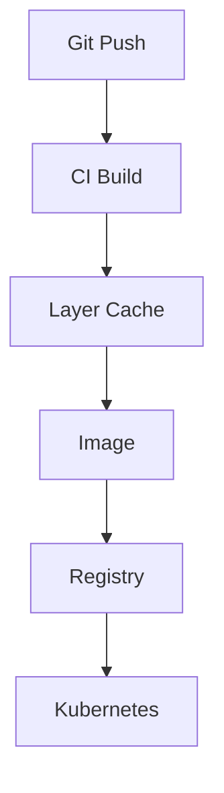

# Docker Layers

> "Docker layers transformed software distribution from repeatedly moving entire systems into intelligently sharing reusable pieces."

---

# Why This File Exists

Most Docker tutorials teach:

> Every Dockerfile instruction creates a layer.

That's true.

But that's only 5% of the story.

The real story is:

> Docker layers solved one of the biggest infrastructure scaling problems in software engineering.

This file exists to answer:

> How can millions of containers around the world share software efficiently?

---

# The Biggest Misconception

Many people think:

```text
Docker Image

=

One File
```

Wrong.

A Docker image is:

```text
Collection Of Layers
```

---

# The Biggest Mental Model

Think:

> Docker layers are reusable building blocks of infrastructure.

---

# Mental Model 1: LEGO Blocks

Traditional deployment:

```text
Entire House

↓

Copy Entire House

↓

Copy Entire House
```

Docker layers:

```text
Foundation

↓

Walls

↓

Windows

↓

Roof
```

Reuse pieces.

Build efficiently.

---

# Mental Model 2: Photoshop Layers

Imagine Photoshop.

```text
Background

↓

Text

↓

Icons

↓

Effects
```

Each layer is independent.

Together:

```text
Final Image
```

Docker works similarly.

---

# Mental Model 3: Git Commits

Git:

```text
Commit 1

Commit 2

Commit 3
```

Docker:

```text
Layer 1

Layer 2

Layer 3
```

Both represent changes over time.

---

# The Core Problem

Imagine 100 microservices.

Every service needs:

```text
Ubuntu

Python

Libraries

Application
```

Without layers:

```text
100 full systems
```

Storage explosion.

Network explosion.

Cloud costs explode.

---

# The Revolutionary Idea

Instead of:

```text
Copy everything
```

Do:

```text
Reuse everything

Copy only changes
```

This is the foundation of Docker layers.

---

# The Official Definition

> A Docker layer is an immutable filesystem change created during image construction.

Simple definition:

> Every layer represents a difference.

---

# Layer Architecture



---

# What This Diagram Means

Instead of one giant image:

```text
Ubuntu

+

Python

+

Dependencies

+

Application
```

Docker stores:

```text
Ubuntu

↓

Python

↓

Dependencies

↓

Application
```

independently.

---

# The Formula

```text
Docker Image

=

Layer 1

+

Layer 2

+

Layer 3

+

Layer 4
```

---

# Dockerfile Example

```dockerfile
FROM ubuntu

RUN apt update

RUN apt install python3

COPY app.py .

CMD python3 app.py
```

Produces layers.

---

# Layer Mapping

```text
FROM ubuntu

↓

Layer 1

Ubuntu


RUN apt update

↓

Layer 2


RUN apt install python3

↓

Layer 3


COPY app.py

↓

Layer 4
```

CMD itself does not create a filesystem layer.

It creates metadata.

---

# Visual Representation



---

# Image Layer Stack

```text
+----------------+

Application Layer

+----------------+

Python Layer

+----------------+

Ubuntu Layer

+----------------+
```

Applications see:

```text
One Filesystem
```

Reality:

```text
Many layers
```

---

# Relationship With OverlayFS

OverlayFS combines layers.

Docker stores:

```text
Layers
```

OverlayFS merges them.

Architecture:



---

# Why Immutability Matters

Layers never change.

If code changes:

```text
Old layer stays

↓

New layer created
```

Benefits:

```text
Predictable

Versioned

Cacheable

Secure
```

---

# Layer IDs

Every layer gets:

```text
SHA256 Hash
```

Example:

```text
sha256:84ae98...
```

Content changes?

Hash changes.

---

# Build Cache: Docker's Superpower

Suppose:

```dockerfile
FROM ubuntu

RUN apt install python3

COPY app.py .
```

You change:

```text
app.py
```

Docker rebuilds only:

```text
COPY app.py
```

Huge optimization.

---

# Build Cache Visualization



Green:

```text
Reused Cache
```

Orange:

```text
Rebuilt Layer
```

---

# Layer Cache Rules

Docker compares:

```text
Instruction

Context

Files

Metadata
```

If unchanged:

```text
Reuse cache
```

Otherwise:

```text
Rebuild
```

---

# Why Layer Order Matters

Bad Dockerfile:

```dockerfile
COPY . .

RUN npm install
```

Every code change:

```text
Reinstall dependencies
```

Slow.

---

# Better Dockerfile

```dockerfile
COPY package.json .

RUN npm install

COPY . .
```

Now:

Code changes:

```text
Reuse dependencies
```

Huge speed gain.

---

# Optimization Visualization



Only application layer changes frequently.

---

# Layer Reuse Across Services

Imagine:

Auth Service:

```text
Ubuntu

Node

Express

Auth App
```

Payment Service:

```text
Ubuntu

Node

Express

Payment App
```

Docker reuses:

```text
Ubuntu

Node

Express
```

Only application differs.

---

# Shared Layer Architecture



---

# Pull Optimization

Suppose image exists.

Only one layer changed.

Instead of downloading:

```text
2 GB image
```

Docker downloads:

```text
50 MB layer
```

Huge network savings.

---

# Pull Flow



---

# Cloud Economics

Imagine:

1000 servers.

Without layers:

```text
1000 × 2GB
```

2 TB transfer.

With layers:

```text
50 MB transfer
```

Massive savings.

---

# Relationship With Kubernetes

Kubernetes:

```text
Pod

↓

Image Pull

↓

Reuse Existing Layers

↓

Container Starts
```

Startup becomes faster.

---

# CI/CD Relationship



---

# Multi Stage Build Relationship

Instead of:

```text
Compiler

Libraries

Source Code

Application
```

in one image.

Do:

Builder Stage:

```text
Compiler
```

↓

Final Stage:

```text
Application only
```

Smaller images.

---

# Layer Storage Internals

Linux location:

```bash
/var/lib/docker/overlay2
```

Contains:

```text
Layer Directories
```

---

# Useful Commands

See layers:

```bash
docker history nginx
```

Inspect image:

```bash
docker image inspect nginx
```

Disk usage:

```bash
docker system df
```

---

# Production Example

Company:

```text
200 Microservices
```

Shared:

```text
Ubuntu

Node.js

OpenSSL
```

Unique:

```text
Business Logic
```

Layer reuse dramatically reduces:

```text
Bandwidth

Storage

Build Time
```

---

# Security Considerations

Layers can leak:

```text
Secrets

API Keys

Passwords
```

Never do:

```dockerfile
COPY . .
```

without `.dockerignore`.

---

# Common Secret Leak Example

Bad:

```dockerfile
COPY . .
```

Copies:

```text
.env

.git

Secrets
```

Dangerous.

---

# Performance Considerations

Optimize:

```text
Layer count

Layer order

Base image size

Build cache
```

Avoid:

```text
Huge layers
```

---

# Scaling Considerations

At scale optimize:

```text
Registry bandwidth

Regional caches

Image pull time

Node cache hit ratio
```

---

# Observability Considerations

Monitor:

```text
Build duration

Image size

Cache hit rate

Layer growth

Pull duration
```

Tools:

```text
docker history

docker system df

docker buildx

Trivy

Docker Scout
```

---

# Common Mistakes

## Mistake 1

Thinking layers are files.

Wrong.

They are filesystem differences.

---

## Mistake 2

Putting changing code at the top.

Kills caching.

---

## Mistake 3

Gigantic base images.

Expensive.

---

## Mistake 4

Ignoring `.dockerignore`.

Dangerous.

---

## Mistake 5

Too many layers.

Creates inefficiencies.

---

# Troubleshooting Guide

Slow builds?

Check:

```text
Layer order
```

---

Huge image?

Check:

```bash
docker history image
```

---

Slow deployments?

Check:

```text
Layer reuse
```

---

Secrets leaked?

Check:

```text
Dockerfile

.dockerignore
```

---

# Engineering Mindset

Do not think:

```text
Docker Layers = Build Steps
```

Think:

```text
Docker Layers

=

Infrastructure Optimization Engine
```

They optimize:

```text
Storage

Bandwidth

Deployment

Caching

Cloud Costs

Scalability
```

---

# Evolution Of Thinking

```text
Linux Filesystems

↓

Union Filesystems

↓

OverlayFS

↓

Docker Layers

↓

Docker Images

↓

Containers

↓

Kubernetes

↓

Cloud Native Infrastructure
```

---

# Interview Questions

## Beginner

1. What is a Docker layer?

2. Why do layers exist?

3. Why are layers immutable?

4. How do layers reduce storage?

5. What is build cache?

---

## Intermediate

6. Explain Docker layer architecture.

7. Explain layer reuse.

8. Explain build cache.

9. Explain OverlayFS relationship.

10. Explain layer ordering.

---

## Advanced

11. Explain cloud economics.

12. Explain Kubernetes image optimization.

13. Explain image pull optimization.

14. Explain production image strategies.

15. Explain supply chain implications.

---

# Cheat Sheet

```text
Docker Layer

=

Immutable Filesystem Change


Docker Image

=

Collection Of Layers


Layer Benefits:

✓ Reusable

✓ Immutable

✓ Cacheable

✓ Portable

✓ Optimized


Optimizations:

✓ Layer Ordering

✓ Build Cache

✓ Multi Stage Builds

✓ Small Base Images

✓ .dockerignore


Infrastructure Evolution:

Linux

↓

OverlayFS

↓

Docker Layers

↓

Docker Images

↓

Containers

↓

Cloud Native Systems
```

---

# Final Thought

Docker layers are one of the greatest invisible optimizations in modern infrastructure.

Without them:

```text
Cloud Costs ↑

Bandwidth ↑

Storage ↑

Deployment Time ↑
```

With them:

```text
Infrastructure becomes modular.
```

And modularity is one of the reasons modern cloud systems can scale to millions of deployments every day.
