# Docker Networking

> "Docker networking is not a Docker feature. It is Linux networking virtualization packaged into an easy interface."

---

# Why This File Exists

One of the biggest beginner questions:

```bash
docker run nginx
```

works.

Then:

```bash
docker run postgres
```

works.

But:

> How does nginx talk to postgres?

Most tutorials answer:

```bash
Use docker network
```

But that teaches commands.

This file teaches systems.

---

# The Biggest Misconception

Many people think:

```text
Docker creates networking
```

Wrong.

Linux already had networking.

Docker orchestrates Linux networking.

---

# The Core Problem

Imagine:

```text
Server

↓

Container A

↓

Container B

↓

Container C
```

Questions:

```text
How do they talk?

How do they get IP addresses?

How do they find each other?

How do they reach the internet?

How do users reach them?
```

This entire system is Docker networking.

---

# The Biggest Mental Model

Think:

> Every container is a tiny computer connected to a virtual network.

---

# Mental Model 1: Apartment Building

Linux Host:

```text
Apartment Building
```

Containers:

```text
Apartments
```

Networking:

```text
Hallways + Elevator + Reception Desk
```

Residents can:

```text
Talk internally

Receive visitors

Go outside
```

---

# Mental Model 2: Tiny Virtual Servers

Every container gets:

```text
Own IP

Own Network Interface

Own Routing Table

Own DNS

Own Ports
```

Containers are tiny virtual servers.

---

# The Big Formula

```text
Docker Networking

=

Linux Networking

+

Namespaces

+

veth pairs

+

Bridges

+

iptables

+

NAT

+

DNS
```

Memorize this.

---

# Big Picture Architecture

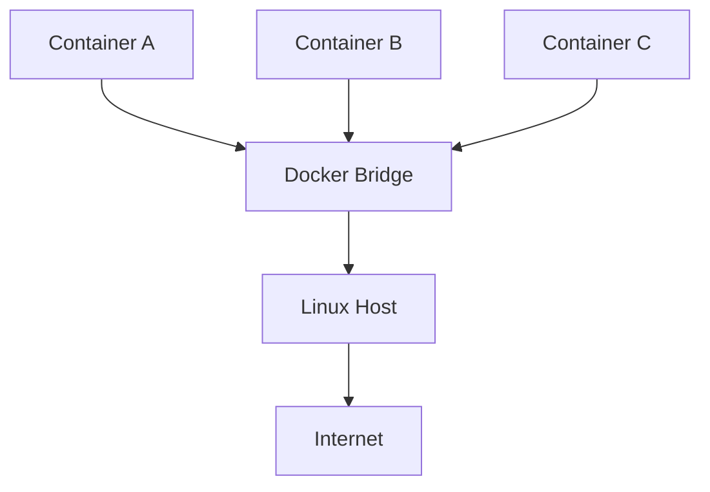

---

# The Entire Network Stack

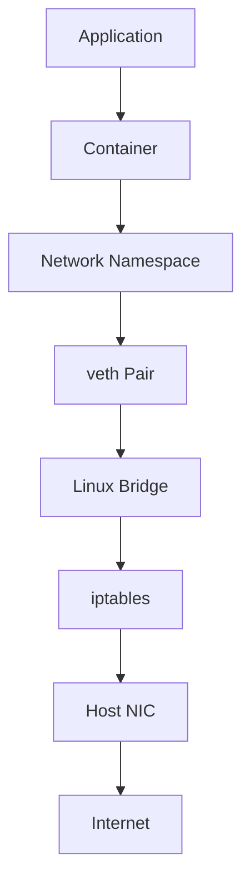

---

# Explain This Diagram

Each layer has responsibilities.

Application:

```text
Generates traffic
```

Container:

```text
Runs application
```

Network Namespace:

```text
Creates isolation
```

veth:

```text
Acts as cable
```

Bridge:

```text
Acts as switch
```

iptables:

```text
Acts as firewall/router
```

Host NIC:

```text
Connects to internet
```

---

# Step 1: Network Namespace

Every container gets its own network world.

Each container has:

```text
eth0

localhost

routing table

DNS config
```

---

# Namespace Visualization

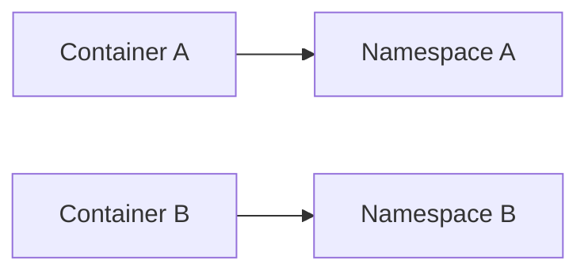

Containers cannot see each other's networking directly.

---

# Step 2: Virtual Ethernet Pair (veth)

Think:

```text
Virtual Cable
```

veth always comes in pairs.

```text
End A

↓

End B
```

One end:

```text
Container
```

Other end:

```text
Host
```

---

# veth Visualization


---

# Step 3: Linux Bridge

Docker creates:

```text
docker0
```

This acts like a virtual switch.

---

# Bridge Visualization

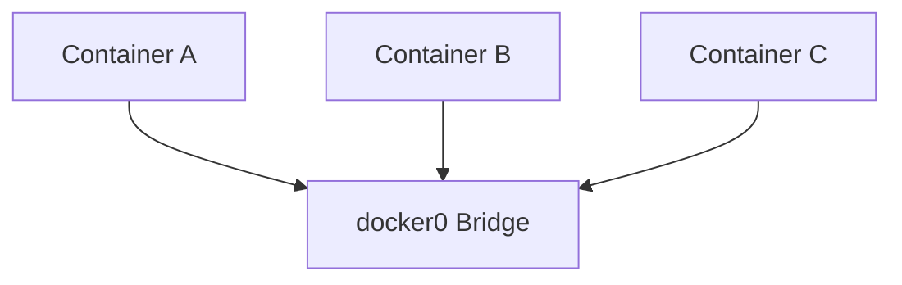

---

# Check Bridge

```bash
ip addr show docker0
```

Example:

```text
172.17.0.1
```

---

# Step 4: IP Address Allocation

Docker automatically assigns:

```text
172.17.0.2

172.17.0.3

172.17.0.4
```

Each container gets one.

---

# Example

Container A:

```text
172.17.0.2
```

Container B:

```text
172.17.0.3
```

Container C:

```text
172.17.0.4
```

---

# Step 5: Internet Access

Question:

How does container reach Google?

Container:

```text
172.17.0.2
```

cannot exist publicly.

Docker uses:

```text
NAT
```

---

# NAT Flow

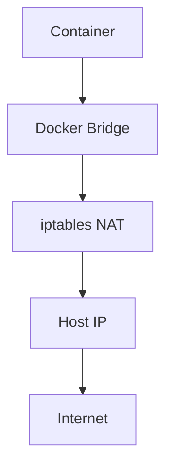

---

# Container Traffic Flow

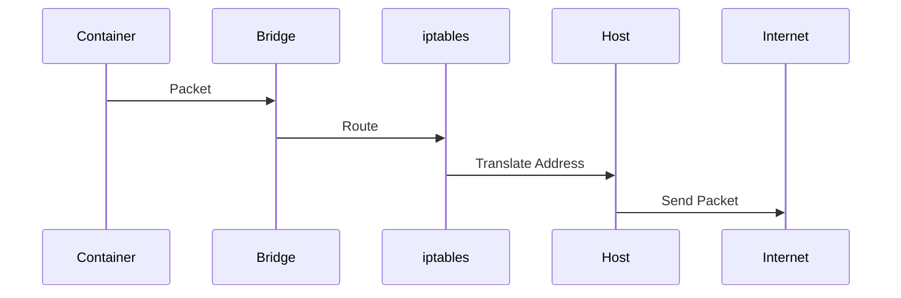

---

# Docker DNS

Containers can discover each other.

Instead of:

```text
172.18.0.5
```

Use:

```text
postgres
```

This is service discovery.

---

# DNS Architecture

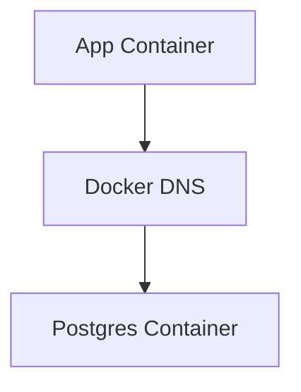

---

# Types Of Docker Networks

Docker supports several drivers.

```text
Bridge

Host

None

Overlay

Macvlan
```

Each solves different problems.

---

# Bridge Network

Default.

Best for:

```text
Single server
```

Architecture:

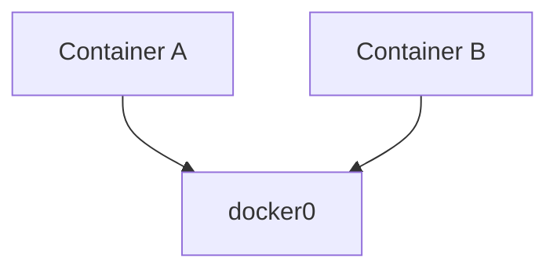

---

# Host Network

Shares host networking.

No isolation.

Container directly uses:

```text
Host IP
```

---

# Host Network Visualization

```text
Container

↓

Host Network

↓

Internet
```

No bridge.

No NAT.

---

# None Network

No networking.

Container becomes isolated.

Useful for:

```text
Security

Batch jobs

Special workloads
```

---

# Overlay Network

Multi-server networking.

Used in:

```text
Docker Swarm

Kubernetes
```

---

# Overlay Visualization

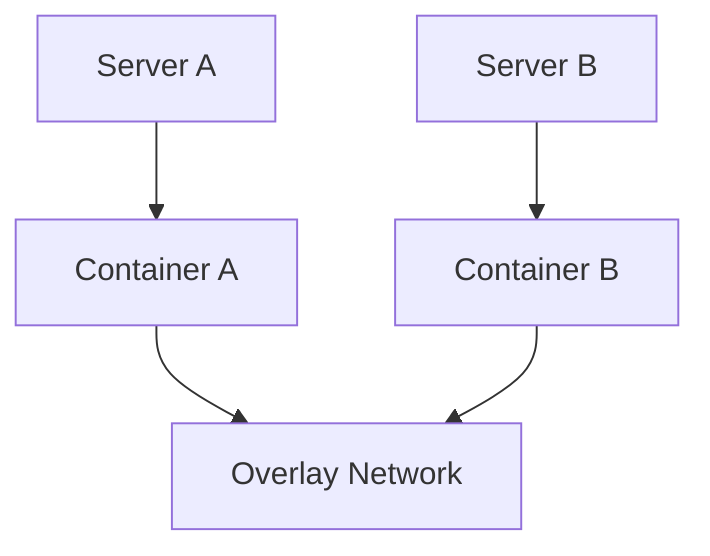

---

# Macvlan Network

Containers become real devices.

They get:

```text
Real LAN IP
```

Useful for:

```text
IoT

Legacy Systems

Appliances
```

---

# Port Publishing

Very important.

Without:

```bash
docker run nginx
```

Nobody outside can access it.

With:

```bash
docker run -p 8080:80 nginx
```

Users can.

---

# Port Mapping Visualization


---

# Data Flow Example

User requests:

```text
localhost:8080
```

Flow:

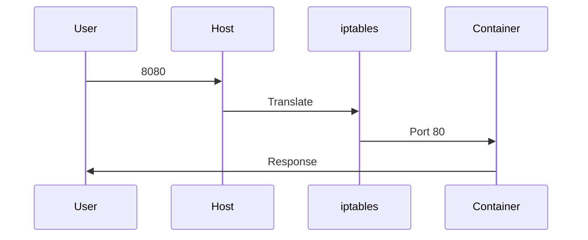

---

# Docker Compose Networking

Compose automatically creates networks.

Services:

```yaml
frontend

backend

database
```

can talk using names.

---

# Compose Visualization

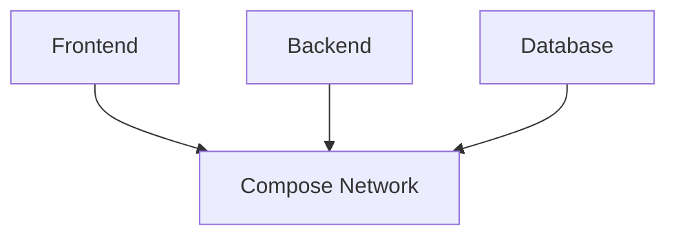

---

# Relationship With Kubernetes

Kubernetes evolved these ideas.

Docker:

```text
Container Networking
```

Kubernetes:

```text
Cluster Networking
```

Rule:

> Every pod gets its own IP.

---

# Kubernetes Architecture

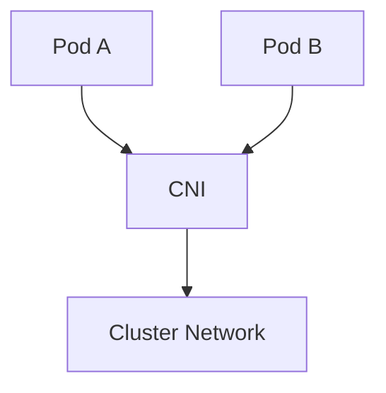

---

# Relationship With Linux Topics

Everything connects.

```text
Linux Networking

↓

Namespaces

↓

veth

↓

Bridges

↓

iptables

↓

Docker Networking

↓

Kubernetes Networking

↓

Cloud Networking
```

---

# Cloud Provider Connection

Clouds build giant versions of this.

Examples:

```text
AWS VPC

Azure VNet

Google VPC
```

Very similar ideas.

---

# Production Example

Microservices:

```text
Frontend

↓

API Gateway

↓

Authentication

↓

Payments

↓

Notifications

↓

Database
```

All connected through networking.

---

# Production Architecture

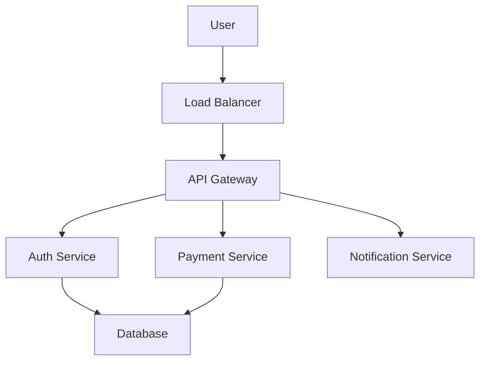

---

# Performance Considerations

Network bottlenecks:

```text
DNS latency

Bridge overhead

NAT overhead

Packet processing

Bandwidth limits
```

Optimize carefully.

---

# Security Considerations

Protect:

```text
Ports

DNS

Network policies

Firewall rules
```

Never expose everything publicly.

---

# Scaling Considerations

As services grow:

```text
10 containers

↓

100 containers

↓

1000 containers
```

Networking complexity explodes.

This is why orchestration platforms exist.

---

# Observability Considerations

Monitor:

```text
Latency

Packet loss

DNS resolution

Bandwidth

Connection count

Errors
```

Tools:

```text
ip

ss

netstat

tcpdump

wireshark

Prometheus

Grafana
```

---

# Useful Commands

View networks:

```bash
docker network ls
```

Inspect:

```bash
docker network inspect bridge
```

Inspect container IP:

```bash
docker inspect container_name
```

See interfaces:

```bash
ip addr
```

See routes:

```bash
ip route
```

---

# Common Mistakes

## Mistake 1

Thinking Docker created networking.

Wrong.

Linux did.

---

## Mistake 2

Exposing all ports publicly.

Dangerous.

---

## Mistake 3

Hardcoding IP addresses.

Bad practice.

Use DNS.

---

## Mistake 4

Ignoring network namespaces.

Huge knowledge gap.

---

## Mistake 5

Treating networking as an afterthought.

Networking is infrastructure.

---

# Troubleshooting Guide

Cannot reach container?

Check:

```text
Port mapping?
```

---

Containers cannot communicate?

Check:

```text
Same network?
```

---

Internet not working?

Check:

```text
NAT?
```

---

DNS failing?

Check:

```text
Service names?
```

---

Useful commands:

```bash
docker network ls

docker inspect

ping

curl

nslookup

dig

ip addr

ip route
```

---

# Engineering Mindset

Do not think:

```text
Docker Networking = Expose Ports
```

Think:

```text
Docker Networking

=

Linux Network Virtualization

=

Microservice Communication

=

Software Defined Networking
```

---

# Evolution Of Thinking

```text
Linux Networking

↓

Network Namespaces

↓

veth

↓

Linux Bridges

↓

Docker Networking

↓

Kubernetes Networking

↓

Cloud Networking

↓

Distributed Systems
```

---

# Interview Questions

## Beginner

1. What is Docker networking?

2. Why does every container get an IP?

3. What is docker0?

4. What is port mapping?

5. What is a bridge network?

---

## Intermediate

6. Explain veth pairs.

7. Explain network namespaces.

8. Explain Docker DNS.

9. Explain NAT.

10. Explain bridge architecture.

---

## Advanced

11. Explain the entire packet flow.

12. Explain Kubernetes networking.

13. Explain service discovery.

14. Explain cloud networking similarities.

15. Explain SDN concepts.

---

# Cheat Sheet

```text
Docker Networking

=

Linux Networking

+

Namespaces

+

veth

+

Bridges

+

iptables

+

NAT

+

DNS


Network Drivers:

Bridge

Host

None

Overlay

Macvlan


Infrastructure Evolution:

Linux Networking

↓

Docker Networking

↓

Kubernetes Networking

↓

Cloud Networking
```

---

# Final Thought

Docker networking was never about connecting containers.

It was about teaching Linux a new trick:

> Turn one machine into an entire virtual data center.

That single idea became the foundation of modern cloud infrastructure.
