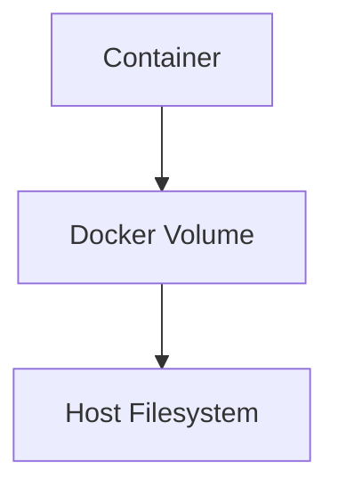
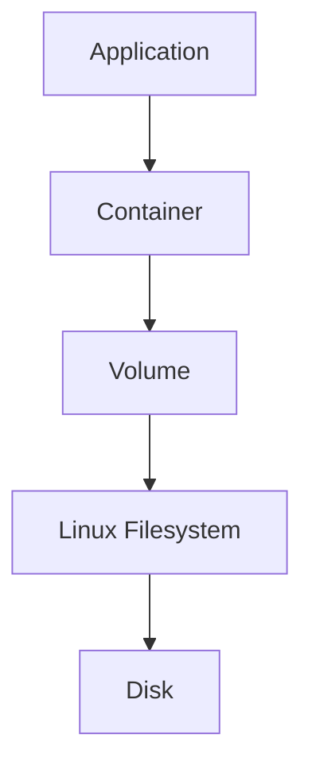
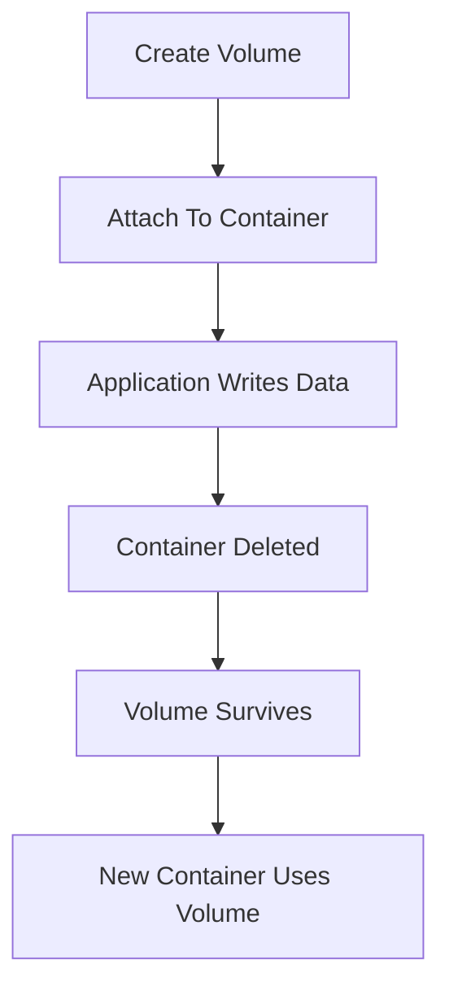
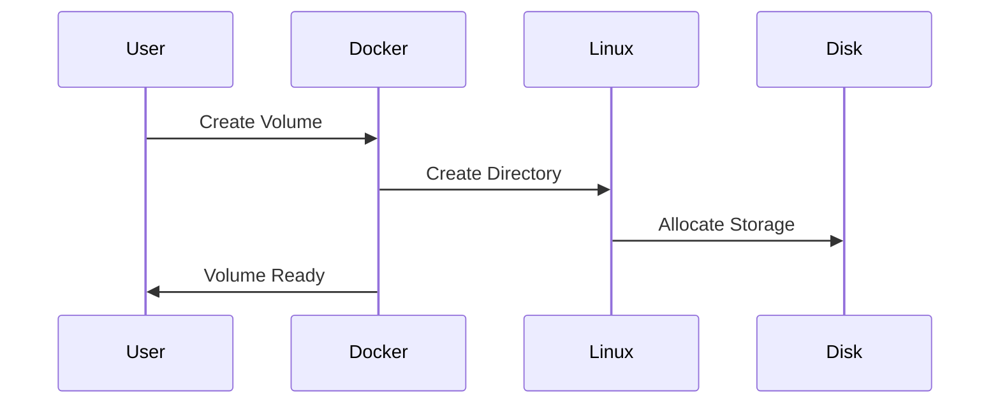
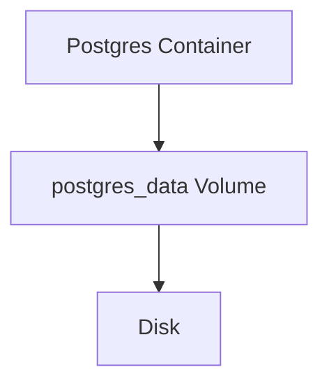
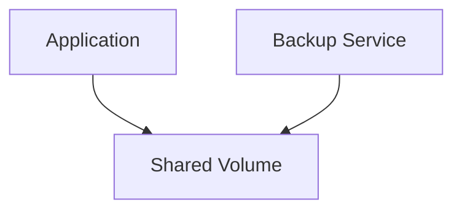
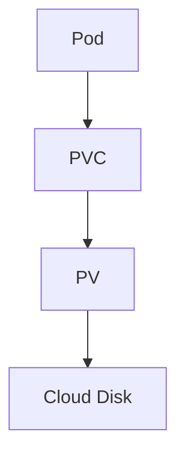
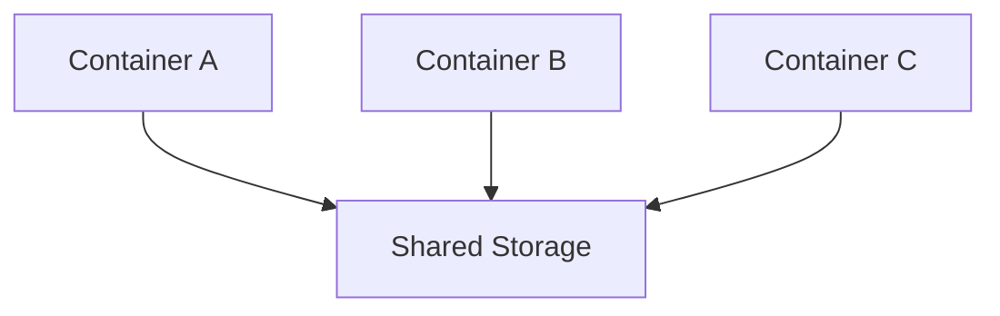

# Docker Volumes

> "Containers are temporary. Data is not. Docker Volumes exist because state outlives applications."

---

# Why This File Exists

One of the biggest beginner mistakes is this:

```bash
docker run postgres
```

Everything works.

You add data.

Then:

```bash
docker rm postgres
```

Your data disappears.

Panic begins.

This file exists to answer:

> Where should application data live?

Because this question is one of the most important questions in infrastructure engineering.

---

# The Core Problem

Containers are designed to be destroyed.

This is intentional.

Cloud-native philosophy says:

```text
Applications are temporary

Data is permanent
```

These two must be separated.

---

# The Biggest Mental Model

Never attach important data to a container.

Think:

> Containers are workers.

> Data is the company's knowledge.

Workers may leave.

Knowledge must remain.

---

# Mental Model 1: Hotel Room vs Bank Vault

Container:

```text
Hotel Room
```

Temporary.

Volume:

```text
Bank Vault
```

Persistent.

---

# Mental Model 2: Laptop vs External SSD

Laptop:

```text
Can break
```

External SSD:

```text
Data survives
```

Equivalent:

```text
Container

↓

Volume
```

---

# Mental Model 3: Brain vs Body

Application:

```text
Body
```

Data:

```text
Brain
```

You can replace the body.

The brain must survive.

---

# The Core Rule Of Cloud Native Systems

```text
Stateless Applications

+

Persistent Storage

=

Scalable Systems
```

Memorize this.

---

# The Problem Without Volumes

Suppose:

```bash
docker run postgres
```

PostgreSQL stores data inside:

```text
/var/lib/postgresql/data
```

Delete container:

```bash
docker rm postgres
```

Data gone.

Why?

Because container writable layers are temporary.

---

# Visual Representation

```text
Container

↓

Writable Layer

↓

Delete Container

↓

Delete Data
```

Dangerous.

---

# Solution: Volumes

Volumes move data outside the container lifecycle.

---

# Architecture



---

# Explain This Diagram

Container:

```text
Uses storage
```

Volume:

```text
Owns storage
```

Host:

```text
Physically stores data
```

Delete container?

Volume survives.

---

# Big Picture Architecture



---

# What Is A Docker Volume?

Official definition:

> A Docker volume is a persistent storage mechanism managed by Docker and independent of container lifecycles.

Simple definition:

> A Docker volume is storage that survives containers.

---

# Data Lifecycle



---

# Where Volumes Are Stored?

Linux:

```bash
/var/lib/docker/volumes
```

Example:

```bash
ls /var/lib/docker/volumes
```

Output:

```text
postgres_data

redis_data

nginx_logs
```

---

# Types Of Docker Storage

Docker provides three mechanisms.

```text
Volumes

Bind Mounts

tmpfs
```

Each solves different problems.

---

# Volume Comparison

| Type | Purpose | Production Use |
|------|---------|---------------|
| Volume | Persistent storage | Yes |
| Bind Mount | Host sharing | Development |
| tmpfs | RAM storage | Temporary secrets |

---

# Docker Managed Volumes

Docker manages everything.

Create:

```bash
docker volume create postgres_data
```

Use:

```bash
docker run -v postgres_data:/var/lib/postgresql/data postgres
```

---

# Bind Mounts

Maps host directory.

Example:

```bash
docker run -v /home/app:/app nginx
```

Host:

```text
/home/app
```

Container:

```text
/app
```

Useful for development.

---

# Bind Mount Architecture


---

# tmpfs

Stores data in RAM.

Example:

```bash
docker run --tmpfs /tmp nginx
```

Benefits:

```text
Fast

Temporary

Secure
```

Use cases:

```text
Secrets

Caches

Temporary files
```

---

# Volume Creation Flow



---

# PostgreSQL Production Example

Without volume:

```text
Postgres

↓

Container Deleted

↓

Database Deleted
```

Bad.

---

# With Volume



Container dies.

Database survives.

---

# Multiple Containers Sharing Data

Possible.

Example:

```text
App Container

↓

Shared Volume

↓

Backup Container
```

---

# Shared Volume Architecture



---

# Relationship With OverlayFS

Very important.

Remember:

Container storage:

```text
OverlayFS

↓

Temporary
```

Volumes:

```text
Persistent
```

Never confuse them.

---

# Storage Comparison

OverlayFS:

```text
Ephemeral
```

Volumes:

```text
Persistent
```

---

# Production Rule

Never store:

```text
Databases

Uploads

Logs

Models

Backups
```

inside container layers.

Use volumes.

---

# Relationship With Kubernetes

Kubernetes evolved this concept.

Docker:

```text
Volume
```

Kubernetes:

```text
Persistent Volume

Persistent Volume Claim

Storage Classes
```

---

# Kubernetes Architecture



---

# Cloud Storage Evolution

Local disk:

```text
Single Server
```

↓

Network storage:

```text
NFS
```

↓

Cloud storage:

```text
AWS EBS

Google Persistent Disk

Azure Disk
```

---

# Distributed Systems Problem

Suppose:

```text
3 Containers

3 Servers
```

Where should data live?

Bad:

```text
Inside containers
```

Good:

```text
Shared Storage
```

---

# Distributed Storage Architecture



---

# Data Flow Example


---

# Linux Internals

Inspect volumes:

```bash
docker volume ls
```

Inspect specific volume:

```bash
docker volume inspect postgres_data
```

Location:

```bash
/var/lib/docker/volumes
```

---

# Backup Strategies

Production systems must backup volumes.

Methods:

```text
Snapshots

Replication

Incremental Backups

Cloud Backups
```

---

# Disaster Recovery

Always assume:

```text
Container will die
```

Protect:

```text
Data
```

Backups are mandatory.

---

# AI Infrastructure Example

AI systems generate:

```text
Embeddings

Models

Caches

Checkpoints
```

Never store these inside containers.

Use volumes.

---

# Production Example

Microservices:

```text
Postgres

Redis

Elasticsearch

MinIO
```

All need persistent storage.

---

# Security Considerations

Protect volumes.

Risks:

```text
Data leaks

Permission issues

Unauthorized access
```

Use:

```text
Least privilege

Encryption

Backups
```

---

# Performance Considerations

Choose correct storage.

Examples:

Fast:

```text
NVMe SSD
```

Slow:

```text
Network Attached Storage
```

Understand workload.

---

# Scaling Considerations

State is the hardest problem.

Stateless apps:

```text
Easy to scale
```

Stateful systems:

```text
Hard to scale
```

This is why storage engineering matters.

---

# Observability Considerations

Monitor:

```text
Disk usage

Latency

IOPS

Throughput

Storage growth
```

Tools:

```text
iostat

df

du

Prometheus

Grafana
```

---

# Common Mistakes

## Mistake 1

Storing databases inside containers.

Wrong.

---

## Mistake 2

Ignoring backups.

Dangerous.

---

## Mistake 3

Using bind mounts everywhere.

Bad practice.

---

## Mistake 4

Ignoring permissions.

Security risk.

---

## Mistake 5

Thinking volumes are backups.

Wrong.

Volumes still need backups.

---

# Troubleshooting Guide

Data disappeared?

Ask:

```text
Was it inside container storage?
```

---

Disk full?

Check:

```bash
docker system df

docker volume ls
```

---

Permission issue?

Check:

```bash
docker volume inspect
```

---

Slow database?

Check:

```text
Disk IOPS
```

---

# Engineering Mindset

Do not think:

```text
Volume = Folder
```

Think:

```text
Volume

=

Persistent State Layer
```

Infrastructure is always two systems:

```text
Compute

+

State
```

Containers are compute.

Volumes are state.

---

# Evolution Of Thinking

```text
Files

↓

Filesystems

↓

Volumes

↓

Persistent Storage

↓

Distributed Storage

↓

Cloud Storage

↓

State Management
```

---

# Interview Questions

## Beginner

1. What is a Docker volume?

2. Why do volumes exist?

3. Why are containers temporary?

4. What is persistent storage?

5. What is a bind mount?

---

## Intermediate

6. Explain OverlayFS vs volumes.

7. Explain volume lifecycle.

8. Explain tmpfs.

9. Explain Kubernetes storage.

10. Explain backups.

---

## Advanced

11. Explain state management.

12. Explain distributed storage.

13. Explain cloud storage architecture.

14. Explain storage performance bottlenecks.

15. Explain disaster recovery.

---

# Cheat Sheet

```text
Containers = Compute

Volumes = State


Storage Types:

Volumes

Bind Mounts

tmpfs


Production Rules:

✓ Databases → Volumes

✓ Uploads → Volumes

✓ Logs → Volumes

✓ AI Models → Volumes

✓ Backups → Separate System


Golden Rule:

Containers Die

Data Must Survive
```

---

# Final Thought

One of the biggest shifts in engineering happens when you stop thinking:

> How do I run my application?

and start thinking:

> Where does my application's state live?

Because compute is easy.

State is hard.

And modern infrastructure is largely the art of managing state safely.
