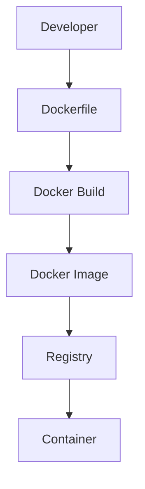
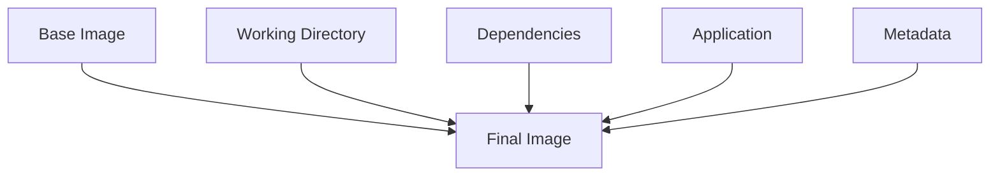
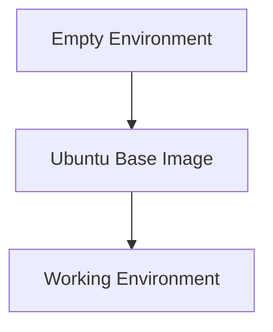
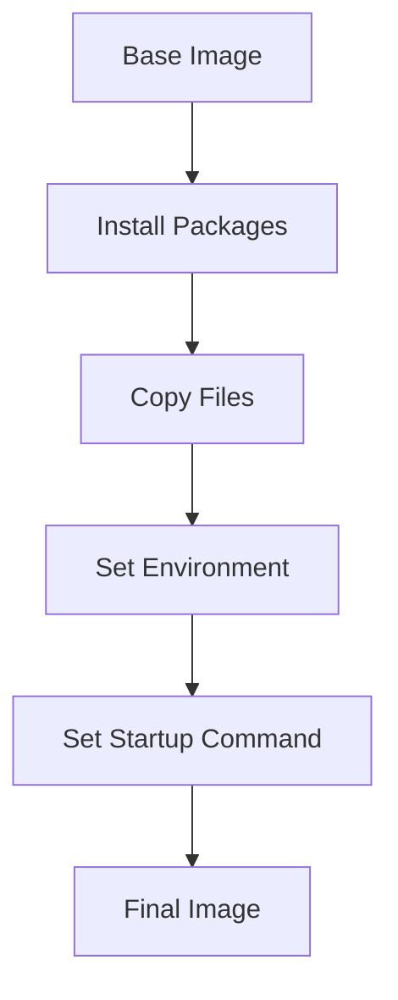
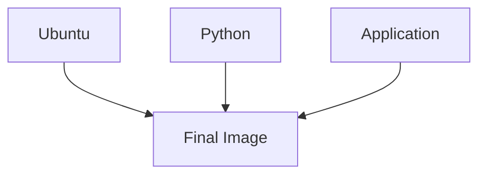
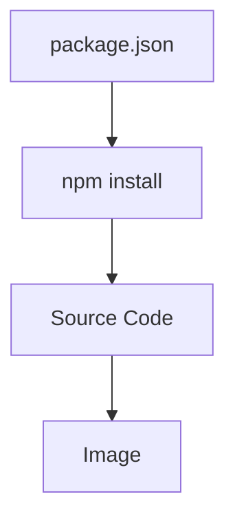
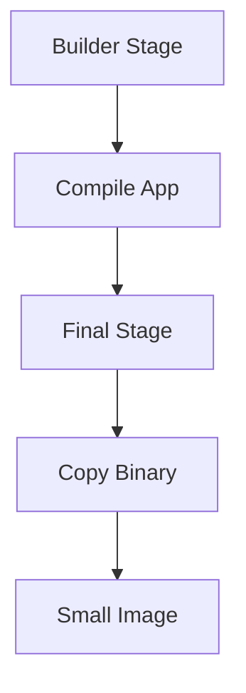
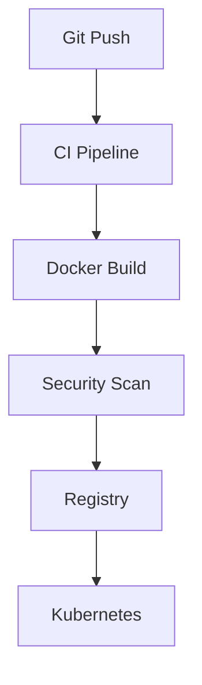

# Dockerfiles

> "Dockerfiles are not build scripts. They are reproducible infrastructure blueprints."

---

# Why This File Exists

Most developers learn Dockerfiles like this:

```dockerfile
FROM node

COPY .

RUN npm install

CMD npm start
```

Then they memorize instructions.

That is not enough.

This file exists to answer:

> What problem does a Dockerfile solve?

Because Dockerfiles changed software engineering forever.

---

# The Core Problem

Before Dockerfiles:

Deployments looked like this.

```text
Developer Laptop

↓

Install Ubuntu

↓

Install Python

↓

Install Libraries

↓

Install Application

↓

Configure Environment

↓

Run Application
```

Repeat this everywhere.

Problems:

```text
Human errors

Missing packages

Version mismatches

Environment drift

Slow deployments
```

Chaos.

---

# The Revolutionary Idea

Instead of documenting infrastructure...

Let's describe infrastructure.

Instead of:

```text
README.md instructions
```

We write:

```dockerfile
Dockerfile
```

Infrastructure becomes code.

---

# The Biggest Mental Model

Dockerfiles are:

> Git for infrastructure environments.

---

# Mental Model 1: House Blueprint

Imagine constructing a house.

Blueprint:

```text
Foundation

Walls

Electricity

Plumbing

Roof
```

House:

```text
Final structure
```

Docker:

```text
Dockerfile

↓

Docker Image

↓

Container
```

---

# Mental Model 2: Cake Recipe

Recipe:

```text
Ingredients

Instructions

Order
```

Cake:

```text
Final product
```

Docker:

```text
Dockerfile

↓

Docker Image

↓

Container
```

---

# Mental Model 3: Infrastructure Recipe

Old infrastructure:

```text
Manual steps
```

Modern infrastructure:

```text
Declarative instructions
```

---

# The Official Definition

> A Dockerfile is a declarative text file that describes how to build a Docker image.

Simple definition:

> A Dockerfile is a reproducible environment specification.

---

# Infrastructure Evolution

```text
Manual Servers

↓

Scripts

↓

Virtual Machines

↓

Dockerfiles

↓

Containers

↓

Kubernetes

↓

Cloud Native Systems
```

---

# The Entire Flow



---

# The Big Formula

```text
Dockerfile

↓

Docker Build

↓

Docker Image

↓

Container
```

---

# What Does A Dockerfile Actually Build?

It builds:

```text
Operating Environment
```

Not just:

```text
Application
```

This environment contains:

```text
Base OS

Libraries

Dependencies

Configurations

Environment Variables

Application Code

Startup Instructions
```

---

# Dockerfile Anatomy

Example:

```dockerfile
FROM node:22

WORKDIR /app

COPY package.json .

RUN npm install

COPY . .

EXPOSE 3000

CMD ["npm","start"]
```

Each instruction has meaning.

---

# Architecture Visualization



---

# Every Instruction Creates Infrastructure

Not every instruction creates layers.

But every instruction changes the environment.

---

# FROM

The most important instruction.

Example:

```dockerfile
FROM ubuntu:24.04
```

Purpose:

```text
Choose foundation
```

Think:

```text
Foundation Of A House
```

---

# FROM Visualization



---

# WORKDIR

Sets current directory.

Example:

```dockerfile
WORKDIR /app
```

Think:

```text
cd /app
```

for future instructions.

---

# COPY

Copies files.

Example:

```dockerfile
COPY . .
```

Dangerous if misused.

---

# RUN

Executes commands during image build.

Example:

```dockerfile
RUN apt install python3
```

This changes the image permanently.

---

# CMD

Defines default startup command.

Example:

```dockerfile
CMD ["node","server.js"]
```

Executed when container starts.

---

# ENTRYPOINT

Defines fixed executable.

Example:

```dockerfile
ENTRYPOINT ["python"]
```

---

# CMD vs ENTRYPOINT

CMD:

```text
Default command

Can override
```

ENTRYPOINT:

```text
Main executable

Harder to override
```

---

# Environment Lifecycle



---

# Dockerfile Execution Is Sequential

Docker reads top to bottom.

```dockerfile
FROM ubuntu

RUN apt update

RUN apt install python3

COPY app.py .
```

Order matters.

Very important.

---

# Layer Creation

Dockerfile:

```dockerfile
FROM ubuntu

RUN apt install python3

COPY app.py .
```

Produces:

```text
Layer 1 Ubuntu

↓

Layer 2 Python

↓

Layer 3 Application
```

---

# Layer Architecture



---

# Why Layer Ordering Matters

Bad:

```dockerfile
COPY . .

RUN npm install
```

Every code change:

```text
Reinstall dependencies
```

Slow.

---

# Better

```dockerfile
COPY package.json .

RUN npm install

COPY . .
```

Code changes:

```text
Reuse dependencies
```

Huge optimization.

---

# Build Cache Visualization



Stable things first.

Changing things later.

---

# Multi Stage Builds

This is production engineering.

Bad:

```text
Compiler

Dependencies

Application

Everything together
```

Huge images.

---

# Multi Stage Architecture



---

# Example

```dockerfile
FROM golang:1.24 AS builder

WORKDIR /app

COPY . .

RUN go build -o app

FROM alpine

COPY --from=builder /app/app .

CMD ["./app"]
```

Very efficient.

---

# Relationship With Linux

Dockerfiles eventually become:

```text
Filesystem Layers
```

Linux technologies underneath:

```text
OverlayFS

Namespaces

Cgroups
```

Dockerfiles indirectly configure Linux environments.

---

# Relationship With Docker Images

```text
Dockerfile

↓

Docker Image

↓

Container
```

Dockerfile is source code.

Docker image is compiled output.

---

# Relationship With Kubernetes

Kubernetes does not read Dockerfiles.

Kubernetes consumes:

```text
Docker Images
```

So:

```text
Dockerfile

↓

Image

↓

Pod

↓

Cluster
```

---

# CI/CD Relationship



Dockerfiles are central to CI/CD.

---

# Production Example

Microservices:

```text
Auth Service

Payments

Notifications

Analytics
```

Each service:

```text
Own Dockerfile

Own Image

Own Pipeline
```

Independent deployments.

---

# Security Considerations

Never do this:

```dockerfile
COPY . .
```

without `.dockerignore`.

Never do:

```dockerfile
ENV PASSWORD=secret
```

Secrets should not live inside images.

---

# Security Best Practices

Always:

```text
Use minimal images

Use non-root users

Scan images

Pin versions

Remove unnecessary packages
```

---

# Create Non Root User

Example:

```dockerfile
RUN useradd appuser

USER appuser
```

Very important.

---

# Performance Considerations

Optimize:

```text
Layer ordering

Base image size

Cache utilization

Multi-stage builds
```

Avoid:

```text
Huge images
```

---

# Scaling Considerations

1000 deployments means:

1000 image pulls.

Optimization matters.

Smaller images:

```text
Faster deployments

Lower cloud costs
```

---

# Observability Considerations

Monitor:

```text
Build time

Image size

Cache hit ratio

Pull time
```

Useful commands:

```bash
docker build

docker history

docker image inspect

docker system df
```

---

# Production Dockerfile Template

```dockerfile
FROM node:22-alpine

WORKDIR /app

COPY package.json package-lock.json ./

RUN npm ci

COPY . .

RUN npm run build

USER node

EXPOSE 3000

CMD ["npm","start"]
```

---

# Common Mistakes

## Mistake 1

Using latest.

Bad.

---

## Mistake 2

Gigantic images.

Expensive.

---

## Mistake 3

Root user.

Security risk.

---

## Mistake 4

Bad layer ordering.

Slow builds.

---

## Mistake 5

Secrets inside images.

Dangerous.

---

# Troubleshooting Guide

Slow builds?

Check:

```text
Layer ordering
```

---

Huge image?

Check:

```bash
docker history image
```

---

Security issues?

Check:

```text
Image scanning
```

---

Cache not working?

Check:

```text
Instruction order
```

---

# Engineering Mindset

Do not think:

```text
Dockerfile = Docker Script
```

Think:

```text
Dockerfile

=

Infrastructure Blueprint

=

Environment Specification

=

Software Supply Chain Definition
```

---

# Evolution Of Thinking

```text
Manual Setup

↓

Scripts

↓

Dockerfiles

↓

Images

↓

Containers

↓

Kubernetes

↓

Cloud Native Systems
```

---

# Interview Questions

## Beginner

1. What is a Dockerfile?

2. Why do Dockerfiles exist?

3. What is FROM?

4. What is COPY?

5. What is CMD?

---

## Intermediate

6. Explain Dockerfile lifecycle.

7. Explain build cache.

8. Explain multi-stage builds.

9. Explain Dockerfile optimization.

10. Explain Dockerfile security.

---

## Advanced

11. Explain Dockerfiles as Infrastructure as Code.

12. Explain supply chain engineering.

13. Explain image optimization strategies.

14. Explain cloud economics.

15. Explain CI/CD integration.

---

# Cheat Sheet

```text
Dockerfile

↓

Docker Build

↓

Docker Image

↓

Container


Core Instructions:

FROM

WORKDIR

COPY

RUN

ENV

EXPOSE

USER

CMD

ENTRYPOINT


Production Rules:

✓ Pin Versions

✓ Small Base Images

✓ Multi Stage Builds

✓ Non Root Users

✓ Layer Optimization

✓ Image Scanning

✓ No Secrets
```

---

# Final Thought

Dockerfiles changed infrastructure forever.

Before Dockerfiles:

> We deployed instructions.

After Dockerfiles:

> We deploy environments.

Modern cloud systems no longer ship code.

**They ship reproducible environments.**
