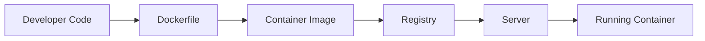
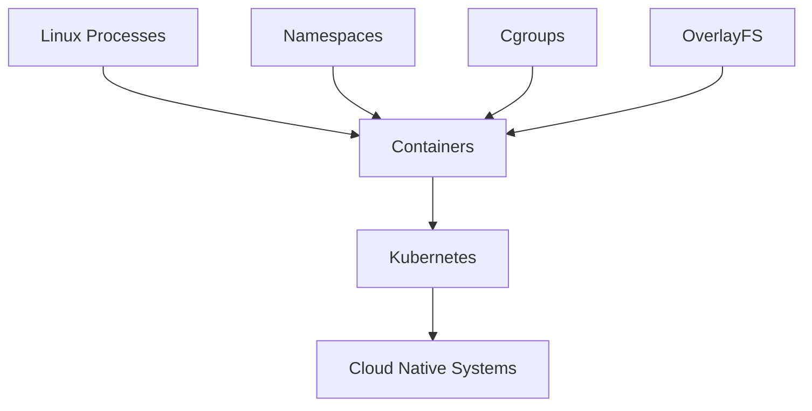

# Container Mental Models

> "The biggest mistake beginners make is trying to memorize Docker commands instead of building mental models."

---

# Why This File Exists

Most people learn containers like this:

```bash
docker build .

docker run nginx

docker compose up
```

After a few weeks they can execute commands.

But they still cannot answer:

- What is a container?
- Where does a container actually run?
- Why is Linux required?
- Why is a container fast?
- Why is a container not a VM?
- What happens inside the system when a container starts?

This file exists to solve that problem.

This file is not technical first.

This file is visualization first.

Because engineering is largely about building correct mental models.

---

# What Is A Mental Model?

A mental model is a simplified way to visualize a complex system.

Good engineers don't memorize.

Good engineers visualize.

Instead of remembering:

```text
Namespaces

Cgroups

OverlayFS

Seccomp

Container Runtime
```

You visualize:

```text
Portable isolated apartments running inside Linux
```

Now everything becomes easier.

---

# The Master Mental Model

> A container is an isolated Linux process packaged with everything it needs to run.

Memorize this forever.

```text
Container

=

Linux Process

+

Isolation

+

Dependencies

+

Resource Limits

+

Portable Filesystem
```

Not magic.

Not a mini OS.

Not a cloud technology.

---

# Mental Model 1: Linux Apartment Building

This is the most important mental model.

Imagine Linux is a giant apartment building.

```text
Linux Kernel

↓

Apartment Building
```

Containers are apartments.

```text
Building

├── Apartment A
├── Apartment B
├── Apartment C
└── Apartment D
```

Each apartment has:

```text
Own files

Own network

Own processes

Own users

Own limits
```

But everyone shares:

```text
Foundation

Electricity

Water

Security
```

Equivalent:

```text
Shared Linux Kernel
```

---

# Apartment Visualization

```text
+--------------------------------+

Linux Kernel

+--------------------------------+

Apartment A

Node App

+

Libraries

+--------------------------------+

Apartment B

Python App

+

Libraries

+--------------------------------+

Apartment C

Redis

+

Libraries

+--------------------------------+
```

Everyone shares the building.

Nobody sees each other.

---

# Why This Mental Model Is Powerful

Now many concepts become intuitive.

Container isolation?

```text
Apartment walls
```

Container networking?

```text
Apartment communication
```

Container storage?

```text
Apartment storage rooms
```

Container security?

```text
Apartment locks
```

Container orchestration?

```text
Apartment managers
```

Kubernetes?

```text
Entire apartment cities
```

---

# Mental Model 2: Containers Are Actors On A Stage

Imagine a theater.

```text
Linux Kernel

↓

Stage
```

Containers are actors.

```text
Actor A

Actor B

Actor C
```

Each actor:

```text
Has a role

Has scripts

Has props
```

But all actors share:

```text
The same stage
```

The stage is Linux.

---

# Mental Model 3: Portable Lunch Boxes

Applications need many ingredients.

Imagine making lunch.

Ingredients:

```text
Rice

Vegetables

Sauce

Plate

Spoon
```

You pack everything.

Now you can eat anywhere.

Container:

```text
Application

Runtime

Libraries

Dependencies

Configurations
```

Portable.

Move anywhere.

---

# Mental Model 4: Shipping Containers

This is actually where the name comes from.

Before shipping containers:

```text
Different boxes

Different sizes

Different shapes

Difficult transportation
```

Chaos.

After shipping containers:

Everything standardized.

```text
Truck

↓

Ship

↓

Train

↓

Port
```

All transport the same container.

Software containers do the same.

```text
Laptop

↓

Testing

↓

Staging

↓

Production

↓

Cloud
```

The same package moves everywhere.

---

# Physical World Visualization

```text
Cargo

↓

Container

↓

Ship

↓

Port

↓

Truck
```

Software equivalent:

```text
Application

↓

Container Image

↓

Registry

↓

Server

↓

Running Container
```

Identical idea.

---

# Mental Model 5: Containers Are Special Linux Processes

This is the engineer mental model.

Imagine this command:

```bash
sleep 1000
```

Linux creates:

```text
PID 5000
```

Now imagine:

```bash
docker run nginx
```

Linux also creates:

```text
PID 5001
```

Surprised?

Container = process.

Difference:

Extra isolation.

---

# The Formula

Normal Process:

```text
Process
```

Container:

```text
Process

+

Namespaces

+

Cgroups

+

Filesystem

+

Security Rules
```

That's it.

Nothing magical.

---

# Mental Model 6: Invisible Walls

Imagine children playing.

Without walls:

```text
Everyone touches everything.
```

Chaos.

Now build invisible walls.

```text
Child A

Wall

Child B

Wall

Child C
```

That's namespaces.

Each child thinks:

> I am alone.

Reality:

Everyone shares one room.

---

# Namespace Visualization

```text
Container A

Sees:

PID 1

PID 2

PID 3


Container B

Sees:

PID 1

PID 2

PID 3
```

They both think they're alone.

Reality:

```text
Linux

PID 5001

PID 5002

PID 5003

PID 5004

PID 5005
```

Linux is translating perspectives.

---

# Mental Model 7: Resource Budgets

Imagine parents giving allowances.

```text
Child A

$100

Child B

$50

Child C

$25
```

Nobody can exceed their limit.

Cgroups work similarly.

```text
Container A

2 CPU

4GB RAM

Container B

1 CPU

2GB RAM
```

Resource budgets.

---

# Mental Model 8: Transparent Layers

Imagine stacking transparent papers.

```text
Layer 1

Ubuntu

↓

Layer 2

Python

↓

Layer 3

Libraries

↓

Layer 4

Application
```

Together they form one image.

This is OverlayFS.

---

# Layer Visualization

```text
+----------------+

Application Layer

+----------------+

Dependencies Layer

+----------------+

Python Layer

+----------------+

Ubuntu Layer

+----------------+
```

Each layer is reusable.

---

# Mental Model 9: Disposable Workers

Think of containers as temporary workers.

Never become attached.

Worker dies?

Replace them.

```text
Container dies

↓

Create another
```

Do not repair.

Replace.

This is cloud-native thinking.

---

# Mental Model 10: Factory Assembly Line

Modern systems are factories.

```text
Developer

↓

Code

↓

Image

↓

Registry

↓

Container

↓

Kubernetes

↓

Production
```

Everything is automated.

---

# Data Flow Mental Model



---

# Mental Model 11: Container = Frozen Snapshot

Imagine taking a photo.

Everything is captured.

```text
OS libraries

Runtime

Application

Dependencies
```

Now recreate it anywhere.

That's a container image.

---

# Mental Model 12: Containers Are Lego Blocks

Monolithic applications:

```text
One giant block
```

Containers:

```text
Small reusable pieces
```

Example:

```text
Authentication

Payments

Notifications

Analytics

Search
```

Each becomes a separate container.

Build systems using blocks.

---

# Mental Model 13: Cities And Citizens

At Kubernetes scale:

Linux:

```text
Planet
```

Server:

```text
Country
```

Node:

```text
City
```

Container:

```text
Citizen
```

Kubernetes:

```text
Government
```

This mental model becomes useful later.

---

# Mental Model Evolution

Your thinking should evolve.

### Beginner

```text
Container = Docker
```

Wrong.

---

### Intermediate

```text
Container = Application Package
```

Better.

---

### Advanced

```text
Container = Isolated Linux Process
```

Excellent.

---

### Production Engineer

```text
Container = Deployment Unit
```

Great.

---

### Platform Engineer

```text
Container = Infrastructure Primitive
```

Excellent.

---

### Systems Architect

```text
Container = Abstraction Layer Between Software And Infrastructure
```

Expert level.

---

# How Everything Connects



---

# Modern World Connections

Containers power:

```text
Netflix

Spotify

Amazon

Uber

Airbnb

OpenAI

Google

Meta

Cloud Providers

AI Platforms
```

Everything is built on these ideas.

---

# Performance Mental Model

Containers are fast because:

They do NOT do this:

```text
Create hardware

Install OS

Boot OS

Start drivers
```

They do this:

```text
Create process

Add isolation

Run application
```

Huge difference.

---

# Security Mental Model

Think:

```text
Locked Apartments

NOT

Separate Houses
```

Security exists.

But it's not absolute.

Shared kernel = shared risk.

---

# Scaling Mental Model

Do not scale servers.

Scale containers.

Old thinking:

```text
1 bigger server
```

Modern thinking:

```text
100 smaller containers
```

---

# Troubleshooting Mental Model

Whenever a container breaks, ask:

### Is the process alive?

```bash
ps
```

---

### Is networking broken?

```text
DNS?

Port?

Firewall?
```

---

### Is storage broken?

```text
Volume issue?
```

---

### Is memory exhausted?

```text
OOM killer?
```

---

### Is the image wrong?

```text
Bad build?
```

---

# Common Mistakes

## Mistake 1

Thinking Docker = Containers.

Wrong.

Docker is tooling.

---

## Mistake 2

Thinking containers are VMs.

Wrong.

Containers are processes.

---

## Mistake 3

Ignoring Linux.

Huge mistake.

Linux is everything underneath.

---

## Mistake 4

Treating containers as permanent servers.

Wrong.

Containers are disposable.

---

# Engineering Mindset

Do not memorize commands.

Visualize systems.

When you see:

```bash
docker run nginx
```

Your brain should instantly visualize:

```text
Linux

↓

Namespaces

↓

Cgroups

↓

OverlayFS

↓

Network Namespace

↓

Filesystem Mount

↓

Nginx Process

↓

Running Container
```

That is engineering thinking.

---

# Interview Questions

## Beginner

1. What is a container?

2. Why are containers lightweight?

3. Why are containers portable?

4. Why are containers fast?

5. Why aren't containers virtual machines?

---

## Intermediate

6. Explain containers using an apartment analogy.

7. Explain containers using shipping containers.

8. Why do containers share a kernel?

9. Why is Linux important?

10. Why are containers disposable?

---

## Advanced

11. Explain the entire container lifecycle.

12. Explain containers using process isolation.

13. Explain how mental models improve troubleshooting.

14. Explain how containers enable cloud-native systems.

15. Explain why Kubernetes exists.

---

# Cheat Sheet

```text
Mental Model Summary

Container = Apartment

Container = Shipping Container

Container = Portable Lunch Box

Container = Linux Process

Container = Resource Budget

Container = Invisible Walls

Container = Disposable Worker

Container = Lego Block

Container = Infrastructure Primitive


Golden Formula

Container

=

Linux Process

+

Namespaces

+

Cgroups

+

Filesystem

+

Dependencies

+

Security Rules
```

---

# Final Thought

Beginners memorize commands.

Engineers visualize systems.

Never remember:

```bash
docker run
```

Remember:

```text
Linux

↓

Process Isolation

↓

Portable Execution

↓

Containers

↓

Cloud Native Infrastructure
```

Because once your mental model is correct, every technology built on top of containers becomes dramatically easier to learn.
