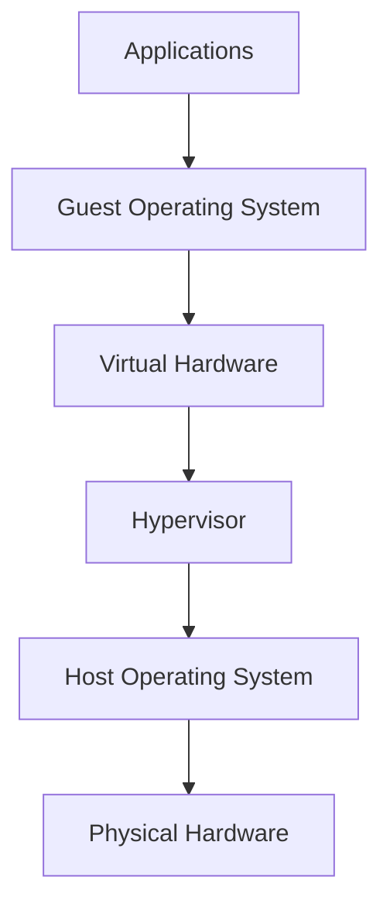
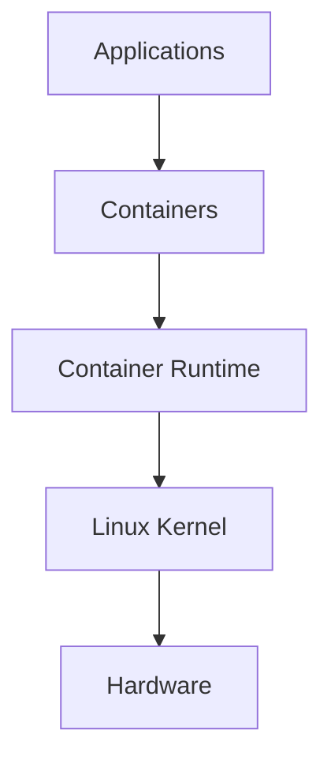
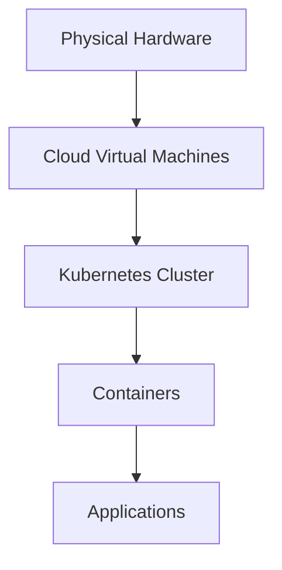

# Virtual Machines vs Containers

> "Containers did not replace Virtual Machines. Containers solved a different problem. Modern infrastructure uses both together."

---

# Why This File Exists

Many engineers learn this wrong.

They hear:

> Containers are better than Virtual Machines.

This statement is incomplete.

The correct statement is:

> Virtual Machines and Containers solve different layers of infrastructure problems.

Understanding this distinction is one of the biggest transitions from developer thinking to infrastructure engineering thinking.

If you deeply understand this file, you will understand:

- Why cloud providers exist
- Why Kubernetes exists
- Why Docker became popular
- Why Linux is essential for containers
- Why AWS, Azure, and GCP still heavily rely on VMs
- Why both technologies coexist

---

# The Problem Both Technologies Solve

As infrastructure grows, engineers face a problem.

How do we efficiently run many applications on limited hardware?

Imagine this server.

```text
Physical Server

CPU: 32 cores
RAM: 128 GB
Storage: 4 TB SSD
```

A company has:

```text
Application A

Application B

Application C

Application D
```

Can we put everything together?

Technically yes.

But this creates problems.

---

# The Bare Metal Problem

Without isolation:

```text
+---------------------------------+

Application A

Application B

Application C

Application D

Shared Linux OS

+---------------------------------+
```

Problems:

```text
Dependency conflicts

Resource contention

Security risks

Environment drift

Hard upgrades

Difficult scaling

Poor fault isolation
```

Engineers needed isolation.

Two major solutions emerged.

```text
Hardware Virtualization

↓

Virtual Machines


Operating System Virtualization

↓

Containers
```

---

# Mental Model First

Think of a physical server as a giant apartment building.

```text
One Physical Server

↓

Many Tenants
```

Question:

How do we isolate tenants?

There are two approaches.

---

# Approach 1: Build Independent Houses (Virtual Machines)

Every tenant gets a complete house.

```text
Tenant A

House A

Kitchen

Bathroom

Electricity

Water

Security
```

Everything is duplicated.

---

# Approach 2: Create Apartments (Containers)

Everyone shares one building.

Each tenant gets isolated rooms.

```text
Building

↓

Apartment A

Apartment B

Apartment C
```

Shared infrastructure.

Less duplication.

---

# Evolution Timeline

```text
1990s

Bare Metal Servers

↓

2000s

Virtual Machines

↓

2010s

Containers

↓

2015+

Kubernetes

↓

Today

Cloud Native Infrastructure
```

---

# Virtual Machine Architecture

A Virtual Machine virtualizes hardware.

It pretends to be a real computer.

Architecture:



---

# Visual Representation

```text
Physical Server

CPU
RAM
Storage
Network

↓

Hypervisor

↓

VM A

Ubuntu

Application A

↓

VM B

Windows

Application B

↓

VM C

CentOS

Application C
```

Every VM contains an entire operating system.

---

# What Is A Hypervisor?

A hypervisor creates and manages virtual computers.

Its job:

```text
Allocate CPU

Allocate RAM

Allocate Storage

Allocate Network

Schedule resources

Create isolation
```

Think:

> Hypervisor = Infrastructure manager

---

# Types Of Hypervisors

## Type 1 (Bare Metal)

Runs directly on hardware.

Examples:

```text
VMware ESXi

Microsoft Hyper-V

Xen
```

Architecture:

```text
Hardware

↓

Hypervisor

↓

VMs
```

Used heavily in data centers.

---

## Type 2 (Hosted)

Runs on top of an OS.

Examples:

```text
VirtualBox

VMware Workstation

Parallels
```

Architecture:

```text
Hardware

↓

Host OS

↓

Hypervisor

↓

VMs
```

Used mostly by developers.

---

# Container Architecture

Containers virtualize the operating system.

Architecture:



Notice:

There is no Guest OS.

This is the biggest difference.

---

# Visual Representation

```text
Physical Server

↓

Linux Kernel

↓

Container A

Application A

↓

Container B

Application B

↓

Container C

Application C
```

Everyone shares one kernel.

---

# The Most Important Difference

## Virtual Machines Virtualize Hardware

```text
CPU

RAM

Storage

Network
```

---

## Containers Virtualize The Operating System

```text
Processes

Filesystem

Networking

Users

Resources
```

---

# Deep Internal Comparison

## Virtual Machine Internals

Every VM contains:

```text
Kernel

Drivers

Init System

Libraries

System Services

Applications
```

This is expensive.

---

## Container Internals

Every container contains:

```text
Application

Dependencies

Libraries

Runtime
```

Kernel is shared.

No duplication.

---

# Architecture Comparison

## Virtual Machines

```text
+---------------------------+

App A

Ubuntu Kernel

Ubuntu OS

+---------------------------+

+---------------------------+

App B

Windows Kernel

Windows OS

+---------------------------+

+---------------------------+

App C

CentOS Kernel

CentOS OS

+---------------------------+

Hypervisor

Host

Hardware
```

---

## Containers

```text
+------------------+

Container A

App A

+------------------+

+------------------+

Container B

App B

+------------------+

+------------------+

Container C

App C

+------------------+

Linux Kernel

Hardware
```

---

# Startup Time Comparison

Virtual Machine:

```text
Allocate Resources

↓

Load BIOS

↓

Load Guest OS

↓

Initialize Drivers

↓

Boot Services

↓

Start Application
```

Time:

```text
30 sec

1 min

2 min
```

---

Container:

```text
Start Process

↓

Attach Isolation

↓

Run Application
```

Time:

```text
Milliseconds

Seconds
```

Huge difference.

---

# Resource Consumption Comparison

## Virtual Machine

Example:

```text
Guest OS = 2 GB

Application = 500 MB

Total = 2.5 GB
```

Three VMs:

```text
7.5 GB RAM
```

---

## Container

Example:

```text
Application = 500 MB
```

Three containers:

```text
1.5 GB RAM
```

Much smaller.

---

# Performance Comparison

| Category | Virtual Machines | Containers |
|----------|-----------------|------------|
| Startup | Slow | Fast |
| Memory Usage | High | Low |
| Storage Usage | High | Low |
| Isolation | Strong | Medium |
| Density | Lower | Higher |
| Portability | Good | Excellent |
| Scaling | Slower | Faster |
| OS Flexibility | Any OS | Same Kernel |

---

# Security Comparison

## Virtual Machines

Stronger isolation.

Reason:

```text
Independent Kernel
```

If one VM is compromised:

```text
Other VMs usually safe
```

---

## Containers

Containers share one kernel.

If kernel is compromised:

```text
All containers at risk
```

Additional security is necessary.

---

# Why Linux Is Mandatory For Containers

Containers depend heavily on Linux features.

Examples:

```text
Namespaces

Cgroups

OverlayFS

Capabilities

Seccomp
```

Without Linux:

No containers.

Windows containers exist but use different internals.

Linux dominates container infrastructure.

---

# Density Comparison

Imagine:

```text
64 GB RAM Server
```

Virtual Machines:

```text
10-20 VMs
```

Containers:

```text
100-500 Containers
```

Huge difference.

This changed cloud economics.

---

# Why Cloud Providers Still Use VMs

Many beginners ask:

> If containers are better, why does AWS sell EC2?

Because containers still need servers.

Reality:

```text
Physical Hardware

↓

Virtual Machines

↓

Containers

↓

Applications
```

This is how most production systems work.

---

# Production Example

Netflix architecture simplified.

```text
AWS Hardware

↓

EC2 VMs

↓

Kubernetes

↓

Containers

↓

Microservices
```

Containers usually run inside VMs.

---

# Data Flow In Modern Infrastructure



---

# Where Each Technology Excels

## Use Virtual Machines When

You need:

```text
Strong isolation

Multiple operating systems

Legacy software

Strict compliance

Kernel customization
```

Examples:

```text
Banks

Government

Enterprise Datacenters
```

---

## Use Containers When

You need:

```text
Microservices

CI/CD

Fast deployments

Elastic scaling

Cloud native applications
```

Examples:

```text
Startups

AI Infrastructure

SaaS Products

Streaming Platforms
```

---

# Production Scenario

Imagine an e-commerce company.

Services:

```text
Authentication

Payments

Inventory

Notifications

Analytics

Recommendations
```

Would you create:

```text
100 VMs ?
```

No.

Too expensive.

Instead:

```text
10 VMs

↓

100 Containers
```

Efficient.

---

# Why Kubernetes Was Created

Containers created a new problem.

Too many containers.

Questions emerged.

```text
Where to run them?

How to scale them?

How to restart them?

How to network them?

How to monitor them?
```

Kubernetes solved this.

---

# Performance Implications

Containers:

Advantages:

```text
Fast startup

Low overhead

High density

Rapid deployment
```

Disadvantages:

```text
Shared kernel risks
```

---

# Security Implications

Virtual Machines:

```text
Stronger isolation
```

Containers:

Need extra security.

Examples:

```text
AppArmor

SELinux

Seccomp

User Namespaces

Read-only filesystems
```

---

# Scaling Implications

Virtual Machines:

```text
Scale slower
```

Containers:

```text
Scale faster
```

Reason:

They are simply processes.

---

# Observability Implications

Monitor both.

VM metrics:

```text
CPU

RAM

Disk

Network
```

Container metrics:

```text
CPU

Memory

Container Restarts

Network

Filesystem

Latency
```

Tools:

```text
Prometheus

Grafana

Loki

Jaeger

OpenTelemetry
```

---

# Common Mistakes

## Mistake 1

Thinking containers replace VMs.

Wrong.

Containers complement VMs.

---

## Mistake 2

Thinking containers are secure by default.

Wrong.

Security requires extra layers.

---

## Mistake 3

Thinking Docker is infrastructure.

Docker is tooling.

Linux is the foundation.

---

## Mistake 4

Ignoring Linux knowledge.

Huge mistake.

Linux powers containers.

---

# Troubleshooting Mindset

Always ask:

### Is the issue inside the VM?

```text
Hypervisor issue?
```

### Is the issue inside the container?

```text
Application issue?
```

### Is the issue inside Linux?

```text
Kernel issue?
```

### Is the issue resource contention?

```text
Memory exhaustion?
```

---

# Engineering Mindset

Never ask:

> Which is better?

Ask:

> Which layer of abstraction solves my problem?

Infrastructure engineers think in layers.

```text
Hardware

↓

Virtual Machines

↓

Containers

↓

Orchestration

↓

Applications
```

Every layer exists for a reason.

---

# Interview Questions

## Beginner

1. Why were Virtual Machines created?

2. Why were Containers created?

3. What is the biggest difference?

4. Which is faster?

5. Which consumes less memory?

---

## Intermediate

6. What is a hypervisor?

7. Why are containers lightweight?

8. Why do containers need Linux?

9. Why do VMs provide stronger isolation?

10. Why do containers scale faster?

---

## Advanced

11. Explain the entire infrastructure stack.

12. Why do cloud providers still rely on VMs?

13. Why do Kubernetes clusters usually run inside VMs?

14. Explain security differences.

15. Explain performance differences.

---

# Cheat Sheet

```text
Virtual Machine

Virtualizes Hardware

Contains:

OS

Kernel

Drivers

Application

Startup:

Seconds/Minutes

Isolation:

Strong

Density:

Low


Container

Virtualizes Operating System

Contains:

Application

Libraries

Dependencies

Startup:

Milliseconds

Isolation:

Medium

Density:

High


Production Stack

Hardware

↓

Virtual Machines

↓

Containers

↓

Kubernetes

↓

Applications
```

---

# Final Thought

**Virtual Machines taught computers how to become many computers.**

**Containers taught operating systems how to become application platforms.**

Modern infrastructure uses both together.

The real evolution is:

```text
Hardware

↓

Virtualization

↓

Containers

↓

Orchestration

↓

Cloud Native Systems
```

Understanding this stack is the foundation of becoming a Platform Engineer, SRE, Cloud Engineer, or Systems Architect.
