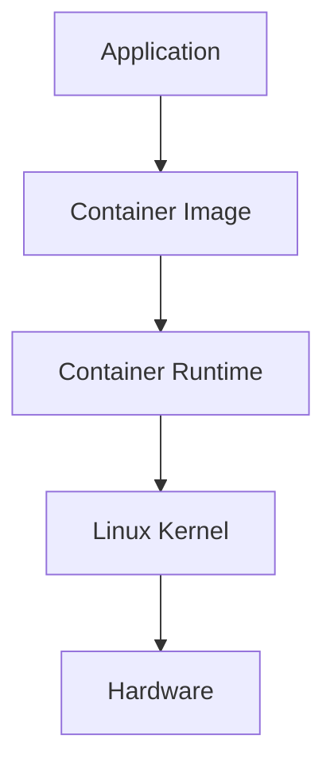

# Why Containers Exist

> "Containers were not invented because engineers wanted Docker. Containers were invented because software deployment became one of the hardest problems in computing."

---

# The Biggest Misconception

Many people think:

> Containers exist to package applications.

That's only partially true.

The real reason containers exist is this:

> Containers solve the software consistency problem.

They answer one fundamental question:

> How do we run the same application reliably everywhere?

---

# Before Learning Containers, Learn The Problem

Never start with Docker commands.

Start with the problem.

Ask:

> Why did some of the world's smartest engineers build an entire ecosystem around containers?

Because software engineering became extremely difficult.

As software evolved, infrastructure complexity exploded.

---

# The Evolution of Computing

Let's travel through history.

```text
Single Computer Era
        ↓

Multi-User Server Era
        ↓

Internet Era
        ↓

Cloud Era
        ↓

Microservices Era
        ↓

AI Infrastructure Era
```

At every stage, software complexity increased.

Eventually, deployment became harder than writing code itself.

---

# The Original Era: One Machine, One Application

Imagine the year 1995.

A company buys one server.

```text
+---------------------+
| Physical Server     |
|                     |
|     Application     |
|                     |
+---------------------+
```

Life was simple.

Application and server had a one-to-one relationship.

---

# The Problems Begin

As companies grew:

```text
1 Application
        ↓

5 Applications
        ↓

20 Applications
        ↓

100 Applications
```

Multiple applications started sharing the same server.

Example:

```text
Physical Server

├── MySQL
├── Apache
├── PHP
├── Node.js App
├── Python App
└── Redis
```

Immediately, problems appeared.

---

# Problem #1: Dependency Hell

This is one of the biggest reasons containers exist.

Imagine:

Application A needs:

```text
Python 3.8
```

Application B needs:

```text
Python 3.12
```

Server has:

```text
Python 3.10
```

Now everyone is unhappy.

---

## Real Production Example

Backend Team:

```text
Node 18
```

AI Team:

```text
Python 3.12
```

Analytics Team:

```text
Java 21
```

Database Team:

```text
PostgreSQL 16
```

Security Team:

```text
Specific OpenSSL version
```

All sharing one server.

Chaos begins.

---

# Problem #2: "It Works On My Machine"

This became one of the most famous software engineering jokes.

Developer laptop:

```text
Ubuntu 24.04

Node 22

Redis 8

PostgreSQL 17
```

Production server:

```text
Ubuntu 20.04

Node 18

Redis 6

PostgreSQL 14
```

Application crashes.

Developer says:

> It works on my machine.

Operations team says:

> Not here.

Everyone blames everyone.

---

# Problem #3: Environment Drift

Servers slowly become different.

Server A:

```text
Installed package X
```

Server B:

```text
Installed package Y
```

Server C:

```text
Unknown modifications
```

Over time:

```text
Development ≠ Testing ≠ Staging ≠ Production
```

Nobody knows why.

---

# Problem #4: Resource Contention

Multiple applications fight for resources.

```text
Server

CPU: 8 cores

RAM: 32GB
```

Applications:

```text
App A → 12GB RAM

App B → 16GB RAM

App C → 8GB RAM
```

Server crashes.

Applications can kill each other.

---

# Problem #5: Poor Isolation

One application failure can impact everything.

```text
App A crashes

↓

Consumes all memory

↓

Kernel invokes OOM killer

↓

Other applications die
```

This is dangerous.

---

# Problem #6: Deployment Complexity

Deploying software became harder than building software.

Teams had to remember:

```text
Install Java

Install Node

Install Python

Install Libraries

Configure Network

Configure Permissions

Configure Environment Variables

Configure Storage
```

Human error became inevitable.

---

# Problem #7: Scaling Becomes Difficult

Traffic increases.

```text
100 Users

↓

1000 Users

↓

10000 Users

↓

1 Million Users
```

Engineers need:

```text
More servers

More applications

More consistency
```

Manual deployment becomes impossible.

---

# Traditional Infrastructure Looks Like This

```text
+--------------------------------------+
| Physical Server                      |
|                                      |
| App A                                |
| App B                                |
| App C                                |
| Shared Dependencies                  |
| Shared Libraries                     |
| Shared Configurations                |
| Shared Resources                     |
+--------------------------------------+
```

Everything is tightly coupled.

---

# The Virtual Machine Solution

Engineers invented Virtual Machines.

Mental model:

> Split one server into many independent computers.

```text
Physical Server

↓

Hypervisor

↓

VM A

VM B

VM C
```

Each VM contains:

```text
Guest OS

Libraries

Application
```

Much better.

But new problems appeared.

---

# Problems With Virtual Machines

## Heavyweight

Every VM contains:

```text
Full Operating System

Kernel

Drivers

System Processes
```

Huge duplication.

---

## Slow Startup

Starting a VM is like booting a computer.

Can take:

```text
30 seconds

1 minute

Several minutes
```

Too slow for modern systems.

---

## Memory Waste

Three VMs:

```text
Ubuntu

Ubuntu

Ubuntu
```

Why duplicate entire operating systems?

Inefficient.

---

# Engineers Asked A Better Question

Instead of virtualizing hardware...

Can we virtualize the operating system?

This question changed everything.

---

# The Birth Of Containers

Instead of this:

```text
Hardware

↓

Hypervisor

↓

VM

↓

Operating System

↓

Application
```

We do this:

```text
Hardware

↓

Linux Kernel

↓

Containers

↓

Applications
```

One kernel.

Many isolated applications.

---

# The Most Important Mental Model

## Containers Are Isolated Linux Processes

This sentence explains everything.

A container is simply:

```text
Linux Process

+

Isolation

+

Resource Limits

+

Packaged Filesystem
```

That's all.

No magic.

---

# Visualizing Containers

Imagine Linux as a giant apartment building.

```text
Linux Kernel

Apartment Building
```

Containers are apartments.

```text
Apartment A

Apartment B

Apartment C
```

Each apartment has:

```text
Own Filesystem

Own Processes

Own Network

Own Users

Own Limits
```

But everyone shares:

```text
Foundation

Electricity

Water
```

Equivalent:

```text
Shared Linux Kernel
```

---

# The Core Idea Of Containers

Bundle everything an application needs.

Application Package:

```text
Application

Dependencies

Libraries

Runtime

Configuration
```

Move anywhere.

Run anywhere.

---

# The Container Promise

Build once.

Run everywhere.

```text
Developer Laptop

↓

CI/CD

↓

Testing

↓

Staging

↓

Production

↓

Cloud
```

Exactly the same package.

---

# How Linux Made Containers Possible

Containers are built from existing Linux technologies.

## Namespaces

Provide isolation.

```text
Container A

Cannot see

Container B
```

---

## Cgroups

Provide resource limits.

```text
CPU

Memory

Disk I/O

Network
```

---

## OverlayFS

Provides layered filesystems.

Efficient storage.

---

## Capabilities

Provides fine-grained permissions.

---

## Seccomp

Filters dangerous system calls.

---

# Container Architecture



---

# Why Containers Became Revolutionary

Containers solved multiple problems simultaneously.

| Problem | Solution |
|---------|----------|
| Dependency Hell | Package dependencies |
| Environment Drift | Immutable images |
| Slow Deployment | Fast startup |
| Resource Contention | Cgroups |
| Isolation | Namespaces |
| Scaling | Easy replication |
| Portability | Build once run anywhere |

---

# Why Companies Adopted Containers

Containers enabled:

```text
Fast Deployments

Consistent Environments

Horizontal Scaling

Cloud Migration

Microservices

CI/CD Automation

Infrastructure Portability
```

---

# Why Microservices Need Containers

Imagine 100 services.

```text
Authentication

Payments

Notifications

Inventory

Analytics

Recommendations

Search
```

Without containers:

Chaos.

With containers:

Each service is isolated.

Easy to deploy independently.

---

# Modern Infrastructure Is Built Around Containers

Almost everything today uses containers.

Examples:

```text
AWS ECS

AWS EKS

Google Kubernetes Engine

Azure AKS

OpenShift

Nomad

Docker Swarm
```

---

# Even AI Infrastructure Uses Containers

AI systems use containers extensively.

Example:

```text
Inference Service

↓

Container

↓

GPU Node

↓

Load Balancer
```

Every AI model deployment is often containerized.

Examples:

```text
OpenAI

Anthropic

Meta

NVIDIA

Hugging Face
```

---

# The Hidden Superpower Of Containers

Containers transformed infrastructure into software.

Instead of configuring servers manually:

```text
Install software

Configure server

Fix dependencies
```

We now describe infrastructure declaratively.

Infrastructure becomes reproducible.

This changed the industry.

---

# Data Flow: What Happens During Deployment?


---

# Real World Example

Instagram uploads service.

Without containers:

```text
Install dependencies

Configure server

Configure runtime

Configure storage

Configure networking
```

With containers:

```text
docker pull image

docker run image
```

Huge simplification.

---

# Performance Considerations

Containers are efficient because:

```text
No Guest OS

No Hardware Emulation

No Hypervisor Overhead

Shared Kernel
```

Advantages:

```text
Fast startup

Lower memory

High density

Better utilization
```

---

# Security Considerations

Containers improve security but are NOT security boundaries.

Containers still share:

```text
Linux Kernel
```

Kernel compromise is dangerous.

Security layers are essential.

Examples:

```text
User Namespaces

Seccomp

AppArmor

SELinux

Read-only Filesystems

Least Privilege
```

---

# Scaling Considerations

Containers enable:

```text
Horizontal Scaling
```

Instead of:

```text
1 Huge Server
```

We do:

```text
100 Small Containers
```

Benefits:

```text
Fault tolerance

Elasticity

Auto scaling
```

---

# Observability Considerations

Production containers require visibility.

Observe:

```text
CPU

Memory

Disk

Logs

Metrics

Traces

Network
```

Popular tools:

```text
Prometheus

Grafana

Loki

OpenTelemetry

Jaeger
```

---

# Common Mistakes

## Mistake 1

Thinking containers are virtual machines.

Wrong.

Containers are Linux processes.

---

## Mistake 2

Learning Docker without Linux.

Wrong order.

Learn Linux first.

---

## Mistake 3

Putting multiple applications in one container.

One container = one responsibility.

---

## Mistake 4

Treating containers as permanent servers.

Containers are disposable.

---

## Mistake 5

Ignoring security.

Containers share the kernel.

---

# Troubleshooting Mindset

Always ask:

### Is it a process problem?

```text
Process crashed?
```

### Is it a filesystem problem?

```text
Missing dependency?
```

### Is it a network problem?

```text
DNS issue?
```

### Is it a resource problem?

```text
Out of memory?
```

### Is it an image problem?

```text
Wrong build?
```

---

# Engineering Mindset

Do not think:

> Docker solved deployment.

Think:

> Linux evolved into an application execution platform.

Containers are simply Linux abstractions.

---

# Interview Questions

## Beginner

1. Why do containers exist?

2. What problems do containers solve?

3. Why is "it works on my machine" a problem?

4. What is dependency hell?

5. Are containers virtual machines?

---

## Intermediate

6. Why are containers lightweight?

7. How do containers isolate applications?

8. Why do containers share a kernel?

9. Why are containers portable?

10. What Linux technologies power containers?

---

## Advanced

11. Why are containers ideal for microservices?

12. Why are containers good for cloud computing?

13. Why aren't containers true security boundaries?

14. Explain the entire container lifecycle.

15. Explain why Kubernetes depends on containers.

---

# Cheat Sheet

```text
Containers Exist Because:

✓ Dependency Hell

✓ Environment Drift

✓ Poor Isolation

✓ Resource Contention

✓ Slow Deployments

✓ Difficult Scaling

✓ Inconsistent Infrastructure

Core Idea:

Application

+

Dependencies

+

Isolation

+

 Resource Limits

=

Container

Container ≠ VM

Container = Isolated Linux Process

Linux Technologies:

Namespaces

Cgroups

OverlayFS

Capabilities

Seccomp

AppArmor

SELinux
```

---

# Final Thought

**Containers are not a Docker invention.**

**Containers are the result of decades of infrastructure problems finally being solved using Linux primitives.**

Before learning Docker commands, always remember:

> Containers exist because deploying software at scale became harder than writing software itself.
