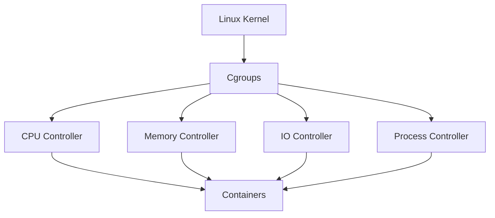
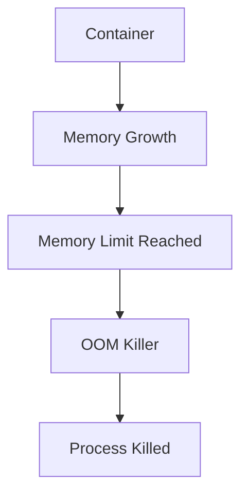

# Cgroups and Containers

> "Namespaces create isolated worlds. Cgroups enforce limits inside those worlds."

---

# Why This File Exists

Most people think containers are magic.

They learn:

```bash
docker run nginx
```

without asking:

> What stops this container from consuming all server resources?

The answer is:

# Cgroups

Without cgroups:

Containers become dangerous.

Without cgroups:

Docker would be unusable in production.

Without cgroups:

Kubernetes could not exist.

This file teaches one of Linux's most important technologies.

---

# The Biggest Mental Model

Namespaces answer:

> Who can see what?

Cgroups answer:

> Who can use how much?

Both are required.

---

# The Core Problem

Imagine one server.

```text
CPU: 16 cores

RAM: 64 GB

Storage: 2 TB SSD
```

Running:

```text
Authentication Service

Payments Service

Notifications Service

Redis

PostgreSQL

Analytics Service
```

Question:

What happens if Analytics consumes all RAM?

Answer:

Everything dies.

---

# Life Without Cgroups

```text
Server

↓

Application A

Application B

Application C
```

Application A:

```text
Infinite CPU

Infinite RAM

Infinite Disk I/O
```

Dangerous.

Applications can become selfish.

---

# Real Production Example

Analytics job:

```python
while True:
    data.append(large_object)
```

Memory consumption:

```text
2 GB

↓

10 GB

↓

20 GB

↓

64 GB
```

Eventually:

```text
Linux OOM Killer
```

Now critical applications die too.

Huge outage.

---

# Why Containers Need Resource Control

Containers create isolation.

But isolation is incomplete.

Without resource control:

```text
Container A

can destroy

Container B
```

We need limits.

---

# What Are Cgroups?

Technical definition:

> Cgroups (Control Groups) are a Linux kernel feature that limits, measures, and prioritizes resource usage for groups of processes.

Simple definition:

> Cgroups create budgets for applications.

---

# Mental Model: Parents Giving Allowances

Imagine children.

Parents give budgets.

```text
Child A

$100

Child B

$50

Child C

$25
```

Nobody can exceed their limit.

Cgroups work exactly like this.

---

# Another Mental Model: Restaurant Tables

Restaurant:

```text
100 seats
```

Reservations:

```text
Team A → 30 seats

Team B → 20 seats

Team C → 50 seats
```

Nobody can steal another team's seats.

That's cgroups.

---

# Master Formula

Container:

```text
Application

+

Namespaces

+

Cgroups

+

Filesystem

+

Security
```

Remove cgroups:

```text
No resource control
```

Bad idea.

---

# What Resources Can Cgroups Control?

Cgroups can control:

```text
CPU

Memory

Disk I/O

Network Priority

Process Count

Huge Pages

Devices
```

---

# Big Picture Architecture



---

# How Containers Use Cgroups

Imagine:

```bash
docker run nginx
```

Docker automatically creates:

```text
CPU limits

Memory limits

I/O limits

Process limits
```

Linux enforces them.

Docker only orchestrates.

Linux does the work.

---

# CPU Cgroups

## Problem It Solves

Without limits:

One application can consume:

```text
100% CPU
```

Bad.

---

# CPU Budget Example

Server:

```text
8 CPUs
```

Assign:

Container A:

```text
2 CPUs
```

Container B:

```text
4 CPUs
```

Container C:

```text
2 CPUs
```

Linux schedules fairly.

---

# Docker Example

```bash
docker run --cpus=2 nginx
```

Now:

```text
Maximum

2 CPUs
```

---

# CPU Mental Model

Imagine a pizza.

```text
8 slices
```

Allocate:

```text
Container A → 2 slices

Container B → 4 slices

Container C → 2 slices
```

Nobody eats more.

---

# Memory Cgroups

This is extremely important.

Memory is dangerous.

---

# Without Memory Limits

Application:

```python
while True:
   data.append("large object")
```

Memory:

```text
4 GB

↓

10 GB

↓

20 GB

↓

64 GB
```

Server crashes.

---

# Memory Limit Example

```bash
docker run --memory=2g nginx
```

Maximum:

```text
2 GB
```

Linux enforces it.

---

# Memory Exceeded?

Linux triggers:

```text
OOM Killer
```

Out Of Memory Killer.

The process dies.

---

# OOM Flow



---

# Disk I/O Cgroups

## Problem

Imagine:

```text
Database

Analytics

Logs
```

Analytics writes:

```text
100 GB/s
```

Database slows down.

Bad.

---

# Disk I/O Limits

Cgroups can throttle:

```text
Read speed

Write speed

IO priority
```

Protecting important workloads.

---

# PIDs Cgroup

Problem:

Fork bombs.

Example:

```bash
:(){ :|:& };:
```

Creates infinite processes.

Dangerous.

---

# PID Limit Example

```bash
docker run --pids-limit=100 nginx
```

Maximum:

```text
100 processes
```

Safe.

---

# Device Cgroups

Controls hardware access.

Examples:

```text
GPU

USB

Block Devices
```

Useful for AI infrastructure.

---

# Container Resource Flow


---

# Linux Scheduler Relationship

Cgroups do not execute tasks.

The scheduler does.

Responsibilities:

Scheduler:

```text
Who runs next?
```

Cgroups:

```text
How much may they use?
```

Together:

```text
Fairness
```

---

# Cgroups v1 vs Cgroups v2

Linux evolved.

---

# Cgroups v1

Older design.

Separate controllers.

```text
CPU

Memory

IO

Network
```

Independent hierarchy.

Complex.

---

# Cgroups v2

Modern design.

Unified hierarchy.

Benefits:

```text
Simpler

More efficient

Consistent

Better security
```

Most modern Linux systems use v2.

---

# Visual Comparison

## v1

```text
CPU Tree

Memory Tree

IO Tree
```

---

## v2

```text
Unified Tree

↓

CPU

Memory

IO

Processes
```

Cleaner.

---

# How To Check Your System

Check:

```bash
mount | grep cgroup
```

Or:

```bash
stat -fc %T /sys/fs/cgroup
```

Output:

```text
cgroup2fs
```

Means:

```text
Cgroups v2
```

---

# Explore Cgroups

Location:

```bash
cd /sys/fs/cgroup
```

View:

```bash
ls
```

You'll see:

```text
cpu.max

memory.max

memory.current

io.max

pids.max
```

---

# Systemd Connection

Systemd heavily uses cgroups.

Every service gets a cgroup.

Example:

```bash
systemctl status nginx
```

Behind the scenes:

```text
nginx.service

↓

Cgroup
```

---

# Kubernetes Connection

Kubernetes ultimately creates:

```text
Pods

↓

Containers

↓

Cgroups
```

Kubernetes only orchestrates.

Linux enforces.

---

# AI Infrastructure Connection

Imagine:

```text
GPU Server

8 GPUs
```

AI containers receive:

```text
GPU quotas

CPU quotas

Memory quotas
```

Cgroups enable fair sharing.

---

# Cloud Connection

AWS ECS:

```text
Tasks

↓

Containers

↓

Cgroups
```

---

# Production Scenario

Server:

```text
64 CPUs

256 GB RAM
```

Running:

```text
Authentication

Payments

Notifications

Analytics

AI Inference
```

Allocate:

```text
Auth → 2 CPU

Payments → 4 CPU

Analytics → 16 CPU

AI → 32 CPU
```

Controlled.

Predictable.

---

# Performance Considerations

Advantages:

```text
Fair scheduling

Better utilization

Resource isolation

Higher density
```

Tradeoffs:

```text
Misconfigured limits

↓

Performance bottlenecks
```

---

# Security Considerations

Without cgroups:

Denial-of-service attacks become easier.

Examples:

```text
CPU exhaustion

Memory exhaustion

Fork bombs
```

Cgroups help mitigate these.

---

# Scaling Considerations

Containers scale because:

Linux can efficiently manage:

```text
Hundreds

Thousands

of resource groups
```

---

# Observability Considerations

Monitor:

```text
CPU usage

Memory usage

I/O usage

OOM events

PIDs
```

Tools:

```text
docker stats

htop

top

systemd-cgtop

cadvisor

Prometheus

Grafana
```

---

# Common Mistakes

## Mistake 1

Thinking namespaces are enough.

Wrong.

Need cgroups.

---

## Mistake 2

Setting no memory limits.

Dangerous.

---

## Mistake 3

Setting very low limits.

Applications become unstable.

---

## Mistake 4

Ignoring OOM events.

Huge production mistake.

---

# Troubleshooting Guide

Container slow?

Check:

```text
CPU throttling?
```

---

Container dying?

Check:

```text
OOM Killer?
```

---

Container frozen?

Check:

```text
Disk I/O limits?
```

---

Container crashing?

Check:

```text
PID exhaustion?
```

---

Useful commands:

```bash
docker stats

systemd-cgtop

cat /sys/fs/cgroup/memory.current

dmesg | grep oom
```

---

# Engineering Mindset

Namespaces create isolated worlds.

Cgroups create fair economies inside those worlds.

Containers need both.

Think:

```text
Namespaces

↓

Isolation

↓

Cgroups

↓

Fairness

↓

Containers

↓

Cloud Native Systems
```

---

# Interview Questions

## Beginner

1. What are cgroups?

2. Why do cgroups exist?

3. What problem do they solve?

4. What resources can they control?

5. Why do containers need cgroups?

---

## Intermediate

6. Explain CPU cgroups.

7. Explain memory cgroups.

8. Explain OOM killer.

9. Explain PID limits.

10. Explain cgroups v2.

---

## Advanced

11. Explain how docker uses cgroups.

12. Explain Kubernetes and cgroups.

13. Explain Linux scheduler vs cgroups.

14. Explain production resource allocation.

15. Explain container performance bottlenecks.

---

# Cheat Sheet

```text
Namespaces = Who can see what?

Cgroups = Who can use how much?


Resources Controlled:

CPU

Memory

Disk I/O

PIDs

Devices

Network Priority


Container Formula:

Application

+

Namespaces

+

Cgroups

+

Filesystem

+

Security

=

Container


Useful Commands:

docker stats

systemd-cgtop

ls /sys/fs/cgroup

dmesg | grep oom

stat -fc %T /sys/fs/cgroup
```

---

# Final Thought

**Namespaces create the illusion of separate machines.**

**Cgroups make those machines behave fairly.**

Containers exist because Linux learned two incredible tricks:

> Convince applications they are alone.

> Prevent applications from becoming selfish.

Those two ideas changed the entire infrastructure industry.
