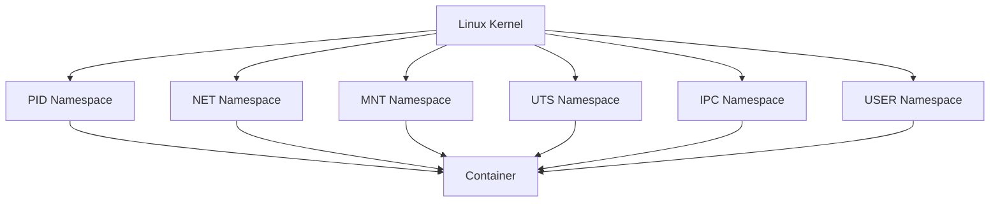
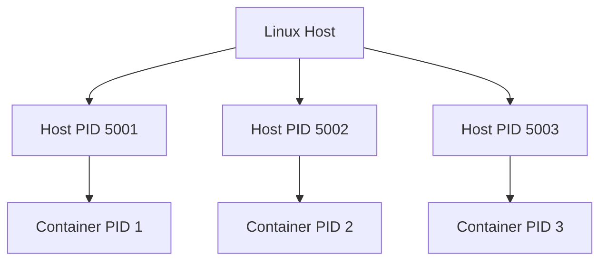
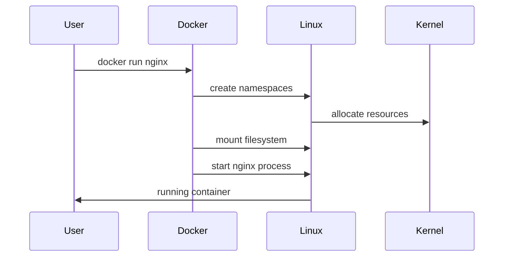
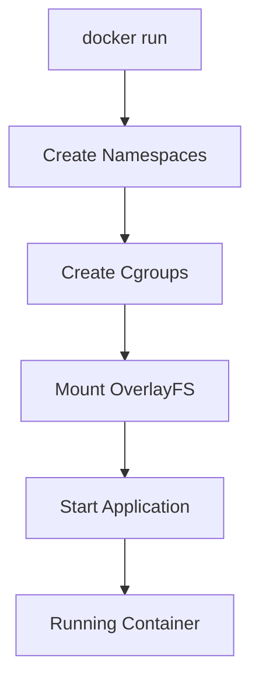

# Namespaces and Containers

> "Containers are not magic. Containers are Linux processes living inside isolated worlds called namespaces."

---

# Why This File Exists

If you remove namespaces, containers stop existing.

Docker would not exist.

Kubernetes would not exist.

Cloud-native infrastructure would not exist.

This file exists because many engineers learn:

```bash
docker run nginx
```

without understanding:

> What actually happens inside Linux?

This file answers that question.

---

# The Most Important Sentence

## Containers are isolated Linux processes.

But isolation doesn't happen automatically.

Linux needed a mechanism to create:

```text
Independent worlds

inside

the same operating system
```

That mechanism is:

# Namespaces

---

# The Problem Namespaces Solve

Imagine one Linux server.

```text
Linux Server

↓

100 Processes
```

Without isolation:

Every process can potentially see:

```text
Other processes

Other networks

Other mounts

Other users

Other hostnames
```

Chaos.

Applications interfere with each other.

Linux needed invisible walls.

---

# Mental Model: Office Building

Imagine a giant office building.

Without walls:

```text
Everyone

Shares everything
```

Problems:

```text
Noise

Confusion

No privacy

No isolation
```

Now build rooms.

```text
Office Building

├── Room A
├── Room B
├── Room C
└── Room D
```

Each room thinks:

> I am alone.

Reality:

Everyone is inside one building.

This is exactly what namespaces do.

---

# What Is A Namespace?

Technical definition:

> A namespace is a Linux kernel feature that creates an isolated view of a system resource.

Simplified:

> A namespace makes processes see their own version of reality.

---

# Master Mental Model

```text
Linux Server

↓

Kernel

↓

Namespaces

↓

Isolated Worlds

↓

Containers
```

---

# What Does Namespace Isolation Mean?

Imagine 3 containers.

```text
Container A

Container B

Container C
```

Each thinks:

```text
I have my own:

Processes

Network

Hostname

Filesystem

Users
```

Reality:

```text
One Linux Kernel

Shared underneath
```

---

# Visual Representation

```text
+--------------------------------------+

Linux Kernel

+--------------------------------------+

Namespace A

Container A

+--------------------------------------+

Namespace B

Container B

+--------------------------------------+

Namespace C

Container C

+--------------------------------------+
```

---

# The Six Core Linux Namespaces

Linux provides several namespaces.

Containers heavily depend on them.

| Namespace | Purpose |
|-----------|---------|
| PID | Process isolation |
| NET | Network isolation |
| MNT | Filesystem isolation |
| UTS | Hostname isolation |
| IPC | Inter-process communication isolation |
| USER | User isolation |

Modern Linux also has:

```text
CGROUP namespace

TIME namespace
```

---

# Big Picture Architecture



---

# PID Namespace

## Problem It Solves

Normally:

```bash
ps aux
```

shows:

```text
Every process
```

That's dangerous.

Applications should not see other applications.

---

## Without PID Namespace

```text
Linux

PID 1 systemd

PID 2 kthreadd

PID 500 nginx

PID 600 mysql

PID 700 redis
```

Everyone sees everything.

---

## With PID Namespace

Container A:

```text
PID 1 nginx

PID 2 worker

PID 3 worker
```

Container B:

```text
PID 1 mysql

PID 2 replication
```

Both think they own PID 1.

---

# Why PID 1 Is Special

Inside containers:

```text
Application

↓

PID 1
```

PID 1 has responsibilities:

```text
Signal handling

Zombie cleanup

Child process management
```

This is why PID 1 matters.

---

# PID Namespace Visualization



---

# Network Namespace (NET)

## Problem It Solves

Without isolation:

Everyone shares:

```text
IP

Ports

Interfaces
```

Chaos.

---

# With Network Namespace

Each container gets:

```text
Own IP

Own Routing Table

Own Network Interfaces

Own Firewall Rules

Own DNS Configuration
```

Example:

Container A:

```text
eth0

10.0.0.2
```

Container B:

```text
eth0

10.0.0.3
```

Both have an `eth0`.

Magic?

No.

Different network namespaces.

---

# Network Visualization

```text
Host

↓

Bridge docker0

↓

Container A

10.0.0.2

↓

Container B

10.0.0.3

↓

Container C

10.0.0.4
```

---

# Mount Namespace (MNT)

## Problem It Solves

Without isolation:

Processes see the entire filesystem.

Dangerous.

---

# With Mount Namespace

Each container sees:

```text
Its own filesystem
```

Container A:

```text
/

/app

/etc

/usr
```

Container B:

```text
/

/data

/etc

/usr
```

Different views.

---

# OverlayFS Connection

Mount namespaces work together with:

```text
OverlayFS
```

to create container filesystems.

---

# UTS Namespace

UTS = Unix Time Sharing

Controls:

```text
Hostname

Domain Name
```

Example:

Container A:

```text
hostname

web-server
```

Container B:

```text
hostname

database
```

Host:

```text
hostname

production-server
```

Everyone has different identities.

---

# IPC Namespace

IPC = Inter Process Communication.

Controls:

```text
Shared memory

Message queues

Semaphores
```

Without IPC isolation:

Applications can interfere.

With namespaces:

They cannot.

---

# User Namespace

One of the most important security features.

Allows:

```text
root

inside

container
```

without being:

```text
root

on

host
```

Example:

Container:

```text
UID 0
```

Host:

```text
UID 100000
```

Huge security improvement.

---

# The Reality Of A Container

A container is simply:

```text
Application

+

PID Namespace

+

NET Namespace

+

MNT Namespace

+

UTS Namespace

+

IPC Namespace

+

USER Namespace
```

Plus:

```text
Cgroups

Filesystem Layers
```

Done.

That's a container.

---

# How Docker Creates A Container

Simplified flow:



---

# Real Linux Commands

## See Namespace Information

```bash
lsns
```

Example:

```text
NS TYPE

4026531836 pid

4026531840 net

4026531841 mnt
```

---

# View Current Process Namespace

```bash
ls -l /proc/self/ns
```

Output:

```text
cgroup

ipc

mnt

net

pid

user

uts
```

---

# Enter Another Namespace

```bash
nsenter
```

Example:

```bash
sudo nsenter -t 1234 -n
```

Enter network namespace.

---

# Container Data Flow



---

# Relationship With Other Linux Topics

Containers are built from everything you've learned.

```text
Processes

↓

Namespaces

↓

Storage

↓

OverlayFS

↓

Networking

↓

Cgroups

↓

Security

↓

Containers
```

Linux knowledge compounds.

---

# Production Example

Microservices architecture:

```text
Authentication

↓

Container

↓

Own Namespace


Payments

↓

Container

↓

Own Namespace


Notifications

↓

Container

↓

Own Namespace
```

Independent worlds.

Shared kernel.

---

# Performance Considerations

Namespaces are fast because:

They do NOT create:

```text
Hardware

BIOS

Guest OS
```

They simply create:

```text
Kernel views
```

Extremely lightweight.

---

# Security Considerations

Namespaces improve security.

But they are NOT enough.

Add:

```text
Seccomp

SELinux

AppArmor

Capabilities

Read-only filesystems
```

Defense in depth.

---

# Scaling Considerations

Because namespaces are lightweight:

You can run:

```text
Hundreds

Thousands

of containers
```

on one server.

Impossible with VMs.

---

# Observability Considerations

Monitor:

```text
Namespaces

Processes

Memory

CPU

Network

Filesystem
```

Useful commands:

```bash
docker inspect

lsns

ip netns

ps

top

htop
```

---

# Common Mistakes

## Mistake 1

Thinking Docker created containers.

Wrong.

Linux did.

---

## Mistake 2

Thinking namespaces are containers.

Wrong.

Namespaces are one component.

---

## Mistake 3

Thinking namespaces provide complete security.

Wrong.

Security requires layers.

---

## Mistake 4

Ignoring User Namespaces.

Huge security mistake.

---

# Troubleshooting Mindset

Container issue?

Ask:

### Process problem?

```text
PID namespace
```

### Network problem?

```text
NET namespace
```

### Storage problem?

```text
MNT namespace
```

### Identity problem?

```text
UTS namespace
```

### Permission problem?

```text
USER namespace
```

---

# Engineering Mindset

Do not think:

> Docker creates containers.

Think:

> Docker orchestrates Linux primitives.

Linux already had the superpowers.

Docker made them accessible.

---

# Interview Questions

## Beginner

1. What is a namespace?

2. Why do namespaces exist?

3. How do namespaces enable containers?

4. What problem does PID namespace solve?

5. What problem does NET namespace solve?

---

## Intermediate

6. Explain all six namespaces.

7. Why does every container have PID 1?

8. Explain User Namespaces.

9. Why are namespaces lightweight?

10. Explain namespace isolation.

---

## Advanced

11. Explain the complete lifecycle of docker run.

12. Explain how namespaces and cgroups work together.

13. Explain container security limitations.

14. Explain namespace inheritance.

15. Explain namespace performance advantages.

---

# Cheat Sheet

```text
Namespace = Isolated View Of System Resources

Core Namespaces:

PID → Processes

NET → Networking

MNT → Filesystem

UTS → Hostname

IPC → Shared Memory

USER → Users

Container Formula:

Application

+

Namespaces

+

Cgroups

+

OverlayFS

=

Container
```

---

# Final Thought

Containers are not miniature computers.

Containers are Linux processes living inside carefully constructed illusions.

The Linux kernel performs an extraordinary trick:

> It convinces thousands of processes that each one owns its own machine.

That illusion is called **Namespaces**.

And that illusion changed the entire software industry.
