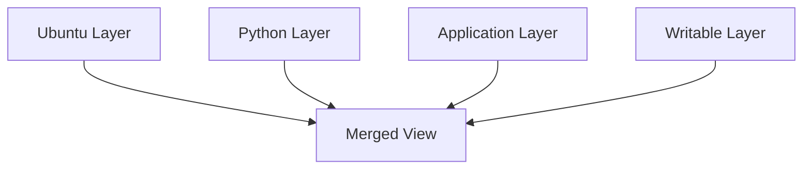
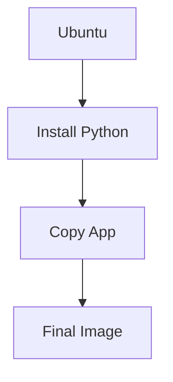
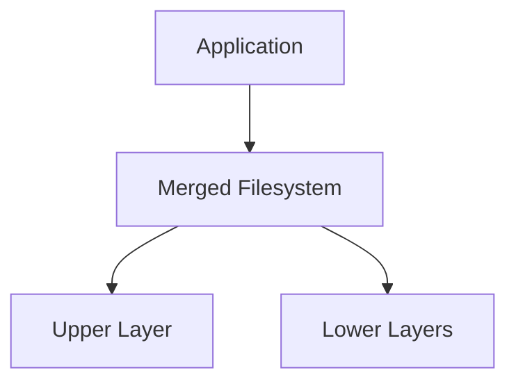

# OverlayFS

> "OverlayFS is one of Linux's most brilliant inventions. It allows thousands of containers to share the same filesystem without duplicating data."

---

# Why This File Exists

Most people think:

```bash
docker pull ubuntu
docker run ubuntu
```

creates a complete Ubuntu operating system every time.

It doesn't.

If that were true:

```text
100 Containers

=

100 Ubuntu installations
```

That would be terrible.

Huge storage waste.

Slow deployments.

Poor scalability.

Instead Linux invented something extraordinary.

That technology is:

# OverlayFS

---

# The Biggest Mental Model

OverlayFS is a filesystem stacking technology.

Think:

> OverlayFS combines multiple directories into one virtual filesystem.

---

# The Core Problem

Imagine this.

Ubuntu image size:

```text
80 MB
```

100 containers:

```text
100 × 80 MB

=

8000 MB
```

8 GB wasted.

Completely inefficient.

Question:

Can Linux allow all containers to share one Ubuntu?

Answer:

Yes.

Using OverlayFS.

---

# Mental Model: Transparent Papers

Imagine transparent sheets.

```text
Sheet 1

Ubuntu

↓

Sheet 2

Python

↓

Sheet 3

Libraries

↓

Sheet 4

Application
```

Stack them.

Your eyes see:

```text
One complete system
```

Reality:

Multiple layers.

That's OverlayFS.

---

# Another Mental Model: LEGO Blocks

Traditional systems:

```text
Entire house

↓

Duplicate entire house
```

OverlayFS:

```text
Foundation

↓

Walls

↓

Doors

↓

Windows
```

Reuse pieces.

Only change what is necessary.

---

# Master Formula

```text
Multiple Layers

+

Virtual Merge

=

One Filesystem
```

---

# Traditional Filesystem Approach

Without OverlayFS:

```text
Container A

Ubuntu

Python

App


Container B

Ubuntu

Python

App


Container C

Ubuntu

Python

App
```

Massive duplication.

---

# OverlayFS Approach

```text
Shared Ubuntu Layer

↓

Shared Python Layer

↓

Shared Dependencies Layer

↓

Unique App Layer
```

Much smaller.

---

# Visual Representation

```text
Container Filesystem

+----------------+

Application Layer

+----------------+

Dependencies Layer

+----------------+

Python Layer

+----------------+

Ubuntu Layer

+----------------+
```

Looks like one filesystem.

Actually many layers.

---

# Official OverlayFS Terminology

OverlayFS combines:

```text
Lower Layer

Upper Layer

Merged Layer

Work Directory
```

These four concepts are critical.

---

# Lower Layer

Lower layers are:

```text
Read Only
```

Examples:

```text
Ubuntu

Python

Libraries
```

Shared by everyone.

---

# Upper Layer

Upper layer is:

```text
Read Write
```

Stores:

```text
File modifications

New files

Deleted files
```

Unique per container.

---

# Merged Layer

Merged layer is:

```text
What applications see
```

Applications think:

```text
This is one filesystem.
```

Reality:

Multiple layers underneath.

---

# Work Directory

Temporary workspace used internally by OverlayFS.

Applications don't interact with it.

Linux uses it behind the scenes.

---

# OverlayFS Architecture



---

# Directory Structure

Example:

```text
lowerdir/

upperdir/

workdir/

merged/
```

Linux mounts them.

---

# Manual Mount Example

```bash
sudo mount -t overlay overlay \
-o lowerdir=/lower,\
upperdir=/upper,\
workdir=/work \
/merged
```

Now:

```text
merged/
```

looks like a normal filesystem.

---

# What Docker Does

Docker automatically creates OverlayFS structures.

When you run:

```bash
docker run nginx
```

Docker creates:

```text
Read Only Layers

↓

Writable Layer

↓

Merged Filesystem

↓

Container Starts
```

---

# Docker Layer Example

Dockerfile:

```dockerfile
FROM ubuntu

RUN apt install python3

COPY app.py /app

CMD python3 /app/app.py
```

Each instruction creates a layer.

Layer 1:

```text
Ubuntu
```

Layer 2:

```text
Python
```

Layer 3:

```text
Application
```

---

# Build Visualization



---

# Copy-On-Write (CoW)

This is OverlayFS's superpower.

Question:

If files are shared, how can a container modify them?

Answer:

Copy-On-Write.

---

# What Is Copy-On-Write?

Imagine:

```text
Shared file

↓

Someone edits it

↓

Create a copy

↓

Modify the copy
```

Original stays untouched.

---

# Example

Shared file:

```text
/etc/config
```

Container A edits:

```text
/etc/config
```

Linux:

```text
Copy file

↓

Move to upper layer

↓

Modify copy
```

Other containers unaffected.

---

# Visualization

Before edit:

```text
Ubuntu Layer

config.txt
```

After edit:

```text
Ubuntu Layer

config.txt


Upper Layer

config.txt (modified)
```

Container sees:

```text
Modified version
```

---

# File Read Flow

Suppose container requests:

```text
/etc/nginx.conf
```

Linux searches:

```text
Upper Layer

↓

Lower Layer
```

First match wins.

---

# Read Algorithm

```text
Request File

↓

Upper Layer?

YES → Return

NO

↓

Lower Layer?

YES → Return

NO

↓

File Not Found
```

---

# Delete Operations

Question:

Can a container delete shared files?

No.

Instead Linux creates:

```text
Whiteout files
```

Whiteout means:

> Pretend this file doesn't exist.

The original remains safe.

---

# Whiteout Visualization

Shared layer:

```text
config.txt
```

Container deletes it.

Linux creates:

```text
.whiteout_config.txt
```

Container no longer sees the file.

Other containers still do.

---

# Data Flow



---

# Relationship With Docker Images

Docker images are layers.

Docker containers add:

```text
Writable Layer
```

Formula:

```text
Docker Image

+

Writable Layer

=

Container
```

---

# Relationship With Docker Build Cache

Suppose:

```dockerfile
FROM ubuntu

RUN apt install python3

COPY app.py .
```

Change:

```text
app.py
```

Docker rebuilds only:

```text
COPY app.py
```

Not Ubuntu.

Huge speed improvement.

---

# Why OverlayFS Changed Everything

Without OverlayFS:

```text
Slow deployments

Huge storage usage

Poor scalability
```

With OverlayFS:

```text
Fast deployments

Tiny images

Layer reuse

Efficient caching
```

This enabled cloud-native systems.

---

# Production Example

100 microservices.

Without OverlayFS:

```text
100 Ubuntu installations
```

Terrible.

With OverlayFS:

```text
1 Ubuntu Layer

100 Small App Layers
```

Massive savings.

---

# Kubernetes Connection

Pods use container runtimes.

Container runtimes use:

```text
OverlayFS
```

Every Kubernetes cluster indirectly uses OverlayFS.

---

# AI Infrastructure Connection

AI images contain:

```text
Ubuntu

CUDA

PyTorch

Transformers

Models
```

Without layers:

Images become enormous.

OverlayFS reduces duplication.

---

# Cloud Provider Connection

Cloud providers optimize:

```text
Container startup

Image distribution

Storage usage
```

OverlayFS is critical.

---

# Linux Internals Deep Dive

Linux stores OverlayFS inside:

```bash
/var/lib/docker/
```

Look here:

```bash
/var/lib/docker/overlay2
```

You'll see:

```text
layer1

layer2

layer3
```

Each image instruction becomes a layer.

---

# Explore Docker Layers

Commands:

```bash
docker image inspect nginx

docker history nginx
```

See:

```text
Image layers
```

---

# Performance Considerations

Advantages:

```text
Fast startup

Storage efficiency

Layer caching

Reduced bandwidth

Reduced duplication
```

Tradeoffs:

```text
Extra filesystem lookups

Copy-on-write overhead

Large writable layers reduce performance
```

---

# Security Considerations

Shared layers are:

```text
Read Only
```

Benefits:

```text
Harder to tamper

Predictable images

Immutable infrastructure
```

Still secure your containers.

---

# Scaling Considerations

OverlayFS enables:

```text
Hundreds

Thousands

of containers
```

on one machine.

Without it:

Storage becomes expensive.

---

# Observability Considerations

Monitor:

```text
Disk usage

Layer growth

Writable layer size

Copy-on-write activity
```

Useful commands:

```bash
docker system df

docker history

docker image inspect

du -sh /var/lib/docker

mount | grep overlay
```

---

# Common Mistakes

## Mistake 1

Thinking containers contain entire operating systems.

Wrong.

They contain layers.

---

## Mistake 2

Writing huge amounts of data inside containers.

Wrong.

Use volumes.

---

## Mistake 3

Creating gigantic images.

Bad practice.

---

## Mistake 4

Ignoring Docker build cache.

Huge performance loss.

---

# Troubleshooting Guide

Container huge?

Check:

```bash
docker system df
```

---

Image slow?

Check:

```text
Too many layers?
```

---

Disk full?

Check:

```bash
docker image prune
```

---

Container writes disappearing?

Remember:

```text
Container writable layers are temporary.
```

Use volumes.

---

# Engineering Mindset

Think:

```text
Containers

↓

Images

↓

Layers

↓

OverlayFS

↓

Linux Filesystems
```

Containers are storage engineering.

---

# Interview Questions

## Beginner

1. What is OverlayFS?

2. Why does it exist?

3. What problem does it solve?

4. What is Copy-On-Write?

5. Why are containers small?

---

## Intermediate

6. Explain lower and upper layers.

7. Explain merged filesystem.

8. Explain whiteout files.

9. Explain Docker image layers.

10. Explain Docker build cache.

---

## Advanced

11. Explain OverlayFS internals.

12. Explain container startup.

13. Explain Kubernetes and OverlayFS.

14. Explain performance bottlenecks.

15. Explain immutable infrastructure.

---

# Cheat Sheet

```text
OverlayFS = Filesystem Stacking

Components:

Lower Layer → Read Only

Upper Layer → Read Write

Merged Layer → Application View

Work Directory → Internal Workspace


Copy-On-Write:

Read → Shared

Write → Copy


Container Formula:

Docker Image

+

Writable Layer

=

Container


Useful Commands:

docker history

docker image inspect

docker system df

mount | grep overlay

du -sh /var/lib/docker
```

---

# Final Thought

Namespaces create isolated worlds.

Cgroups create fair resource economies.

OverlayFS creates efficient storage realities.

Together they allow Linux to perform an incredible trick:

> Run thousands of applications while pretending every application owns its own machine.

That illusion is the foundation of modern cloud infrastructure.
