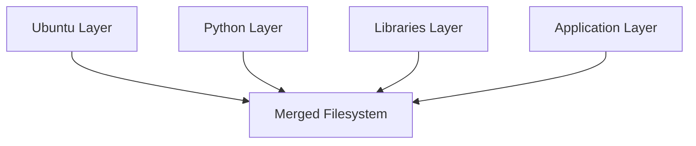
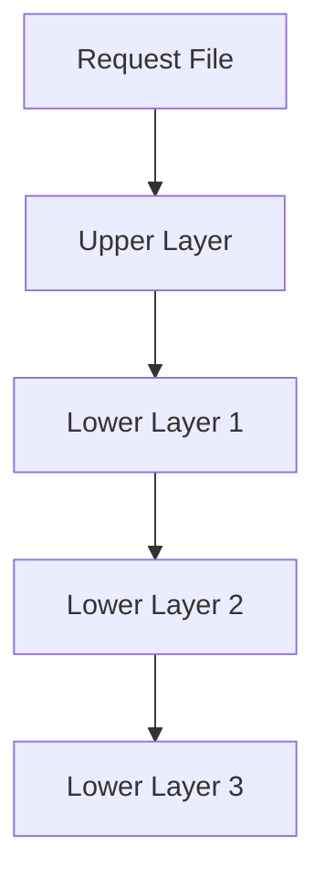

# Union Filesystems

> "Union filesystems taught Linux how to combine many filesystems into one reality. This single idea changed how software is built, distributed, and deployed across the entire cloud industry."

---

# Why This File Exists

Most people know:

```bash
docker build

docker run
```

Very few ask:

> How can Docker combine Ubuntu, Python, Node.js, and my application into one filesystem?

The answer starts here.

Before OverlayFS...

Before Docker...

Before Kubernetes...

There was a storage engineering problem.

That problem led to:

# Union Filesystems

---

# The Core Problem

Imagine building applications traditionally.

Application A:

```text
Ubuntu

Python

Libraries

Application
```

Application B:

```text
Ubuntu

Python

Libraries

Application
```

Application C:

```text
Ubuntu

Python

Libraries

Application
```

Huge duplication.

Waste everywhere.

---

# Storage Explosion Problem

Imagine:

```text
Ubuntu = 80 MB

Python = 150 MB

Libraries = 100 MB

Application = 50 MB
```

Total:

```text
380 MB
```

100 services:

```text
38 GB
```

Most of that is duplicate data.

Terrible design.

---

# Engineers Asked A Better Question

Instead of duplicating entire systems...

Can we share common pieces?

This simple question created a revolution.

---

# Mental Model: Transparent Sheets

Imagine transparent papers.

Layer 1:

```text
Ubuntu
```

Layer 2:

```text
Python
```

Layer 3:

```text
Libraries
```

Layer 4:

```text
Application
```

Stack them.

You see:

```text
One complete system
```

Reality:

Multiple independent layers.

This is a union filesystem.

---

# Another Mental Model: LEGO Blocks

Traditional infrastructure:

```text
House

↓

Duplicate house

↓

Duplicate house
```

Union filesystem:

```text
Foundation

↓

Walls

↓

Doors

↓

Windows
```

Reuse components.

Build efficiently.

---

# Official Definition

> A Union Filesystem combines multiple independent filesystems into one unified virtual filesystem.

Simple definition:

> Many directories become one reality.

---

# Master Mental Model

```text
Multiple Filesystems

↓

Virtual Merge

↓

Single Filesystem View
```

---

# Traditional Filesystem Thinking

Old world:

```text
Application A

Entire Filesystem


Application B

Entire Filesystem


Application C

Entire Filesystem
```

Wasteful.

---

# Union Filesystem Thinking

```text
Shared Ubuntu

↓

Shared Runtime

↓

Shared Libraries

↓

Unique Application Layer
```

Efficient.

---

# Visual Representation

```text
Application Layer

↓

Dependencies Layer

↓

Runtime Layer

↓

Base OS Layer

↓

Unified Filesystem
```

Applications see:

```text
One Filesystem
```

Linux sees:

```text
Multiple Layers
```

---

# Why Linux Needed This

Modern systems require:

```text
Portability

Speed

Caching

Scalability

Storage Efficiency
```

Traditional filesystems weren't designed for this.

Union filesystems were.

---

# Core Components

Most union filesystems contain:

```text
Lower Layers

Upper Layer

Merged Layer
```

---

# Lower Layers

These are:

```text
Read Only
```

Examples:

```text
Ubuntu

Python

Node.js

Libraries
```

Reusable.

Shared.

Immutable.

---

# Upper Layer

This is:

```text
Read Write
```

Stores:

```text
Changes

New files

Updates

Deletions
```

Unique per container.

---

# Merged Layer

This is:

```text
What applications see
```

The illusion layer.

---

# Big Picture Architecture



---

# The Illusion Principle

Applications think:

```text
There is one filesystem.
```

Reality:

```text
Many filesystems
```

Linux performs the illusion.

---

# Copy-On-Write (CoW)

This is one of the biggest ideas in cloud infrastructure.

Question:

How can files be shared if applications modify them?

Answer:

Copy-On-Write.

---

# Mental Model: Shared Book

Imagine a shared textbook.

Three students read it.

One student writes notes.

Instead of modifying the original:

```text
Create a copy

↓

Write notes there
```

Original remains untouched.

---

# File Flow Example

Shared file:

```text
config.yaml
```

Container edits it.

Linux:

```text
Copy file

↓

Move to writable layer

↓

Modify copy
```

Done.

---

# Read Flow

Suppose application requests:

```text
/etc/nginx.conf
```

Linux searches:

```text
Upper Layer

↓

Lower Layer 1

↓

Lower Layer 2

↓

Lower Layer 3
```

First match wins.

---

# Read Visualization



---

# Delete Operations

Question:

Can containers delete shared files?

No.

Instead Linux creates:

```text
Whiteout Files
```

Whiteout means:

> Pretend this file no longer exists.

Original remains safe.

---

# Whiteout Example

Original:

```text
nginx.conf
```

Delete request:

Linux creates:

```text
.wh.nginx.conf
```

Only this container hides it.

Other containers still see it.

---

# Evolution Of Union Filesystems

Linux experimented with multiple technologies.

Examples:

```text
UnionFS

AUFS

OverlayFS

Btrfs

ZFS
```

---

# Timeline

```text
2004

UnionFS

↓

2006

AUFS

↓

2014

OverlayFS

↓

Today

OverlayFS Dominates
```

---

# UnionFS

One of the earliest implementations.

Goal:

```text
Merge directories
```

Problems:

```text
Complexity

Kernel integration issues
```

---

# AUFS

Advanced Multi-Layered Filesystem.

Very popular in early Docker versions.

Pros:

```text
Stable

Flexible
```

Cons:

```text
Never fully merged into Linux kernel
```

---

# OverlayFS

Modern solution.

Pros:

```text
Simple

Fast

Kernel integrated

Efficient
```

Docker uses:

```text
overlay2
```

today.

---

# Relationship With Docker

Docker images are layered.

Example:

```dockerfile
FROM ubuntu

RUN apt install python3

COPY app.py .

CMD python3 app.py
```

Layers:

```text
Ubuntu

↓

Python

↓

Application
```

Each instruction becomes a layer.

---

# Data Flow


---

# Why This Changed The Industry

Before union filesystems:

```text
Slow deployments

Huge storage

Large bandwidth costs

Duplicate software
```

After:

```text
Fast deployments

Layer caching

Storage efficiency

Immutable infrastructure
```

Huge transformation.

---

# Immutable Infrastructure

This idea changed DevOps forever.

Old world:

```text
Update servers
```

Modern world:

```text
Replace servers
```

Instead of:

```text
SSH

Fix server

Install packages
```

We do:

```text
Build new image

Deploy image

Destroy old container
```

Infrastructure becomes code.

---

# Cloud Connection

Cloud providers optimize:

```text
Storage

Bandwidth

Image distribution

Container startup
```

Union filesystems are foundational.

---

# Kubernetes Connection

Kubernetes:

```text
Pod

↓

Container Runtime

↓

OverlayFS

↓

Union Filesystem
```

Every Kubernetes cluster indirectly depends on this concept.

---

# AI Infrastructure Connection

AI images are huge.

Components:

```text
Ubuntu

CUDA

PyTorch

TensorFlow

Transformers

Models
```

Without layers:

Impossible to scale efficiently.

---

# Linux Internals

Docker stores layers here:

```bash
/var/lib/docker
```

Especially:

```bash
/var/lib/docker/overlay2
```

This is where reality becomes visible.

---

# Build Cache Superpower

Suppose:

```dockerfile
FROM ubuntu

RUN apt install python3

COPY app.py .
```

Only `app.py` changes.

Docker reuses:

```text
Ubuntu

Python
```

Rebuilds:

```text
Application Layer
```

Fast.

---

# Production Example

100 microservices.

Without union filesystems:

```text
100 Ubuntu systems
```

Terrible.

With union filesystems:

```text
1 Ubuntu Layer

↓

100 Tiny App Layers
```

Efficient.

---

# Performance Considerations

Advantages:

```text
Storage efficiency

Bandwidth savings

Fast deployment

Caching

Scalability
```

Tradeoffs:

```text
Filesystem lookup overhead

Copy-on-write overhead

Large writable layers reduce performance
```

---

# Security Considerations

Benefits:

```text
Immutable images

Read-only layers

Predictable environments
```

Still apply:

```text
Least privilege

Image scanning

Runtime security
```

---

# Scaling Considerations

This technology enables:

```text
Hundreds

Thousands

of containers
```

per server.

Without it:

Cloud-native infrastructure becomes expensive.

---

# Observability Considerations

Monitor:

```text
Image size

Layer count

Disk usage

Copy-on-write growth

Writable layer size
```

Useful commands:

```bash
docker system df

docker history

docker image inspect

du -sh /var/lib/docker

mount | grep overlay
```

---

# Common Mistakes

## Mistake 1

Thinking OverlayFS and Union Filesystems are identical.

Wrong.

OverlayFS is an implementation.

Union Filesystem is the concept.

---

## Mistake 2

Creating gigantic images.

Bad practice.

---

## Mistake 3

Writing persistent data inside containers.

Use volumes.

---

## Mistake 4

Ignoring image optimization.

Costs money at scale.

---

# Troubleshooting Guide

Disk full?

Check:

```bash
docker system df
```

---

Huge image?

Check:

```bash
docker history image_name
```

---

Slow builds?

Check:

```text
Layer caching strategy
```

---

Container writes disappearing?

Remember:

```text
Writable layers are temporary.
```

---

# Engineering Mindset

Think bigger.

Do not think:

> Docker stores files.

Think:

> Linux created a new storage paradigm that powers modern infrastructure.

The evolution is:

```text
Linux Filesystems

↓

Union Filesystems

↓

OverlayFS

↓

Containers

↓

Kubernetes

↓

Cloud Native Systems
```

---

# Interview Questions

## Beginner

1. What is a union filesystem?

2. Why was it created?

3. What problem does it solve?

4. What is Copy-On-Write?

5. Why are containers small?

---

## Intermediate

6. Explain lower and upper layers.

7. Explain merged views.

8. Explain whiteout files.

9. Explain immutable infrastructure.

10. Explain Docker image layers.

---

## Advanced

11. Explain OverlayFS vs UnionFS.

12. Explain Kubernetes storage flow.

13. Explain image distribution optimization.

14. Explain cloud economics.

15. Explain container storage performance bottlenecks.

---

# Cheat Sheet

```text
Union Filesystem

=

Multiple Filesystems

+

Virtual Merge

=

One Filesystem


Core Concepts:

Lower Layers → Read Only

Upper Layer → Read Write

Merged Layer → Application View

Copy-On-Write → Duplicate Only On Modification

Whiteout → Pretend File Doesn't Exist


Evolution:

UnionFS

↓

AUFS

↓

OverlayFS


Infrastructure Evolution:

Linux Filesystems

↓

Union Filesystems

↓

Containers

↓

Kubernetes

↓

Cloud Native Systems
```

---

# Final Thought

One of Linux's greatest achievements was teaching storage a new trick:

> Stop duplicating everything.

> Start sharing everything safely.

That single idea transformed Linux from an operating system into a platform capable of running the modern internet.
