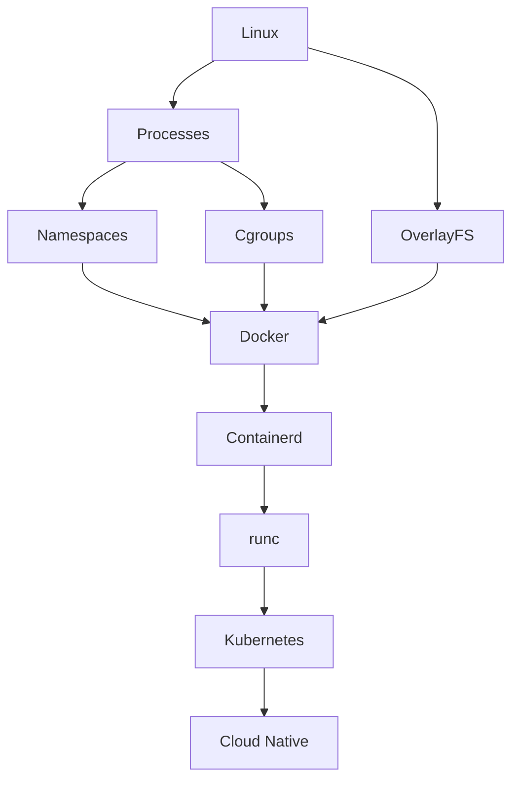
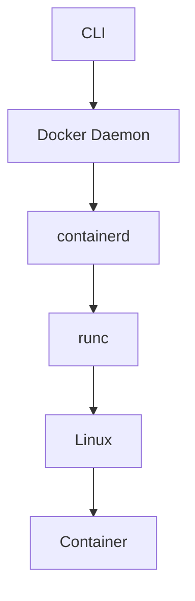
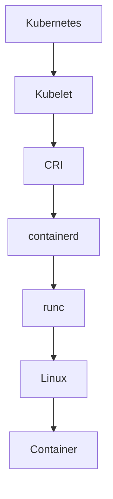

# Container Engineering Interview Questions

> "The goal is not to memorize answers. The goal is to learn how infrastructure engineers think."

---

# How To Use This File

Do NOT memorize.

For every question ask:

```text
WHY?

HOW?

WHAT PROBLEM DOES IT SOLVE?

WHAT HAPPENS IF IT BREAKS?

HOW DOES IT SCALE?

HOW DOES IT CONNECT TO LINUX?
```

If you can answer these questions, you understand containers deeply.

---

# Container Knowledge Dependency Tree



---

# Level 1: Beginner Questions (Fundamentals)

## 1. What problem do containers solve?

Expected thinking:

```text
Dependency conflicts

Environment consistency

Portability

Deployment speed
```

---

## 2. What is a container?

Expected answer:

```text
A container is an isolated Linux process.
```

Not:

```text
Small VM
```

---

## 3. Why do containers exist if Linux already existed?

---

## 4. Explain the difference between a process and a container.

---

## 5. Explain the difference between a VM and a container.

---

## 6. Why are containers lightweight?

---

## 7. Why are containers faster than VMs?

---

## 8. Why do containers share the host kernel?

---

## 9. What is container isolation?

---

## 10. Are containers secure by default?

Answer:

```text
No.
```

---

# Level 2: Linux Internals Questions

## 11. What Linux technologies make containers possible?

Expected:

```text
Namespaces

Cgroups

OverlayFS

Capabilities

Seccomp
```

---

## 12. What are namespaces?

---

## 13. Explain PID namespace.

---

## 14. Explain network namespace.

---

## 15. Explain mount namespace.

---

## 16. Explain UTS namespace.

---

## 17. Explain IPC namespace.

---

## 18. Explain user namespace.

---

## 19. What are cgroups?

---

## 20. Why do cgroups exist?

---

## 21. What happens if containers had no cgroups?

Expected:

```text
Resource starvation
```

---

## 22. Explain OverlayFS.

---

## 23. Explain union filesystems.

---

## 24. Explain Copy-On-Write.

---

## 25. Where are Docker layers stored?

---

# Level 3: Docker Fundamentals

## 26. Explain Docker architecture.

Draw:

```text
CLI

↓

Daemon

↓

containerd

↓

runc

↓

Linux
```

---

## 27. Explain Docker Engine.

---

## 28. Explain Docker daemon.

---

## 29. What happens during docker run?

---

## 30. Explain the complete lifecycle of docker run nginx.

Expected flow:

```text
CLI

↓

Docker Daemon

↓

containerd

↓

runc

↓

Namespaces

↓

Cgroups

↓

OverlayFS

↓

Linux Process
```

---

## 31. Difference between image and container?

---

## 32. Why are images immutable?

---

## 33. Why are containers ephemeral?

---

## 34. Explain Docker layers.

---

## 35. Why does layer ordering matter?

---

## 36. Explain Docker cache.

---

## 37. Explain multi-stage builds.

---

## 38. Explain Dockerfiles.

---

## 39. Difference between CMD and ENTRYPOINT?

---

## 40. Why avoid latest tags?

---

# Level 4: Storage Questions

## 41. Why do Docker volumes exist?

---

## 42. Difference between:

```text
Volumes

Bind Mounts

tmpfs
```

---

## 43. Why should databases never live inside container layers?

---

## 44. Explain persistent storage.

---

## 45. Why is state management difficult?

---

# Level 5: Networking Questions

## 46. Explain Docker networking architecture.

---

## 47. What is docker0?

---

## 48. Explain veth pairs.

---

## 49. Explain bridge networking.

---

## 50. Explain NAT.

---

## 51. Explain port mapping.

---

## 52. Explain Docker DNS.

---

## 53. Explain host networking.

---

## 54. Explain overlay networking.

---

## 55. Why do microservices need service discovery?

---

# Level 6: Runtime Questions

## 56. Is Docker a runtime?

Expected:

```text
No.
```

Docker is a platform.

---

## 57. What is a container runtime?

---

## 58. What is containerd?

---

## 59. Why was Docker split?

---

## 60. What is runc?

---

## 61. What is OCI?

---

## 62. Why does OCI exist?

---

## 63. Explain CRI.

---

## 64. Why did Kubernetes remove Docker?

Expected:

```text
Kubernetes removed Docker dependency.

Not Docker itself.
```

---

## 65. Explain dockershim.

---

# Level 7: Security Questions

## 66. Why are containers not security boundaries?

---

## 67. Explain least privilege.

---

## 68. Why avoid root users?

---

## 69. Explain Linux capabilities.

---

## 70. Explain seccomp.

---

## 71. Explain AppArmor.

---

## 72. Explain SELinux.

---

## 73. Explain image security.

---

## 74. Explain runtime security.

---

## 75. Explain supply chain security.

---

## 76. What is SBOM?

---

## 77. Explain image signing.

---

## 78. Explain Zero Trust.

---

# Level 8: Production Questions

## 79. What does immutable infrastructure mean?

---

## 80. Why should containers be disposable?

---

## 81. Explain health checks.

---

## 82. Explain self-healing systems.

---

## 83. Explain observability.

---

## 84. Explain sidecar pattern.

---

## 85. Explain ambassador pattern.

---

## 86. Explain adapter pattern.

---

## 87. Explain circuit breaker.

---

## 88. Explain retry patterns.

---

## 89. Explain bulkheads.

---

## 90. Why separate state and compute?

---

# Level 9: Deployment Questions

## 91. Explain rolling deployment.

---

## 92. Explain blue-green deployment.

---

## 93. Explain canary deployment.

---

## 94. Explain shadow deployment.

---

## 95. Explain feature flags.

---

## 96. Why are rollbacks important?

---

## 97. Explain deployment risk management.

---

## 98. Why are database deployments dangerous?

---

## 99. Explain backward compatibility.

---

## 100. Explain health checks during deployments.

---

# Level 10: Kubernetes Connections

## 101. How are containers related to Kubernetes?

---

## 102. Explain Pod.

---

## 103. Why do Pods exist?

---

## 104. Explain kubelet.

---

## 105. Explain CNI.

---

## 106. Explain CSI.

---

## 107. Explain Kubernetes networking.

---

## 108. Explain Kubernetes storage.

---

## 109. Explain Kubernetes deployment flow.

---

## 110. Explain service mesh.

---

# Level 11: Production Scenarios

## Scenario 1

Container CPU suddenly spikes to 100%.

How do you debug?

Expected thought process:

```text
Application

↓

Infinite Loop

↓

Traffic Spike

↓

Crypto Miner

↓

Memory Leak

↓

Resource Abuse
```

---

## Scenario 2

Containers cannot communicate.

How do you debug?

Checklist:

```text
Network

↓

DNS

↓

Port Mapping

↓

Firewall

↓

Policies
```

---

## Scenario 3

Container starts then immediately exits.

How do you debug?

Checklist:

```text
Entrypoint

↓

Dependencies

↓

Permissions

↓

Logs

↓

Health Checks
```

---

## Scenario 4

Deployment breaks production.

How do you respond?

Checklist:

```text
Stop Rollout

↓

Rollback

↓

Investigate

↓

Fix

↓

Redeploy
```

---

## Scenario 5

Database becomes slow after deployment.

Investigate:

```text
Queries

↓

Connections

↓

Indexes

↓

CPU

↓

Network
```

---

# FAANG / Senior Engineer Questions

## Explain containers from first principles.

---

## Explain complete container startup flow.

Expected:

```text
docker run

↓

Docker Daemon

↓

containerd

↓

runc

↓

Namespaces

↓

Cgroups

↓

OverlayFS

↓

Syscalls

↓

Linux Process
```

---

## Explain why Kubernetes won.

---

## Explain why containers changed cloud computing.

---

## Explain cloud-native infrastructure.

---

## Explain container security from code to production.

---

## Explain how you would run 10000 containers reliably.

---

## Explain how Netflix deploys software safely.

---

# Whiteboard Architecture Questions

## Draw Complete Docker Architecture



---

## Draw Complete Kubernetes Runtime Architecture



---

# Ultimate Systems Thinking Question

Explain the entire evolution.

```text
Linux

↓

Processes

↓

Namespaces

↓

Cgroups

↓

OverlayFS

↓

Containers

↓

Docker

↓

OCI

↓

containerd

↓

runc

↓

Kubernetes

↓

Cloud Native Systems

↓

Platform Engineering
```

If you can explain every arrow, you deeply understand containers.

---

# Interview Cheat Sheet

```text
Always Answer:

WHY

↓

HOW

↓

DATA FLOW

↓

SCALING

↓

SECURITY

↓

FAILURES

↓

OBSERVABILITY
```

---

# Engineering Mindset

Do not answer interviews like this:

```text
Definition

↓

Done
```

Answer like this:

```text
Problem

↓

Solution

↓

Internals

↓

Production

↓

Tradeoffs
```

That is how senior engineers think.

---

# Final Thought

Junior engineers memorize technologies.

Senior engineers understand systems.

Staff engineers understand relationships between systems.

Architects understand why those systems exist.

**Your goal is not to learn Docker.**

**Your goal is to learn how modern infrastructure thinks.**
