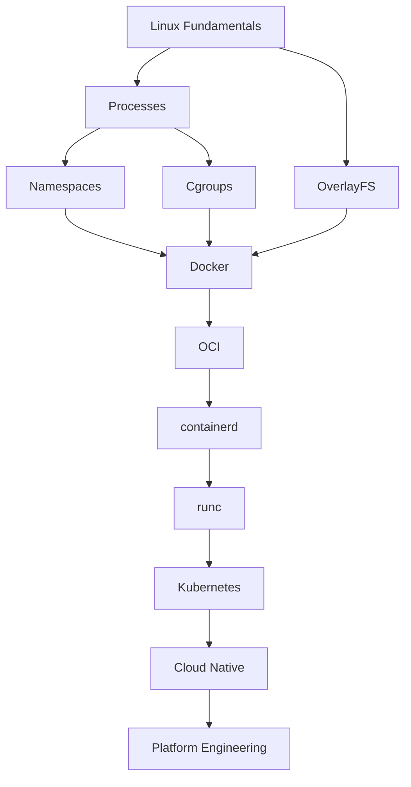
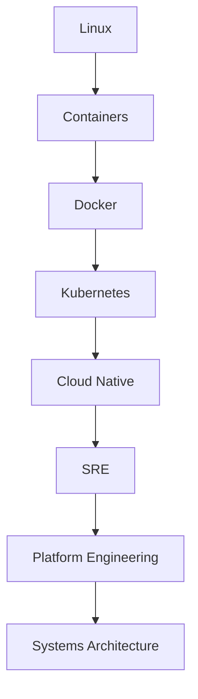

# Container Engineering References

> "Don't collect resources. Build a knowledge graph."

This is a curated collection of world-class resources to deeply understand containers, cloud-native systems, Linux internals, platform engineering, and distributed infrastructure.

---

# How To Use This File

Do NOT consume randomly.

Follow this progression.

```text
Linux

↓

Processes

↓

Namespaces

↓

Cgroups

↓

OverlayFS

↓

Containers

↓

Docker

↓

OCI

↓

containerd

↓

runc

↓

Kubernetes

↓

Cloud Native Systems

↓

Platform Engineering
```

---

# Knowledge Dependency Map



---

# Tier 1: Must Master Linux First

## Linux Kernel Documentation

Purpose:

```text
Understand Linux internals from the source.
```

Topics:

```text
Processes

Namespaces

Cgroups

Security

Memory

Networking
```

Website:

https://www.kernel.org/doc/html/latest/

---

## Linux man pages

Purpose:

```text
Learn Linux directly from the operating system.
```

Commands:

```text
man namespaces

man clone

man cgroups

man mount

man unshare
```

Website:

https://man7.org/linux/man-pages/

---

# Tier 2: Container Foundations

## OCI (Open Container Initiative)

Purpose:

```text
Learn container standards.
```

Topics:

```text
Image Spec

Runtime Spec

Distribution Spec
```

Website:

https://opencontainers.org/

GitHub:

https://github.com/opencontainers

---

## Docker Official Documentation

Purpose:

```text
Learn Docker architecture correctly.
```

Topics:

```text
Images

Networking

Volumes

Compose

Security
```

Website:

https://docs.docker.com/

---

# Tier 3: Deep Runtime Knowledge

## containerd Documentation

Purpose:

```text
Understand container lifecycle management.
```

Website:

https://containerd.io/

Documentation:

https://github.com/containerd/containerd

---

## runc

Purpose:

```text
Learn low-level runtime internals.
```

GitHub:

https://github.com/opencontainers/runc

---

# Tier 4: Kubernetes Knowledge

## Kubernetes Official Documentation

Purpose:

```text
Learn orchestration.
```

Website:

https://kubernetes.io/docs/

---

## Kubernetes Concepts

Study:

```text
Pods

Deployments

Services

Ingress

Storage

Networking

Scheduling
```

---

# Tier 5: CNCF Landscape

## CNCF

Purpose:

```text
Understand cloud native ecosystem.
```

Website:

https://www.cncf.io/

Landscape:

https://landscape.cncf.io/

---

# Tier 6: Books (Highest Priority)

## Book 1

### The Linux Programming Interface

Author:

```text
Michael Kerrisk
```

Learn:

```text
Processes

Namespaces

Syscalls

Filesystems
```

Difficulty:

```text
Advanced
```

---

## Book 2

### Understanding The Linux Kernel

Authors:

```text
Daniel Bovet

Marco Cesati
```

Learn:

```text
Kernel Internals
```

Difficulty:

```text
Advanced
```

---

## Book 3

### Docker Deep Dive

Author:

```text
Nigel Poulton
```

Learn:

```text
Docker

Containers

Cloud Native
```

Difficulty:

```text
Beginner → Intermediate
```

---

## Book 4

### Kubernetes Up & Running

Authors:

```text
Kelsey Hightower

Brendan Burns

Joe Beda
```

Learn:

```text
Production Kubernetes
```

Difficulty:

```text
Intermediate
```

---

## Book 5

### Designing Data-Intensive Applications

Author:

```text
Martin Kleppmann
```

Learn:

```text
Distributed Systems

Reliability

Scalability
```

Difficulty:

```text
Advanced
```

---

## Book 6

### Site Reliability Engineering

Organization:

```text
Google
```

Learn:

```text
Production Systems

Reliability

Observability
```

Difficulty:

```text
Advanced
```

Free:

https://sre.google/books/

---

# Tier 7: GitHub Repositories

## Awesome Containers

https://github.com/ramitsurana/awesome-kubernetes

---

## Awesome Docker

https://github.com/veggiemonk/awesome-docker

---

## Awesome Kubernetes

https://github.com/ramitsurana/awesome-kubernetes

---

## Awesome Cloud Native

https://github.com/rootsongjc/awesome-cloud-native

---

# Tier 8: Interactive Labs

## Play With Docker

Purpose:

```text
Practice Docker in browser.
```

Website:

https://labs.play-with-docker.com/

---

## Killercoda

Purpose:

```text
Hands-on Kubernetes.
```

Website:

https://killercoda.com/

---

# Tier 9: Security Learning

## OWASP Docker Security

Website:

https://cheatsheetseries.owasp.org/

Topics:

```text
Container Security

Supply Chain Security
```

---

## Falco

Website:

https://falco.org/

Learn:

```text
Runtime Security
```

---

## Tetragon

Website:

https://tetragon.io/

Learn:

```text
eBPF Security
```

---

# Tier 10: Observability Learning

## Prometheus

Website:

https://prometheus.io/

---

## Grafana

Website:

https://grafana.com/

---

## OpenTelemetry

Website:

https://opentelemetry.io/

---

# Tier 11: Networking Learning

Study Linux networking deeply.

Topics:

```text
TCP/IP

veth

Bridges

NAT

iptables

nftables

DNS
```

Resources:

```text
man pages

kernel docs
```

---

# Tier 12: Storage Learning

Study:

```text
OverlayFS

UnionFS

Volumes

Persistent Storage

Distributed Storage
```

Technologies:

```text
Ceph

Longhorn

Rook

MinIO
```

---

# Tier 13: CI/CD Learning

Tools:

```text
GitHub Actions

GitLab CI

Jenkins

ArgoCD

FluxCD
```

Learn:

```text
Automation

GitOps

Continuous Delivery
```

---

# Tier 14: Platform Engineering Learning

Study:

```text
Internal Developer Platforms

Golden Paths

Self Service Infrastructure

Infrastructure APIs
```

Topics:

```text
Backstage

Crossplane

ArgoCD
```

---

# Tier 15: Cloud Learning

AWS:

```text
ECS

EKS

Fargate
```

Google:

```text
GKE
```

Azure:

```text
AKS
```

---

# Tier 16: YouTube Channels (High Quality)

## TechWorld with Nana

Topics:

```text
Docker

Kubernetes

DevOps
```

---

## Bret Fisher

Topics:

```text
Docker

Production Containers
```

---

## Nana Janashia

Topics:

```text
Cloud Native Systems
```

---

## Hussein Nasser

Topics:

```text
Backend Systems

Infrastructure

Networking
```

---

## ByteByteGo

Topics:

```text
System Design
```

---

# Tier 17: Blogs Worth Reading

## Cloudflare Blog

Topics:

```text
Networking

Security

Performance
```

Website:

https://blog.cloudflare.com/

---

## Netflix Tech Blog

Topics:

```text
Distributed Systems
```

Website:

https://netflixtechblog.com/

---

## Uber Engineering

Website:

https://www.uber.com/blog/engineering/

---

## Google Engineering

Website:

https://research.google/blog/

---

# Tier 18: The Long-Term Learning Roadmap



---

# Engineering Principles To Revisit Constantly

## Principle 1

```text
Everything is a Linux process.
```

---

## Principle 2

```text
Containers are not VMs.
```

---

## Principle 3

```text
Docker is not the runtime.
```

---

## Principle 4

```text
Containers are disposable.
```

---

## Principle 5

```text
Applications are ecosystems.
```

---

## Principle 6

```text
Infrastructure should be immutable.
```

---

## Principle 7

```text
Observability is mandatory.
```

---

## Principle 8

```text
Security is continuous.
```

---

## Principle 9

```text
Automation beats humans.
```

---

## Principle 10

```text
Always learn from first principles.
```

---

# Repository Graduation Test

If you can explain all of this without memorization:

```text
Linux

↓

Processes

↓

Namespaces

↓

Cgroups

↓

OverlayFS

↓

Containers

↓

Docker

↓

OCI

↓

containerd

↓

runc

↓

CRI

↓

Kubernetes

↓

Cloud Native

↓

SRE

↓

Platform Engineering

↓

Systems Architecture
```

You have moved beyond learning tools.

You have started learning how modern infrastructure thinks.

---

# Final Thought

Do not collect certifications.

Do not collect technologies.

Do not collect tools.

Collect mental models.

Because tools change every year.

**First principles survive for decades.**
