# Deployment Strategies

> "Deployment is not moving code into production. Deployment is safely changing a living distributed system."

---

# Why This File Exists

Most beginners think:

```text
Code

↓

Server

↓

Done
```

Production engineers think:

```text
How much downtime?

How much risk?

How fast can we rollback?

How do we detect failures?

How do we protect users?
```

This file exists to answer:

> How do companies safely deploy software millions of times every day?

---

# The Biggest Misconception

Many people think:

```text
Deployment

=

Copy Files
```

Wrong.

Reality:

```text
Deployment

=

Risk Management
```

---

# The Core Problem

Suppose:

```text
1 Million Users
```

You deploy a bug.

Consequences:

```text
Downtime

Revenue Loss

Customer Loss

Data Corruption

Reputation Damage
```

Production deployments are dangerous.

---

# The Biggest Mental Model

Think:

> Every deployment is a controlled experiment.

Never deploy everything at once.

---

# Mental Model 1: Airplane Engine Replacement

Bad:

```text
Replace engine mid-air

↓

Hope everything works
```

Good:

```text
Test

Observe

Switch gradually
```

---

# Mental Model 2: Traffic Redirection

Deployment is often:

```text
Move Users

↓

Observe

↓

Move More Users
```

---

# The Golden Rule

Never deploy faster than you can recover.

---

# Deployment Formula

```text
Deployment

=

Automation

+

Traffic Control

+

Observability

+

Rollback

+

Confidence
```

---

# The Universal Deployment Pipeline

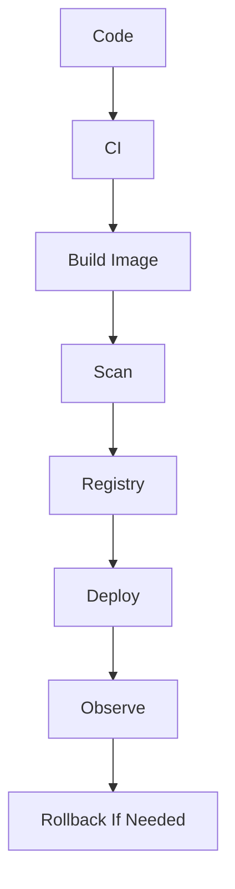

---

# The Deployment Lifecycle

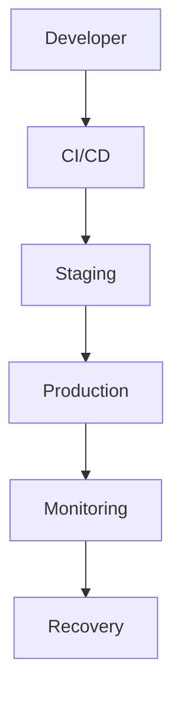

---

# Strategy 1: Recreate Deployment

The simplest strategy.

---

## Process

```text
Stop Old

↓

Start New
```

---

# Visualization

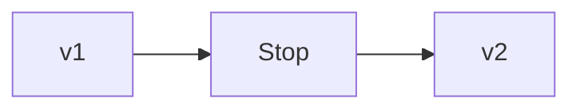

---

# Advantages

```text
Simple

Easy
```

---

# Disadvantages

```text
Downtime

Service Interruptions
```

---

# Best For

```text
Internal Tools

Small Apps

Low Traffic Systems
```

---

# Strategy 2: Rolling Deployment

Most common strategy.

Replace gradually.

---

## Process

```text
v1

↓

v1 + v2

↓

v2
```

---

# Architecture

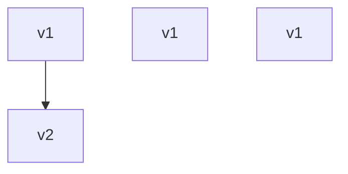

---

# Traffic Flow

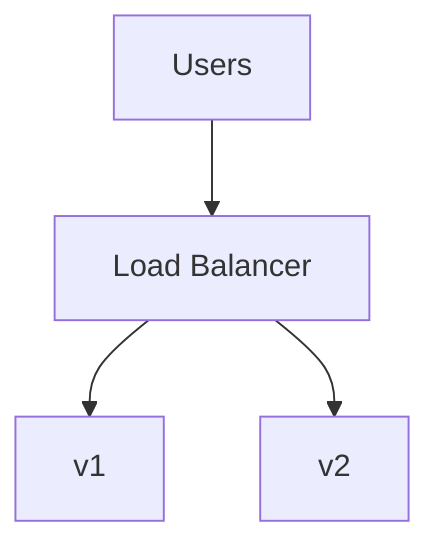

---

# Benefits

```text
No Downtime

Gradual Transition
```

---

# Risks

```text
Mixed Versions

Schema Compatibility Problems
```

---

# Strategy 3: Blue-Green Deployment

Two complete environments.

---

## Architecture

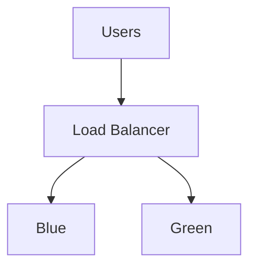

---

# Process

Current:

```text
Blue
```

Deploy:

```text
Green
```

Switch traffic.

Done.

---

# Benefits

```text
Fast Rollback

Zero Downtime

Easy Testing
```

---

# Cost

Double infrastructure.

---

# Strategy 4: Canary Deployment

Deploy to a small percentage.

---

## Traffic Distribution

```text
5%

↓

20%

↓

50%

↓

100%
```

---

# Architecture


---

# Why Canary Is Powerful

If:

```text
5% users fail
```

95% remain safe.

---

# Strategy 5: A/B Deployment

Not purely technical.

Used for experimentation.

---

# Architecture

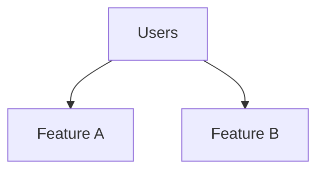

Measure:

```text
Engagement

Revenue

Clicks

Retention
```

---

# Strategy 6: Shadow Deployment

Users don't see new system.

Requests are duplicated.

---

# Architecture

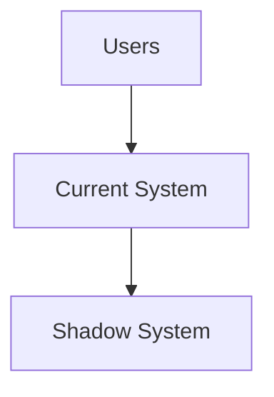

---

# Purpose

Observe safely.

---

# Strategy 7: Feature Flags

Deploy code.

Hide features.

---

# Architecture

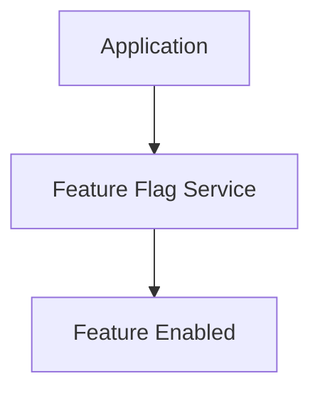

---

# Benefits

No redeployment required.

---

# Deployment Decision Matrix

| Strategy | Downtime | Risk | Cost | Complexity |
|----------|----------|------|------|------------|
| Recreate | High | High | Low | Low |
| Rolling | Low | Medium | Low | Medium |
| Blue-Green | Very Low | Low | High | Medium |
| Canary | Very Low | Very Low | Medium | High |
| Shadow | None | Very Low | High | High |

---

# The Traffic Control Layer

Load balancers become critical.

Examples:

```text
Nginx

HAProxy

Traefik

Cloud Load Balancers
```

---

# Traffic Architecture

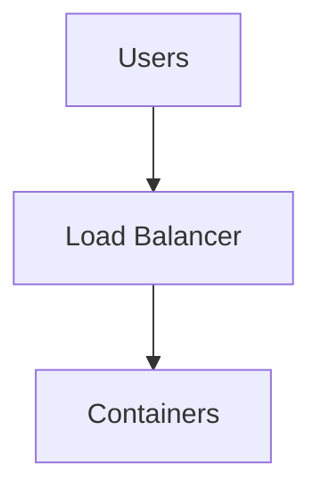

---

# Kubernetes Relationship

Kubernetes automates deployments.

Resources:

```text
Deployment

ReplicaSet

Service

Ingress
```

---

# Kubernetes Deployment Flow

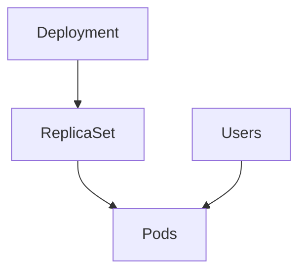

---

# Service Mesh Relationship

Tools:

```text
Istio

Linkerd

Cilium
```

enable advanced traffic control.

---

# Canary With Service Mesh

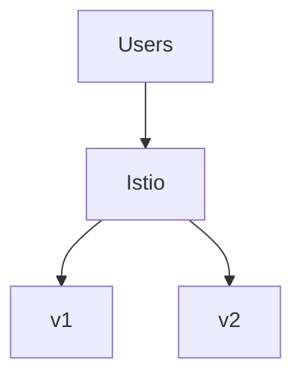

---

# Database Deployment Problem

Applications are easy.

Databases are hard.

---

# Dangerous Deployment

```text
Deploy New App

↓

Break Old Schema
```

Avoid this.

---

# Safe Rule

Expand first.

Contract later.

---

# Safe Database Migration

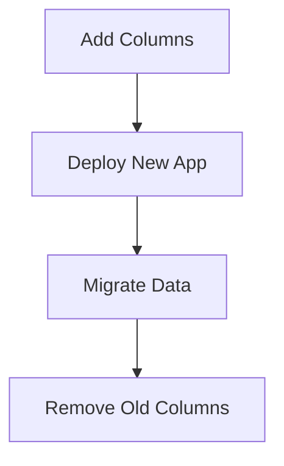

---

# Health Checks Are Mandatory

Three checks:

```text
Startup

Readiness

Liveness
```

---

# Health Check Flow

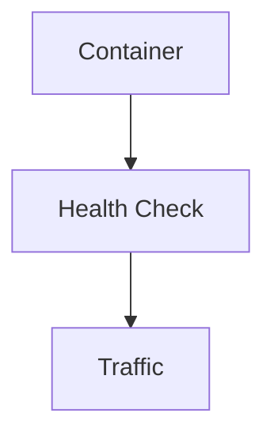

---

# Rollback Engineering

Every deployment must answer:

```text
Can we rollback in 5 minutes?
```

If no:

Don't deploy.

---

# Rollback Flow

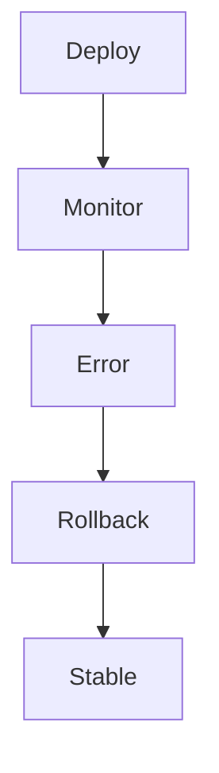

---

# Observability During Deployments

Monitor:

```text
Latency

Error Rate

CPU

Memory

Traffic

User Experience
```

---

# The Four Golden Signals

Google SRE.

```text
Latency

Traffic

Errors

Saturation
```

---

# Observability Architecture

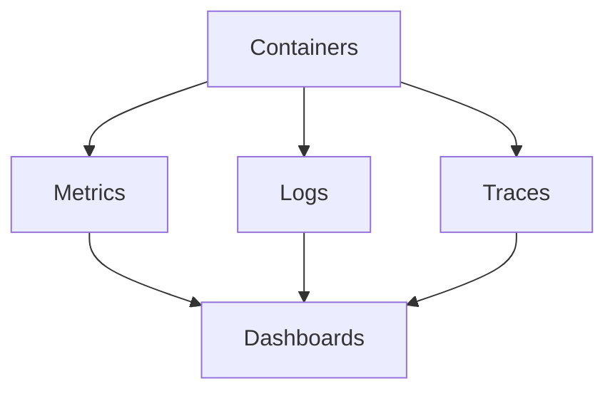

---

# CI/CD Relationship

Deployment is only one stage.

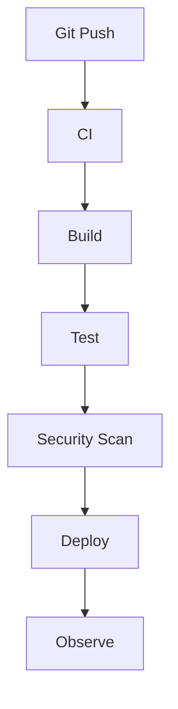

---

# Production Example

Netflix style thinking:

```text
Build

↓

Canary

↓

Observe

↓

Scale Traffic

↓

Complete Rollout
```

---

# Cloud Relationship

Cloud providers provide deployment tools.

Examples:

```text
AWS CodeDeploy

Azure DevOps

Google Cloud Deploy

ArgoCD

FluxCD
```

---

# Linux Relationship

Everything still becomes:

```text
Linux Processes

↓

Containers

↓

Traffic Management
```

Linux is still underneath.

---

# Performance Considerations

Deployment bottlenecks:

```text
Large Images

Slow Registries

Slow Health Checks

Database Migrations

Traffic Spikes
```

---

# Security Considerations

Always secure:

```text
CI/CD

Registries

Secrets

Images

Permissions
```

---

# Scaling Considerations

As infrastructure grows:

```text
10 Containers

↓

100 Containers

↓

1000 Containers

↓

10000 Containers
```

Automation becomes mandatory.

---

# Common Mistakes

## Mistake 1

Deploying everything at once.

Dangerous.

---

## Mistake 2

No rollback plan.

Very dangerous.

---

## Mistake 3

Ignoring databases.

Huge mistake.

---

## Mistake 4

No observability.

Blind deployments.

---

## Mistake 5

Deploying without health checks.

Risky.

---

# Troubleshooting Guide

Deployment failed?

Ask:

```text
Image issue?

↓

Database issue?

↓

Traffic issue?

↓

Health check issue?

↓

Resource issue?

↓

Rollback required?
```

---

# Engineering Mindset

Do not think:

```text
Deployment

=

Release Code
```

Think:

```text
Deployment

=

Controlled Risk Management
```

And do not think:

```text
Kubernetes = Deployment Tool
```

Think:

```text
Kubernetes

=

Automated Deployment Engine
```

---

# Evolution Of Thinking

```text
Copy Files

↓

Deploy Applications

↓

Deploy Containers

↓

Manage Traffic

↓

Manage Risk

↓

Engineer Reliability

↓

Distributed Systems Evolution
```

---

# Interview Questions

## Beginner

1. What is deployment?

2. What is rolling deployment?

3. What is blue-green deployment?

4. What is canary deployment?

5. Why are health checks important?

---

## Intermediate

6. Explain shadow deployments.

7. Explain feature flags.

8. Explain rollback engineering.

9. Explain traffic shifting.

10. Explain deployment risks.

---

## Advanced

11. Explain deployment as risk management.

12. Explain service mesh deployments.

13. Explain large-scale deployment architectures.

14. Explain database deployment strategies.

15. Explain reliability engineering.

---

# Cheat Sheet

```text
Deployment

=

Automation

+

Traffic Control

+

Observability

+

Rollback

+

Confidence


Strategies:

✓ Recreate

✓ Rolling

✓ Blue-Green

✓ Canary

✓ Shadow

✓ Feature Flags


Golden Rule:

Never deploy faster than you can recover.
```

---

# Final Thought

The biggest shift in engineering happens when you stop asking:

> How do I deploy software?

and start asking:

> How do I safely evolve a distributed system without hurting users?

Because deployments are not engineering tasks.

**Deployments are trust management systems.**
