# Production Container Patterns

> "Containers are easy. Running thousands of containers reliably is hard. Production patterns are the engineering knowledge accumulated from solving that problem repeatedly."

---

# Why This File Exists

Most tutorials teach:

```bash
docker run nginx
```

Production engineers think:

```text
How do I deploy?

How do I recover failures?

How do I scale?

How do I observe?

How do I secure?

How do I upgrade?

How do I rollback?

How do I survive disasters?
```

Production patterns answer these questions.

---

# The Biggest Mental Model

Think:

> A container is a disposable worker.

Never think:

```text
Container = Server
```

Think:

```text
Container = Replaceable Compute Unit
```

---

# The Core Production Philosophy

Containers should be:

```text
Ephemeral

Immutable

Observable

Replaceable

Automated

Recoverable
```

These six words define cloud-native systems.

---

# The Golden Rule

Never become attached to containers.

Containers are expected to die.

Applications must survive anyway.

---

# Production Architecture

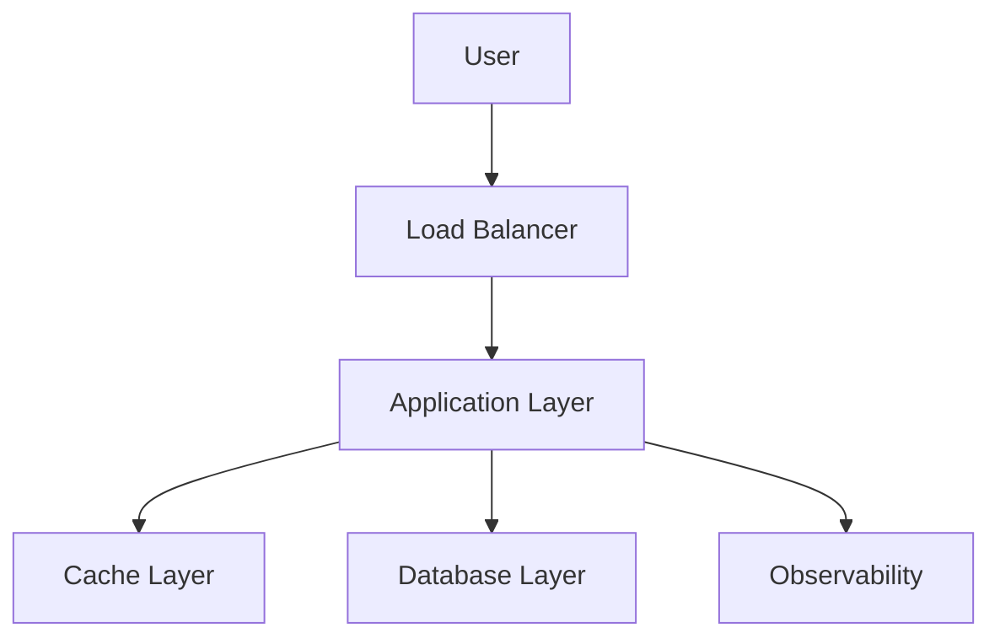

---

# Pattern 1: Immutable Infrastructure

## Problem

Manual changes create configuration drift.

Bad:

```text
SSH

↓

Install Package

↓

Fix Production
```

---

## Solution

Never modify running containers.

Replace them.

---

## Pattern

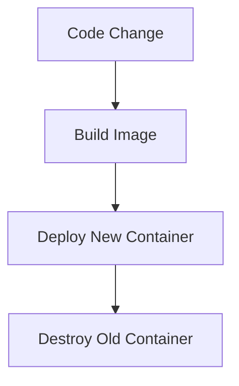

---

# Why This Exists

Benefits:

```text
Predictable

Repeatable

Recoverable

Auditable
```

---

# Pattern 2: One Process Per Container

## Problem

Beginners do this:

```text
Nginx

Postgres

Redis

Node

Cron

All Inside One Container
```

Difficult to manage.

---

## Solution

Separate concerns.

---

## Pattern

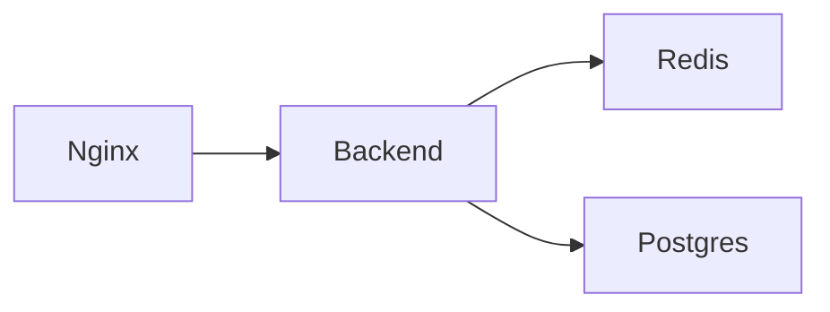

---

# Why This Exists

Benefits:

```text
Independent Scaling

Independent Deployments

Independent Recovery
```

---

# Pattern 3: Stateless Applications

This is one of the most important concepts.

---

## Problem

Applications store state internally.

Bad.

```text
Container Dies

↓

Data Dies
```

---

## Solution

Separate compute and state.

---

## Pattern

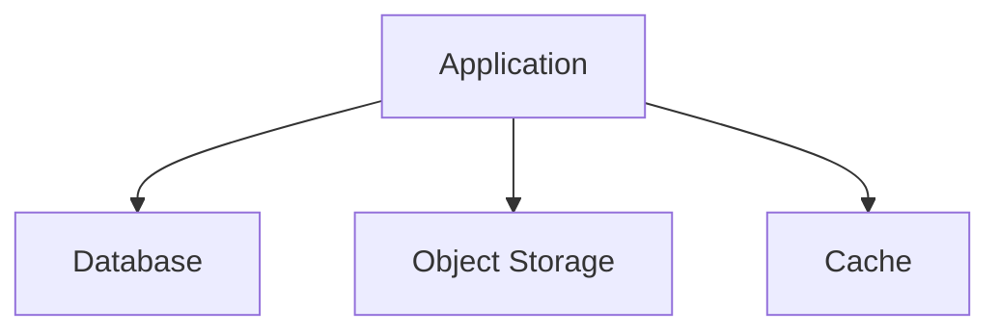

---

# Formula

```text
Stateless Compute

+

Persistent Storage

=

Scalable Systems
```

---

# Pattern 4: Sidecar Pattern

## Problem

Applications need extra functionality.

Examples:

```text
Logging

Metrics

Proxy

Security
```

Don't modify application code.

---

## Solution

Add helper containers.

---

## Pattern

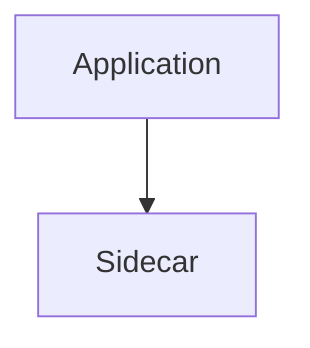

---

## Examples

```text
Envoy

Fluent Bit

OpenTelemetry Collector
```

---

# Pattern 5: Ambassador Pattern

Container acts as proxy.

---

## Example

```text
Application

↓

Ambassador

↓

External Database
```

---

## Architecture

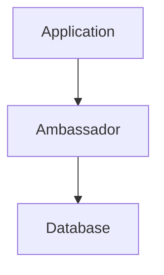

---

# Pattern 6: Adapter Pattern

Convert incompatible systems.

---

## Example

```text
Application

↓

Adapter

↓

Legacy System
```

---

# Pattern 7: Reverse Proxy Pattern

One entry point.

---

## Architecture

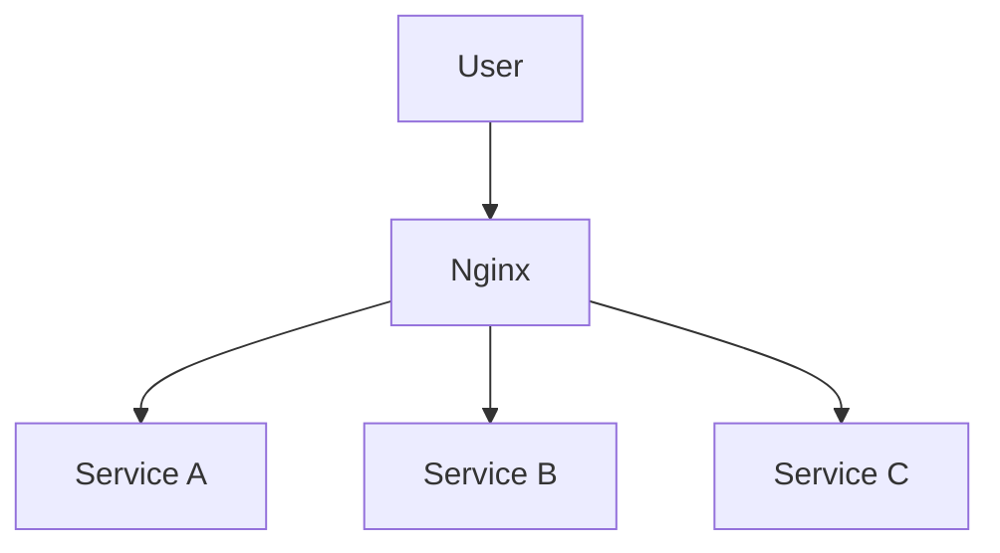

---

# Pattern 8: Health Check Pattern

Containers die.

We need to know when.

---

## Three Health Checks

```text
Liveness

Readiness

Startup
```

---

## Architecture

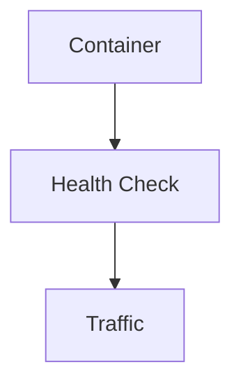

---

# Pattern 9: Self Healing Pattern

Never rely on humans.

System repairs itself.

---

## Flow

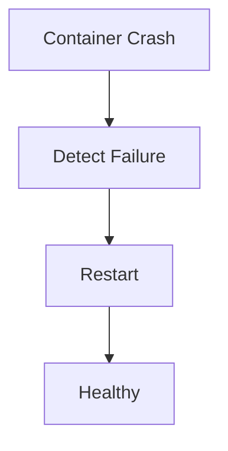

---

# Pattern 10: Auto Scaling Pattern

Traffic changes constantly.

Scale dynamically.

---

## Architecture

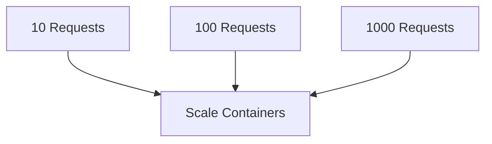

---

# Pattern 11: Resource Limits Pattern

Prevent noisy neighbors.

---

## Set Limits

```text
CPU

Memory

Disk

Processes
```

---

# Architecture

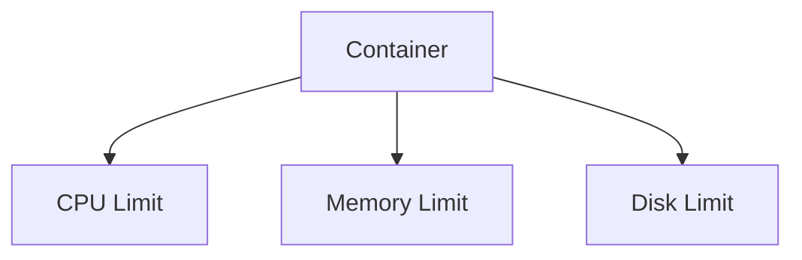

---

# Pattern 12: Configuration Externalization

Never hardcode.

Bad:

```javascript
DB_PASSWORD=123
```

Good:

```text
Environment Variables

Secret Managers

Config Systems
```

---

# Pattern 13: Secret Management

Store secrets separately.

Tools:

```text
Vault

AWS Secrets Manager

Azure Key Vault

Google Secret Manager
```

---

# Pattern 14: Logging Pattern

Containers are temporary.

Logs must survive.

---

## Flow

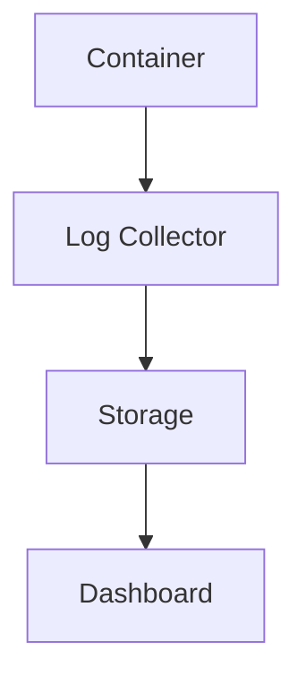

---

# Pattern 15: Metrics Pattern

Measure everything.

Monitor:

```text
CPU

Memory

Latency

Errors

Throughput
```

---

# Pattern 16: Tracing Pattern

Track requests.

---

## Flow

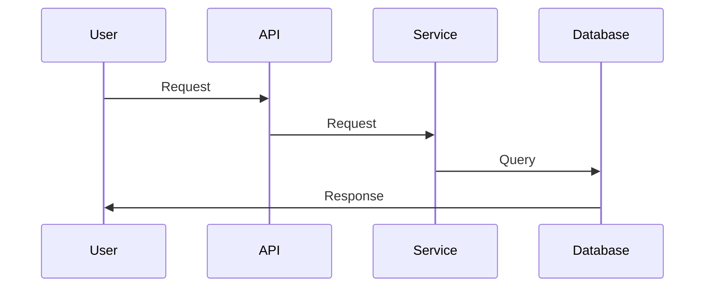

---

# Pattern 17: Circuit Breaker Pattern

Prevent cascading failures.

---

## Flow

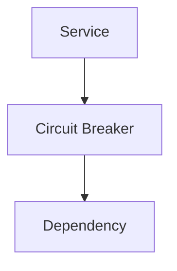

---

# Pattern 18: Retry Pattern

Temporary failures happen.

Retry intelligently.

Avoid:

```text
Infinite Retries
```

---

# Pattern 19: Bulkhead Pattern

Isolate failures.

---

## Architecture

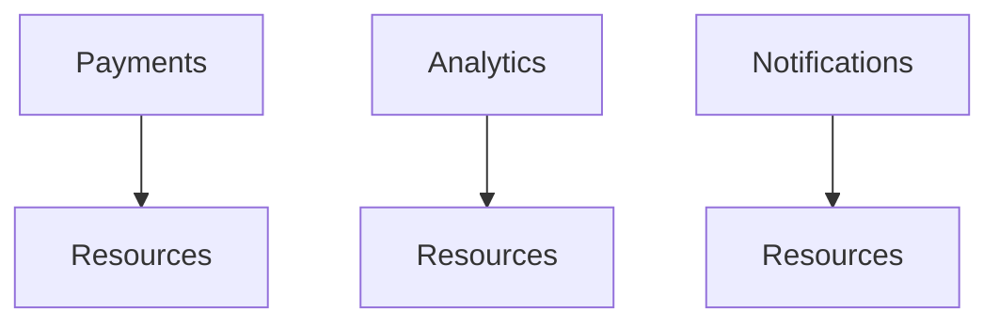

Separate failures.

---

# Pattern 20: Blue-Green Deployment

Two environments.

```text
Blue = Current

Green = New
```

Switch traffic.

---

## Architecture

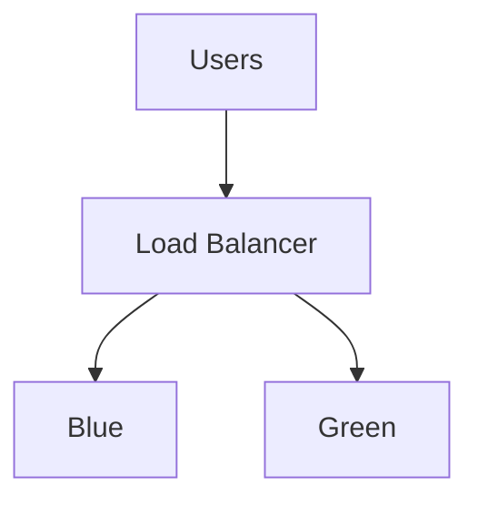

---

# Pattern 21: Canary Deployment

Small percentage first.

```text
5%

↓

20%

↓

50%

↓

100%
```

Reduce risk.

---

# Pattern 22: Graceful Shutdown

Never kill immediately.

---

## Flow

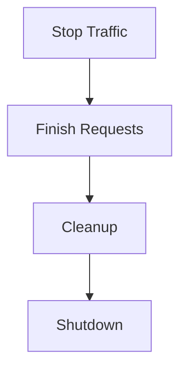

---

# Pattern 23: Observability Pattern

Three pillars.

```text
Logs

Metrics

Traces
```

---

## Architecture

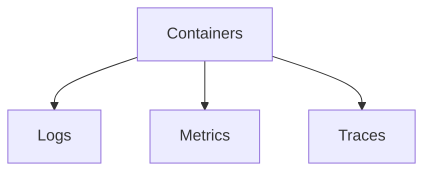

---

# Pattern 24: Zero Trust Networking

Never trust internal traffic.

Always verify.

---

# Pattern 25: GitOps Pattern

Git becomes source of truth.

```text
Git

↓

CI

↓

Registry

↓

Kubernetes
```

---

# Production Container Lifecycle

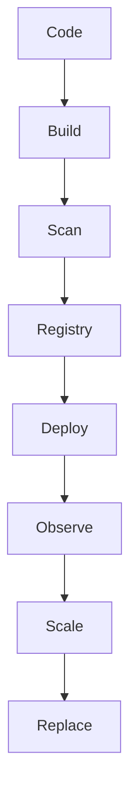

---

# Production Stack Example

```text
Frontend

↓

API Gateway

↓

Microservices

↓

Redis

↓

PostgreSQL

↓

Prometheus

↓

Grafana

↓

ELK
```

---

# Relationship With Linux

Everything still becomes:

```text
Linux Processes
```

Linux powers all patterns.

---

# Relationship With Kubernetes

Kubernetes automates these patterns.

Kubernetes is basically:

> A production pattern automation engine.

---

# Production Failure Scenarios

## Database Down

Use:

```text
Retries

Circuit Breakers

Failover
```

---

## Container Crash

Use:

```text
Health Checks

Self Healing
```

---

## Traffic Spike

Use:

```text
Auto Scaling
```

---

## Region Failure

Use:

```text
Disaster Recovery
```

---

# Performance Considerations

Optimize:

```text
Image Size

Startup Time

CPU Usage

Memory Usage

Network Latency
```

---

# Security Considerations

Always implement:

```text
Least Privilege

Image Scanning

Secrets Management

Runtime Security
```

---

# Scaling Considerations

As infrastructure grows:

```text
10 Containers

↓

100 Containers

↓

1000 Containers

↓

10000 Containers
```

Manual management becomes impossible.

Automation becomes mandatory.

---

# Observability Considerations

Monitor:

```text
Deployments

Errors

Latency

Availability

Resource Usage
```

---

# Engineering Mindset

Do not think:

```text
Container = Application
```

Think:

```text
Container

=

Disposable Compute Unit
```

And do not think:

```text
Kubernetes = Technology
```

Think:

```text
Kubernetes

=

Production Pattern Automation Platform
```

---

# Evolution Of Thinking

```text
Linux

↓

Containers

↓

Microservices

↓

Production Patterns

↓

Kubernetes

↓

Platform Engineering

↓

Cloud Native Systems
```

---

# Interview Questions

## Beginner

1. Why should containers be ephemeral?

2. What is immutable infrastructure?

3. Why separate state from compute?

4. What is a sidecar?

5. What is a health check?

---

## Intermediate

6. Explain canary deployments.

7. Explain blue-green deployments.

8. Explain observability.

9. Explain auto scaling.

10. Explain self-healing systems.

---

## Advanced

11. Explain production container architectures.

12. Explain GitOps.

13. Explain zero trust infrastructure.

14. Explain failure isolation.

15. Explain distributed system resilience.

---

# Cheat Sheet

```text
Production Patterns

=

Immutable

Ephemeral

Observable

Replaceable

Automated

Recoverable


Key Patterns:

✓ Sidecar

✓ Ambassador

✓ Adapter

✓ Circuit Breaker

✓ Retry

✓ Bulkhead

✓ Canary

✓ Blue-Green

✓ Self Healing

✓ Auto Scaling
```

---

# Final Thought

The biggest shift in engineering happens when you stop asking:

> How do I run containers?

and start asking:

> How do I build systems that continue working when containers inevitably fail?

Because containers are temporary.

**Resilience is permanent.**
