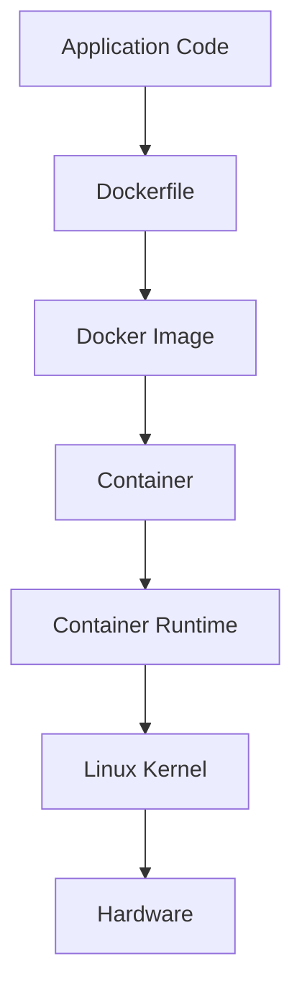

# Containers: From Linux Processes to Planet-Scale Infrastructure

> "Containers are not magic boxes. Containers are Linux processes that have been isolated, packaged, and made portable."

---

# Welcome to Containers Engineering

Most people learn containers backwards.

They learn:

```text
docker run nginx
docker build .
docker compose up
````

and think they know containers.

They don't.

That's equivalent to driving a car without understanding:

* Engine
* Transmission
* Fuel system
* Steering
* Brakes

The same happens with containers.

Many engineers can use Docker but cannot answer:

* What is a container?
* Where does a container actually run?
* Is Docker a container?
* Is a container a small VM?
* What happens when `docker run` executes?
* Why is Linux mandatory for containers?
* Why do Kubernetes engineers need Linux expertise?
* Why do cloud providers rely heavily on containers?

This chapter fixes that.

---

# Philosophy of this Chapter

This chapter is not about memorizing Docker commands.

This chapter teaches:

```text
Application Thinking
        ↓

Operating System Thinking
        ↓

Process Isolation Thinking
        ↓

Container Thinking
        ↓

Platform Engineering Thinking
        ↓

Distributed Systems Thinking
        ↓

Cloud Infrastructure Thinking
```

By the end, you should understand:

> Containers are Linux itself being used as an application packaging platform.

---

# Why Containers Exist

Imagine you built an application.

```text
Node.js Application

Works on:

Laptop A ✅

Laptop B ❌

Production Server ❌

Cloud VM ❌

CI/CD Pipeline ❌
```

Immediately, engineers faced a huge problem.

---

## The Dependency Problem

Applications depend on:

```text
OS version

Libraries

Runtime versions

Environment variables

Kernel features

Configurations

CPU architecture
```

Example:

```text
Application

Requires:

Python 3.12

OpenSSL 3.x

Redis client v7

Specific Linux packages

Ubuntu 24.04
```

But production has:

```text
Ubuntu 20.04

Python 3.8

Different OpenSSL
```

Application breaks.

---

# The Historical Evolution

## Era 1: Bare Metal Servers

```text
1 Server

├── App A
├── App B
├── App C
└── Shared OS
```

Problems:

```text
Dependency conflicts

Resource contention

No isolation

Difficult upgrades

Single point of failure
```

---

## Era 2: Virtual Machines

```text
Physical Server

├── VM A
│   ├── Guest OS
│   └── App A
│
├── VM B
│   ├── Guest OS
│   └── App B
│
└── VM C
    ├── Guest OS
    └── App C
```

Better isolation.

New problems:

```text
Heavy

Slow startup

Consumes lots of RAM

Duplicate operating systems

Operational overhead
```

---

## Era 3: Containers

```text
Physical Server

Linux Kernel

├── Container A
│   └── App A
│
├── Container B
│   └── App B
│
└── Container C
    └── App C
```

Shared kernel.

Lightweight.

Portable.

Fast.

---

# The Biggest Mental Model

## A Container Is A Special Linux Process

This is the most important sentence of this entire chapter.

A container is NOT:

❌ A virtual machine

❌ A mini operating system

❌ A cloud technology

❌ A Docker feature

A container IS:

> A Linux process running with additional isolation mechanisms.

---

# The House Analogy

Imagine Linux as an apartment building.

```text
Linux Kernel

Apartment Building
```

Containers are apartments.

```text
Building

├── Apartment A
├── Apartment B
├── Apartment C
└── Apartment D
```

Each apartment has:

```text
Own filesystem

Own processes

Own users

Own network

Own limits
```

But everyone shares:

```text
Electricity

Water

Foundation
```

Equivalent:

```text
Shared Linux Kernel
```

---

# Linux Features That Made Containers Possible

Containers are built from existing Linux technologies.

| Linux Feature    | Purpose               |
| ---------------- | --------------------- |
| Namespaces       | Isolation             |
| Cgroups          | Resource control      |
| OverlayFS        | Layered filesystem    |
| Capabilities     | Permission control    |
| Seccomp          | System call filtering |
| AppArmor/SELinux | Mandatory security    |
| Netfilter        | Networking            |
| IPTables         | Traffic control       |

Docker simply orchestrates these.

---

# The Entire Container Stack



---

# How This Connects To Linux Fundamentals

Everything you've learned previously now comes together.

```text
Linux Filesystem
        ↓
OverlayFS

Linux Processes
        ↓
Containers

Linux Networking
        ↓
Container Networking

Linux Storage
        ↓
Volumes

Linux Systemd
        ↓
Containerized Services

Linux Permissions
        ↓
Container Security

Linux Resource Management
        ↓
Cgroups
```

Containers are Linux knowledge applied together.

---

# Learning Journey Of This Chapter

This folder is intentionally ordered.

Do not skip files.

---

# Phase 1: Foundations

## `why-containers.md`

Learn:

* Why containers exist
* Infrastructure evolution
* Why companies adopted containers
* The deployment problem

Outcome:

```text
Problem Solving Thinking
```

---

## `virtual-machines-vs-containers.md`

Learn:

* VM architecture
* Hypervisors
* Hardware virtualization
* Resource overhead
* Performance differences

Outcome:

```text
Infrastructure Thinking
```

---

## `container-mental-models.md`

Learn:

* Powerful analogies
* How to visualize containers
* How to explain containers to anyone

Outcome:

```text
Systems Thinking
```

---

# Phase 2: Linux Internals Behind Containers

## `namespaces-and-containers.md`

Learn:

```text
PID Namespace

Network Namespace

Mount Namespace

UTS Namespace

IPC Namespace

User Namespace
```

Outcome:

```text
Isolation Thinking
```

---

## `cgroups-and-containers.md`

Learn:

```text
CPU limits

Memory limits

I/O limits

OOM killer

Resource scheduling
```

Outcome:

```text
Resource Engineering
```

---

## `overlayfs.md`

Learn:

```text
Layered filesystems

Read only layers

Copy on write

Storage efficiency
```

Outcome:

```text
Filesystem Engineering
```

---

## `union-filesystems.md`

Learn:

```text
How multiple directories become one filesystem
```

Outcome:

```text
Storage Architecture Thinking
```

---

# Phase 3: Docker Fundamentals

## `docker-architecture.md`

Learn:

```text
Docker Client

Docker Daemon

Docker API

Container Runtime
```

Outcome:

```text
Docker Internals Thinking
```

---

## `docker-images.md`

Learn:

```text
Images

Tags

Registries

Build systems
```

Outcome:

```text
Artifact Thinking
```

---

## `docker-layers.md`

Learn:

```text
Layer caching

Optimization

Image performance
```

Outcome:

```text
Performance Engineering
```

---

## `dockerfiles.md`

Learn:

```text
Infrastructure as Code
```

Outcome:

```text
Reproducibility Thinking
```

---

## `docker-volumes.md`

Learn:

```text
Persistent storage
```

Outcome:

```text
State Management Thinking
```

---

## `docker-networking.md`

Learn:

```text
Bridge networks

Host networks

Overlay networks

DNS
```

Outcome:

```text
Network Engineering
```

---

## `docker-compose.md`

Learn:

```text
Multi-service applications
```

Outcome:

```text
Microservices Thinking
```

---

# Phase 4: Container Runtime Deep Dive

## `container-runtime.md`

Learn:

```text
OCI

Runtime ecosystem

Execution pipeline
```

Outcome:

```text
Platform Engineering
```

---

## `containerd.md`

Learn:

```text
Container manager internals
```

Outcome:

```text
Infrastructure Engineering
```

---

## `runc.md`

Learn:

```text
Low-level container execution
```

Outcome:

```text
Kernel Engineering
```

---

## `cri.md`

Learn:

```text
Kubernetes integration
```

Outcome:

```text
Cloud Native Thinking
```

---

# Phase 5: Security

## `container-security.md`

Learn:

```text
Least privilege

Isolation boundaries

Hardening
```

---

## `image-security.md`

Learn:

```text
Image scanning

Supply chain security

SBOM
```

---

## `runtime-security.md`

Learn:

```text
Threat detection

Monitoring

Incident response
```

---

# Phase 6: Production Engineering

## `production-container-patterns.md`

Learn:

```text
Stateless services

Sidecars

Init containers

Immutable infrastructure
```

---

## `deployment-strategies.md`

Learn:

```text
Blue-Green

Canary

Rolling updates

Shadow deployments
```

---

# Container Ecosystem Big Picture


---

# Where Containers Are Used Today

Containers power:

```text
Netflix

Spotify

Amazon

Uber

Airbnb

Google

Microsoft

Meta

OpenAI

Cloud Providers

AI Platforms

Data Platforms

Banks

Startups
```

Containers are now the default deployment unit.

---

# Engineering Mindset

Do not think:

> I am learning Docker.

Think:

> I am learning how Linux became an application platform.

Because:

```text
Linux
 ↓

Containers

 ↓

Kubernetes

 ↓

Cloud Native Systems

 ↓

Platform Engineering

 ↓

Modern Infrastructure
```

Linux is the foundation.

Containers are one layer above Linux.

Kubernetes is one layer above containers.

Cloud infrastructure is built on top of all of them.

---

# How This Connects To Future Topics

This chapter prepares you for:

```text
Containers
       ↓

Kubernetes
       ↓

Orchestration
       ↓

Service Mesh
       ↓

Cloud Native Systems
       ↓

Platform Engineering
       ↓

Distributed Systems
```

---

# Expected Skills After Completing This Chapter

You should be able to answer:

✅ What is a container?

✅ Why do containers exist?

✅ Why is Linux required?

✅ Why are containers fast?

✅ What happens when docker run executes?

✅ How do containers isolate processes?

✅ How do containers communicate?

✅ How do containers store data?

✅ How does Kubernetes run containers?

✅ How do cloud providers use containers?

✅ How do we secure containers?

✅ How do we run containers at scale?

---

# Folder Structure

```text
13-containers/

README.md

Foundations
├── why-containers.md
├── virtual-machines-vs-containers.md
└── container-mental-models.md

Linux Internals
├── namespaces-and-containers.md
├── cgroups-and-containers.md
├── overlayfs.md
└── union-filesystems.md

Docker Fundamentals
├── docker-architecture.md
├── docker-images.md
├── docker-layers.md
├── dockerfiles.md
├── docker-volumes.md
├── docker-networking.md
└── docker-compose.md

Container Runtime
├── container-runtime.md
├── containerd.md
├── runc.md
└── cri.md

Security
├── container-security.md
├── image-security.md
└── runtime-security.md

Production
├── production-container-patterns.md
├── deployment-strategies.md

Others
├── interview-questions.md
└── references.md
```

---

# Final Thought

**Containers are not a Docker topic.**

**Containers are Linux engineering applied to modern infrastructure.**

If Linux is the operating system revolution,

Containers are the packaging revolution built on top of Linux.

Everything after this chapter—Kubernetes, cloud platforms, AI infrastructure, platform engineering, and large-scale distributed systems—depends on understanding these fundamentals deeply.

```
```
