# Container Security

> "Containers improve isolation, but they are not virtual machines. Security is not something Docker gives you. Security is something engineers build around containers."

---

# Why This File Exists

Many beginners think:

```text
Container

↓

Secure
```

Wrong.

Containers share the host kernel.

This changes everything.

This file exists to answer:

```text
How can containers be attacked?

How can containers escape?

How do we secure them?

How do production companies protect them?
```

---

# The Biggest Misconception

Many people think:

```text
Container = VM
```

Wrong.

Reality:

```text
VM

↓

Own Kernel

↓

Strong Isolation
```

Containers:

```text
Container A

↓

Shared Linux Kernel

↓

Container B
```

The Linux kernel is shared.

---

# The Core Security Problem

Suppose:

```text
100 containers

↓

1 Linux kernel
```

Question:

```text
If the kernel is compromised,

what happens?
```

Answer:

Everything is compromised.

---

# The Biggest Mental Model

Think:

> Containers are isolated roommates living in the same house.

The house:

```text
Linux Kernel
```

If someone destroys the house:

```text
Everyone suffers.
```

---

# Mental Model 1: Apartment Building

```text
Host Kernel

↓

Apartment Building

↓

Containers
```

Shared infrastructure.

---

# Mental Model 2: Security Onion

Container security is layered.

```text
Supply Chain

↓

Images

↓

Runtime

↓

Kernel

↓

Network

↓

Monitoring
```

No single layer is enough.

---

# The Security Formula

```text
Container Security

=

Least Privilege

+

Isolation

+

Immutability

+

Monitoring

+

Supply Chain Security

+

Defense In Depth
```

---

# The Container Attack Surface

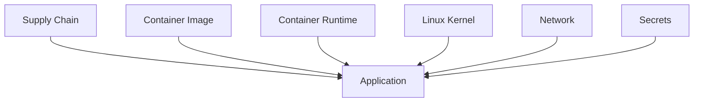

---

# Threat Model

Attackers can target:

```text
Images

Containers

Runtime

Host

Kernel

Network

Secrets

Registries

CI/CD
```

---

# Security Layers Architecture

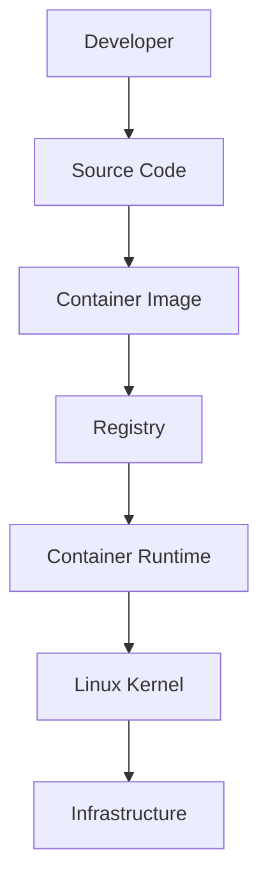

Every layer needs protection.

---

# Container Security Pillars

There are 7 major pillars.

```text
1. Image Security

2. Runtime Security

3. Kernel Security

4. Network Security

5. Secret Security

6. Supply Chain Security

7. Monitoring
```

---

# Pillar 1: Least Privilege

One of the most important engineering principles.

Never give more access than necessary.

Bad:

```bash
docker run --privileged
```

Very dangerous.

---

# Why --privileged Is Dangerous

This effectively gives:

```text
Almost entire host access
```

Avoid it.

---

# Privilege Escalation Visualization

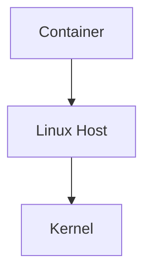

`--privileged` reduces isolation.

---

# Pillar 2: Run As Non Root

Bad:

```dockerfile
USER root
```

Good:

```dockerfile
RUN adduser appuser

USER appuser
```

---

# Why Root Is Dangerous

Inside containers:

```text
Root

↓

More Linux capabilities

↓

More attack opportunities
```

---

# Pillar 3: Linux Capabilities

Root is split into capabilities.

Examples:

```text
CAP_SYS_ADMIN

CAP_NET_ADMIN

CAP_SYS_PTRACE

CAP_SYS_MODULE
```

Drop unnecessary capabilities.

---

# Capability Visualization

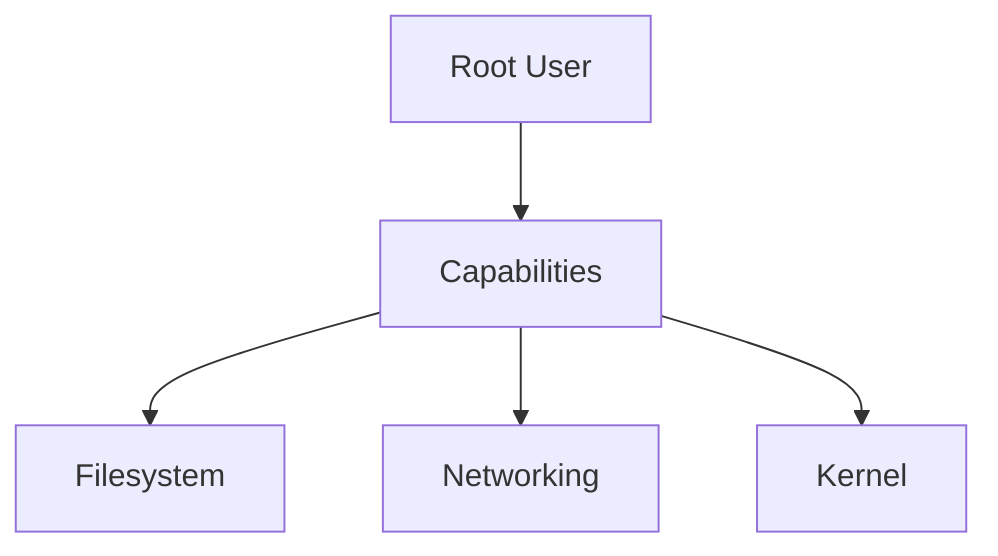

---

# Recommended Practice

Drop everything.

Add only what is required.

Example:

```bash
docker run --cap-drop ALL
```

then:

```bash
--cap-add NET_BIND_SERVICE
```

if necessary.

---

# Pillar 4: Seccomp

Seccomp filters Linux syscalls.

Question:

Can applications use every syscall?

No.

Restrict them.

---

# Seccomp Architecture

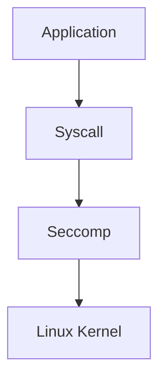

---

# Example Dangerous Syscalls

```text
ptrace

mount

kexec

reboot
```

Restrict them.

---

# Pillar 5: AppArmor & SELinux

Mandatory Access Control systems.

Control:

```text
Files

Processes

Resources

Permissions
```

---

# Security Layer Visualization

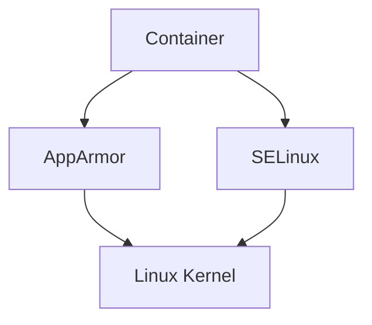

---

# Pillar 6: Read Only Containers

Applications rarely need writable filesystems.

Use:

```bash
--read-only
```

Benefits:

```text
Harder to persist malware
```

---

# Pillar 7: Secrets Management

Never do:

```dockerfile
ENV PASSWORD=123
```

Very dangerous.

Use:

```text
Secret Managers
```

Examples:

```text
HashiCorp Vault

AWS Secrets Manager

Azure Key Vault

Google Secret Manager
```

---

# Supply Chain Security

This is one of the most important modern topics.

Threat:

```text
Compromised dependency

↓

Compromised image

↓

Compromised infrastructure
```

---

# Supply Chain Architecture

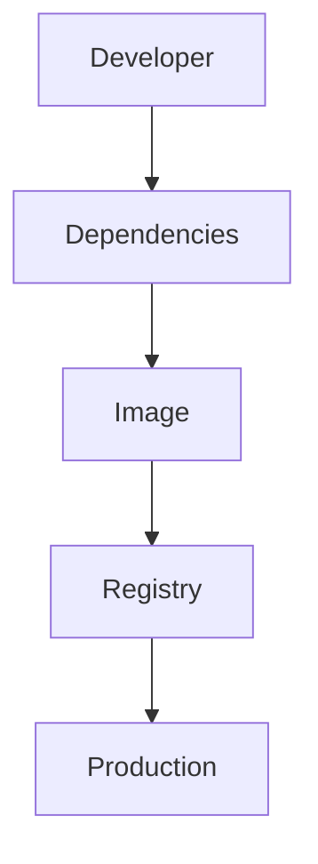

---

# Image Scanning

Always scan images.

Tools:

```text
Trivy

Grype

Clair

Docker Scout
```

Detect:

```text
CVEs

Outdated packages

Malware

Misconfigurations
```

---

# Image Signing

Sign images.

Tools:

```text
Cosign

Notary
```

Benefits:

```text
Integrity

Authenticity
```

---

# Runtime Security

Monitor containers while running.

Questions:

```text
Unexpected process?

Unexpected network connection?

Unexpected file access?
```

Detect anomalies.

---

# Runtime Security Architecture

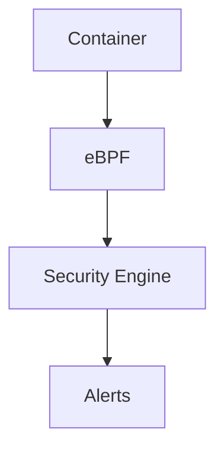

---

# eBPF

eBPF is huge in modern security.

It observes:

```text
Syscalls

Processes

Networking

Files
```

without modifying applications.

---

# Network Security

Never expose everything.

Use:

```text
Network Segmentation

Firewall Rules

Zero Trust
```

---

# Network Segmentation

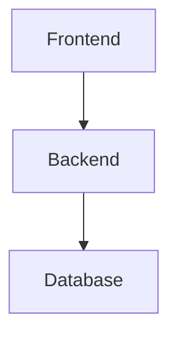

No direct:

```text
Frontend → Database
```

connection.

---

# Zero Trust Principle

Never assume:

```text
Internal = Safe
```

Always verify.

---

# Kubernetes Relationship

Kubernetes adds:

```text
Network Policies

Pod Security Standards

RBAC

Admission Controllers

Secrets
```

---

# Kubernetes Security Architecture

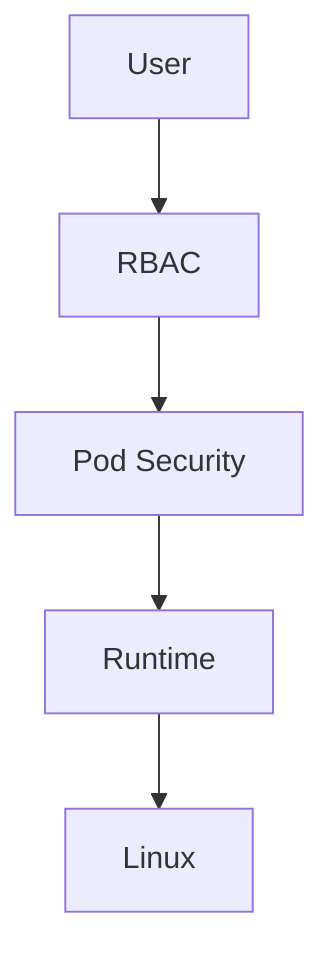

---

# Cloud Security Relationship

Cloud providers add:

```text
IAM

VPC

KMS

Security Groups
```

Additional protection layers.

---

# Production Security Pipeline

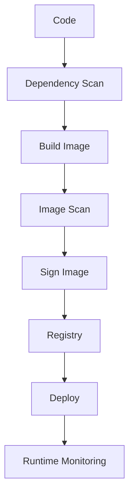

---

# Production Example

Secure Node.js service.

Requirements:

```text
Non Root User

Read Only Filesystem

Minimal Image

No Secrets

Image Scanning

Runtime Monitoring
```

---

# Linux Security Relationship

Everything connects.

```text
Users

↓

Permissions

↓

Capabilities

↓

Namespaces

↓

Seccomp

↓

AppArmor

↓

Containers
```

Linux security compounds.

---

# Performance Considerations

Security always has tradeoffs.

Examples:

```text
Image Scanning → Slower CI

Runtime Monitoring → CPU Overhead

Logging → Disk Usage
```

Balance is important.

---

# Scaling Considerations

1000 containers means:

```text
1000 attack surfaces
```

Automation becomes mandatory.

---

# Observability Considerations

Monitor:

```text
Syscalls

CPU

Memory

Processes

Connections

File Access
```

Tools:

```text
Falco

Prometheus

Grafana

OpenTelemetry

eBPF
```

---

# Useful Commands

Inspect capabilities:

```bash
capsh --print
```

Inspect Docker security:

```bash
docker info
```

Inspect processes:

```bash
ps aux
```

Inspect namespaces:

```bash
lsns
```

---

# Container Security Checklist

```text
✓ Minimal Images

✓ Non Root Users

✓ Drop Capabilities

✓ Seccomp

✓ AppArmor

✓ Read Only Filesystem

✓ No Secrets

✓ Image Scanning

✓ Runtime Monitoring

✓ Signed Images
```

---

# Common Mistakes

## Mistake 1

Thinking containers are VMs.

Wrong.

---

## Mistake 2

Using --privileged.

Dangerous.

---

## Mistake 3

Running everything as root.

Dangerous.

---

## Mistake 4

Embedding secrets.

Very dangerous.

---

## Mistake 5

Ignoring supply chain attacks.

Huge risk.

---

# Troubleshooting Guide

Security issue?

Ask:

```text
Image issue?

↓

Secret leak?

↓

Privilege escalation?

↓

Kernel vulnerability?

↓

Network exposure?

↓

Runtime anomaly?
```

---

# Engineering Mindset

Do not think:

```text
Container Security

=

Docker Flags
```

Think:

```text
Container Security

=

Threat Modeling

+

Defense In Depth

+

Supply Chain Security

+

Continuous Monitoring
```

---

# Evolution Of Thinking

```text
Linux Security

↓

Container Security

↓

Supply Chain Security

↓

Cloud Native Security

↓

Zero Trust Infrastructure
```

---

# Interview Questions

## Beginner

1. Are containers secure?

2. Why are containers not VMs?

3. What is least privilege?

4. Why avoid root?

5. What is image scanning?

---

## Intermediate

6. Explain Linux capabilities.

7. Explain seccomp.

8. Explain AppArmor.

9. Explain supply chain security.

10. Explain runtime security.

---

## Advanced

11. Explain zero trust containers.

12. Explain defense in depth.

13. Explain eBPF security.

14. Explain Kubernetes security layers.

15. Explain secure software supply chains.

---

# Cheat Sheet

```text
Container Security

=

Least Privilege

+

Capabilities

+

Seccomp

+

AppArmor

+

Secrets Management

+

Image Scanning

+

Runtime Monitoring

+

Supply Chain Security
```

---

# Final Thought

The biggest shift in security engineering happens when you stop asking:

> How do I secure my container?

and start asking:

> How do I secure the entire journey from code to production?

Because attackers don't attack containers.

**Attackers attack systems.**
