# Image Security

> "Modern infrastructure no longer deploys code. Modern infrastructure deploys images. Therefore, image security is software security."

---

# Why This File Exists

Most engineers think:

```text
Code

↓

Production
```

Wrong.

Modern infrastructure looks like this:

```text
Code

↓

Build

↓

Container Image

↓

Registry

↓

Production
```

The image becomes the source of truth.

This file exists to answer:

```text
How do images become dangerous?

How are images attacked?

How do we trust images?

How do companies secure software delivery?
```

---

# The Biggest Misconception

Many people think:

```text
Docker Image

=

Application Package
```

Wrong.

Reality:

```text
Docker Image

=

Deployable Software Supply Chain Artifact
```

---

# The Core Problem

Suppose your image contains:

```text
Ubuntu

↓

OpenSSL

↓

Node.js

↓

Express

↓

Application
```

Question:

Can attackers compromise any layer?

Answer:

Yes.

Every dependency is an attack surface.

---

# The Biggest Mental Model

Think:

> A Docker image is a supply chain.

---

# Mental Model 1: Food Supply Chain

Food supply chain:

```text
Farm

↓

Factory

↓

Warehouse

↓

Truck

↓

Store
```

Software supply chain:

```text
Developer

↓

Dependencies

↓

Image

↓

Registry

↓

Production
```

Every step can be attacked.

---

# Mental Model 2: Russian Dolls

Image:

```text
Application

↓

Libraries

↓

Runtime

↓

OS
```

Each layer contains more layers.

---

# Mental Model 3: Sealed Package

Think:

```text
Amazon Package
```

Questions:

```text
Who built it?

Was it modified?

Can we trust it?
```

Exactly the same questions apply to images.

---

# The Security Formula

```text
Image Security

=

Trust

+

Integrity

+

Verification

+

Scanning

+

Signing

+

Monitoring
```

---

# The Software Supply Chain

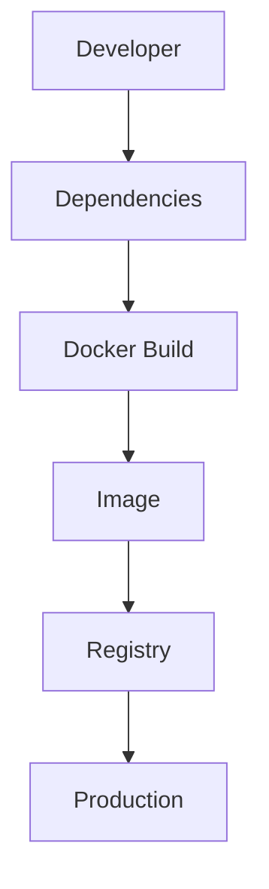

Every step is an attack surface.

---

# Supply Chain Attacks

Attackers may compromise:

```text
Dependencies

Build Systems

Images

Registries

Secrets

CI/CD
```

---

# Threat Landscape

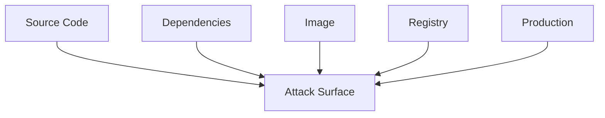

---

# The Image Anatomy

An image contains:

```text
Base OS

Runtime

Libraries

Application

Metadata
```

Every component must be trusted.

---

# Image Attack Surface

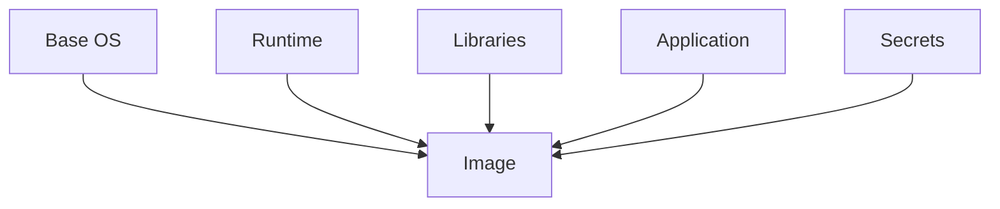

---

# The Biggest Security Principle

Never trust images blindly.

Even official images can contain vulnerabilities.

Always verify.

---

# Security Pillars

There are 8 major pillars.

```text
1. Minimal Images

2. Trusted Sources

3. Dependency Management

4. Image Scanning

5. Image Signing

6. SBOM

7. Immutable Images

8. Runtime Verification
```

---

# Pillar 1: Minimal Images

Smaller images:

```text
Less Code

Less Risk

Less Surface Area
```

Bad:

```dockerfile
FROM ubuntu
```

for everything.

Better:

```dockerfile
FROM alpine

or

FROM distroless
```

when appropriate.

---

# Attack Surface Reduction

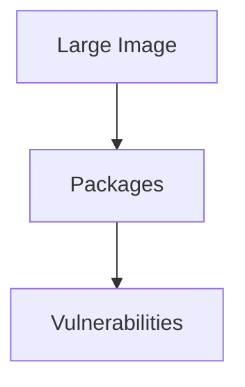

Reduce packages.

Reduce vulnerabilities.

---

# Pillar 2: Trusted Base Images

Use:

```text
Official Images

Verified Publishers

Internal Registries
```

Avoid:

```text
Unknown Random Images
```

from the internet.

---

# Image Source Hierarchy

```text
Best

↓

Internal Registry

↓

Verified Publisher

↓

Official Image

↓

Unknown Source

Worst
```

---

# Pillar 3: Dependency Security

Most vulnerabilities come from dependencies.

Examples:

```text
OpenSSL

glibc

Node Packages

Python Packages
```

Monitor continuously.

---

# Dependency Explosion

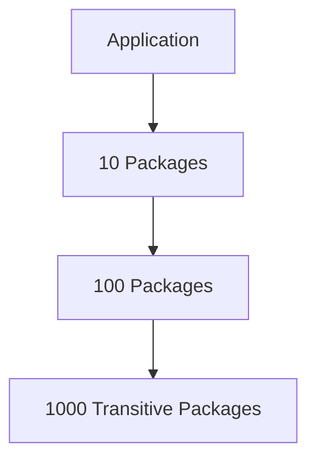

Small apps can have thousands of dependencies.

---

# Pillar 4: Image Scanning

Scan before deployment.

Detect:

```text
CVEs

Secrets

Misconfigurations

Malware
```

---

# Security Pipeline

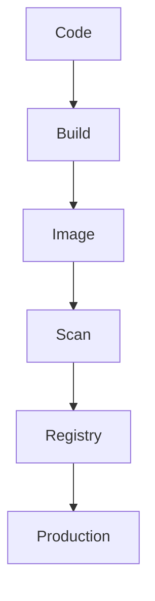

---

# Popular Scanners

Tools:

```text
Trivy

Grype

Clair

Docker Scout

Snyk
```

---

# Example

```bash
trivy image myapp:1.0
```

---

# Pillar 5: Image Signing

Question:

How do we know an image wasn't modified?

Answer:

Digital signatures.

---

# Signing Architecture

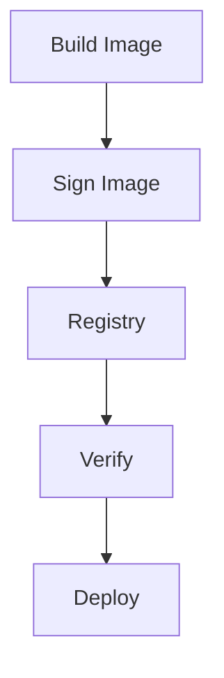

---

# Tools

Examples:

```text
Cosign

Notary
```

---

# Pillar 6: SBOM

SBOM = Software Bill Of Materials.

Think:

```text
Ingredient List
```

for software.

Contains:

```text
Libraries

Versions

Dependencies
```

---

# SBOM Visualization

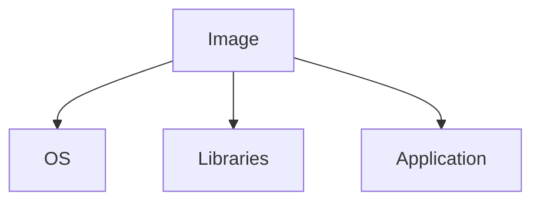

---

# Why SBOM Matters

Suppose:

```text
OpenSSL vulnerability discovered
```

Question:

```text
Which images contain OpenSSL?
```

SBOM answers instantly.

---

# Pillar 7: Immutable Images

Never modify running containers.

Wrong:

```text
SSH

↓

Install Package

↓

Fix Production
```

Right:

```text
Build New Image

↓

Deploy New Image
```

---

# Immutable Infrastructure

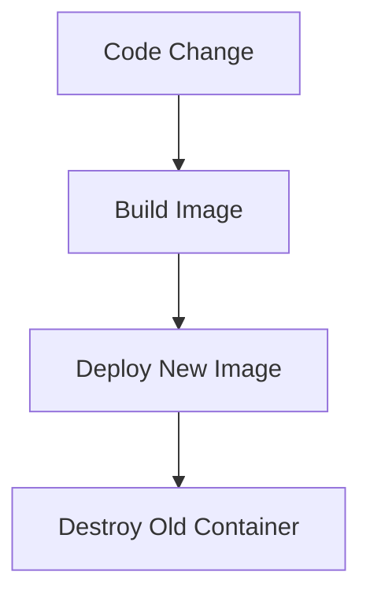

---

# Pillar 8: Runtime Verification

Question:

Was image modified?

Verify before running.

Use:

```text
Admission Controllers

Policies

Signature Verification
```

---

# Kubernetes Relationship

Kubernetes adds:

```text
Image Policies

Admission Controllers

Signature Verification
```

---

# Kubernetes Security Flow

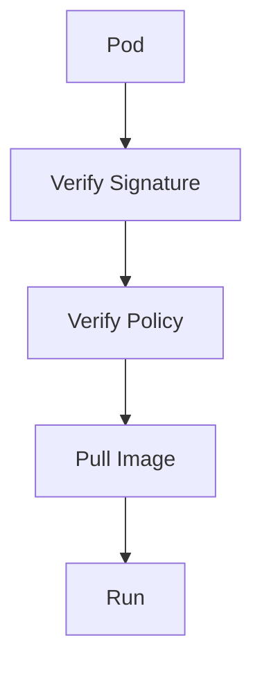

---

# CI/CD Relationship

CI/CD is where security begins.

Pipeline:

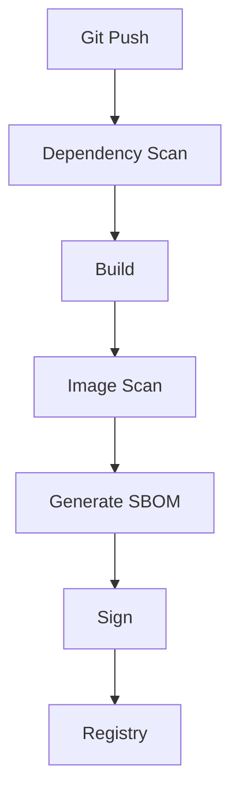

---

# Registry Security

Protect registries.

Enable:

```text
Authentication

Authorization

Image Signing

Auditing
```

---

# Private Registries

Examples:

```text
Harbor

AWS ECR

Google Artifact Registry

Azure Container Registry

GHCR
```

---

# Cloud Relationship

Cloud providers integrate:

```text
IAM

KMS

Scanning

Encryption
```

Additional protections.

---

# Production Example

Company pipeline:

```text
GitHub

↓

CI

↓

Scan

↓

Generate SBOM

↓

Sign

↓

Registry

↓

Kubernetes
```

Everything automated.

---

# Linux Relationship

Everything still runs on Linux.

```text
Linux

↓

Docker Images

↓

Containers

↓

Cloud Native Systems
```

Linux remains foundational.

---

# Performance Considerations

Security adds overhead.

Examples:

```text
Scanning → Slower Builds

SBOM → Extra Generation Time

Verification → Startup Delay
```

Worth it.

---

# Scaling Considerations

1000 microservices means:

```text
1000 images

↓

Millions of dependencies
```

Automation becomes mandatory.

---

# Observability Considerations

Monitor:

```text
Vulnerability Counts

Image Age

Unsigned Images

Dependency Risk

Registry Activity
```

---

# Useful Commands

Inspect image:

```bash
docker image inspect nginx
```

History:

```bash
docker history nginx
```

Generate SBOM:

```bash
syft nginx
```

Scan image:

```bash
trivy image nginx
```

Sign image:

```bash
cosign sign myimage
```

---

# Golden Production Pipeline

```text
Code

↓

Dependency Scan

↓

Build

↓

Image Scan

↓

SBOM

↓

Sign

↓

Registry

↓

Deploy

↓

Runtime Monitoring
```

---

# Common Mistakes

## Mistake 1

Trusting Docker Hub blindly.

Wrong.

---

## Mistake 2

Using latest tag.

Dangerous.

---

## Mistake 3

Ignoring transitive dependencies.

Huge risk.

---

## Mistake 4

Skipping image scanning.

Dangerous.

---

## Mistake 5

Not signing images.

Bad practice.

---

# Troubleshooting Guide

Security incident?

Ask:

```text
Dependency issue?

↓

Image issue?

↓

Registry compromise?

↓

Secret leak?

↓

Unsigned image?

↓

Runtime issue?
```

---

# Engineering Mindset

Do not think:

```text
Image Security

=

Docker Scanner
```

Think:

```text
Image Security

=

Software Supply Chain Security
```

---

# Evolution Of Thinking

```text
Linux Packages

↓

Dependencies

↓

Docker Images

↓

Supply Chains

↓

Cloud Native Security

↓

Zero Trust Infrastructure
```

---

# Interview Questions

## Beginner

1. What is image security?

2. Why are images dangerous?

3. What is image scanning?

4. What is image signing?

5. What is SBOM?

---

## Intermediate

6. Explain software supply chains.

7. Explain trusted images.

8. Explain immutable infrastructure.

9. Explain registry security.

10. Explain CI/CD integration.

---

## Advanced

11. Explain zero trust images.

12. Explain supply chain attacks.

13. Explain admission controllers.

14. Explain artifact trust management.

15. Explain secure delivery pipelines.

---

# Cheat Sheet

```text
Image Security

=

Minimal Images

+

Trusted Sources

+

Scanning

+

Signing

+

SBOM

+

Immutable Infrastructure


Pipeline:

Code

↓

Build

↓

Scan

↓

SBOM

↓

Sign

↓

Registry

↓

Production
```

---

# Final Thought

The biggest shift in modern infrastructure is this:

> We no longer deploy applications.

> We deploy trusted artifacts.

And the moment you understand that, image security stops being a Docker topic.

It becomes a software supply chain engineering topic.
