# Runtime Security

> "Image security protects what you deploy. Runtime security protects what is currently alive."

---

# Why This File Exists

Most engineers secure images.

Very few secure running systems.

But attackers don't stop after deployment.

Questions every engineer should ask:

```text
What if malware starts inside a container?

What if a container suddenly opens a shell?

What if a container contacts a malicious server?

What if a container starts crypto mining?

What if a container escapes isolation?
```

Runtime security exists to answer these questions.

---

# The Biggest Misconception

Many people think:

```text
Image Secure

↓

Production Secure
```

Wrong.

Reality:

```text
Image Secure

↓

Deploy

↓

Runtime Attacks Still Possible
```

Security never ends.

---

# The Core Problem

A container is not static.

After deployment it becomes:

```text
Living Process
```

Processes can:

```text
Open files

Open network connections

Spawn shells

Execute binaries

Access secrets

Consume resources
```

All of these can become threats.

---

# The Biggest Mental Model

Think:

> Runtime security is CCTV + security guards for running infrastructure.

Image security:

```text
Airport security gate
```

Runtime security:

```text
24/7 airport surveillance
```

---

# Mental Model 1: Human Body

Image security:

```text
Vaccination
```

Runtime security:

```text
Immune System
```

Continuous protection.

---

# Mental Model 2: Bank Security

Before opening:

```text
Verify employees
```

After opening:

```text
Cameras

Guards

Alarms

Continuous monitoring
```

---

# The Security Formula

```text
Runtime Security

=

Monitoring

+

Detection

+

Enforcement

+

Response

+

Automation
```

---

# The Runtime Attack Surface

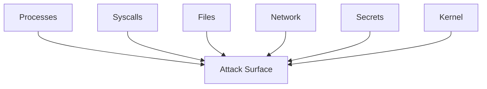

---

# Runtime Security Architecture

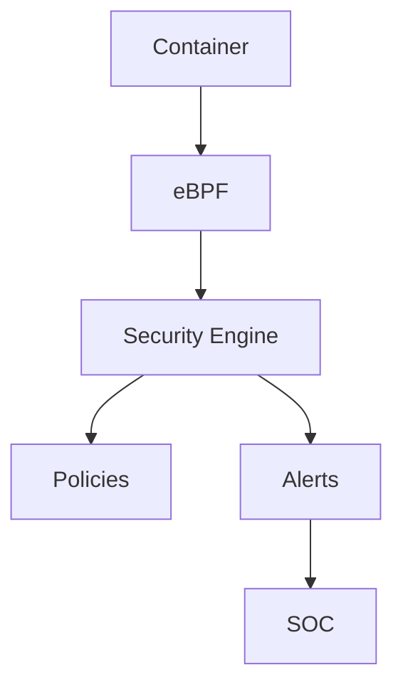

---

# The Runtime Lifecycle

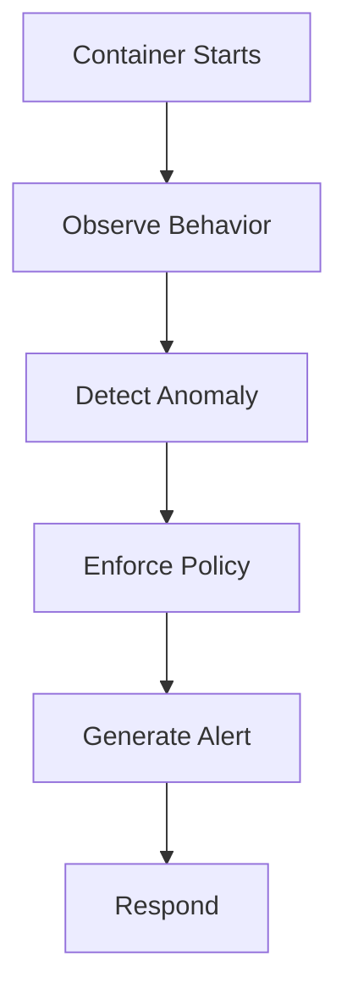

---

# Threat Categories

Runtime attacks generally fall into 7 categories.

```text
1. Process Attacks

2. Network Attacks

3. File Attacks

4. Privilege Escalation

5. Secret Theft

6. Resource Abuse

7. Container Escape
```

---

# Attack 1: Unexpected Processes

Suppose nginx container suddenly runs:

```bash
bash
```

Question:

Why?

This is suspicious.

---

# Process Monitoring

Monitor:

```text
Unexpected Binaries

Unexpected Shells

Unexpected Child Processes
```

---

# Process Architecture

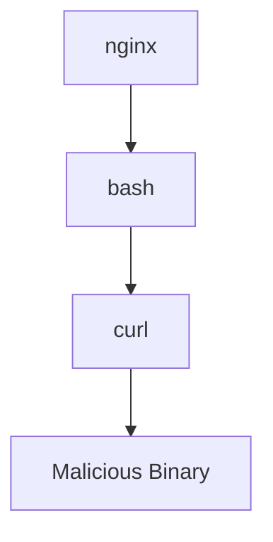

---

# Attack 2: Network Attacks

Questions:

```text
Why is Redis calling Russia?

Why is PostgreSQL contacting the internet?

Why is nginx scanning IP addresses?
```

These are indicators.

---

# Network Monitoring

Monitor:

```text
DNS Requests

Outbound Traffic

Lateral Movement

Port Scans
```

---

# Network Architecture

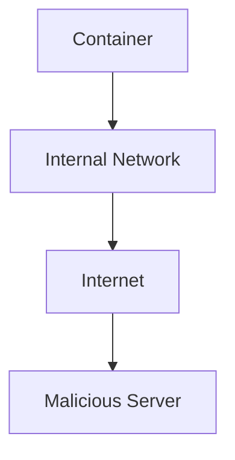

---

# Attack 3: File Attacks

Questions:

```text
Why is nginx modifying /etc/passwd?

Why is application writing to /bin?

Why is container changing system files?
```

Monitor file activity.

---

# File Monitoring

Observe:

```text
Reads

Writes

Deletes

Permission Changes
```

---

# Attack 4: Privilege Escalation

Attacker goal:

```text
Container

↓

Host

↓

Kernel
```

Very dangerous.

---

# Escalation Visualization

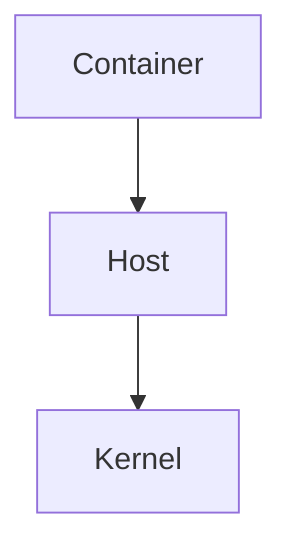

Protect aggressively.

---

# Attack 5: Secret Theft

Attackers target:

```text
API Keys

Cloud Credentials

Database Passwords

Tokens
```

Secrets are valuable.

---

# Attack 6: Resource Abuse

Examples:

```text
Crypto Mining

Fork Bombs

Memory Exhaustion

CPU Abuse
```

Monitor usage patterns.

---

# Resource Monitoring

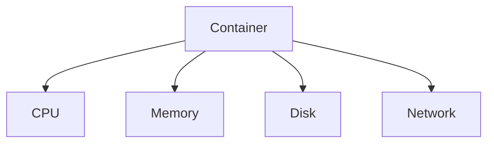

---

# Attack 7: Container Escape

Most dangerous attack.

Goal:

```text
Container

↓

Linux Host

↓

Entire Infrastructure
```

This is why kernel security matters.

---

# Why Linux Matters

Everything eventually reaches Linux.

```text
Syscalls

Processes

Namespaces

Filesystems

Networking
```

Linux is the battlefield.

---

# The Most Important Runtime Technology: eBPF

eBPF is huge.

Think:

> eBPF is a programmable observability engine inside Linux.

It can observe:

```text
Processes

Syscalls

Files

Networks

Memory
```

in real time.

---

# eBPF Architecture

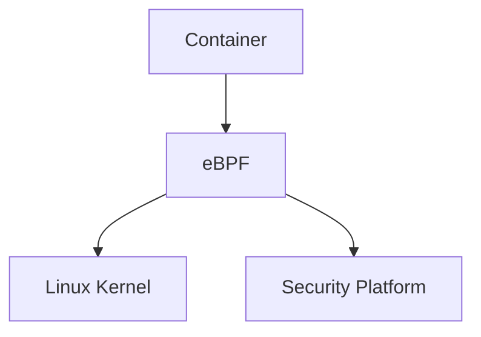

---

# Why eBPF Is Revolutionary

Old monitoring:

```text
Logs

↓

Delayed Detection
```

eBPF:

```text
Kernel Events

↓

Real Time Detection
```

---

# Syscall Monitoring

Every application generates syscalls.

Examples:

```text
open()

read()

write()

connect()

execve()

mount()
```

These become security signals.

---

# Syscall Architecture

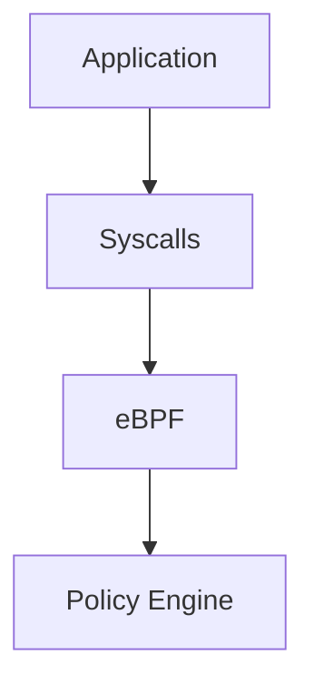

---

# Runtime Security Policies

Policies define:

```text
Allowed Processes

Allowed Connections

Allowed Files

Allowed Resources
```

Anything else becomes suspicious.

---

# Policy Example

Web server:

Allowed:

```text
nginx

HTTP

HTTPS

Read Static Files
```

Blocked:

```text
bash

ssh

nc

crypto miners
```

---

# Security Pipeline

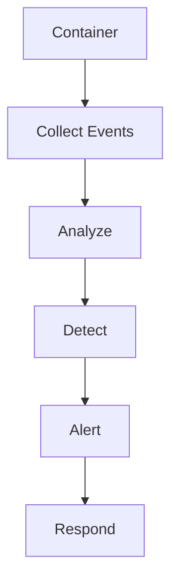

---

# Automated Responses

Responses may include:

```text
Kill Container

Block Network

Throttle Resources

Quarantine Workload
```

---

# Kubernetes Relationship

Kubernetes adds:

```text
Network Policies

Pod Security Standards

Admission Controllers

OPA Policies
```

But runtime security is still necessary.

---

# Kubernetes Runtime Architecture

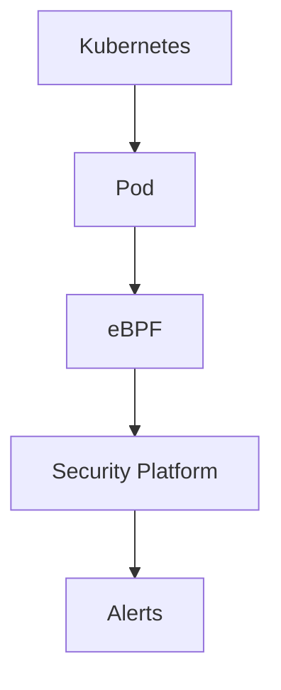

---

# Zero Trust Runtime Security

Never trust:

```text
Pods

Containers

Services

Networks
```

Always verify behavior.

---

# Detection Engineering

Modern security teams build detections.

Questions:

```text
What behavior is normal?

What behavior is abnormal?
```

This becomes engineering.

---

# SOC Relationship

SOC = Security Operations Center.

Pipeline:

```text
Infrastructure

↓

Detection

↓

Alert

↓

Investigation

↓

Response
```

---

# SIEM Relationship

SIEM aggregates events.

Examples:

```text
Splunk

Elastic

Microsoft Sentinel

Chronicle
```

---

# Production Security Stack

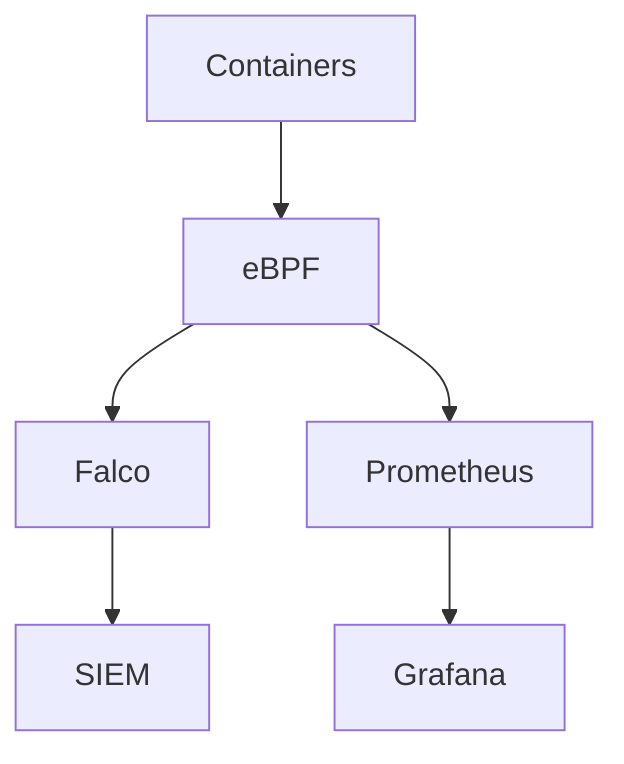

---

# Popular Runtime Security Tools

Examples:

```text
Falco

Tetragon

Tracee

Cilium

Sysdig
```

---

# Cloud Relationship

Cloud providers provide additional security.

Examples:

```text
AWS GuardDuty

Azure Defender

Google Security Command Center
```

---

# Production Example

Secure Kubernetes platform.

Layers:

```text
Image Scanning

↓

Admission Policies

↓

Runtime Monitoring

↓

Detection Engine

↓

Alerting

↓

Automated Response
```

---

# Linux Relationship

Everything connects.

```text
Linux

↓

Processes

↓

Syscalls

↓

eBPF

↓

Runtime Security

↓

Cloud Native Security
```

---

# Performance Considerations

Monitoring everything is expensive.

Tradeoffs:

```text
CPU Overhead

Memory Overhead

Storage Overhead
```

Balance visibility.

---

# Scaling Considerations

1000 containers:

```text
Millions of syscalls

Millions of events

Millions of logs
```

Automation is mandatory.

---

# Observability Considerations

Monitor:

```text
Process Creation

File Access

Network Activity

Resource Usage

DNS Queries

Syscalls
```

---

# Useful Commands

Processes:

```bash
ps aux
```

Namespaces:

```bash
lsns
```

Network:

```bash
ss -tulpn
```

Logs:

```bash
journalctl
```

Resources:

```bash
top

htop
```

---

# Runtime Security Checklist

```text
✓ Non Root Users

✓ Read Only Filesystem

✓ Network Policies

✓ Syscall Monitoring

✓ eBPF Monitoring

✓ Runtime Detection

✓ Secret Protection

✓ Resource Limits

✓ Automated Alerts
```

---

# Common Mistakes

## Mistake 1

Thinking deployment finishes security.

Wrong.

---

## Mistake 2

Only scanning images.

Incomplete.

---

## Mistake 3

Ignoring runtime behavior.

Dangerous.

---

## Mistake 4

Ignoring Linux internals.

Huge gap.

---

## Mistake 5

No monitoring.

Very dangerous.

---

# Troubleshooting Guide

Security incident?

Ask:

```text
Unexpected process?

↓

Unexpected network traffic?

↓

Unexpected file access?

↓

Resource abuse?

↓

Privilege escalation?

↓

Container escape?
```

---

# Engineering Mindset

Do not think:

```text
Runtime Security

=

Container Monitoring
```

Think:

```text
Runtime Security

=

Continuous Threat Detection

+

Continuous Enforcement

+

Continuous Response
```

---

# Evolution Of Thinking

```text
Linux Security

↓

Container Security

↓

Runtime Security

↓

Detection Engineering

↓

Zero Trust Infrastructure
```

---

# Interview Questions

## Beginner

1. What is runtime security?

2. Why isn't image security enough?

3. What is eBPF?

4. What is container escape?

5. Why monitor syscalls?

---

## Intermediate

6. Explain runtime architecture.

7. Explain anomaly detection.

8. Explain network monitoring.

9. Explain process monitoring.

10. Explain Falco.

---

## Advanced

11. Explain detection engineering.

12. Explain eBPF security.

13. Explain zero trust runtime systems.

14. Explain autonomous defense systems.

15. Explain large-scale runtime security.

---

# Cheat Sheet

```text
Runtime Security

=

Monitoring

+

Detection

+

Enforcement

+

Response

+

Automation


Observe:

Processes

Syscalls

Files

Networks

Resources

Secrets


Tools:

Falco

Tetragon

Tracee

Cilium

eBPF
```

---

# Final Thought

The biggest security shift in cloud-native engineering is this:

> Security is no longer a firewall sitting at the edge.

Security is becoming a real-time nervous system embedded inside infrastructure itself.

And runtime security is one of the first steps toward that future.
