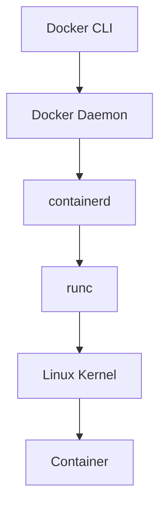
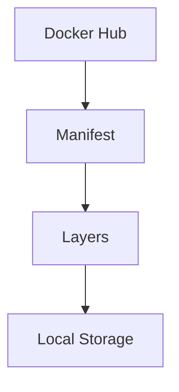
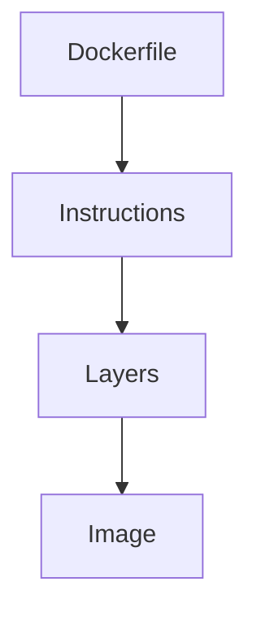
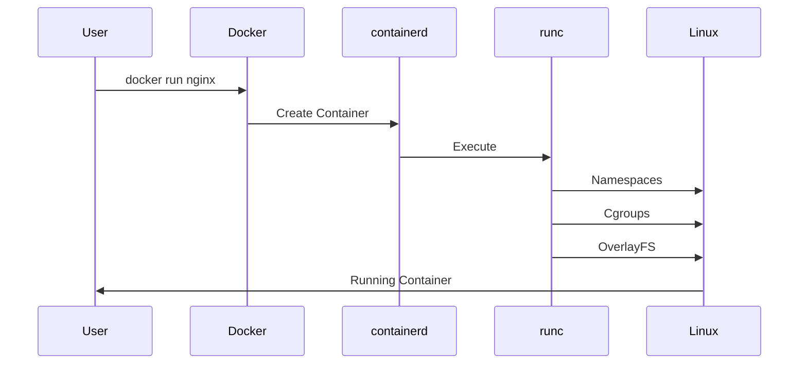

# Docker Commands: The Engineering Handbook

> "Don't memorize Docker commands. Learn the systems they control."

---

# Why This File Exists

Most people learn Docker like this:

```text
Command

↓

Syntax

↓

Done
```

Engineers learn Docker like this:

```text
Problem

↓

Command

↓

Internal Flow

↓

Linux Internals

↓

Production Usage

↓

Troubleshooting
```

---

# Docker Command Mental Model

Docker commands are APIs for infrastructure.

```text
docker command

↓

Docker CLI

↓

Docker Daemon

↓

containerd

↓

runc

↓

Linux Kernel

↓

Container
```

---

# Docker Command Categories

```text
Image Commands

↓

Container Commands

↓

Volume Commands

↓

Network Commands

↓

System Commands

↓

Compose Commands

↓

Debugging Commands

↓

Production Commands
```

---

# Complete Docker Flow



---

# SECTION 1: Docker Information Commands

# docker version

## Why this exists

Shows Docker client and server versions.

## Command

```bash
docker version
```

## Example Output

```text
Client:
 Version: 28.x

Server:
 Docker Engine: 28.x
```

## Internal Flow

```text
CLI

↓

Docker Daemon

↓

Retrieve Version Information
```

---

# docker info

## Why this exists

Shows Docker system internals.

## Command

```bash
docker info
```

## Shows

```text
Containers

Images

Storage Driver

Cgroup Version

Kernel Version

Runtimes

Plugins
```

Production engineers use this first when debugging.

---

# SECTION 2: Image Commands

# docker pull

## Problem

Need image from registry.

## Command

```bash
docker pull nginx
```

## Internal Flow



---

# docker images

List local images.

```bash
docker images
```

or

```bash
docker image ls
```

Output:

```text
Repository

Tag

Image ID

Created

Size
```

---

# docker build

## Problem

Convert source code into image.

## Command

```bash
docker build -t myapp .
```

## Internal Flow



---

# docker history

Shows image layers.

```bash
docker history nginx
```

Shows:

```text
Layer Size

Commands

Creation Time
```

---

# docker inspect image

Inspect image metadata.

```bash
docker inspect nginx
```

Shows:

```text
Environment Variables

Layers

Architecture

OS

Entrypoint
```

---

# docker tag

Creates another image reference.

```bash
docker tag myapp:latest myrepo/myapp:v1
```

Mental model:

```text
One Image

↓

Multiple Labels
```

---

# docker push

Upload image.

```bash
docker push myrepo/myapp:v1
```

Flow:

```text
Image

↓

Registry

↓

Production
```

---

# docker save

Export image.

```bash
docker save myapp > myapp.tar
```

---

# docker load

Import image.

```bash
docker load < myapp.tar
```

---

# SECTION 3: Container Commands

# docker run

The most important command.

## Why this exists

Create and start container.

```bash
docker run nginx
```

---

# Internal Flow



---

# Useful Options

## Detached mode

```bash
docker run -d nginx
```

Runs in background.

---

## Name container

```bash
docker run --name web nginx
```

---

## Port Mapping

```bash
docker run -p 8080:80 nginx
```

```text
Host:8080

↓

Container:80
```

---

## Environment Variables

```bash
docker run -e NODE_ENV=production myapp
```

---

## Mount Volume

```bash
docker run -v mydata:/data nginx
```

---

## Resource Limits

```bash
docker run --memory=512m --cpus=1 nginx
```

---

# docker ps

List running containers.

```bash
docker ps
```

All containers:

```bash
docker ps -a
```

---

# docker stop

Graceful shutdown.

```bash
docker stop web
```

Flow:

```text
SIGTERM

↓

Wait

↓

SIGKILL
```

---

# docker start

Start stopped container.

```bash
docker start web
```

---

# docker restart

Restart container.

```bash
docker restart web
```

---

# docker kill

Immediate termination.

```bash
docker kill web
```

Uses:

```text
SIGKILL
```

---

# docker rm

Delete container.

```bash
docker rm web
```

Delete forcefully:

```bash
docker rm -f web
```

---

# docker rename

Rename container.

```bash
docker rename old new
```

---

# SECTION 4: Debugging Commands

# docker logs

Read logs.

```bash
docker logs web
```

Follow logs:

```bash
docker logs -f web
```

---

# docker exec

Execute inside container.

```bash
docker exec -it web bash
```

Mental model:

```text
SSH replacement
```

without SSH.

---

# docker attach

Attach terminal.

```bash
docker attach web
```

---

# docker inspect

Inspect everything.

```bash
docker inspect web
```

Shows:

```text
Network

Volumes

Environment

Ports

State

Mounts
```

---

# docker top

Show processes.

```bash
docker top web
```

---

# docker stats

Real-time metrics.

```bash
docker stats
```

Shows:

```text
CPU

Memory

Network

Disk
```

Production engineers use this constantly.

---

# SECTION 5: Volume Commands

# docker volume create

```bash
docker volume create postgres_data
```

---

# docker volume ls

```bash
docker volume ls
```

---

# docker volume inspect

```bash
docker volume inspect postgres_data
```

---

# docker volume rm

```bash
docker volume rm postgres_data
```

---

# SECTION 6: Network Commands

# docker network ls

```bash
docker network ls
```

Types:

```text
bridge

host

none
```

---

# docker network inspect

```bash
docker network inspect bridge
```

Shows:

```text
Subnets

Containers

Gateways
```

---

# docker network create

```bash
docker network create mynetwork
```

---

# docker network connect

```bash
docker network connect mynetwork web
```

---

# docker network disconnect

```bash
docker network disconnect mynetwork web
```

---

# SECTION 7: System Commands

# docker system df

Disk usage.

```bash
docker system df
```

---

# docker system prune

Cleanup unused resources.

```bash
docker system prune
```

Dangerous.

Removes:

```text
Stopped Containers

Unused Networks

Unused Images
```

---

# docker system events

Live Docker events.

```bash
docker system events
```

---

# SECTION 8: Docker Compose Commands

# Start everything

```bash
docker compose up
```

Background:

```bash
docker compose up -d
```

---

# Stop everything

```bash
docker compose down
```

---

# Build services

```bash
docker compose build
```

---

# Logs

```bash
docker compose logs
```

---

# Restart services

```bash
docker compose restart
```

---

# List services

```bash
docker compose ps
```

---

# SECTION 9: Production Engineer Commands

# Find resource usage

```bash
docker stats
```

---

# Check logs

```bash
docker logs
```

---

# Inspect networking

```bash
docker network inspect
```

---

# Inspect volumes

```bash
docker volume inspect
```

---

# Cleanup safely

```bash
docker system prune
```

---

# SECTION 10: Docker Debugging Workflow

Container not working?

```text
Container Running?

↓

docker ps

↓

Logs?

↓

docker logs

↓

Processes?

↓

docker top

↓

Resource Usage?

↓

docker stats

↓

Configuration?

↓

docker inspect

↓

Network?

↓

docker network inspect
```

---

# Common Beginner Mistakes

## Mistake 1

Using latest.

Bad:

```bash
docker pull node:latest
```

Good:

```bash
docker pull node:22-alpine
```

---

## Mistake 2

Using docker exec in production to fix systems.

Wrong.

Rebuild image instead.

---

## Mistake 3

Ignoring resource limits.

Wrong.

Always limit resources.

---

## Mistake 4

Using SSH inside containers.

Wrong.

Containers are disposable.

---

## Mistake 5

Never cleaning Docker resources.

Eventually fills disk.

---

# Docker Command Ecosystem Map

```mermaid
mindmap

root((Docker Commands))

    Images

        pull

        build

        push

        tag

        history

    Containers

        run

        ps

        stop

        start

        restart

        rm

    Debugging

        logs

        inspect

        exec

        top

        stats

    Volumes

        create

        ls

        inspect

    Networks

        create

        inspect

        connect

    System

        info

        version

        prune

    Compose

        up

        down

        logs

        restart
```

---

# Production Cheat Sheet

| Problem | Command |
|---------|---------|
| See containers | `docker ps` |
| Check logs | `docker logs` |
| Enter container | `docker exec -it` |
| See resource usage | `docker stats` |
| Inspect configuration | `docker inspect` |
| See processes | `docker top` |
| Inspect network | `docker network inspect` |
| Cleanup | `docker system prune` |

---

# Final Thought

Don't memorize:

```text
docker run

docker ps

docker exec
```

Understand:

```text
Docker Commands

↓

Docker API

↓

Docker Daemon

↓

containerd

↓

runc

↓

Linux Kernel

↓

Container
```

Because Docker commands are simply **remote controls for Linux-powered infrastructure systems.**
