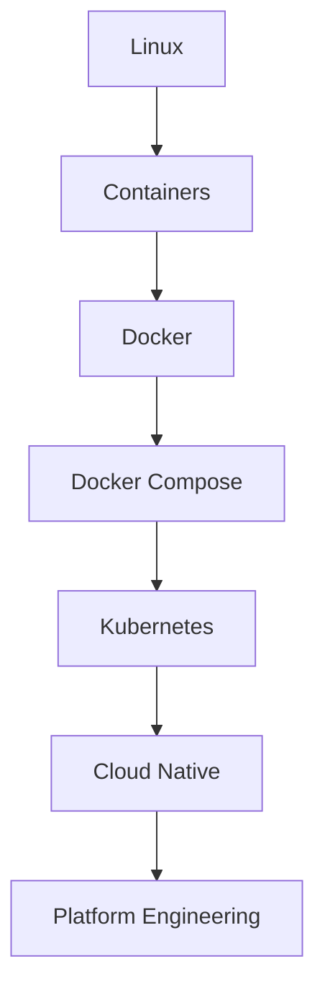
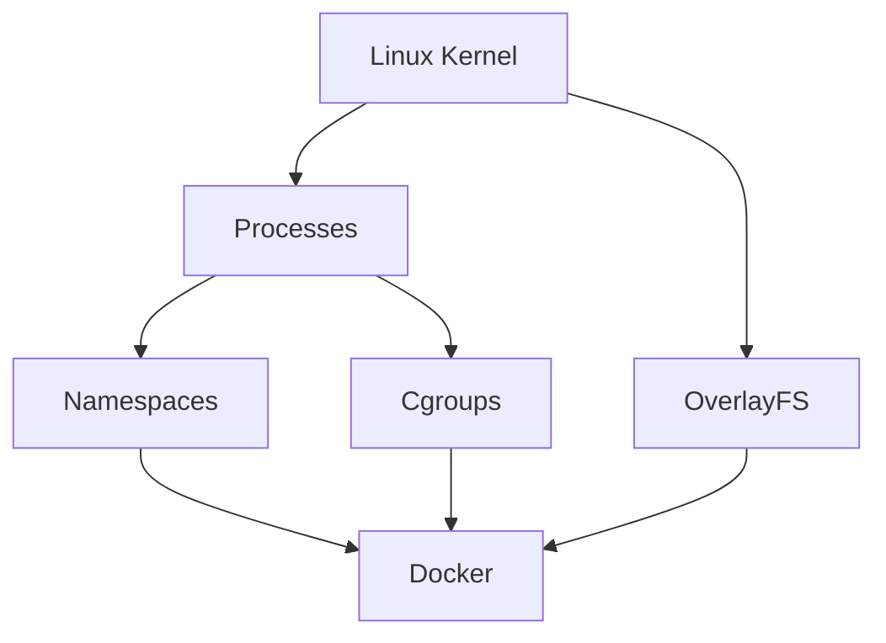
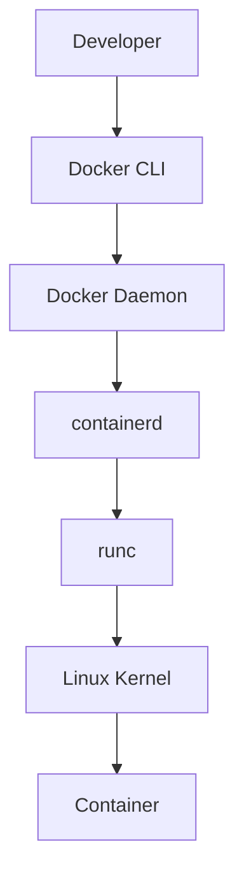
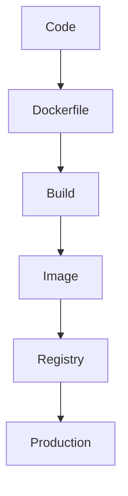
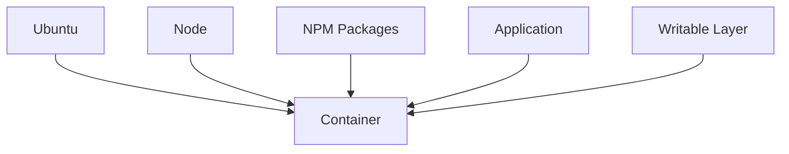
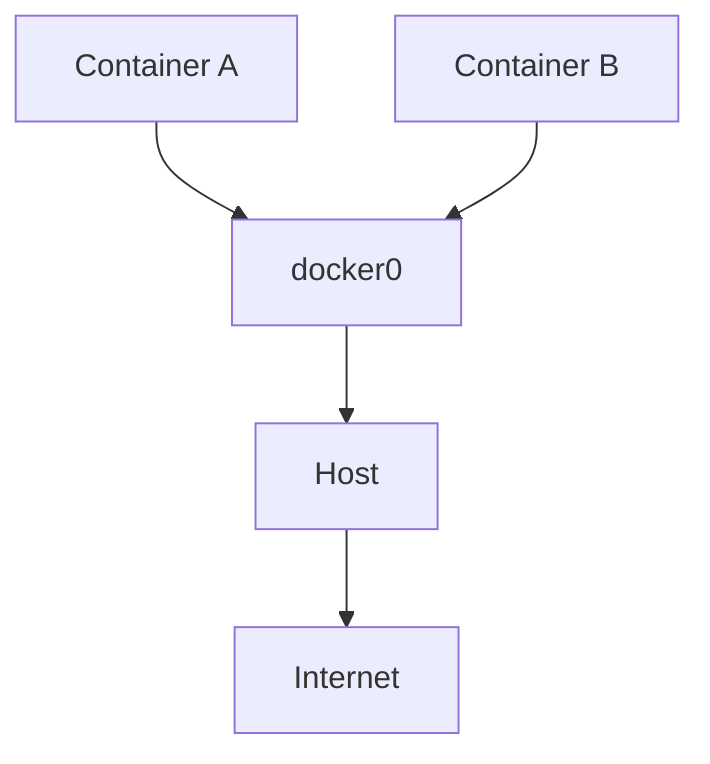
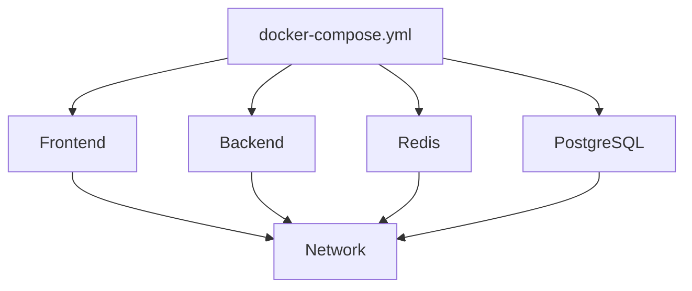
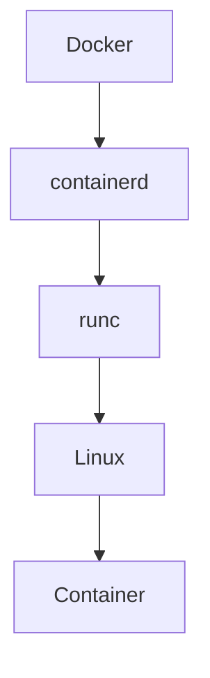
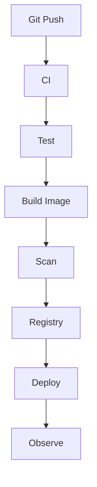
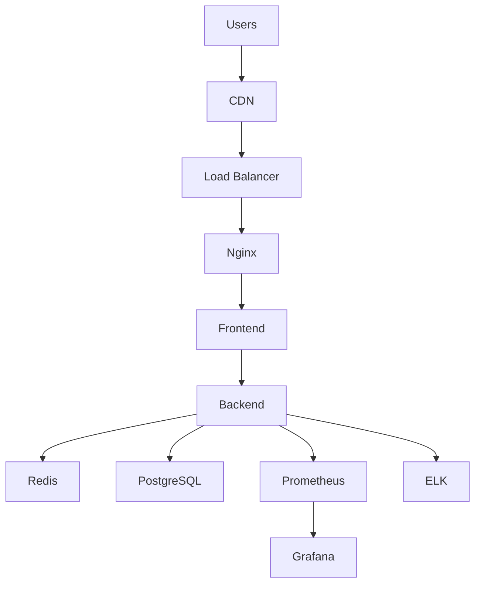

# Docker Master Mind Map

> "Docker is not a container technology. Docker is a Linux abstraction platform."

---

# How To Use This Mind Map

Never memorize Docker commands.

Always ask:

```text
WHY?

↓

WHAT PROBLEM DOES IT SOLVE?

↓

WHAT LINUX PRIMITIVE POWERS IT?

↓

HOW DOES IT SCALE?

↓

HOW DOES IT CONNECT TO MODERN INFRASTRUCTURE?
```

---

# Master Docker Knowledge Graph

```mermaid
mindmap

root((Docker))

    Why Docker Exists

        Dependency Hell

        Environment Drift

        Deployment Complexity

        Reproducibility

        Portability

        Faster Delivery

    Linux Foundation

        Linux Kernel

        Processes

        Syscalls

        Filesystems

        Networking

        Security

    Container Internals

        Namespaces

            PID

            NET

            IPC

            UTS

            MNT

            USER

        Cgroups

            CPU

            Memory

            Disk

            PID Limits

        OverlayFS

            Lower Layer

            Upper Layer

            Merged Layer

        UnionFS

    Docker Architecture

        Docker CLI

        Docker API

        Docker Daemon

        Docker Engine

    Docker Images

        Layers

        Caching

        Registries

        Tags

        Digests

    Dockerfiles

        Instructions

        Optimization

        Multi Stage Builds

    Docker Networking

        docker0

        veth

        Bridge

        NAT

        DNS

        Port Mapping

    Docker Storage

        Volumes

        Bind Mounts

        tmpfs

    Docker Compose

        Services

        Networks

        Volumes

        Environment Variables

    Runtime Ecosystem

        OCI

        containerd

        runc

    Security

        Image Security

        Runtime Security

        Capabilities

        Seccomp

        AppArmor

        Supply Chain Security

    Production

        Immutable Infrastructure

        Stateless Systems

        Health Checks

        Self Healing

        Auto Scaling

        Observability

    Deployments

        Rolling

        Blue Green

        Canary

        Shadow

    Cloud Native

        Kubernetes

        Service Mesh

        GitOps

        SRE

        Platform Engineering
```

---

# Docker Evolution



---

# Linux → Docker Relationship



---

# Docker Internal Architecture



---

# Docker Build Flow



---

# Docker Image Mind Map

```mermaid
mindmap

root((Docker Images))

    Base Images

    Layers

    Caching

    Registries

    Tags

    Digests

    Multi Stage Builds

    Optimization

    Security
```

---

# Docker Layer Architecture



---

# Docker Networking Mind Map

```mermaid
mindmap

root((Networking))

    docker0

    veth

    Bridge

    NAT

    Port Mapping

    DNS

    Overlay Networks

    Service Discovery
```

---

# Docker Networking Architecture



---

# Docker Storage Mind Map

```mermaid
mindmap

root((Storage))

    Volumes

    Bind Mounts

    tmpfs

    Persistent Storage

    Databases

    Shared Data
```

---

# Docker Compose Mind Map

```mermaid
mindmap

root((Compose))

    Services

    Networks

    Volumes

    Dependencies

    Environment Variables

    Infrastructure As Code
```

---

# Docker Compose Architecture



---

# Runtime Ecosystem Mind Map

```mermaid
mindmap

root((Runtime Ecosystem))

    OCI

        Image Spec

        Runtime Spec

        Distribution Spec

    containerd

    runc

    CRI

    Kubernetes
```

---

# Runtime Architecture



---

# Security Mind Map

```mermaid
mindmap

root((Docker Security))

    Least Privilege

    Non Root Users

    Capabilities

    Seccomp

    AppArmor

    Image Scanning

    SBOM

    Runtime Security

    Supply Chain Security
```

---

# Production Mind Map

```mermaid
mindmap

root((Production))

    Immutable Infrastructure

    Stateless Applications

    Health Checks

    Auto Scaling

    Self Healing

    Configuration Management

    Observability

    Security
```

---

# Deployment Mind Map

```mermaid
mindmap

root((Deployments))

    Rolling

    Blue Green

    Canary

    Shadow

    Feature Flags

    Rollbacks
```

---

# Observability Mind Map

```mermaid
mindmap

root((Observability))

    Logs

    Metrics

    Traces

    Dashboards

    Alerts

    SLO

    SLA

    SLI
```

---

# CI/CD Pipeline



---

# Production Architecture



---

# Docker → Kubernetes Transition

```mermaid
flowchart TD

A[Docker]

B[Docker Compose]

C[Kubernetes]

D[Cloud Native]

A --> B

B --> C

C --> D
```

---

# Docker Knowledge Pyramid

```mermaid
flowchart TD

A[Docker Commands]

B[Docker Concepts]

C[Docker Internals]

D[Linux Internals]

E[Distributed Systems]

F[Platform Engineering]

A --> B

B --> C

C --> D

D --> E

E --> F
```

---

# The Ultimate Docker Mental Model

```text
Linux

↓

Processes

↓

Namespaces + Cgroups + OverlayFS

↓

Containers

↓

Docker

↓

OCI

↓

containerd

↓

runc

↓

CRI

↓

Kubernetes

↓

Cloud Native Systems

↓

Platform Engineering
```

---

# Docker Graduation Test

If you can explain every arrow below, you deeply understand Docker.

```text
Code

↓

Dockerfile

↓

Image

↓

Docker Engine

↓

containerd

↓

runc

↓

Linux Kernel

↓

Namespaces + Cgroups + OverlayFS

↓

Container

↓

Production Infrastructure
```

---

# Final Thought

Do not learn Docker as a tool.

Learn Docker as an **abstraction layer built on top of Linux that changed how software is delivered to the world.**

Because Docker is temporary.

**Linux principles are permanent.**
