# Docker Visual Atlas

> "Docker is easier to understand when you stop reading text and start seeing systems."

---

# 1. Docker Big Picture

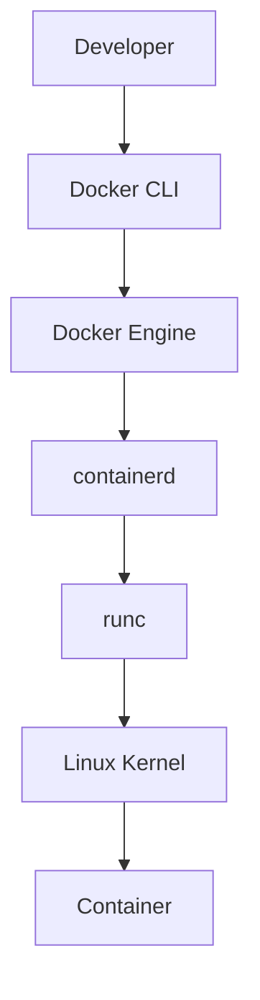

---

# 2. Docker Mental Model


---

# 3. Docker Architecture

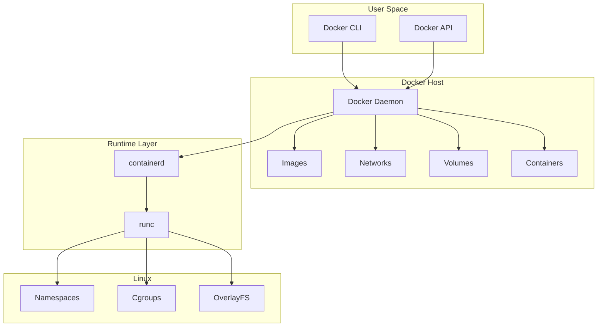

---

# 4. Complete `docker run` Flow

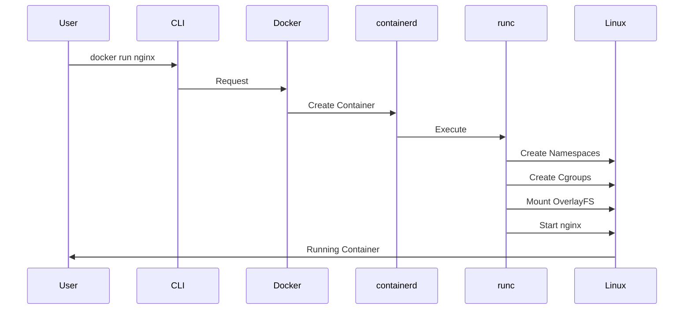

---

# 5. Docker Ecosystem

```mermaid
mindmap

root((Docker))

    Docker Engine

    Docker Images

    Docker Layers

    Dockerfiles

    Docker Networking

    Docker Volumes

    Docker Compose

    Registries

    Security
```

---

# 6. Image To Container Flow

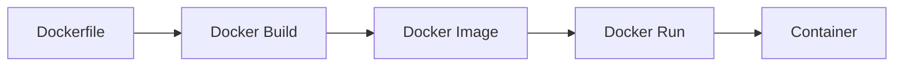

---

# 7. Docker Image Internals

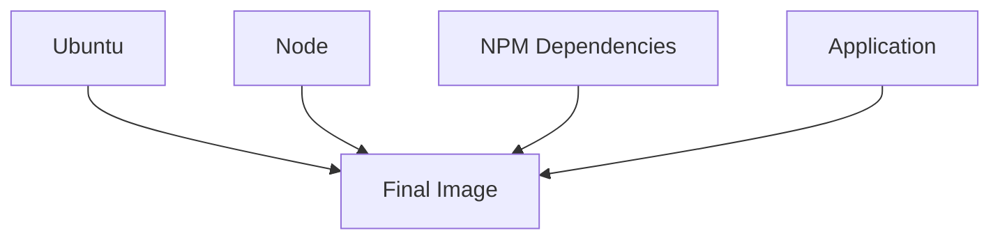

---

# 8. Docker Layers

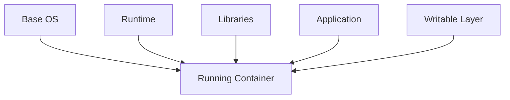

---

# 9. Copy-On-Write

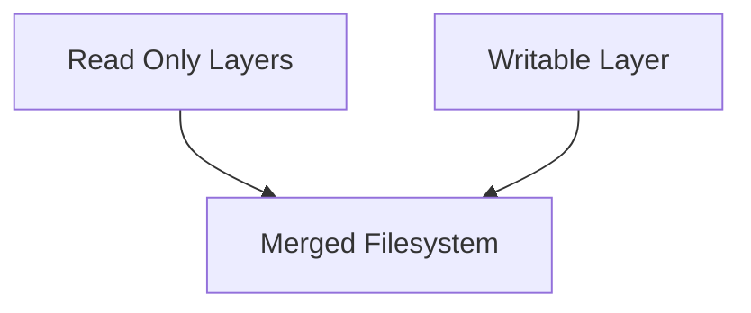

---

# 10. Docker Build Cache

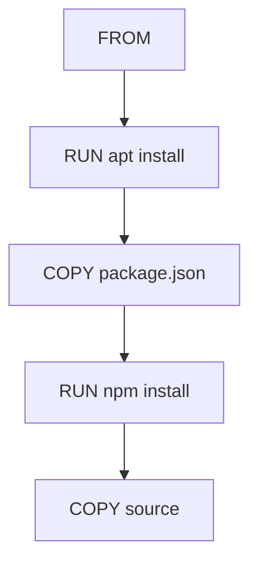

---

# 11. Good Dockerfile Flow

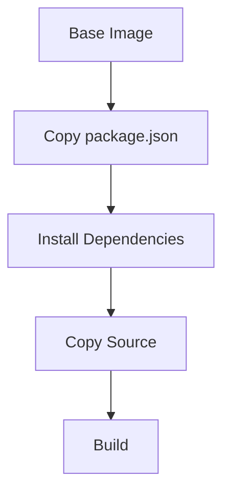

---

# 12. Multi Stage Build

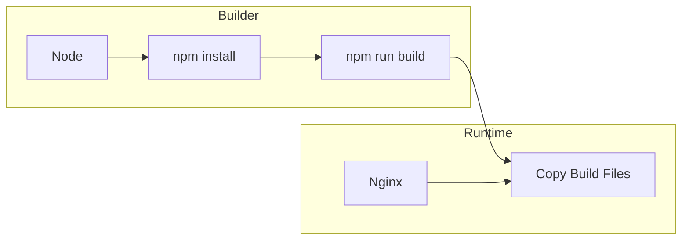

---

# 13. Image Registry Flow


---

# 14. Volume Architecture

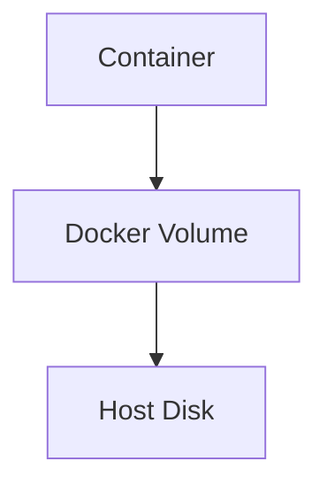

---

# 15. Bind Mount Architecture


---

# 16. Volume Use Cases

```mermaid
mindmap

root((Volumes))

    Databases

    Uploads

    Logs

    Cache

    Shared Data
```

---

# 17. Docker Networking Big Picture

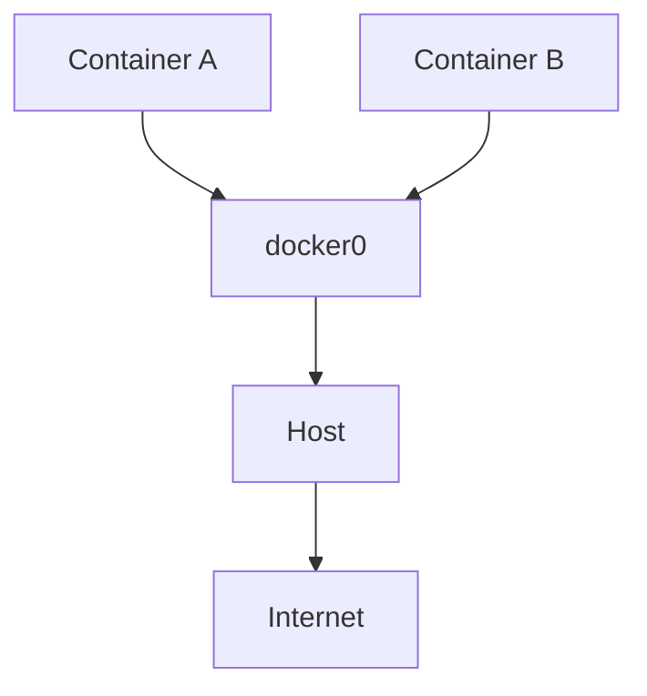

---

# 18. veth Pair Architecture


---

# 19. Port Mapping


---

# 20. Docker DNS

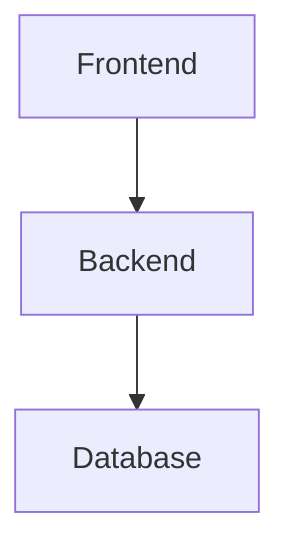

Instead of:

```text
172.18.0.5
```

Docker uses:

```text
backend

database
```

---

# 21. Docker Compose Architecture

```mermaid
flowchart TD

A[docker-compose.yml]

B[Frontend]

C[Backend]

D[Redis]

E[PostgreSQL]

F[Internal Network]

A --> B

A --> C

A --> D

A --> E

B --> F

C --> F

D --> F

E --> F
```

---

# 22. Full Stack Application

```mermaid
flowchart TD

A[User]

B[Nginx]

C[Frontend]

D[Backend]

E[Redis]

F[PostgreSQL]

A --> B

B --> C

C --> D

D --> E

D --> F
```

---

# 23. Production Docker Stack

```mermaid
flowchart TD

A[Users]

B[Load Balancer]

C[Nginx]

D[Containers]

E[Redis]

F[PostgreSQL]

G[Prometheus]

H[Grafana]

I[ELK]

A --> B

B --> C

C --> D

D --> E

D --> F

D --> G

G --> H

D --> I
```

---

# 24. Docker Security Layers

```mermaid
flowchart TD

A[Source Code]

B[Dockerfile]

C[Image]

D[Registry]

E[Runtime]

F[Linux]

A --> B

B --> C

C --> D

D --> E

E --> F
```

---

# 25. Image Security Pipeline

```mermaid
flowchart TD

A[Code]

B[Build]

C[Scan]

D[SBOM]

E[Sign]

F[Registry]

A --> B

B --> C

C --> D

D --> E

E --> F
```

---

# 26. Runtime Security

```mermaid
flowchart TD

A[Container]

B[eBPF]

C[Detection]

D[Alerts]

E[Response]

A --> B

B --> C

C --> D

D --> E
```

---

# 27. Deployment Pipeline

```mermaid
flowchart TD

A[Git Push]

B[CI]

C[Build Image]

D[Registry]

E[Deploy]

F[Observe]

A --> B

B --> C

C --> D

D --> E

E --> F
```

---

# 28. Blue Green Deployment

```mermaid
flowchart TD

A[Users]

B[Load Balancer]

C[Blue]

D[Green]

A --> B

B --> C

B --> D
```

---

# 29. Canary Deployment

```mermaid
flowchart LR

A[5%]

B[20%]

C[50%]

D[100%]

A --> B

B --> C

C --> D
```

---

# 30. Docker To Kubernetes Evolution

```mermaid
flowchart TD

A[Docker]

B[Docker Compose]

C[Kubernetes]

D[Cloud Native]

A --> B

B --> C

C --> D
```

---

# 31. The Docker Knowledge Graph

```mermaid
mindmap

root((Docker))

    Images

        Layers

        Cache

        Registries

    Containers

        Namespaces

        Cgroups

        OverlayFS

    Dockerfiles

        Multi Stage

        Optimization

    Networking

        docker0

        NAT

        DNS

        veth

    Storage

        Volumes

        Bind Mounts

    Compose

        Services

        Networks

        Volumes

    Security

        Images

        Runtime

        Supply Chain

    Production

        Observability

        Deployments

        Scaling
```

---

# 32. The Entire Docker Stack

```mermaid
flowchart TD

A[Developer]

B[Docker CLI]

C[Docker Engine]

D[containerd]

E[runc]

F[Linux Kernel]

G[Namespaces]

H[Cgroups]

I[OverlayFS]

J[Container]

A --> B

B --> C

C --> D

D --> E

E --> F

F --> G

F --> H

F --> I

G --> J

H --> J

I --> J
```

---

# Final Visual Mental Model

```text
Code

↓

Dockerfile

↓

Docker Image

↓

Docker Engine

↓

containerd

↓

runc

↓

Linux Kernel

↓

Namespaces + Cgroups + OverlayFS

↓

Container

↓

Production Infrastructure
```

> **Docker is not one tool. Docker is a Linux abstraction platform built on decades of operating system engineering.**
