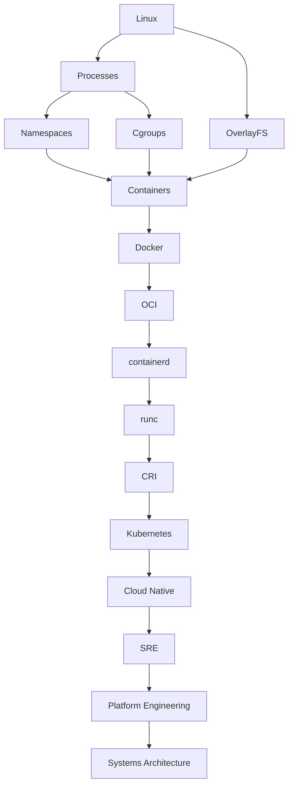
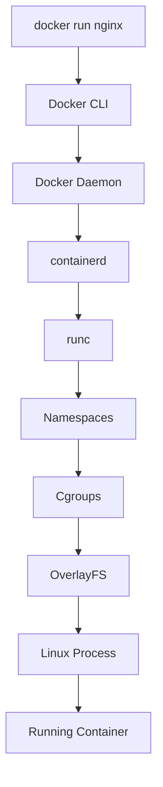
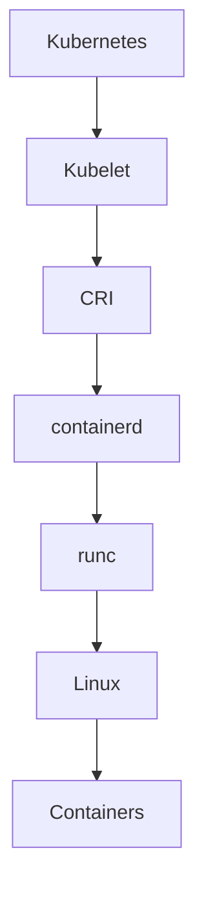
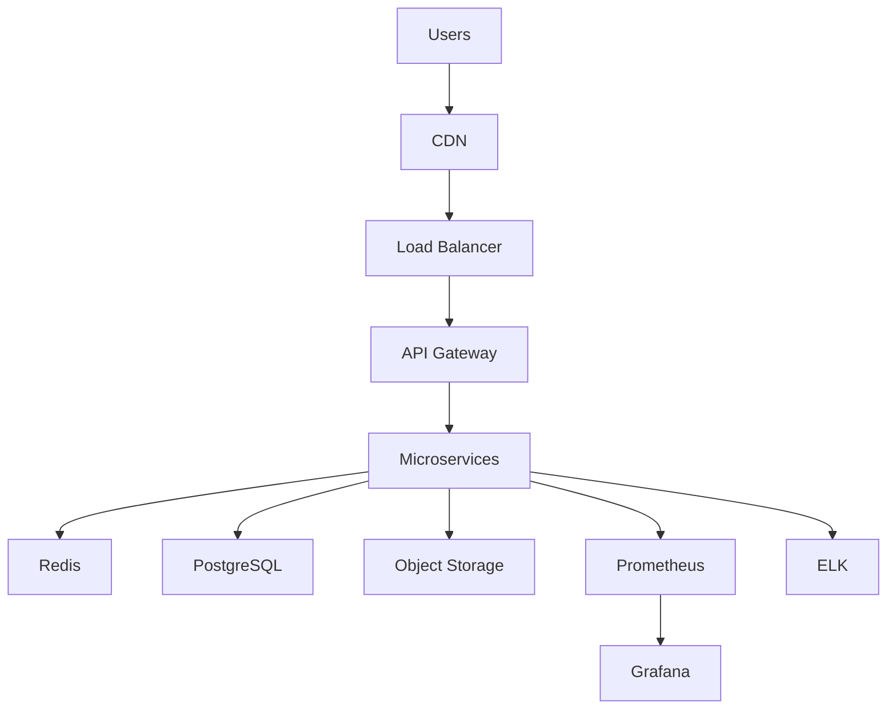

# Containers Master Mind Map

> "Containers are not a technology. They are an ecosystem built on top of Linux."

---

# How To Read This Mind Map

Do NOT memorize topics.

Always ask:

```text
WHY does this exist?

↓

WHAT problem does it solve?

↓

WHAT Linux primitive powers it?

↓

HOW does it scale?

↓

HOW does it connect to cloud-native systems?
```

---

# Master Container Knowledge Graph

```mermaid
mindmap

root((Containers))

    Why Containers Exist

        Dependency Hell

        Environment Consistency

        Portability

        Scalability

        Faster Deployments

        Resource Efficiency

    Linux Foundations

        Linux Kernel

        Processes

        Syscalls

        Filesystems

        Networking

        Security

    Container Internals

        Namespaces

            PID

            NET

            IPC

            MNT

            UTS

            USER

        Cgroups

            CPU

            Memory

            Disk IO

            PID Limits

        OverlayFS

            Lower Layers

            Upper Layer

            Merged Layer

        Union Filesystems

        Capabilities

        Seccomp

        AppArmor

        SELinux

    Docker

        Docker CLI

        Docker Daemon

        Docker Engine

        Docker Images

        Docker Layers

        Dockerfiles

        Docker Volumes

        Docker Networking

        Docker Compose

    Runtime Ecosystem

        OCI

            Image Spec

            Runtime Spec

            Distribution Spec

        containerd

        runc

        CRI

    Networking

        docker0

        veth

        Bridge

        NAT

        Port Mapping

        DNS

        Overlay Networks

        Service Discovery

    Storage

        Volumes

        Bind Mounts

        tmpfs

        Persistent Storage

    Security

        Image Security

        Runtime Security

        Supply Chain Security

        Zero Trust

        Least Privilege

        Secret Management

    Production

        Immutable Infrastructure

        Stateless Applications

        Health Checks

        Self Healing

        Auto Scaling

        Configuration Management

        Observability

        Logging

        Metrics

        Tracing

    Deployment

        Rolling

        Blue Green

        Canary

        Shadow

        Feature Flags

    Kubernetes

        Pods

        Deployments

        Services

        Ingress

        CRI

        CNI

        CSI

    Cloud Native

        Microservices

        Service Mesh

        GitOps

        SRE

        Platform Engineering

        Internal Developer Platforms

    Systems Thinking

        Reliability

        Scalability

        Security

        Automation

        Resilience

        Observability
```

---

# The Big Picture Evolution



---

# Linux → Containers Knowledge Map

```mermaid
mindmap

root((Linux))

    Processes

    Memory

    Storage

    Networking

    Security

    Filesystems

    Namespaces

    Cgroups

    OverlayFS

    Containers
```

---

# Container Startup Flow



---

# Runtime Knowledge Graph

```mermaid
mindmap

root((Runtime))

    OCI

        Image Spec

        Runtime Spec

        Distribution Spec

    containerd

        Images

        Snapshots

        Tasks

        Containers

    runc

        Syscalls

        Namespaces

        Cgroups

    CRI

        Kubernetes

        Kubelet
```

---

# Security Mind Map

```mermaid
mindmap

root((Container Security))

    Image Security

        Scanning

        Signing

        SBOM

    Runtime Security

        eBPF

        Detection

        Alerts

    Supply Chain

        Dependencies

        Registries

        CI/CD

    Least Privilege

    Seccomp

    Capabilities

    AppArmor

    SELinux

    Zero Trust
```

---

# Networking Mind Map

```mermaid
mindmap

root((Networking))

    docker0

    veth

    Bridges

    NAT

    Port Mapping

    DNS

    Overlay Networks

    Service Discovery

    Load Balancers
```

---

# Storage Mind Map

```mermaid
mindmap

root((Storage))

    OverlayFS

    Volumes

    Bind Mounts

    tmpfs

    Persistent Storage

    Databases

    Distributed Storage
```

---

# Production Mind Map

```mermaid
mindmap

root((Production))

    Immutable Infrastructure

    Stateless Applications

    Health Checks

    Auto Scaling

    Self Healing

    Observability

        Logs

        Metrics

        Traces

    Security

    Automation
```

---

# Deployment Mind Map

```mermaid
mindmap

root((Deployments))

    Recreate

    Rolling

    Blue Green

    Canary

    Shadow

    Feature Flags

    Rollbacks
```

---

# Kubernetes Relationship Map



---

# Cloud Native Mind Map

```mermaid
mindmap

root((Cloud Native))

    Containers

    Kubernetes

    Microservices

    Service Mesh

    GitOps

    SRE

    Platform Engineering

    Internal Developer Platforms
```

---

# Observability Knowledge Graph

```mermaid
mindmap

root((Observability))

    Logs

    Metrics

    Traces

    Dashboards

    Alerts

    SLO

    SLA

    SLI
```

---

# Production System Architecture



---

# The Ultimate Mental Model

```text
Linux

↓

Processes

↓

Namespaces + Cgroups + OverlayFS

↓

Containers

↓

Docker

↓

OCI

↓

containerd

↓

runc

↓

CRI

↓

Kubernetes

↓

Cloud Native Systems

↓

SRE

↓

Platform Engineering

↓

Systems Architecture
```

---

# Repository Graduation Test

If you can explain every arrow below, you deeply understand containers.

```text
Linux

↓

Processes

↓

Namespaces

↓

Cgroups

↓

OverlayFS

↓

Containers

↓

Docker

↓

OCI

↓

containerd

↓

runc

↓

CRI

↓

Kubernetes

↓

Cloud Native

↓

Platform Engineering

↓

Systems Architecture
```

---

# Final Thought

Don't learn containers as a Docker chapter.

Learn containers as a **Linux-powered infrastructure ecosystem**.

Because Docker is only one tiny piece.

**Linux is the foundation. Containers are the abstraction. Cloud Native is the evolution.**
