# Containers Visual Atlas

> "Engineers think in systems. Systems are easier to understand when visualized."

---

# 1. The Entire Container Ecosystem

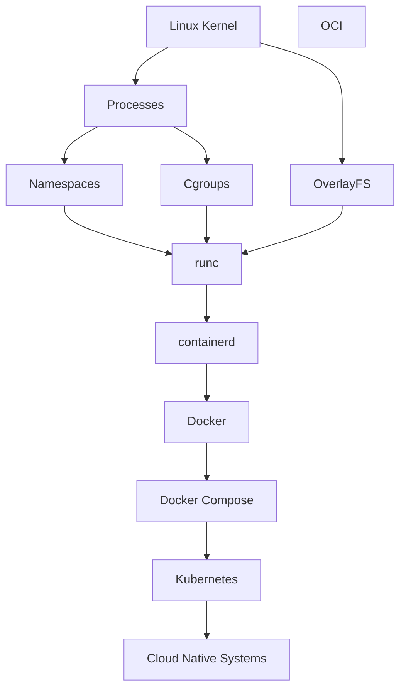

---

# 2. Evolution Of Infrastructure

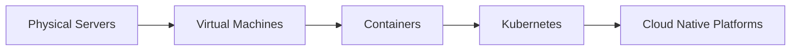

---

# 3. VM vs Container

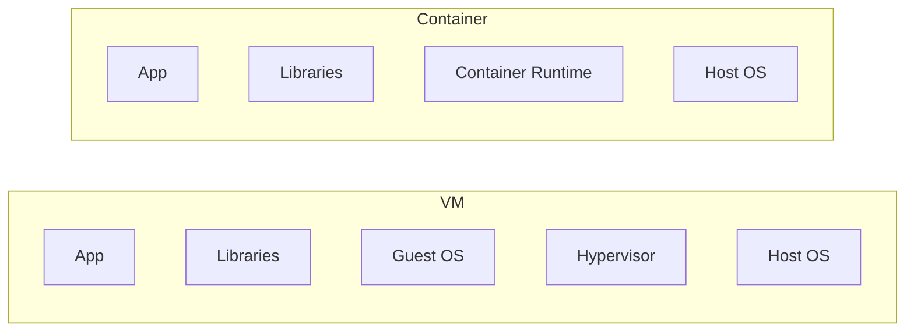

---

# 4. Containers Are Linux Processes

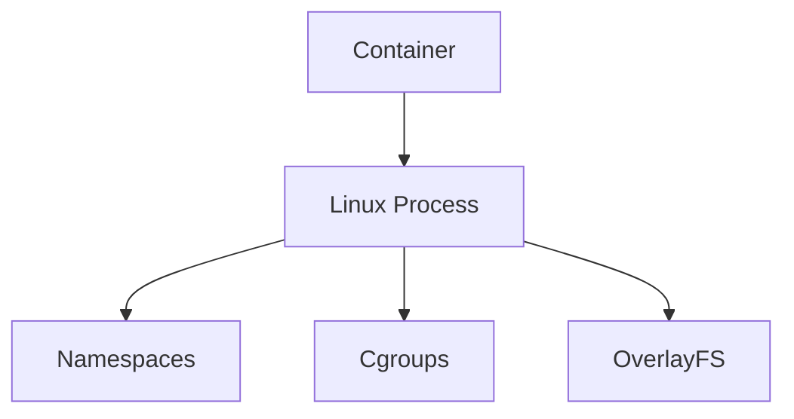

---

# 5. Docker Architecture

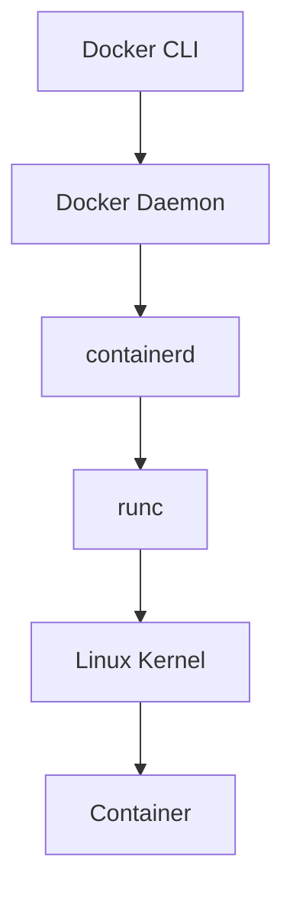

---

# 6. Complete docker run Flow

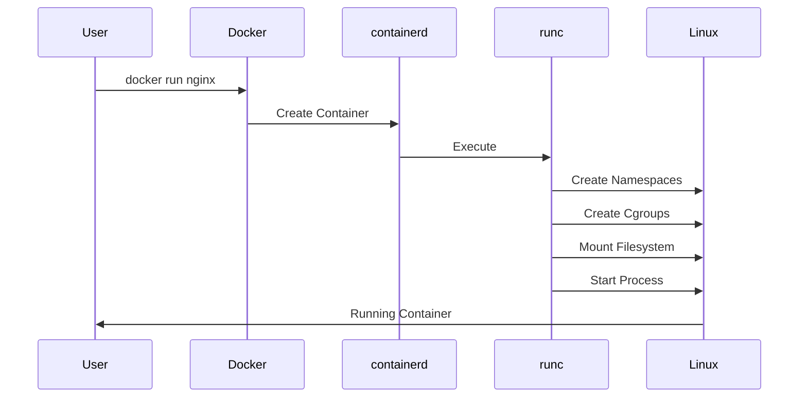

---

# 7. Container Lifecycle

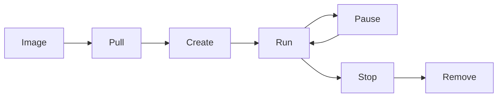

---

# 8. Namespace Isolation

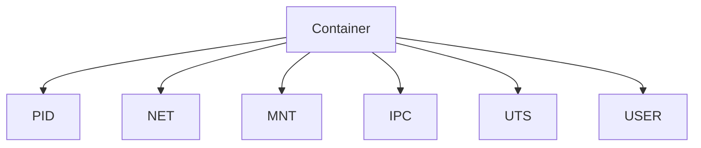

---

# 9. Cgroups Resource Isolation

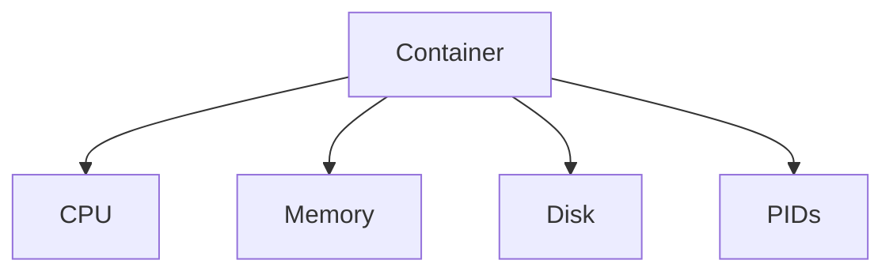

---

# 10. OverlayFS Architecture

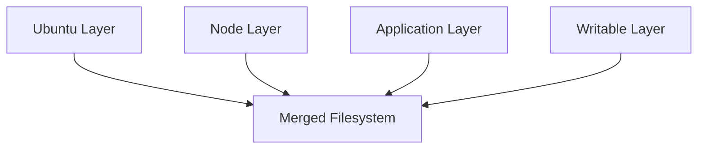

---

# 11. Docker Image Architecture

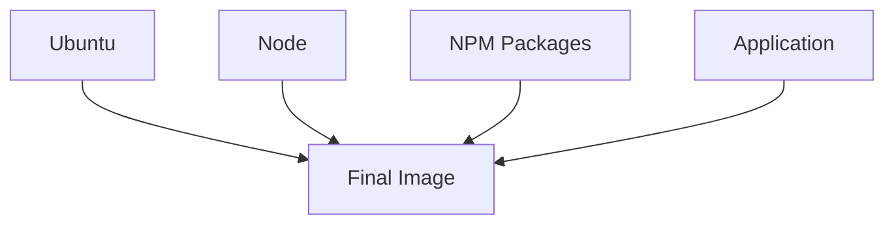

---

# 12. Layer Cache Flow


---

# 13. Bad Dockerfile vs Good Dockerfile

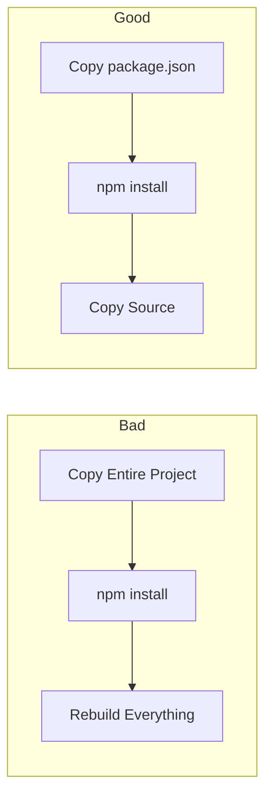

---

# 14. Volume Architecture

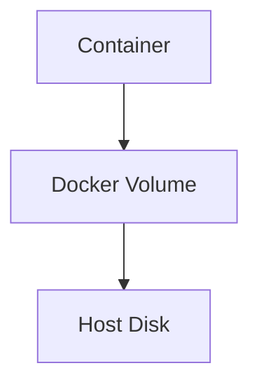

---

# 15. Bind Mount Architecture

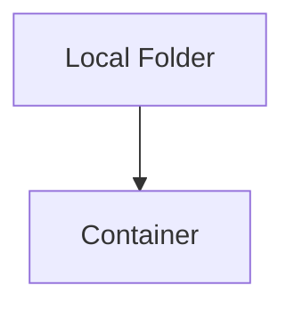

---

# 16. Docker Networking

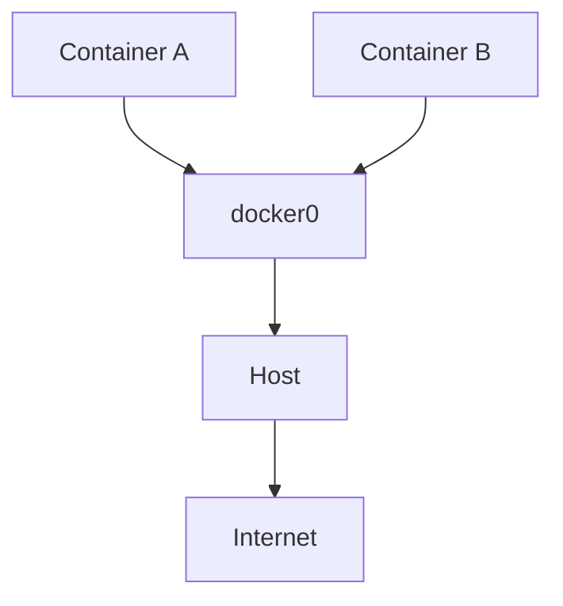

---

# 17. veth Pair


---

# 18. Docker Compose Architecture

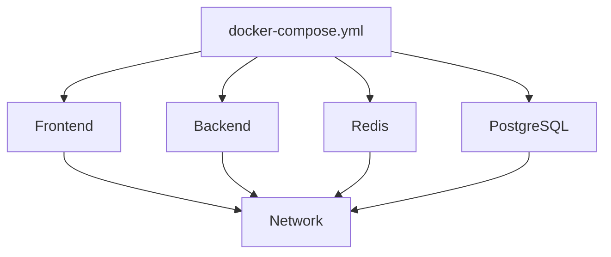

---

# 19. Container Runtime Stack

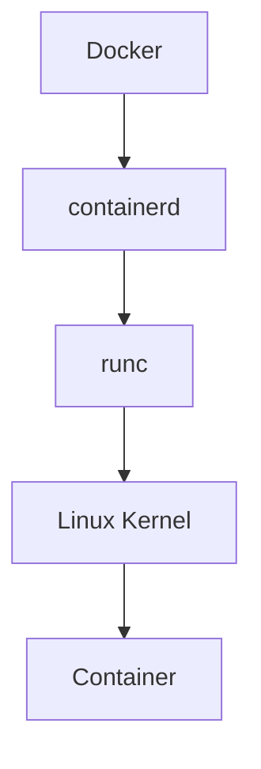

---

# 20. OCI Architecture

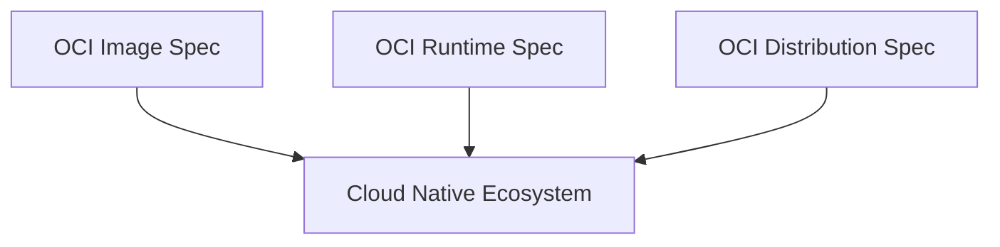

---

# 21. Kubernetes Runtime Architecture

```mermaid
flowchart TD

A[Kubernetes]

B[Kubelet]

C[CRI]

D[containerd]

E[runc]

F[Linux]

G[Container]

A --> B

B --> C

C --> D

D --> E

E --> F

F --> G
```

---

# 22. Security Layers

```mermaid
flowchart TD

A[Source Code]

B[Image]

C[Registry]

D[Container]

E[Runtime]

F[Linux]

A --> B

B --> C

C --> D

D --> E

E --> F
```

---

# 23. Software Supply Chain

```mermaid
flowchart TD

A[Developer]

B[Dependencies]

C[Image]

D[Registry]

E[Production]

A --> B

B --> C

C --> D

D --> E
```

---

# 24. Runtime Security Architecture

```mermaid
flowchart TD

A[Container]

B[eBPF]

C[Detection Engine]

D[Alerting]

E[Response]

A --> B

B --> C

C --> D

D --> E
```

---

# 25. Sidecar Pattern

```mermaid
flowchart TD

A[Application]

B[Sidecar]

A --> B
```

---

# 26. Reverse Proxy Architecture

```mermaid
flowchart TD

A[Users]

B[Nginx]

C[Service A]

D[Service B]

E[Service C]

A --> B

B --> C

B --> D

B --> E
```

---

# 27. Observability Architecture

```mermaid
flowchart TD

A[Containers]

B[Logs]

C[Metrics]

D[Traces]

E[Dashboards]

A --> B

A --> C

A --> D

B --> E

C --> E

D --> E
```

---

# 28. Blue-Green Deployment

```mermaid
flowchart TD

A[Users]

B[Load Balancer]

C[Blue]

D[Green]

A --> B

B --> C

B --> D
```

---

# 29. Canary Deployment

```mermaid
flowchart TD

A[Users]

B[5%]

C[20%]

D[50%]

E[100%]

A --> B

B --> C

C --> D

D --> E
```

---

# 30. Complete Production Architecture

```mermaid
flowchart TD

A[Users]

B[CDN]

C[Load Balancer]

D[Nginx]

E[Frontend]

F[Backend]

G[Redis]

H[PostgreSQL]

I[Prometheus]

J[Grafana]

K[ELK]

A --> B

B --> C

C --> D

D --> E

E --> F

F --> G

F --> H

F --> I

I --> J

F --> K
```

---

# 31. CI/CD Pipeline

```mermaid
flowchart TD

A[Git Push]

B[CI]

C[Test]

D[Build Image]

E[Scan]

F[Registry]

G[Deploy]

H[Observe]

A --> B

B --> C

C --> D

D --> E

E --> F

F --> G

G --> H
```

---

# 32. Cloud Native Stack

```mermaid
flowchart TD

A[Linux]

B[Containers]

C[Docker]

D[Kubernetes]

E[Service Mesh]

F[Observability]

G[Platform Engineering]

A --> B

B --> C

C --> D

D --> E

E --> F

F --> G
```

---

# 33. The Entire Learning Journey

```mermaid
flowchart TD

A[Linux Fundamentals]

B[Processes]

C[Namespaces]

D[Cgroups]

E[OverlayFS]

F[Docker]

G[containerd]

H[runc]

I[CRI]

J[Kubernetes]

K[Cloud Native]

L[SRE]

M[Platform Engineering]

N[Systems Architect]

A --> B

B --> C

B --> D

A --> E

C --> F

D --> F

E --> F

F --> G

G --> H

H --> I

I --> J

J --> K

K --> L

L --> M

M --> N
```

---

# Final Visual Mental Model

```text
Linux

↓

Processes

↓

Namespaces + Cgroups + OverlayFS

↓

Containers

↓

Docker

↓

OCI

↓

containerd

↓

runc

↓

CRI

↓

Kubernetes

↓

Cloud Native Systems

↓

Platform Engineering

↓

Systems Architecture
```

**If you can explain every arrow, you deeply understand containers.**
