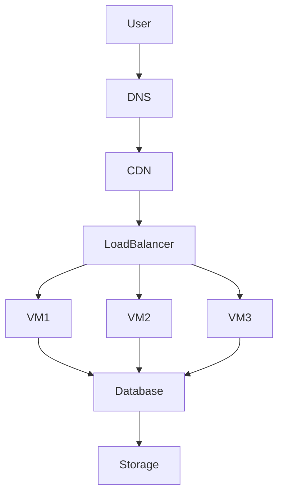
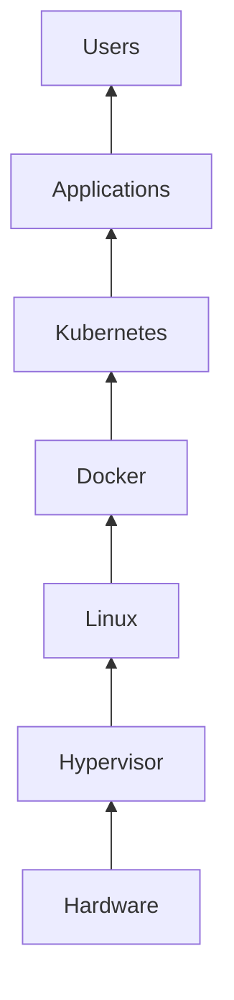

# Cloud Fundamentals

# Why This Exists

Most people learn cloud incorrectly.

They start by opening AWS, Azure, or GCP dashboards and immediately encounter hundreds of services.

```text
EC2
S3
IAM
Lambda
VPC
EKS
RDS
CloudFront
Route53
CloudWatch
...
```

Then they begin memorizing services.

Months later, they know service names but cannot answer simple questions:

- Why was cloud invented?
- Why didn't Linux solve everything?
- Why do companies move to cloud?
- Why do VPCs exist?
- Why is infrastructure becoming software?
- Why does Kubernetes fit naturally into cloud?
- Why do cloud bills become expensive?
- Why do distributed systems live in the cloud?

Cloud is often taught backwards.

This chapter fixes that.

We will learn cloud from first principles.

Cloud is not AWS.

Cloud is not Azure.

Cloud is not GCP.

Cloud is an engineering evolution.

---

# The Biggest Misconception

People think:

> Cloud = Someone else's computer

This is incomplete.

The better definition is:

> Cloud is programmable infrastructure delivered as a service.

Infrastructure became software.

That changed everything.

---

# The Problem Cloud Solves

Before cloud existed, companies built infrastructure themselves.

Imagine building a startup in 2005.

You needed to buy everything.

```text
Application idea

↓

Buy physical servers

↓

Buy storage systems

↓

Buy networking equipment

↓

Buy firewalls

↓

Rent data center space

↓

Configure Linux

↓

Install databases

↓

Deploy application
```

This process could take weeks or months.

Cloud solved this.

---

# Mental Model

Think of cloud as turning infrastructure into an API.

Instead of saying:

"I need servers."

You say:

"I need compute."

Instead of saying:

"I need hard drives."

You say:

"I need storage."

Instead of saying:

"I need network cables."

You say:

"I need networking."

Infrastructure became code.

---

# Evolution Of Computing

## Era 1: Single Computer

```text
User

↓

One Computer

↓

One Application
```

Problems:

- Limited resources
- Single point of failure
- No scalability

---

## Era 2: Multiple Servers

```text
Users

↓

Network

↓

Server 1

Server 2

Server 3
```

Problems:

- Expensive
- Difficult management
- Manual operations

---

## Era 3: Data Centers

```text
Company

↓

Own Building

↓

Thousands Of Servers
```

Problems:

- Huge cost
- Complex management
- Requires expert teams

---

## Era 4: Cloud Computing

```text
Millions Of Users

↓

Internet

↓

Cloud Provider

↓

Virtual Infrastructure

↓

Applications
```

Infrastructure became available instantly.

---

# Why Linux Became The Foundation Of Cloud

Cloud providers could have used anything.

Why Linux?

Because Linux naturally scales.

Linux principles fit cloud engineering.

Linux is:

- Modular
- Lightweight
- Scriptable
- Network-centric
- Secure
- Stable
- Automation friendly

Linux became the operating system of the internet.

Today almost every cloud workload runs Linux.

---

# The Core Cloud Idea

Cloud providers abstract complexity.

Instead of managing hardware:

```text
Hardware

↓

Operating System

↓

Application
```

You manage:

```text
Application

↓

Cloud APIs

↓

Provider Manages Everything Else
```

---

# The Cloud Stack

Every cloud system has layers.

```text
Applications

↑

Containers

↑

Linux

↑

Virtual Machines

↑

Virtual Networks

↑

Physical Servers

↑

Data Centers

↑

Power + Cooling
```

As we move upward:

Abstraction increases.

As abstraction increases:

Management effort decreases.

---

# The Four Pillars Of Cloud

Cloud engineering revolves around four pillars.

```text
Cloud

├── Compute
├── Networking
├── Storage
└── Identity
```

These four systems build everything.

---

# Pillar 1: Compute

Compute means processing power.

Examples:

- CPUs
- Memory
- Virtual machines
- Containers

Think:

```text
Application

↓

CPU

↓

RAM

↓

Execution
```

Examples:

- AWS EC2
- Azure Virtual Machines
- GCP Compute Engine

---

# Pillar 2: Networking

Networking connects systems.

Examples:

```text
Internet

↓

Virtual Networks

↓

Subnets

↓

Routers

↓

Load Balancers
```

Networking controls communication.

---

# Pillar 3: Storage

Storage preserves data.

Three major types:

```text
Block Storage

Object Storage

File Storage
```

We'll study these deeply later.

---

# Pillar 4: Identity

Identity controls access.

Questions it answers:

```text
Who are you?

↓

What can you access?

↓

What can you modify?
```

Identity is one of the most important cloud systems.

---

# First Principles Of Cloud

Everything in cloud revolves around five principles.

## Principle 1: Abstraction

Hide complexity.

```text
Hardware

↓

Virtual Machines

↓

Containers

↓

Applications
```

---

## Principle 2: Virtualization

One physical server becomes many virtual servers.

```text
Physical Server

↓

Hypervisor

↓

VM1

VM2

VM3
```

---

## Principle 3: Automation

Everything should be software.

Bad:

```text
Click buttons
```

Good:

```text
Terraform

↓

Infrastructure As Code
```

---

## Principle 4: Elasticity

Resources scale automatically.

```text
100 users

↓

2 servers

↓

10000 users

↓

20 servers
```

---

## Principle 5: Pay As You Go

You pay for usage.

Like electricity.

Not ownership.

---

# Cloud Characteristics

Cloud systems usually provide:

## On-demand

Resources available instantly.

---

## Self-service

Engineers provision systems themselves.

---

## Elasticity

Resources grow and shrink.

---

## Global availability

Deploy anywhere.

---

## Metered usage

Pay only for usage.

---

# Mental Model: Cloud Is Like A City

Imagine building a city.

You need:

```text
Roads → Networking

Buildings → Compute

Warehouses → Storage

Police → Security

Identity Cards → IAM

Traffic Signals → Load Balancers

Power Plants → Data Centers
```

Cloud providers build the city.

You build your business.

---

# Data Flow Example

Imagine opening Netflix.

```text
User

↓

DNS

↓

CDN

↓

Load Balancer

↓

Linux Servers

↓

Redis Cache

↓

Database

↓

Storage

↓

Response
```

Every step is cloud infrastructure.

---

# How Linux Fits Everywhere

Linux exists in almost every cloud layer.

```text
Linux

├── Web Servers
├── Database Servers
├── Containers
├── Kubernetes Nodes
├── Monitoring Systems
├── AI Infrastructure
├── CI/CD Systems
├── Storage Systems
└── Security Systems
```

Linux is everywhere.

---

# Cloud Architecture Visualization



---

# Where Docker Fits

Docker solved application packaging.

```text
Application

↓

Docker Image

↓

Docker Container

↓

Linux Kernel
```

Cloud solved infrastructure.

Docker solved packaging.

Together they became powerful.

---

# Where Kubernetes Fits

Docker created many containers.

Managing thousands became difficult.

Kubernetes solved orchestration.

```text
Cloud

↓

Virtual Machines

↓

Linux

↓

Docker

↓

Kubernetes
```

This stack powers modern applications.

---

# Cloud + Linux + Kubernetes Relationship



---

# Production Scenario: Startup Growth

Imagine a startup.

## Stage 1

```text
100 Users

↓

1 Linux Server
```

---

## Stage 2

```text
10000 Users

↓

Load Balancer

↓

3 Linux Servers
```

---

## Stage 3

```text
100000 Users

↓

Autoscaling

↓

10 Linux Servers
```

---

## Stage 4

```text
1000000 Users

↓

Containers

↓

Kubernetes

↓

Distributed Databases
```

Cloud allows growth without rebuilding infrastructure.

---

# Why Companies Love Cloud

Benefits:

### Faster deployment

Minutes instead of months.

### Lower upfront costs

No huge hardware purchases.

### Scalability

Grow instantly.

### Reliability

Multiple data centers.

### Global expansion

Deploy worldwide.

### Automation

Infrastructure becomes code.

---

# Performance Considerations

Cloud is not magic.

Every abstraction has costs.

Examples:

Virtualization overhead.

```text
Application

↓

Guest Linux

↓

Hypervisor

↓

Physical Hardware
```

More layers = more latency.

Always understand abstractions.

---

# Security Considerations

Cloud security is shared.

Cloud provider secures:

```text
Buildings

Power

Networking

Hardware
```

You secure:

```text
Linux

Applications

Passwords

Secrets

IAM

Data
```

This is called Shared Responsibility.

---

# Scalability Considerations

Always design horizontally.

Bad:

```text
1 huge server
```

Good:

```text
10 smaller servers
```

Modern systems prefer distribution.

---

# Observability Considerations

Cloud systems are distributed.

You need visibility.

Three pillars:

```text
Logs

Metrics

Traces
```

Without observability:

You are blind.

---

# Common Bottlenecks

Engineers often hit:

## CPU bottlenecks

High compute workloads.

## Memory bottlenecks

Memory leaks.

## Network bottlenecks

Bandwidth saturation.

## Database bottlenecks

Slow queries.

## Storage bottlenecks

Disk latency.

---

# Troubleshooting Mindset

Never ask:

"What service is broken?"

Ask:

"What layer is broken?"

Use layered thinking.

```text
User

↓

DNS

↓

Network

↓

Load Balancer

↓

Linux

↓

Application

↓

Database

↓

Storage
```

Start at the top.

Move downward.

---

# Common Mistakes

## Mistake 1

Memorizing cloud services.

Wrong.

Understand principles.

---

## Mistake 2

Ignoring Linux.

Linux is the foundation.

---

## Mistake 3

Ignoring networking.

Cloud is mostly networking.

---

## Mistake 4

Ignoring costs.

Every resource costs money.

---

## Mistake 5

Ignoring observability.

Monitoring is mandatory.

---

# Engineering Mindset

Junior engineers ask:

> Which AWS service should I use?

Senior engineers ask:

> Which engineering problem am I solving?

Architects ask:

> Which abstraction layer should own this responsibility?

Founders ask:

> How can infrastructure enable business growth?

---

# Interview Questions

## Beginner

1. What is cloud computing?

2. Why was cloud invented?

3. What problems does cloud solve?

4. Why does Linux dominate cloud?

5. What are the four pillars of cloud?

---

## Intermediate

6. What is elasticity?

7. Explain virtualization.

8. What is shared responsibility?

9. Why is automation important?

10. Why is infrastructure becoming software?

---

## Advanced

11. Why are distributed systems natural in cloud?

12. Why does Kubernetes fit cloud architecture?

13. Why does abstraction increase complexity?

14. Explain horizontal vs vertical scaling.

15. Explain cloud from first principles.

---

# Cheat Sheet

```text
Cloud = Programmable Infrastructure

4 Pillars

Compute
Networking
Storage
Identity

5 Principles

Abstraction
Virtualization
Automation
Elasticity
Pay As You Go

Modern Stack

Hardware
↓
Hypervisor
↓
Linux
↓
Docker
↓
Kubernetes
↓
Applications

Observability

Logs
Metrics
Traces

Mindset

Do not memorize services.

Understand systems.
```

# Final Thought

Cloud is not a technology.

Cloud is an engineering philosophy.

It transformed infrastructure from physical machines into software systems.

Once you understand Linux deeply, cloud stops being overwhelming.

It becomes predictable.
