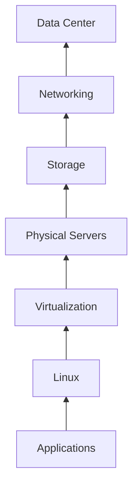
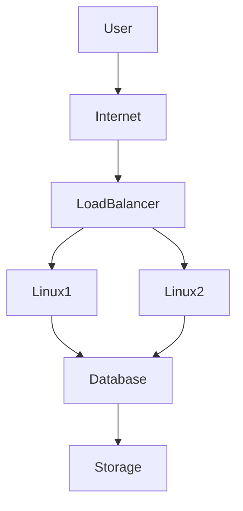
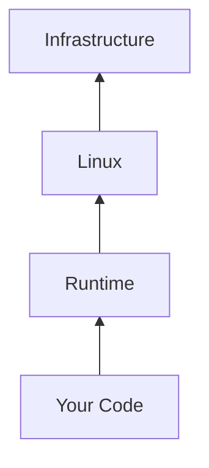

# IaaS vs PaaS vs SaaS

# Why This Exists

One of the biggest mistakes beginners make is memorizing these definitions.

```text
IaaS = Infrastructure as a Service

PaaS = Platform as a Service

SaaS = Software as a Service
```

Then they move on.

That is not understanding.

These are not definitions to memorize.

These are levels of abstraction.

This chapter will teach you to think like an engineer.

The question is not:

> What is IaaS?

The question is:

> Who is responsible for what?

Once you understand ownership and responsibility, everything becomes intuitive.

---

# The Problem This Solves

Every application needs infrastructure.

Someone must manage:

```text
Networking

Servers

Storage

Operating Systems

Applications

Security

Databases

Monitoring
```

The question cloud answers is:

> How much responsibility do you want?

Different companies have different answers.

That's why these models exist.

---

# Mental Model: Building A Restaurant

Imagine opening a restaurant.

There are three options.

---

# Option 1: Build Everything Yourself (IaaS)

You rent land.

You build everything.

```text
Land

↓

Building

↓

Kitchen

↓

Furniture

↓

Electricity

↓

Plumbing

↓

Cooking
```

You have maximum control.

But maximum responsibility.

---

# Option 2: Rent A Fully Equipped Kitchen (PaaS)

Everything is ready.

You only cook food.

```text
Kitchen

↓

Equipment

↓

Utilities

↓

Cooking
```

Less control.

Less responsibility.

---

# Option 3: Order Food (SaaS)

You simply eat.

```text
Food Ready

↓

Consume
```

No infrastructure management.

---

# First Principles

Every software system has layers.

```text
Applications

↑

Runtime

↑

Operating System

↑

Virtualization

↑

Servers

↑

Storage

↑

Networking

↑

Data Centers
```

Cloud service models decide:

> Which layers are managed by whom?

---

# The Responsibility Pyramid

```text
You Manage More

↑

IaaS

↑

PaaS

↑

SaaS

↓

You Manage Less
```

As abstraction increases:

Control decreases.

Operational burden decreases.

---

# The Complete Technology Stack

```text
Applications

Runtime

Operating System

Virtualization

Servers

Storage

Networking

Data Centers
```

We'll use this stack throughout the chapter.

---

# IaaS (Infrastructure As A Service)

# Definition

Infrastructure delivered as a service.

The provider gives infrastructure.

You build everything else.

---

# Mental Model

Cloud provider says:

> Here is a Linux server.

Do whatever you want.

---

# What Provider Manages

```text
Data Centers

Networking

Storage

Servers

Virtualization
```

---

# What You Manage

```text
Linux

Packages

Applications

Security

Databases

Monitoring
```

---

# Visualization



Provider manages:

```text
Virtualization ↓
Servers ↓
Storage ↓
Networking ↓
Data Centers
```

You manage:

```text
Linux
Applications
```

---

# IaaS Examples

Examples:

```text
AWS EC2

Azure Virtual Machines

GCP Compute Engine

DigitalOcean Droplets
```

---

# Linux In IaaS

Linux engineers spend a lot of time here.

Responsibilities:

```text
Install packages

Manage users

Configure SSH

Configure firewalls

Manage applications

Patch systems

Monitor systems
```

Linux knowledge is critical.

---

# Typical IaaS Architecture



This is the most common architecture beginners build.

---

# Advantages Of IaaS

Advantages:

```text
High flexibility

High control

Custom environments

Supports legacy systems
```

---

# Disadvantages Of IaaS

Problems:

```text
High operational burden

Security management

Patching responsibility

Complexity
```

---

# PaaS (Platform As A Service)

# Definition

The provider manages the infrastructure and platform.

You focus on code.

---

# Mental Model

Provider says:

> Deploy your application. We'll handle everything else.

---

# Provider Manages

```text
Data Centers

Networking

Servers

Storage

Linux

Runtime
```

---

# You Manage

```text
Application Code

Business Logic

Data
```

---

# Visualization



---

# PaaS Examples

Examples:

```text
Heroku

Google App Engine

Render

Railway

Vercel

Azure App Service
```

---

# Typical Developer Workflow

Instead of:

```text
Create Linux VM

↓

SSH

↓

Install Node.js

↓

Install Nginx

↓

Deploy application
```

You simply:

```text
git push

↓

Deploy
```

The platform does the rest.

---

# Advantages Of PaaS

```text
Faster development

Less operations

Rapid deployment

Higher productivity
```

---

# Disadvantages Of PaaS

```text
Less control

Vendor lock-in

Limited customization
```

---

# SaaS (Software As A Service)

# Definition

Complete software delivered to users.

You simply use it.

No infrastructure management.

---

# Mental Model

Provider says:

> Login and use it.

---

# Examples

```text
Gmail

Notion

GitHub

Slack

Zoom

Canva

ChatGPT
```

---

# User Responsibilities

Usually:

```text
Users

Permissions

Data
```

Nothing else.

---

# Visualization

```text
Open Browser

↓

Login

↓

Use Software
```

Simple.

---

# The Evolution

```text
On-Premise

↓

IaaS

↓

PaaS

↓

SaaS
```

More abstraction.

Less infrastructure responsibility.

---

# Side By Side Comparison

| Layer | On-Prem | IaaS | PaaS | SaaS |
|------|---------|------|------|------|
| Applications | You | You | You | Provider |
| Runtime | You | You | Provider | Provider |
| Linux | You | You | Provider | Provider |
| Virtualization | You | Provider | Provider | Provider |
| Servers | You | Provider | Provider | Provider |
| Storage | You | Provider | Provider | Provider |
| Networking | You | Provider | Provider | Provider |
| Data Centers | You | Provider | Provider | Provider |

---

# ASCII Visualization

```text
On Premise

██████████ YOU

----------------------

IaaS

████ YOU

██████ Provider

----------------------

PaaS

██ YOU

████████ Provider

----------------------

SaaS

█ YOU

█████████ Provider
```

---

# Real Startup Journey

Most startups evolve.

---

## Stage 1

Single developer.

Uses SaaS.

```text
GitHub

Notion

Slack

ChatGPT
```

---

## Stage 2

Deploy application.

Uses PaaS.

```text
Frontend → Vercel

Backend → Render

Database → Neon
```

---

## Stage 3

Growing traffic.

Moves to IaaS.

```text
Linux VMs

Load Balancers

Redis

PostgreSQL
```

---

## Stage 4

Large company.

Platform engineering.

```text
Cloud

↓

Linux

↓

Docker

↓

Kubernetes

↓

Platform Team
```

---

# Where Docker Fits

Docker is not a cloud service model.

Docker is an application packaging technology.

```text
Cloud

↓

Linux

↓

Docker

↓

Applications
```

---

# Where Kubernetes Fits

Kubernetes is orchestration.

It often sits on top of IaaS.

```text
Cloud VMs

↓

Linux

↓

Docker

↓

Kubernetes
```

---

# Linux Everywhere

Even if developers don't see Linux.

Linux still exists underneath.

```text
SaaS

↓

PaaS

↓

IaaS

↓

Linux
```

Linux powers everything.

---

# Data Flow Example

Imagine opening Spotify.

```text
User

↓

Spotify SaaS

↓

Spotify Platform

↓

Linux Infrastructure

↓

Databases

↓

Storage
```

Users only see SaaS.

Linux engineers build everything underneath.

---

# Production Example: Your MERN Application

## IaaS Approach

You build:

```text
Linux VM

↓

Nginx

↓

Node.js

↓

MongoDB

↓

Redis
```

---

## PaaS Approach

You deploy:

```text
Code

↓

Platform deploys infrastructure
```

---

## SaaS Usage

You consume:

```text
GitHub

Slack

Notion

Stripe
```

---

# Performance Considerations

Higher abstraction may introduce limitations.

Example:

PaaS may restrict:

```text
CPU tuning

Kernel tuning

Filesystem access
```

IaaS gives more freedom.

---

# Security Considerations

## IaaS

You secure:

```text
Linux

Applications

Users

Secrets
```

---

## PaaS

Mostly:

```text
Applications

Secrets

Permissions
```

---

## SaaS

Mostly:

```text
Accounts

Passwords

Permissions
```

---

# Scalability Considerations

## IaaS

Manual or automated scaling.

---

## PaaS

Mostly automatic.

---

## SaaS

Hidden from users.

---

# Observability Considerations

All systems require:

```text
Logs

Metrics

Traces
```

The difference is visibility.

IaaS gives maximum visibility.

SaaS gives minimum visibility.

---

# Common Mistakes

## Mistake 1

Thinking one is better.

Wrong.

They solve different problems.

---

## Mistake 2

Using IaaS too early.

Startups overcomplicate infrastructure.

---

## Mistake 3

Using PaaS forever.

Large systems eventually need more control.

---

## Mistake 4

Ignoring Linux.

Linux powers everything.

---

# Engineering Mindset

Junior engineers ask:

> Which one is best?

Senior engineers ask:

> Which responsibility model fits the business?

Architects ask:

> Which abstraction level minimizes complexity?

Founders ask:

> Which option accelerates product delivery?

---

# Interview Questions

## Beginner

1. What is IaaS?

2. What is PaaS?

3. What is SaaS?

4. What are their differences?

5. Why do these models exist?

---

## Intermediate

6. Explain responsibility distribution.

7. Why does abstraction reduce operational burden?

8. Why do startups love PaaS?

9. Why do enterprises use IaaS?

10. Explain vendor lock-in.

---

## Advanced

11. Design infrastructure migration from PaaS to IaaS.

12. Explain Kubernetes relationship with IaaS.

13. Explain cloud abstractions from first principles.

14. Why does Linux remain important in PaaS?

15. Explain engineering tradeoffs.

---

# Cheat Sheet

```text
IaaS

Infrastructure As A Service

Examples

EC2
Azure VM
Compute Engine

You Manage

Linux
Applications

---------------------

PaaS

Platform As A Service

Examples

Render
Railway
Heroku
Vercel

You Manage

Code

---------------------

SaaS

Software As A Service

Examples

Gmail
GitHub
Slack

You Manage

Usage

---------------------

Abstraction

OnPrem

↓

IaaS

↓

PaaS

↓

SaaS

More Abstraction

↓

Less Control

↓

Less Operations
```

# Final Thought

IaaS, PaaS, and SaaS are not technologies.

They are responsibility models.

Cloud engineering is not about learning services.

It is about deciding:

> Which responsibilities should humans keep, and which responsibilities should software automate?

That question defines modern engineering.
