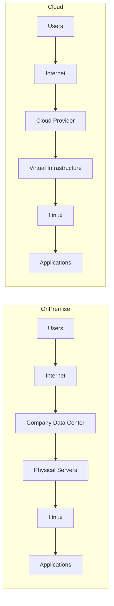
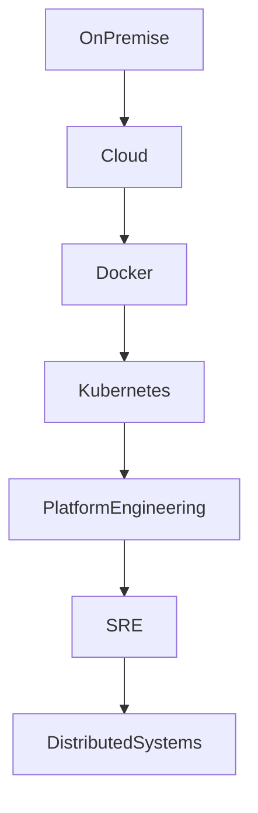

# On-Premise vs Cloud

# Why This Exists

One of the biggest mistakes engineers make is thinking:

> Cloud replaced on-premise.

This is wrong.

Cloud did not replace on-premise.

Cloud evolved from on-premise.

To understand cloud deeply, you must first understand the world before cloud existed.

Every cloud service is essentially solving a pain that companies faced while running their own infrastructure.

If you understand those pains, cloud architecture becomes intuitive instead of something you memorize.

This chapter teaches the engineering evolution.

---

# The Problem This Solves

Many engineers know:

- AWS
- Azure
- GCP

But they don't know:

- Why companies moved to cloud
- Why some companies still use on-premise
- Why hybrid cloud exists
- Why cloud costs sometimes become expensive
- Why certain industries avoid public cloud

Without understanding these tradeoffs, you cannot make good architecture decisions.

Senior engineers don't ask:

> Which cloud service should I use?

They ask:

> Which deployment model best solves my business problem?

---

# Mental Model

Imagine opening a restaurant.

You have two options.

## Option 1: Build Your Own Kitchen

```text
Buy land

↓

Build kitchen

↓

Buy equipment

↓

Install electricity

↓

Install plumbing

↓

Hire maintenance staff

↓

Hire security

↓

Cook food
```

This is On-Premise.

---

## Option 2: Rent A Fully Equipped Kitchen

```text
Rent kitchen

↓

Bring ingredients

↓

Cook food
```

This is Cloud.

You focus on your business instead of infrastructure.

---

# First Principles

At its core, every application needs five things.

```text
Application Needs

├── Compute
├── Storage
├── Networking
├── Security
└── Operations
```

Someone must manage these systems.

The only question is:

> Who manages them?

That defines the deployment model.

---

# What Is On-Premise?

On-premise means:

> You own and manage the entire infrastructure yourself.

You buy:

- Servers
- Storage
- Switches
- Routers
- Firewalls
- Backup systems

And install everything inside your own data center.

---

# What Is Cloud?

Cloud means:

> A provider manages the infrastructure and delivers it as a service.

Instead of buying infrastructure:

You rent resources.

You pay for usage.

---

# The Big Difference

## On-Premise

```text
Company

↓

Data Center

↓

Physical Hardware

↓

Linux

↓

Applications
```

You own everything.

---

## Cloud

```text
Company

↓

Cloud APIs

↓

Virtual Infrastructure

↓

Applications
```

Provider owns the hardware.

You consume services.

---

# Historical Evolution

## Era 1: Single Server

```text
Application

↓

Linux Server
```

---

## Era 2: Server Room

```text
Company Building

↓

10 Servers

↓

Networking Equipment
```

---

## Era 3: Data Centers

```text
Large Building

↓

Thousands Of Servers
```

---

## Era 4: Cloud

```text
Cloud Provider

↓

Virtual Resources

↓

Applications
```

---

# Infrastructure Ownership Comparison

## On-Premise

You own:

```text
Buildings

Power

Cooling

Servers

Storage

Networking

Firewalls

Linux

Applications

Monitoring

Security

Backups
```

---

## Cloud

Cloud provider owns:

```text
Buildings

Power

Cooling

Physical Hardware

Core Networking
```

You own:

```text
Linux

Applications

Data

Users

Permissions

Configurations
```

---

# Side By Side Architecture



---

# Infrastructure Provisioning Comparison

## On-Premise

Deploying infrastructure:

```text
Need server

↓

Budget approval

↓

Purchase hardware

↓

Wait delivery

↓

Rack installation

↓

Power setup

↓

Network setup

↓

Install Linux

↓

Install application
```

Time:

Weeks or months.

---

## Cloud

```text
Need server

↓

Open dashboard

↓

Create instance

↓

Done
```

Time:

Minutes.

---

# Cost Model Comparison

## On-Premise

CapEx (Capital Expenditure)

You pay upfront.

Example:

```text
100 Servers

↓

$500,000 upfront

↓

5 years usage
```

---

## Cloud

OpEx (Operational Expenditure)

Pay continuously.

Example:

```text
100 Servers

↓

Hourly billing

↓

Monthly billing

↓

Pay for usage
```

---

# Resource Utilization Problem

Imagine traffic patterns.

Daytime:

```text
10000 Users
```

Nighttime:

```text
500 Users
```

---

# On-Premise Problem

You must buy infrastructure for peak traffic.

```text
Peak Traffic

↓

100 Servers Required
```

Even at night:

```text
95 Servers Idle
```

You still pay.

---

# Cloud Solution

Elasticity.

```text
Morning

2 Servers

↓

Afternoon

20 Servers

↓

Night

2 Servers
```

Resources adjust automatically.

---

# Linux Perspective

## On-Premise Linux Engineer

Responsibilities:

```text
Install Linux

Manage Linux

Patch Linux

Manage Hardware

Configure Networking

Configure Backups

Configure Monitoring

Configure Security
```

---

## Cloud Linux Engineer

Responsibilities:

```text
Provision Infrastructure

Manage Linux

Automate Linux

Manage Security

Manage Scaling

Manage Costs

Manage Observability
```

Hardware management disappears.

Automation increases.

---

# Why Companies Still Use On-Premise

Cloud isn't always the answer.

Some companies choose on-premise.

Reasons:

## Regulatory Requirements

Examples:

Banks

Defense

Government

Healthcare

Some data cannot leave facilities.

---

## Predictable Workloads

Example:

```text
Constant traffic

24x7

365 days
```

Owning hardware may become cheaper.

---

## Ultra-Low Latency

Example:

High-frequency trading.

Milliseconds matter.

Cloud network hops may be too slow.

---

## Legacy Systems

Some applications are decades old.

Migrating them is expensive.

---

# Why Companies Love Cloud

## Faster Deployment

Minutes instead of months.

---

## Global Expansion

Deploy worldwide.

---

## Elasticity

Scale instantly.

---

## Reduced Operations

Less hardware management.

---

## Built-in Services

Databases

Monitoring

AI

Networking

Storage

Security

Everything is available.

---

# Hybrid Cloud

Most companies use both.

Architecture:

```text
Company Data Center

↓

Private Systems

↓

Secure Connection

↓

Public Cloud

↓

Internet
```

This is called Hybrid Cloud.

---

# Multi-Cloud

Some companies use multiple clouds.

Example:

```text
AWS

+

Azure

+

GCP
```

Reasons:

- Avoid vendor lock-in
- Redundancy
- Geographic coverage
- Specialized services

---

# Linux In Both Worlds

Linux is everywhere.

```text
On-Premise

↓

Linux

↓

Cloud

↓

Linux

↓

Containers

↓

Linux

↓

Kubernetes

↓

Linux
```

Cloud changed infrastructure.

Linux remained constant.

---

# Operational Differences

## On-Premise Mindset

```text
Protect hardware.

Maximize hardware lifespan.

Avoid changes.
```

---

## Cloud Mindset

```text
Infrastructure is temporary.

Automate everything.

Replace instead of repair.
```

---

# Pets vs Cattle Mental Model

Classic engineering analogy.

## On-Premise

Servers are pets.

```text
Server01

Server02

Server03
```

You care for them.

You repair them.

You know their names.

---

## Cloud

Servers are cattle.

```text
Instance 1

Instance 2

Instance 3

Destroy

Recreate
```

Disposable infrastructure.

---

# Data Flow Comparison

## On-Premise

```text
User

↓

Internet

↓

Firewall

↓

Router

↓

Physical Load Balancer

↓

Linux Servers

↓

Database
```

---

## Cloud

```text
User

↓

Internet

↓

Cloud Load Balancer

↓

Linux Instances

↓

Managed Database
```

---

# Performance Considerations

## On-Premise Advantages

Direct hardware access.

Less abstraction.

Lower latency.

---

## Cloud Challenges

Additional layers.

```text
Application

↓

Linux

↓

Virtualization

↓

Physical Hardware
```

More layers may introduce latency.

---

# Security Considerations

## On-Premise

You secure everything.

```text
Physical Security

↓

Network Security

↓

Linux Security

↓

Application Security
```

---

## Cloud

Shared responsibility.

Provider secures:

```text
Buildings

Power

Hardware
```

You secure:

```text
Linux

Applications

Users

Data
```

---

# Scalability Considerations

## On-Premise

Scaling:

```text
Buy Hardware

↓

Install

↓

Configure
```

Slow.

---

## Cloud

Scaling:

```text
API Call

↓

New Resources
```

Fast.

---

# Observability Considerations

Both require:

```text
Logs

Metrics

Traces

Alerts
```

But cloud systems are larger.

Observability becomes mandatory.

---

# Modern Technology Relationship



---

# Production Scenario

Imagine your startup reaches 50 million users.

On-premise becomes difficult.

You now need:

```text
Global Users

↓

Multiple Regions

↓

Load Balancers

↓

Autoscaling Linux Servers

↓

Distributed Databases

↓

CDNs

↓

Observability Systems
```

Cloud solves these problems.

---

# Common Mistakes

## Mistake 1

Thinking cloud is always cheaper.

Wrong.

Poor architecture creates huge bills.

---

## Mistake 2

Thinking on-premise is obsolete.

Wrong.

Many companies still use it.

---

## Mistake 3

Ignoring Linux.

Linux is the foundation everywhere.

---

## Mistake 4

Ignoring costs.

Cloud waste becomes expensive.

---

## Mistake 5

Thinking cloud removes operations.

It changes operations.

---

# Engineering Mindset

Beginners ask:

> Which cloud provider is best?

Engineers ask:

> Which deployment model fits the workload?

Architects ask:

> Which tradeoffs are acceptable?

Founders ask:

> Which infrastructure supports business growth?

---

# Interview Questions

## Beginner

1. What is on-premise?

2. What is cloud?

3. Why was cloud invented?

4. What is elasticity?

5. What is shared responsibility?

---

## Intermediate

6. Explain CapEx vs OpEx.

7. Explain hybrid cloud.

8. Explain multi-cloud.

9. Why do companies still use on-premise?

10. Explain pets vs cattle.

---

## Advanced

11. When should a company avoid cloud?

12. Explain cloud economics.

13. Explain vendor lock-in.

14. Explain infrastructure abstraction.

15. Design migration from on-premise to cloud.

---

# Cheat Sheet

```text
On-Premise

You own infrastructure

Pros

Control
Low latency
Compliance

Cons

Expensive
Slow scaling
Operational burden

-----------------------

Cloud

Rent infrastructure

Pros

Fast
Elastic
Global
Automated

Cons

Vendor lock-in
Recurring costs
Complexity

-----------------------

Mental Models

On-Premise = Own House

Cloud = Rent Utilities

On-Premise = Pets

Cloud = Cattle

-----------------------

Cloud Advantages

Elasticity

Automation

Global Reach

Pay As You Go
```

# Final Thought

The cloud did not eliminate infrastructure.

It changed who manages it.

Infrastructure still exists.

Linux still exists.

Networking still exists.

Storage still exists.

Security still exists.

The only difference is:

Infrastructure became software.

The engineers who understand that become great cloud engineers.
