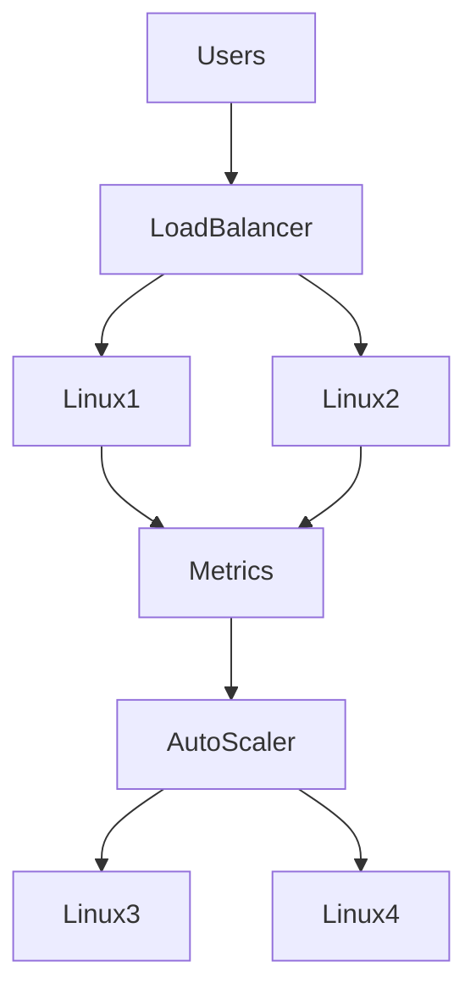
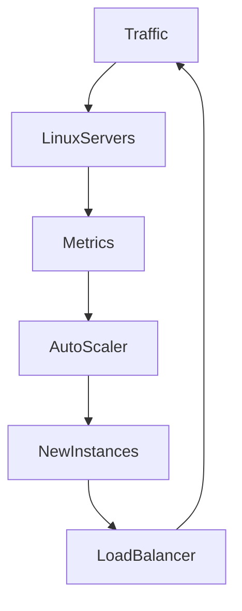
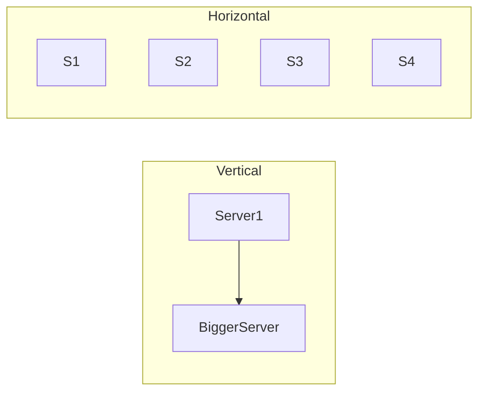

# Autoscaling

# Why This Exists

One of the biggest shifts in modern infrastructure was this:

We stopped building fixed systems.

We started building systems that adapt themselves.

Before autoscaling:

```text
Traffic Increases

↓

Servers Crash

↓

Users Leave

↓

Business Suffers
```

After autoscaling:

```text
Traffic Increases

↓

Infrastructure Expands

↓

Traffic Decreases

↓

Infrastructure Shrinks
```

Infrastructure became dynamic.

Autoscaling is one of the technologies that made cloud successful.

---

# The Problem It Solves

Imagine your application.

At 2 AM:

```text
200 Users
```

At 8 PM:

```text
50000 Users
```

Should you always run infrastructure for 50000 users?

No.

That wastes money.

Should you only run infrastructure for 200 users?

No.

Your system crashes.

Autoscaling solves this.

---

# Mental Model

Think of a restaurant.

---

## Without Autoscaling

```text
3 Employees

↓

Morning

↓

3 Employees

↓

Night Rush

↓

Still 3 Employees
```

Chaos.

---

## With Autoscaling

```text
Morning

↓

3 Employees

↓

Lunch Rush

↓

20 Employees

↓

Night

↓

3 Employees
```

Resources adapt to demand.

This is autoscaling.

---

# First Principles

Applications consume resources.

```text
CPU

Memory

Disk

Network
```

When demand grows:

Resource consumption grows.

Infrastructure must respond automatically.

---

# The Core Idea

Autoscaling is:

> Automatically increasing or decreasing infrastructure based on demand.

It answers:

> How many servers do we need right now?

---

# Cloud Evolution

## Traditional Infrastructure

```text
Traffic

↓

One Server

↓

Crash
```

---

## Manual Scaling

```text
Traffic

↓

Engineer Wakes Up

↓

Add Server
```

Slow.

---

## Autoscaling

```text
Traffic

↓

Monitoring

↓

Decision Engine

↓

New Server
```

Automatic.

---

# Big Picture Architecture



---

# Autoscaling Components

Every autoscaling system contains:

```text
Monitoring

Metrics

Rules

Decision Engine

Infrastructure Provisioner

Load Balancer
```

All six are required.

---

# The Autoscaling Loop

```text
Observe

↓

Analyze

↓

Decide

↓

Act

↓

Observe Again
```

This is a feedback loop.

---

# The OODA Loop

Military concept adopted by engineering.

```text
Observe

Orient

Decide

Act
```

Modern infrastructure uses this continuously.

---

# Data Flow



Continuous feedback.

---

# Metrics Used For Scaling

Autoscaling requires signals.

Common metrics:

```text
CPU

Memory

Network

Requests Per Second

Latency

Queue Length
```

---

# CPU Based Scaling

Example:

```text
CPU > 70%

↓

Add Server
```

---

# Memory Based Scaling

Example:

```text
Memory > 80%

↓

Add Server
```

---

# Request Based Scaling

Example:

```text
10000 Requests/sec

↓

Add Servers
```

---

# Queue Based Scaling

Example:

```text
10000 Pending Jobs

↓

Add Workers
```

Very common.

---

# Autoscaling Decision Visualization

```text
CPU = 25%

↓

Do Nothing

---------------

CPU = 80%

↓

Add Server

---------------

CPU = 90%

↓

Add More Servers
```

---

# Scale Up vs Scale Out

Two approaches exist.

---

# Vertical Scaling

Bigger machine.

```text
4 CPU

↓

8 CPU

↓

16 CPU
```

Also called:

```text
Scale Up
```

---

# Horizontal Scaling

More machines.

```text
1 Server

↓

2 Servers

↓

10 Servers
```

Also called:

```text
Scale Out
```

Modern cloud prefers this.

---

# Visualization



---

# Why Horizontal Scaling Wins

Benefits:

```text
Fault Tolerance

High Availability

Elasticity

Lower Risk
```

One huge machine is dangerous.

---

# Linux Perspective

Linux machines become disposable.

Old mindset:

```text
My Server
```

Modern mindset:

```text
My Fleet Of Servers
```

Huge difference.

---

# Immutable Infrastructure

Bad:

```text
SSH

↓

Fix Server

↓

Save Server
```

Good:

```text
Destroy Server

↓

Create New One
```

Autoscaling depends on this mindset.

---

# Cloud-init Becomes Critical

New servers must configure themselves.

```text
Create Instance

↓

Linux Boots

↓

Cloud-init Runs

↓

Application Starts

↓

Join Cluster
```

Everything is automatic.

---

# Load Balancers Are Mandatory

Without load balancers:

Autoscaling doesn't work.

Architecture:

```text
Users

↓

Load Balancer

↓

Linux1

Linux2

Linux3
```

Traffic is distributed automatically.

---

# Stateless Systems

Autoscaling works best when applications are stateless.

Good:

```text
Any Server

↓

Can Handle Any Request
```

Bad:

```text
User Must Return To Same Server
```

Avoid stateful architectures.

---

# Session Problem

Bad architecture:

```text
User Login

↓

Server1 Stores Session
```

Server1 dies.

User logs out.

---

# Better Architecture

```text
User Login

↓

Redis Stores Session

↓

Any Server Can Serve User
```

State moves outside servers.

---

# Autoscaling Timeline

```text
Traffic Spike

↓

Metrics Increase

↓

Autoscaler Detects

↓

New Instance Created

↓

Linux Boots

↓

Application Starts

↓

Load Balancer Updates

↓

Traffic Stabilizes
```

---

# Cold Start Problem

Servers need time to start.

```text
Create VM

↓

Boot Linux

↓

Run Cloud-init

↓

Start Application
```

This may take:

```text
30 seconds

to

3 minutes
```

Cold starts matter.

---

# Predictive Scaling

Reactive scaling waits for traffic.

Predictive scaling forecasts traffic.

Example:

```text
9 AM

Known Traffic Spike

↓

Pre-create Infrastructure
```

Smarter systems use prediction.

---

# Autoscaling Strategies

## Reactive

```text
Problem Happens

↓

Scale
```

---

## Predictive

```text
Forecast

↓

Scale Before Problem
```

---

## Scheduled

```text
Known Event

↓

Pre-scale
```

---

# Kubernetes Autoscaling

Three major types.

---

# HPA

Horizontal Pod Autoscaler.

Scales pods.

```text
Traffic

↓

Pods Increase
```

---

# VPA

Vertical Pod Autoscaler.

Bigger containers.

---

# Cluster Autoscaler

Scales Linux nodes.

```text
Need Nodes

↓

Create Nodes
```

---

# Full Kubernetes Flow

```text
Traffic

↓

Pods Increase

↓

Node Capacity Full

↓

Create Linux Node

↓

Pods Scheduled
```

---

# Production Example

Imagine an e-commerce sale.

Normal:

```text
1000 Users

↓

2 Servers
```

Sale begins.

```text
100000 Users

↓

20 Servers
```

Sale ends.

```text
1000 Users

↓

2 Servers
```

Infrastructure adapts.

---

# Cost Optimization

Autoscaling also saves money.

Bad:

```text
20 Servers

24 Hours
```

Expensive.

Good:

```text
20 Servers

2 Hours

↓

2 Servers

22 Hours
```

Huge savings.

---

# Performance Considerations

Watch:

```text
CPU

Memory

Latency

Queue Length

Disk

Network
```

Scaling the wrong metric causes problems.

---

# Security Considerations

New machines inherit security automatically.

Automate:

```text
IAM

SSH Keys

Firewall Rules

Secrets
```

Never manually configure production machines.

---

# Observability Considerations

Autoscaling cannot work without observability.

Three pillars:

```text
Logs

Metrics

Traces
```

Metrics drive decisions.

---

# Troubleshooting Workflow

System slow.

Check:

```text
Traffic

↓

CPU

↓

Memory

↓

Autoscaler

↓

Load Balancer

↓

Application
```

Never guess.

Always inspect metrics.

---

# Common Mistakes

## Mistake 1

Scaling only CPU.

Sometimes latency matters more.

---

## Mistake 2

Ignoring cold starts.

New servers need time.

---

## Mistake 3

Keeping state inside servers.

Bad architecture.

---

## Mistake 4

SSHing into production servers.

Infrastructure should be automated.

---

## Mistake 5

Scaling vertically forever.

Eventually hardware limits appear.

---

# Engineering Mindset

Beginner:

> I create servers.

Engineer:

> I create scalable systems.

Senior:

> I automate infrastructure decisions.

Architect:

> I design adaptive infrastructure.

Founder:

> Infrastructure should grow with the business.

---

# Interview Questions

## Beginner

1. What is autoscaling?

2. Why does autoscaling exist?

3. What problem does it solve?

4. What metrics can trigger scaling?

5. What is horizontal scaling?

---

## Intermediate

6. Explain autoscaling architecture.

7. Explain cold starts.

8. Explain stateless applications.

9. Explain load balancer relationships.

10. Explain predictive scaling.

---

## Advanced

11. Explain autoscaling from first principles.

12. Explain Kubernetes autoscaling.

13. Explain feedback loops.

14. Explain immutable infrastructure.

15. Design a scalable system for 1 million users.

---

# Cheat Sheet

```text
Autoscaling = Infrastructure That Makes Decisions

Loop

Observe

↓

Analyze

↓

Decide

↓

Act

Metrics

CPU

Memory

Latency

Queue Length

Network

Strategies

Reactive

Predictive

Scheduled

Modern Stack

Traffic

↓

Load Balancer

↓

Linux Instances

↓

Metrics

↓

Autoscaler

↓

More Linux Instances

Mindset

Infrastructure is dynamic.
```

# Final Thought

Autoscaling is one of the moments where infrastructure stopped being static and became intelligent.

Modern engineers no longer build servers.

Modern engineers build systems that build servers.

That shift is the foundation of cloud engineering, SRE, Kubernetes, and modern platform engineering.
