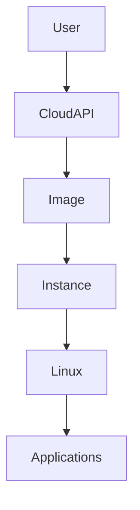
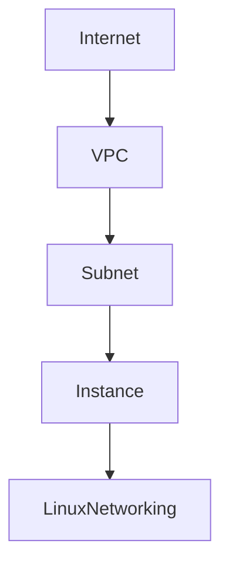
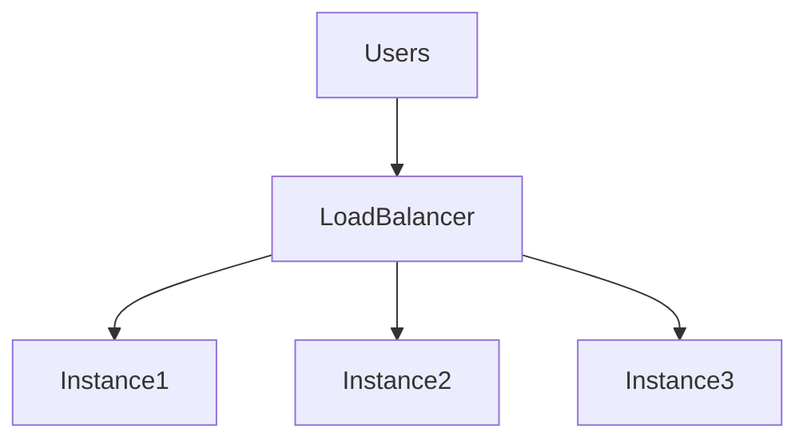

# Cloud Instances

# Why This Exists

One of the biggest misconceptions in cloud engineering is:

> Cloud instances are cloud computers.

This is incomplete.

Cloud instances are not computers.

Cloud instances are **temporary compute resources created from infrastructure abstractions**.

Cloud providers transformed servers into software.

Before cloud:

```text
Need Server

↓

Buy Hardware

↓

Wait Weeks

↓

Install Linux

↓

Deploy Application
```

Today:

```text
API Call

↓

Cloud Instance

↓

Linux Ready
```

Infrastructure became code.

This chapter teaches how cloud instances work from first principles.

---

# The Problem It Solves

Traditional infrastructure had huge problems.

```text
Slow provisioning

Expensive hardware

Poor scalability

Manual management

Resource waste
```

Cloud instances solve all of these.

---

# Mental Model

Imagine electricity.

You do not own a power plant.

You consume electricity when needed.

Cloud compute works similarly.

You don't own servers.

You consume compute.

```text
Power Grid

↓

Electricity

↓

Home

------------------

Cloud Data Center

↓

Compute

↓

Linux Instance
```

---

# First Principles

Every application needs compute.

Compute means:

```text
CPU

Memory

Storage

Networking

Operating System
```

Cloud providers expose these resources through instances.

---

# What Is A Cloud Instance?

A cloud instance is:

> An on-demand virtual server created from an image and backed by cloud infrastructure.

A cloud instance contains:

```text
Virtual CPU

Memory

Storage

Networking

Operating System
```

Most cloud instances run Linux.

---

# Cloud Instance Lifecycle

Instances are temporary.

```text
Create

↓

Boot

↓

Configure

↓

Run

↓

Scale

↓

Terminate
```

Unlike physical servers, instances are disposable.

---

# Big Picture Architecture



---

# The Cloud Stack

```text
Applications

↑

Linux

↑

Cloud Instance

↑

Virtual Machines

↑

Hypervisor

↑

Physical Hardware
```

Instances sit above virtualization.

---

# Instance vs Virtual Machine

They are related but not identical.

## Virtual Machine

Technology.

## Cloud Instance

Operational product.

Cloud instance = VM + Cloud services.

---

# Instance Creation Workflow

When you click:

```text
Launch Instance
```

Many things happen.

```text
Select Image

↓

Allocate CPU

↓

Allocate Memory

↓

Attach Storage

↓

Assign Networking

↓

Boot Linux

↓

Run Cloud Init

↓

Server Ready
```

This entire process may take less than a minute.

---

# Instance Components

Every cloud instance contains:

```text
Image

CPU

Memory

Storage

Network Interface

Security Rules

Metadata
```

---

# Images

Images are templates.

Examples:

```text
Ubuntu

Debian

Amazon Linux

RHEL

Rocky Linux
```

Images contain:

```text
Linux

Packages

Updates

Configurations
```

---

# Instance Metadata

Metadata is hidden information about the instance.

Examples:

```text
Hostname

Region

Private IP

Public IP

Instance ID
```

Linux can access metadata services.

---

# Cloud-init

Cloud-init automates instance setup.

Tasks:

```text
Create Users

Install Packages

Configure SSH

Run Scripts

Deploy Software
```

Without automation, cloud doesn't scale.

---

# Cloud-init Visualization

```text
Create Instance

↓

Linux Boots

↓

Cloud-init Executes

↓

Configurations Applied

↓

Applications Installed

↓

Ready
```

---

# Linux Inside Instances

Linux behaves normally.

Everything you already learned applies.

Commands:

```bash
top

htop

free -h

lsblk

ip addr

journalctl

systemctl
```

Cloud does not replace Linux.

---

# Types Of Cloud Instances

Cloud providers optimize for workloads.

---

# General Purpose

Balanced systems.

```text
CPU

Memory

Storage
```

Use cases:

```text
Web Servers

APIs

Backend Systems
```

---

# Compute Optimized

More CPU.

Use cases:

```text
Video Processing

Data Processing

AI Inference

Game Servers
```

---

# Memory Optimized

More RAM.

Use cases:

```text
Redis

Databases

Caching Systems
```

---

# Storage Optimized

Fast disks.

Use cases:

```text
Databases

Analytics

Big Data
```

---

# GPU Instances

Specialized hardware.

Use cases:

```text
AI Training

Computer Vision

LLMs

Scientific Computing
```

---

# Linux Networking Inside Instances

Architecture:

```text
Internet

↓

Cloud Network

↓

Instance

↓

Linux Network Stack
```

Linux still handles:

```text
IP Address

Routing

Firewall

Sockets
```

---

# Networking Visualization



---

# Storage In Instances

Cloud instances use storage systems.

Examples:

```text
Block Storage

Object Storage

File Storage
```

Linux sees attached block storage as disks.

Commands:

```bash
lsblk

mount

df -h
```

---

# Security Layers

Security is multi-layered.

```text
IAM

↓

Security Groups

↓

Linux Firewall

↓

Linux Users

↓

Applications
```

Never rely on one layer.

---

# The Pets vs Cattle Mental Model

Old thinking:

```text
Server01

Server02

Server03
```

Repair them.

---

Modern thinking:

```text
Instance A

Destroy

Recreate
```

Infrastructure is disposable.

---

# Immutable Infrastructure

Do not manually configure instances.

Bad:

```text
SSH

↓

Install Packages

↓

Configure
```

Good:

```text
Image

↓

Cloud-init

↓

Automation

↓

Deploy
```

Everything becomes reproducible.

---

# Horizontal Scaling

Bad:

```text
1 Huge Instance
```

Good:

```text
10 Smaller Instances
```

Architecture:



---

# Data Flow Example

User requests data.

```text
User

↓

DNS

↓

Load Balancer

↓

Linux Instance

↓

Redis

↓

Database

↓

Storage

↓

Response
```

Instances are one piece of the system.

---

# Cloud Instance + Docker

Very common architecture.

```text
Cloud Instance

↓

Linux

↓

Docker

↓

Containers

↓

Applications
```

---

# Cloud Instance + Kubernetes

Modern architecture.

```text
Cloud

↓

Instances

↓

Linux

↓

containerd

↓

Kubernetes
```

Instances often become Kubernetes worker nodes.

---

# Production Example: Startup Evolution

## Stage 1

```text
1 Instance

↓

Node.js
```

---

## Stage 2

```text
3 Instances

↓

Load Balancer
```

---

## Stage 3

```text
10 Instances

↓

Autoscaling
```

---

## Stage 4

```text
Instances

↓

Kubernetes

↓

Microservices
```

This is common startup growth.

---

# Performance Considerations

Monitor:

## CPU

```bash
top
```

## Memory

```bash
free -h
```

## Disk

```bash
iostat
```

## Network

```bash
sar -n DEV
```

Cloud abstractions do not eliminate bottlenecks.

---

# Security Considerations

Never expose instances directly.

Prefer:

```text
Internet

↓

Load Balancer

↓

Private Instances
```

Disable:

```text
Public Databases

Open SSH

Open Ports
```

---

# Scaling Considerations

Prefer:

```text
Many Small Instances
```

Avoid:

```text
One Huge Instance
```

Distributed systems scale better.

---

# Observability Considerations

Monitor three pillars.

```text
Logs

Metrics

Traces
```

Collect data continuously.

---

# Troubleshooting Workflow

```text
Application Down

↓

DNS

↓

Load Balancer

↓

Instance

↓

Linux

↓

Application

↓

Database
```

Debug layer by layer.

---

# Common Mistakes

## Mistake 1

Treating instances as permanent.

Wrong.

They are temporary.

---

## Mistake 2

Manually configuring instances.

Automate everything.

---

## Mistake 3

Ignoring Linux.

Linux is still the core system.

---

## Mistake 4

Ignoring networking.

Cloud is heavily networking.

---

## Mistake 5

SSHing into production constantly.

Infrastructure should be reproducible.

---

# Engineering Mindset

Beginner:

> I created a server.

Engineer:

> I provisioned compute resources.

Senior:

> I automate infrastructure lifecycles.

Architect:

> I design distributed compute systems.

Founder:

> Infrastructure should enable growth.

---

# Interview Questions

## Beginner

1. What is a cloud instance?

2. Why do cloud instances exist?

3. What is cloud-init?

4. What is an image?

5. Why are cloud instances temporary?

---

## Intermediate

6. Explain instance lifecycle.

7. Explain immutable infrastructure.

8. Explain instance types.

9. Explain horizontal scaling.

10. Explain cloud networking.

---

## Advanced

11. Explain instance vs VM.

12. Explain infrastructure as code.

13. Explain Kubernetes worker nodes.

14. Design scalable compute infrastructure.

15. Explain cloud compute from first principles.

---

# Cheat Sheet

```text
Cloud Instance = VM + Cloud Services

Lifecycle

Create

↓

Boot

↓

Configure

↓

Run

↓

Scale

↓

Terminate

Types

General Purpose

Compute Optimized

Memory Optimized

Storage Optimized

GPU

Modern Stack

Cloud

↓

Instances

↓

Linux

↓

Docker

↓

Kubernetes

↓

Applications

Mindset

Instances are disposable.

Automate everything.
```

# Final Thought

Cloud instances are not servers.

They are temporary compute abstractions built on virtualization.

The modern engineer does not build servers.

The modern engineer orchestrates fleets of Linux instances.

That mindset is the foundation of cloud engineering.
