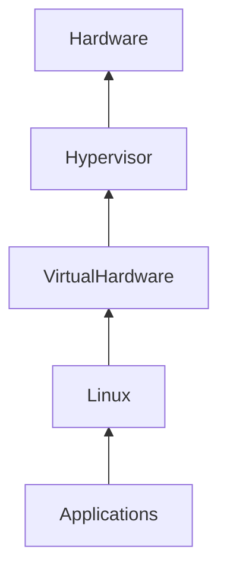
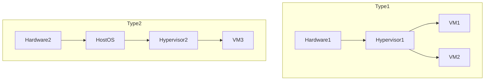
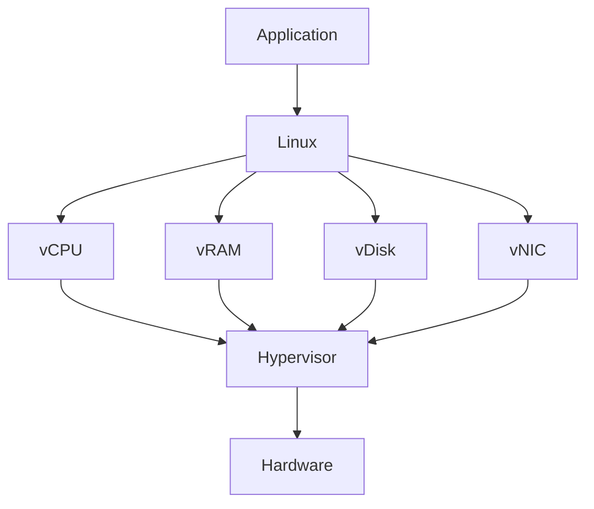
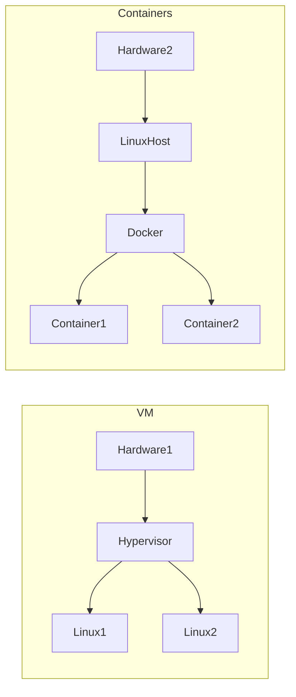

# Virtual Machines (VMs)

# Why This Exists

Modern cloud engineering would not exist without virtualization.

Without Virtual Machines:

- AWS would not exist
- Azure would not exist
- GCP would not exist
- Cloud computing would not scale
- Multi-tenancy would not be possible

Before Virtual Machines, applications were directly installed onto physical servers.

This created enormous problems.

Virtual Machines solved those problems.

This chapter teaches virtualization from first principles.

---

# The Problem It Solves

Imagine a company buys a powerful server.

```text
64 CPU cores

256 GB RAM

10 TB SSD
```

Now they deploy:

```text
One Web Server
```

Utilization:

```text
CPU → 5%

RAM → 8%

Disk → 10%
```

95% of resources are wasted.

Buying more servers becomes expensive.

Virtualization solves this.

---

# Mental Model

Imagine an apartment building.

## Without Virtualization

```text
One Family

↓

One Entire Building
```

Huge waste.

---

## With Virtualization

```text
One Building

↓

Apartment 1

Apartment 2

Apartment 3

Apartment 4
```

Each family gets isolated resources.

This is exactly what a VM does.

---

# First Principles

Physical hardware is expensive.

We want to:

```text
Share Hardware

↓

Safely

↓

Efficiently

↓

Among Multiple Systems
```

Virtualization enables this.

---

# What Is A Virtual Machine?

A Virtual Machine is:

> A software-defined computer running inside another computer.

A VM behaves like a real machine.

It has:

```text
CPU

Memory

Disk

Network Interface

Operating System

Processes
```

Everything appears real.

But underneath, resources are virtualized.

---

# The Big Picture

```text
Applications

↑

Guest Linux

↑

Virtual Hardware

↑

Hypervisor

↑

Physical Hardware
```

The hypervisor is the magic layer.

---

# Architecture Diagram



---

# Physical Server Without Virtualization

```text
Hardware

↓

Linux

↓

Application
```

Simple.

But inefficient.

---

# Physical Server With Virtualization

```text
Hardware

↓

Hypervisor

↓

VM1

VM2

VM3

↓

Applications
```

Multiple systems share one machine.

---

# Components Of A VM

Every VM has:

```text
Virtual CPU (vCPU)

Virtual Memory (vRAM)

Virtual Disk (vDisk)

Virtual NIC (vNIC)

Guest Operating System
```

---

# The Hypervisor

The hypervisor is virtualization software.

Its job:

```text
Manage CPU

Manage Memory

Manage Disk

Manage Networking

Manage Isolation
```

It creates VMs.

---

# Hypervisor Types

# Type 1 (Bare Metal)

Runs directly on hardware.

```text
Hardware

↓

Hypervisor

↓

Virtual Machines
```

Examples:

```text
VMware ESXi

Microsoft Hyper-V

Xen

KVM

AWS Nitro
```

Fastest.

Most common in cloud.

---

# Type 2 (Hosted)

Runs on top of an operating system.

```text
Hardware

↓

Host OS

↓

Hypervisor

↓

VM
```

Examples:

```text
VirtualBox

VMware Workstation
```

Common for learning.

---

# Visualization



---

# Why Linux Loves Virtualization

Linux was built to share resources.

Linux already has:

```text
Schedulers

Memory Managers

Networking Stack

Filesystem Isolation

Namespaces

Control Groups
```

Linux fits virtualization naturally.

---

# CPU Virtualization

Problem:

One physical CPU.

Multiple VMs.

Solution:

Time sharing.

```text
Physical CPU

↓

Hypervisor

↓

vCPU1

vCPU2

vCPU3
```

Each VM thinks it owns the CPU.

---

# Memory Virtualization

Problem:

Multiple VMs need RAM.

Solution:

Virtual memory mapping.

```text
Physical RAM

↓

Hypervisor

↓

VM1 RAM

VM2 RAM

VM3 RAM
```

---

# Disk Virtualization

Problem:

Share storage safely.

Solution:

Virtual disks.

```text
Physical SSD

↓

Hypervisor

↓

VM Disk 1

VM Disk 2

VM Disk 3
```

Linux sees:

```bash
/dev/sda

/dev/nvme0n1
```

---

# Network Virtualization

Problem:

Multiple VMs need networking.

Solution:

Virtual network interfaces.

```text
Physical NIC

↓

Virtual Switch

↓

VM1

VM2

VM3
```

---

# Complete Data Flow



---

# VM Boot Process

Similar to physical Linux.

```text
VM Starts

↓

Virtual BIOS

↓

GRUB

↓

Linux Kernel

↓

systemd

↓

Services

↓

Application
```

Nothing changes.

Linux still boots normally.

---

# Cloud Is Built On VMs

AWS:

```text
EC2

↓

VM

↓

Linux
```

Azure:

```text
Azure VM

↓

VM

↓

Linux
```

GCP:

```text
Compute Engine

↓

VM

↓

Linux
```

Cloud = Massive virtualization platform.

---

# Where Docker Fits

Docker is NOT a VM.

Huge misconception.

VM:

```text
Hardware

↓

Hypervisor

↓

Linux

↓

Application
```

Docker:

```text
Linux

↓

Container Runtime

↓

Application
```

Docker shares the Linux kernel.

VMs do not.

---

# VM vs Docker

| Feature | VM | Docker |
|---------|----|--------|
| Has own kernel | Yes | No |
| Startup speed | Seconds | Milliseconds |
| Resource usage | Heavy | Lightweight |
| Isolation | Strong | Medium |
| Portability | Medium | High |
| OS flexibility | Any OS | Same kernel family |

---

# Visualization



---

# Kubernetes Relationship

Most Kubernetes clusters run on VMs.

```text
Cloud

↓

Virtual Machines

↓

Linux

↓

Docker/containerd

↓

Kubernetes
```

This is the modern stack.

---

# Why Cloud Providers Use VMs

Because they provide:

```text
Isolation

Security

Flexibility

Multi-tenancy
```

Thousands of customers can safely share hardware.

---

# Multi-Tenancy

One server.

Multiple customers.

```text
Physical Server

↓

Customer A VM

Customer B VM

Customer C VM
```

They cannot see each other.

This is isolation.

---

# Production Example

A startup architecture.

```text
Users

↓

Load Balancer

↓

VM1

VM2

VM3

↓

Docker

↓

Application

↓

Database
```

Very common.

---

# Performance Considerations

Virtualization adds overhead.

Watch:

```text
CPU Scheduling

Memory Pressure

Disk IOPS

Network Latency
```

Monitor:

```bash
top

htop

free -h

vmstat

iostat

sar
```

---

# Security Considerations

Security layers.

```text
Cloud IAM

↓

Security Groups

↓

VM Firewall

↓

Linux Users

↓

Application Security
```

---

# Scalability Considerations

Bad:

```text
1 Huge VM
```

Good:

```text
10 Smaller VMs
```

Horizontal scaling wins.

---

# Observability Considerations

Monitor:

```text
CPU

Memory

Disk

Network

Processes

Application Metrics
```

Three pillars:

```text
Logs

Metrics

Traces
```

---

# Troubleshooting Workflow

```text
Application Slow

↓

Check CPU

↓

Check Memory

↓

Check Disk

↓

Check Network

↓

Check Hypervisor

↓

Check Cloud Infrastructure
```

Always debug layer by layer.

---

# Common Mistakes

## Mistake 1

Thinking VMs are outdated.

Wrong.

Cloud runs on VMs.

---

## Mistake 2

Thinking Docker replaced VMs.

Wrong.

Docker runs on VMs.

---

## Mistake 3

Creating huge VMs.

Bad for scaling.

---

## Mistake 4

Ignoring Linux fundamentals.

Linux is still the core system.

---

## Mistake 5

Ignoring observability.

Distributed systems require visibility.

---

# Engineering Mindset

Beginner:

> A VM is a cloud server.

Engineer:

> A VM is a virtual computer.

Senior Engineer:

> A VM is an isolated compute abstraction.

Architect:

> VMs are building blocks for distributed systems.

Founder:

> Infrastructure should be disposable.

---

# Interview Questions

## Beginner

1. What is a VM?

2. Why do VMs exist?

3. What is a hypervisor?

4. What is virtualization?

5. Why does cloud use VMs?

---

## Intermediate

6. Explain Type 1 vs Type 2 hypervisors.

7. Explain CPU virtualization.

8. Explain memory virtualization.

9. Explain network virtualization.

10. Explain VM boot process.

---

## Advanced

11. Explain VM vs Docker.

12. Explain multi-tenancy.

13. Why does Kubernetes run on VMs?

14. Explain AWS Nitro.

15. Explain virtualization from first principles.

---

# Cheat Sheet

```text
VM = Software Defined Computer

Stack

Hardware

↓

Hypervisor

↓

Virtual Machine

↓

Linux

↓

Application

Hypervisors

Type 1

ESXi
Hyper-V
KVM
Xen
Nitro

Type 2

VirtualBox
VMware Workstation

Cloud

AWS → EC2

Azure → Azure VM

GCP → Compute Engine

Modern Stack

Cloud

↓

VMs

↓

Linux

↓

Docker

↓

Kubernetes

↓

Applications
```

# Final Thought

Virtual Machines are one of the most important inventions in modern computing.

Without virtualization:

No cloud.

No multi-tenancy.

No elastic infrastructure.

No modern distributed systems.

Cloud engineering is simply Linux engineering running on virtualized infrastructure.

Understand VMs deeply, and cloud becomes much easier.
