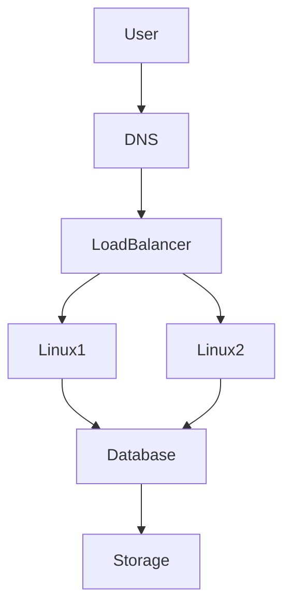
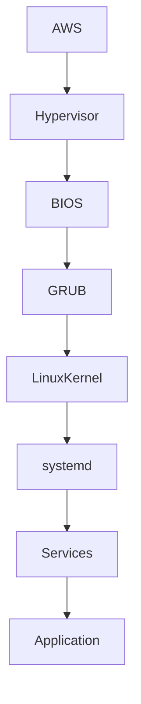
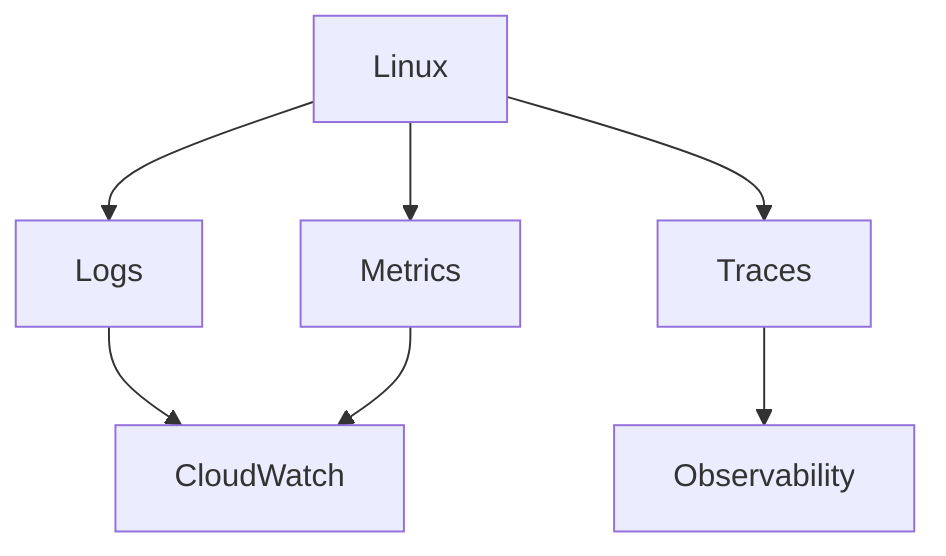
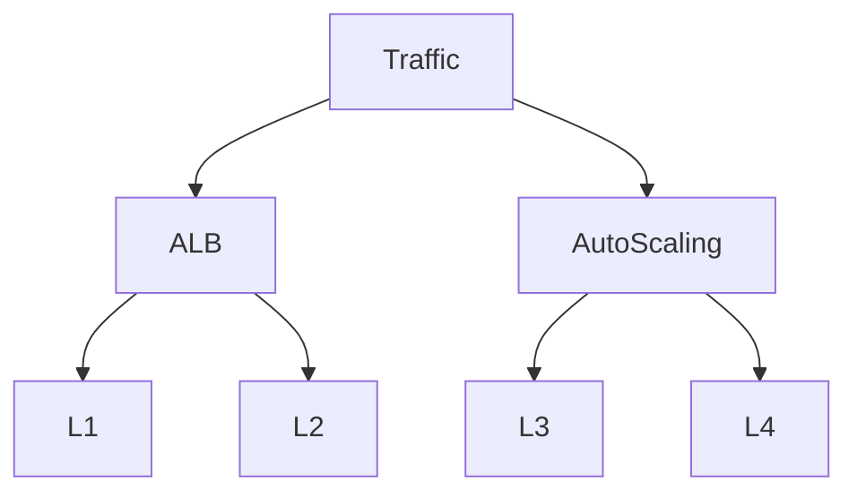

# Linux In AWS

# Why This Exists

Many beginners think:

> I am learning AWS.

But this is the wrong mindset.

AWS is not the thing you are operating.

You are operating Linux.

AWS is the environment where Linux runs.

Almost every modern backend system eventually becomes:

```text
Users

↓

Internet

↓

AWS Infrastructure

↓

Linux Servers

↓

Applications

↓

Databases

↓

Storage
```

Linux is still the foundation.

If Linux is weak, AWS becomes difficult.

If Linux is strong, AWS becomes intuitive.

This chapter teaches AWS through Linux engineering.

---

# The Problem This Solves

People often memorize AWS services.

```text
EC2

VPC

IAM

ALB

EBS

S3

CloudWatch
```

Months later they cannot answer:

- Where does Linux actually run?
- How does Linux boot inside AWS?
- How do Linux servers communicate?
- How does Linux get an IP address?
- How does Linux scale?
- How does Linux get storage?
- How do Linux engineers work in AWS?

This chapter answers those questions.

---

# Mental Model

Think of AWS as a giant programmable data center.

```text
AWS

↓

Buildings

↓

Servers

↓

Virtualization

↓

Linux Machines

↓

Applications
```

AWS hides hardware complexity.

Linux remains your operating system.

---

# First Principles

Every application still needs:

```text
Compute

Storage

Networking

Identity

Observability
```

AWS simply provides these as services.

Linux consumes them.

---

# The Linux In AWS Stack

```text
Applications

↑

Containers

↑

Linux

↑

Virtual Machines

↑

Virtual Networking

↑

AWS Physical Infrastructure
```

This stack powers most systems.

---

# Big Picture Architecture



---

# Linux In AWS Components

Linux interacts with multiple AWS systems.

```text
Linux In AWS

├── EC2
├── EBS
├── VPC
├── Security Groups
├── IAM
├── CloudWatch
├── Load Balancers
├── Auto Scaling
└── S3
```

---

# Where Linux Actually Runs

Primarily inside EC2.

Think:

```text
EC2 = Linux Server In AWS
```

EC2 stands for:

Elastic Compute Cloud.

Elastic means:

Resources can grow and shrink.

---

# Underneath EC2

AWS physical infrastructure.

```text
AWS Data Center

↓

Physical Server

↓

Hypervisor

↓

Virtual Machine

↓

Linux

↓

Applications
```

---

# Hypervisors

AWS virtualizes hardware.

Historically:

```text
Xen
```

Modern AWS:

```text
Nitro Hypervisor
```

Nitro greatly reduces virtualization overhead.

---

# Linux Boot Process In AWS

The boot process is almost identical to physical Linux.

```text
Power On

↓

BIOS/UEFI

↓

Bootloader

↓

Linux Kernel

↓

systemd

↓

Services

↓

Application
```

Difference:

Power On is virtualized.

---

# Linux Boot Visualization



---

# AMI (Amazon Machine Image)

Think of an AMI as a Linux template.

Contains:

```text
Linux Distribution

Packages

Configurations

Security Updates
```

Examples:

```text
Ubuntu

Amazon Linux

Debian

RHEL
```

Launching EC2 means cloning an image.

---

# Cloud Init

Cloud-init configures Linux automatically during boot.

Tasks:

```text
Create users

Install packages

Run scripts

Configure SSH

Configure hostname
```

This enables automation.

---

# Cloud Init Visualization

```text
Launch Instance

↓

AMI Loads

↓

Linux Boots

↓

Cloud-init Runs

↓

Packages Installed

↓

Configuration Applied

↓

Server Ready
```

---

# Networking In AWS Linux

Linux networking still exists.

AWS adds abstraction.

```text
Internet

↓

VPC

↓

Subnet

↓

EC2

↓

Linux Network Stack
```

Inside Linux:

```text
IP Address

↓

Network Interface

↓

Routing Table

↓

iptables/nftables

↓

Sockets
```

---

# Example Network Interface

```bash
ip addr

ip route

ss -tulnp
```

These commands are still important.

Cloud does not replace Linux networking.

---

# Elastic Network Interface (ENI)

Think of ENI as a virtual network card.

```text
EC2

↓

ENI

↓

IP Address

↓

VPC
```

Linux communicates through it.

---

# Storage In AWS Linux

Three major categories.

```text
EBS

S3

EFS
```

---

# EBS

EBS is a virtual disk.

Think:

```text
SSD In The Cloud
```

Linux sees:

```bash
/dev/nvme0n1
```

or

```bash
/dev/xvda
```

You can:

```bash
lsblk

mount

df -h
```

Exactly like normal Linux.

---

# S3

S3 is object storage.

Linux cannot mount it like a traditional disk by default.

It stores objects.

```text
Image.jpg

Video.mp4

backup.sql
```

Not filesystems.

---

# EFS

EFS is network file storage.

Linux mounts it.

```bash
mount -t nfs
```

Multiple Linux servers can share it.

---

# Linux Security In AWS

Security is layered.

```text
IAM

↓

Security Groups

↓

Network ACLs

↓

Linux Firewall

↓

Users

↓

Permissions

↓

Application Security
```

Never rely on one layer.

---

# Security Groups

Think:

```text
Virtual Firewall
```

Example:

```text
Allow:

22

80

443
```

Deny everything else.

---

# Linux Users Still Matter

AWS does not replace Linux users.

Still use:

```bash
useradd

passwd

sudo

groups
```

Avoid:

```text
Everything as root
```

---

# SSH Into Linux

Typical flow:

```text
Laptop

↓

SSH Key

↓

Internet

↓

EC2

↓

Linux Shell
```

Example:

```bash
ssh -i key.pem ubuntu@public-ip
```

---

# Linux Logging In AWS

Linux logs still exist.

```bash
journalctl

dmesg

tail -f
```

AWS adds centralized logging.

CloudWatch aggregates logs.

---

# Observability Architecture



---

# Linux Monitoring

Monitor:

```text
CPU

Memory

Disk

Network

Processes

Application Metrics
```

Commands:

```bash
top

htop

free -h

vmstat

iostat

sar
```

These skills never disappear.

---

# Linux Autoscaling

Traditional Linux:

```text
One Server
```

AWS:

```text
Load Balancer

↓

Linux 1

Linux 2

Linux 3
```

When traffic increases:

```text
Linux 4

Linux 5

Linux 6
```

spawn automatically.

---

# Autoscaling Visualization



---

# Where Docker Fits

Docker runs inside Linux.

```text
AWS

↓

EC2

↓

Linux

↓

Docker

↓

Containers
```

---

# Where Kubernetes Fits

Kubernetes nodes are Linux machines.

```text
AWS

↓

EC2

↓

Linux

↓

Container Runtime

↓

Kubernetes
```

---

# Production Example: MERN Stack

Architecture:

```text
Users

↓

CloudFront

↓

ALB

↓

Node.js Linux Servers

↓

Redis

↓

PostgreSQL

↓

S3
```

---

# Performance Considerations

Watch:

## CPU

```bash
top
```

---

## Memory

```bash
free -h
```

---

## Disk IOPS

```bash
iostat
```

---

## Network

```bash
sar -n DEV
```

---

# Security Considerations

Follow layered security.

```text
IAM

↓

Security Groups

↓

Linux Firewall

↓

SSH Hardening

↓

Application Security
```

---

# Scaling Considerations

Bad:

```text
1 Huge Server
```

Good:

```text
10 Smaller Servers
```

Prefer horizontal scaling.

---

# Troubleshooting Flow

When application is down:

```text
User

↓

DNS

↓

Load Balancer

↓

VPC

↓

EC2

↓

Linux

↓

Application

↓

Database
```

Debug layer by layer.

---

# Common Mistakes

## Mistake 1

Learning AWS before Linux.

Wrong order.

---

## Mistake 2

Ignoring networking.

Cloud is mostly networking.

---

## Mistake 3

Ignoring Linux logs.

Cloud dashboards aren't enough.

---

## Mistake 4

SSHing as root.

Never do this.

---

## Mistake 5

Ignoring automation.

Manual operations don't scale.

---

# Engineering Mindset

Junior:

> I manage AWS servers.

Engineer:

> I manage Linux systems running inside AWS.

Senior:

> I automate Linux infrastructure.

Architect:

> I design resilient distributed Linux systems.

Founder:

> Infrastructure should enable business growth.

---

# Interview Questions

## Beginner

1. Where does Linux run in AWS?

2. What is EC2?

3. What is an AMI?

4. What is cloud-init?

5. What is EBS?

---

## Intermediate

6. Explain Linux boot inside AWS.

7. Explain ENI.

8. Explain Security Groups.

9. Explain CloudWatch.

10. Explain autoscaling.

---

## Advanced

11. Explain AWS Nitro.

12. Design a highly available Linux architecture.

13. Explain observability in AWS Linux.

14. Explain EC2 vs containers.

15. Explain Linux from the perspective of cloud infrastructure.

---

# Cheat Sheet

```text
AWS = Programmable Data Center

Linux Runs Inside EC2

EC2 = Linux Compute

AMI = Linux Template

Cloud-init = Linux Automation

ENI = Virtual NIC

EBS = Virtual Disk

CloudWatch = Observability

Security Groups = Virtual Firewall

Stack

AWS

↓

EC2

↓

Linux

↓

Docker

↓

Kubernetes

↓

Applications
```

# Final Thought

Do not become an AWS click engineer.

Become a Linux infrastructure engineer.

Because AWS changes.

Services change.

Dashboards change.

Linux fundamentals remain.

The engineer who deeply understands Linux can work on AWS, Azure, GCP, Kubernetes, data centers, AI infrastructure, and distributed systems.

Linux is the constant.

Cloud is the environment.
