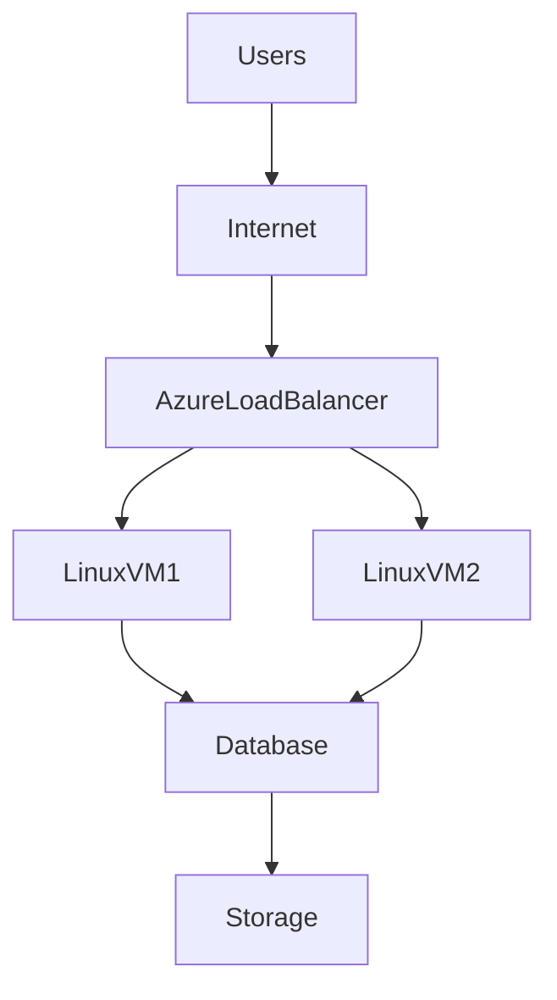
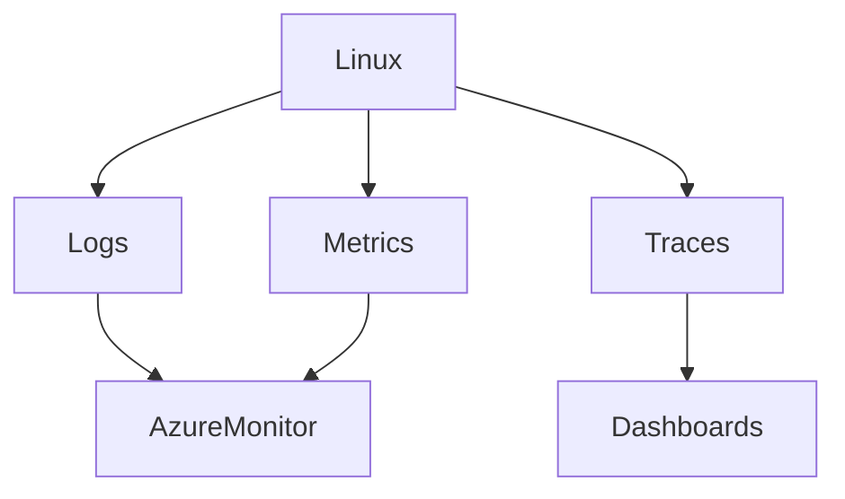
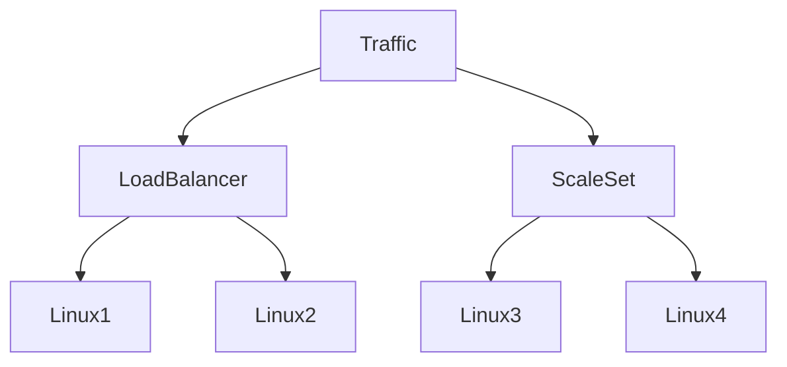

# Linux In Azure

# Why This Exists

Many people think:

> Azure is Microsoft's cloud, therefore Linux is less important there.

This is completely wrong.

Modern Azure runs enormous amounts of Linux infrastructure.

Today Linux powers:

- Kubernetes clusters
- Databases
- AI systems
- Machine learning platforms
- Web applications
- DevOps pipelines
- Platform engineering systems

Azure is no longer a Windows-only ecosystem.

Azure has become a massive Linux platform.

This chapter teaches:

> How Linux operates inside Microsoft's cloud ecosystem.

---

# The Problem This Solves

People memorize Azure services.

```text
Azure VM

Azure Virtual Network

Azure Storage

Azure Monitor

Azure Kubernetes Service

Azure Load Balancer

Azure Active Directory
```

Months later they cannot answer:

- Where does Linux run?
- How does Linux boot?
- How is Linux secured?
- How does Linux communicate?
- Why do enterprises choose Azure?
- Why is Linux important in Azure?

This chapter answers these questions.

---

# Mental Model

Think of Azure as a giant enterprise operating system.

```text
Microsoft Data Centers

↓

Virtual Infrastructure

↓

Linux

↓

Containers

↓

Applications

↓

Enterprise Systems
```

Azure focuses heavily on enterprise integration.

---

# First Principles

Azure still solves the same problems every cloud solves.

Applications need:

```text
Compute

Storage

Networking

Identity

Security

Observability
```

Linux consumes these services.

---

# Linux Is Still The Foundation

Azure does not replace Linux.

It provides an environment for Linux.

```text
Applications

↑

Containers

↑

Linux

↑

Virtual Machines

↑

Azure Infrastructure
```

---

# Linux In Azure Architecture



---

# Core Azure Services Linux Uses

```text
Linux In Azure

├── Azure Virtual Machines
├── Virtual Network
├── Managed Disks
├── Azure Blob Storage
├── Azure Files
├── Azure Load Balancer
├── Azure Monitor
├── Azure Kubernetes Service
├── Microsoft Entra ID
└── Virtual Machine Scale Sets
```

---

# Azure Virtual Machines

Think:

```text
Azure VM = Linux Server In Azure
```

A Linux machine running inside Microsoft's infrastructure.

---

# Underneath Azure VMs

```text
Microsoft Data Center

↓

Physical Hardware

↓

Hypervisor

↓

Virtual Machine

↓

Linux

↓

Applications
```

---

# Hyper-V

Azure virtualization heavily uses Hyper-V technologies.

```text
Physical Server

↓

Hyper-V

↓

Linux Guest OS
```

Linux kernels have special optimizations for cloud environments.

---

# Linux Boot Process In Azure

Boot process is familiar.

```text
Virtual Power On

↓

BIOS/UEFI

↓

GRUB

↓

Linux Kernel

↓

systemd

↓

Services

↓

Application
```

Linux internals do not change.

---

# Azure Images

Azure images are Linux templates.

Examples:

```text
Ubuntu

Debian

RHEL

SUSE

Oracle Linux
```

An image contains:

```text
Operating System

Packages

Configurations

Updates
```

---

# Cloud-init In Azure

Cloud-init is extremely important.

Automates:

```text
Create users

Install packages

Configure SSH

Run scripts

Configure servers
```

Automation is mandatory.

---

# Cloud-init Flow

```text
Launch VM

↓

Linux Boots

↓

Cloud-init Executes

↓

Packages Installed

↓

Configurations Applied

↓

Server Ready
```

---

# Linux Networking In Azure

Cloud did not replace networking.

Azure virtualized networking.

```text
Internet

↓

Virtual Network

↓

Subnet

↓

Linux VM

↓

Linux Network Stack
```

Inside Linux:

```text
IP Address

↓

Network Interface

↓

Routing Table

↓

Firewall

↓

Sockets
```

---

# Important Linux Commands

Still use:

```bash
ip addr

ip route

ss -tulnp

ping

traceroute
```

Cloud engineers still need Linux networking skills.

---

# Azure Virtual Network (VNet)

Equivalent mental model:

```text
VNet = Private Virtual Data Center
```

Contains:

```text
Subnets

Routing

Security Rules

Virtual Machines
```

---

# Storage In Azure Linux

Three primary systems.

```text
Managed Disks

Azure Blob Storage

Azure Files
```

---

# Managed Disks

Think:

```text
Cloud SSD
```

Linux sees:

```bash
/dev/sdX

or

/dev/nvmeX
```

Use:

```bash
lsblk

mount

df -h
```

---

# Azure Blob Storage

Blob storage is object storage.

Stores:

```text
Images

Videos

Backups

Documents

AI Datasets
```

Not traditional filesystems.

---

# Azure Files

Shared file storage.

Multiple Linux machines can access simultaneously.

Uses SMB or NFS.

---

# Identity In Azure

Identity is one of Azure's strengths.

Today called:

Microsoft Entra ID

Previously:

Azure Active Directory.

Provides:

```text
Users

Groups

Roles

Policies

Authentication
```

---

# Linux Security Layers

Security is multi-layered.

```text
Entra ID

↓

Network Security Groups

↓

Linux Firewall

↓

Linux Users

↓

Application Security
```

Never trust one security layer.

---

# SSH In Azure

Architecture:

```text
Laptop

↓

SSH Key

↓

Internet

↓

Azure VM

↓

Linux
```

Example:

```bash
ssh azureuser@public-ip
```

Avoid passwords.

Use SSH keys.

---

# Logging In Azure

Linux logs still matter.

Commands:

```bash
journalctl

dmesg

tail -f
```

Azure centralizes logs through Azure Monitor.

---

# Azure Observability

Three pillars remain.

```text
Logs

Metrics

Traces
```

Architecture:



---

# Enterprise Linux Management

Azure excels in enterprise environments.

Examples:

```text
Single Sign-On

↓

Identity Policies

↓

Security Policies

↓

Compliance

↓

Auditing
```

This is why many enterprises choose Azure.

---

# Linux Monitoring Commands

Monitor:

```bash
top

htop

free -h

iostat

vmstat

sar
```

These skills never disappear.

---

# Scaling Linux In Azure

Azure uses Virtual Machine Scale Sets.

Concept:

```text
Traffic Increases

↓

New Linux Machines Spawn

↓

Traffic Decreases

↓

Machines Removed
```

---

# Autoscaling Visualization



---

# Docker In Azure

Docker runs inside Linux.

```text
Azure

↓

Linux VM

↓

Docker

↓

Containers
```

---

# Kubernetes In Azure

AKS:

Azure Kubernetes Service.

Architecture:

```text
Azure

↓

Linux Nodes

↓

Container Runtime

↓

Kubernetes

↓

Applications
```

Linux powers Kubernetes.

---

# Enterprise Production Architecture

```text
Users

↓

Azure Front Door

↓

Load Balancer

↓

Linux Application Servers

↓

Redis

↓

PostgreSQL

↓

Blob Storage
```

---

# Performance Considerations

Watch:

## CPU

```bash
top
```

## Memory

```bash
free -h
```

## Disk

```bash
iostat
```

## Network

```bash
sar -n DEV
```

Cloud does not remove bottlenecks.

---

# Security Considerations

Use defense in depth.

```text
Entra ID

↓

Network Security Groups

↓

Linux Firewall

↓

SSH Hardening

↓

Application Security
```

---

# Scaling Considerations

Avoid:

```text
One Huge Linux Machine
```

Prefer:

```text
Many Smaller Linux Machines
```

Horizontal scaling wins.

---

# Troubleshooting Flow

Debug layer by layer.

```text
User

↓

DNS

↓

Load Balancer

↓

VNet

↓

Linux

↓

Application

↓

Database

↓

Storage
```

Never skip layers.

---

# Common Mistakes

## Mistake 1

Thinking Azure equals Windows.

Wrong.

Linux is everywhere.

---

## Mistake 2

Ignoring Linux fundamentals.

Cloud doesn't replace Linux.

---

## Mistake 3

Ignoring networking.

Cloud is heavily networking.

---

## Mistake 4

Ignoring observability.

Distributed systems require visibility.

---

## Mistake 5

Managing infrastructure manually.

Automate everything.

---

# Engineering Mindset

Junior:

> I deploy applications in Azure.

Engineer:

> I manage Linux infrastructure inside Azure.

Senior:

> I automate Linux platforms.

Architect:

> I build secure distributed enterprise systems.

Founder:

> Infrastructure should accelerate business.

---

# Interview Questions

## Beginner

1. Where does Linux run in Azure?

2. What is Azure VM?

3. What is VNet?

4. What is Blob Storage?

5. What is cloud-init?

---

## Intermediate

6. Explain Linux boot in Azure.

7. Explain Azure networking.

8. Explain Linux observability.

9. Explain Azure scaling.

10. Explain Entra ID.

---

## Advanced

11. Why do enterprises choose Azure?

12. Explain Linux in AKS.

13. Explain Azure security layers.

14. Design a highly available Linux architecture.

15. Explain Azure from Linux first principles.

---

# Cheat Sheet

```text
Azure = Enterprise Cloud Platform

Azure VM = Linux Server

VNet = Virtual Network

Managed Disk = Virtual SSD

Blob = Object Storage

Azure Files = Shared Filesystem

Entra ID = Identity Platform

Azure Monitor = Observability

Stack

Azure

↓

Linux

↓

Docker

↓

Kubernetes

↓

Applications
```

# Final Thought

Do not think:

> I am learning Azure.

Think:

> I am learning how Linux powers enterprise cloud systems.

Azure is an environment.

Linux is the foundation.

The engineer who deeply understands Linux can move between:

AWS

Azure

GCP

Kubernetes

Data Centers

AI Infrastructure

because Linux remains the constant.
