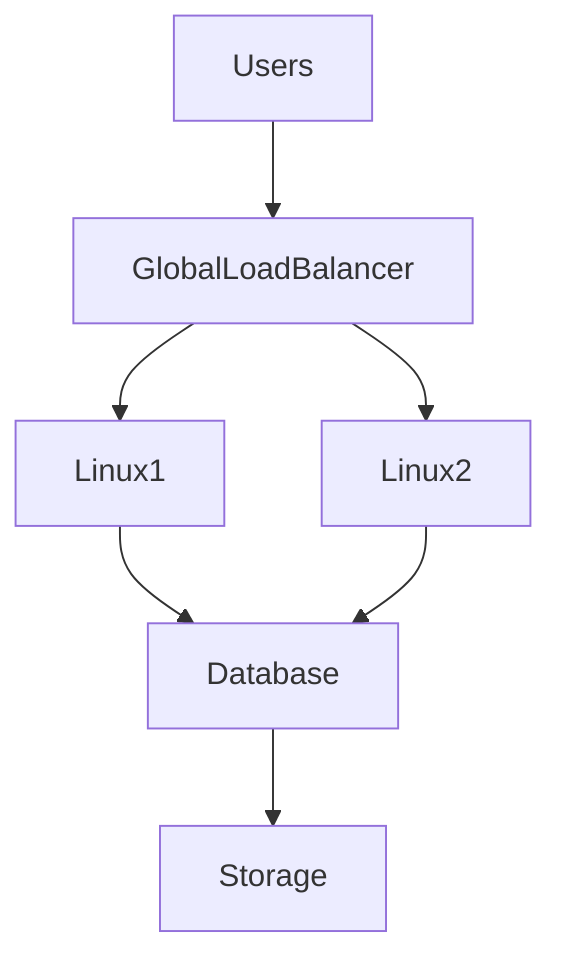
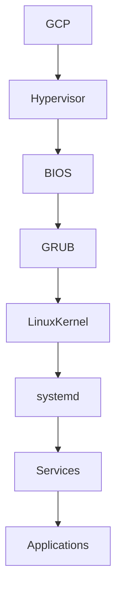
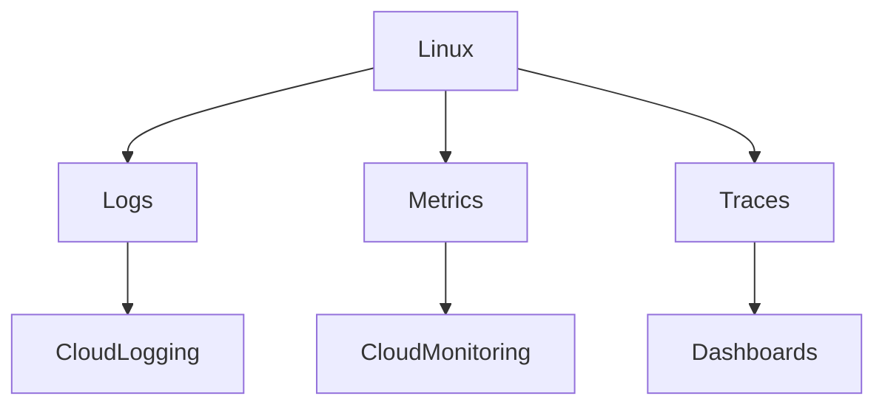

# Linux In GCP

# Why This Exists

Many people think:

> GCP is just another cloud provider.

This is wrong.

Google Cloud Platform is heavily influenced by Google's internal engineering culture.

Google built:

- Google Search
- YouTube
- Gmail
- Google Maps
- Android infrastructure
- AI infrastructure

Before GCP existed.

Then Google exposed many of those ideas to developers.

This chapter teaches:

> How Linux powers Google's distributed systems philosophy.

---

# The Problem This Solves

People memorize services.

```text
Compute Engine

Cloud Storage

VPC

GKE

Cloud SQL

Cloud Monitoring

Cloud IAM
```

But cannot answer:

- Why is GCP popular among engineers?
- How does Linux run in GCP?
- Why does Kubernetes feel natural in GCP?
- Why are distributed systems central to GCP?
- How does Google think about infrastructure?

This chapter answers those questions.

---

# Mental Model

Think of GCP as a distributed systems operating system.

```text
Google Data Centers

↓

Global Infrastructure

↓

Linux

↓

Containers

↓

Distributed Systems

↓

Applications
```

Google optimizes for enormous scale.

---

# First Principles

Every application still needs:

```text
Compute

Storage

Networking

Identity

Observability
```

Linux consumes these resources.

Google automates them aggressively.

---

# Linux Is Still The Foundation

The stack remains familiar.

```text
Applications

↑

Containers

↑

Linux

↑

Virtual Machines

↑

Google Infrastructure
```

Linux remains constant.

---

# Linux In GCP Architecture



---

# GCP Services Linux Uses

```text
Linux In GCP

├── Compute Engine
├── VPC
├── Persistent Disk
├── Cloud Storage
├── Filestore
├── Cloud Load Balancing
├── Cloud Monitoring
├── Cloud Logging
├── GKE
└── Cloud IAM
```

---

# Compute Engine

Think:

```text
Compute Engine = Linux Server In GCP
```

Google manages infrastructure.

You manage Linux.

---

# Underneath Compute Engine

```text
Google Data Center

↓

Physical Server

↓

Hypervisor

↓

Virtual Machine

↓

Linux

↓

Applications
```

Very similar to other clouds.

---

# Google's Engineering Philosophy

Google prefers:

```text
Automation

Distribution

Horizontal Scaling

Self-healing Systems
```

These principles influence GCP design.

---

# Linux Boot Process In GCP

Nothing magical happens.

Linux still boots normally.

```text
Virtual Power On

↓

BIOS/UEFI

↓

GRUB

↓

Linux Kernel

↓

systemd

↓

Services

↓

Applications
```

---

# Boot Visualization



---

# Images In GCP

Images are Linux templates.

Examples:

```text
Ubuntu

Debian

Rocky Linux

RHEL

Container Optimized OS
```

Contains:

```text
OS

Packages

Updates

Configurations
```

---

# Cloud-init

Cloud-init automates Linux initialization.

Tasks:

```text
Users

Packages

SSH

Scripts

Configurations
```

Automation is mandatory at scale.

---

# Networking In GCP

Networking is one of GCP's strengths.

Architecture:

```text
Internet

↓

Global Network

↓

VPC

↓

Subnet

↓

Linux VM
```

Inside Linux:

```text
IP

↓

Interface

↓

Routing

↓

Firewall

↓

Sockets
```

Linux networking remains essential.

---

# Important Linux Commands

Still use:

```bash
ip addr

ip route

ss -tulnp

ping

traceroute
```

Cloud never replaces Linux networking.

---

# GCP VPC

Interesting difference:

GCP VPCs are global.

Mental model:

```text
One Private Global Network
```

This simplifies multi-region systems.

---

# Storage In GCP

Three major systems.

```text
Persistent Disk

Cloud Storage

Filestore
```

---

# Persistent Disk

Think:

```text
Cloud SSD
```

Linux sees:

```bash
/dev/sda

or

/dev/nvme0n1
```

Use:

```bash
lsblk

mount

df -h
```

Same Linux skills.

---

# Cloud Storage

Google's object storage.

Stores:

```text
Backups

AI Datasets

Images

Videos

Logs
```

Not traditional filesystems.

---

# Filestore

Managed network storage.

Shared among Linux systems.

Protocols:

```text
NFS
```

---

# IAM In GCP

IAM controls access.

Components:

```text
Users

Service Accounts

Roles

Permissions
```

Service accounts are heavily used.

---

# Security Layers

```text
IAM

↓

Firewall Rules

↓

Linux Firewall

↓

Linux Users

↓

Applications
```

Security always uses layers.

---

# SSH In GCP

Typical architecture:

```text
Laptop

↓

SSH

↓

GCP VM

↓

Linux Shell
```

Example:

```bash
ssh username@external-ip
```

---

# Linux Logging

Linux logs still exist.

```bash
journalctl

dmesg

tail -f
```

Google centralizes logs.

---

# Observability Architecture



---

# Distributed Systems Thinking

Google assumes:

```text
Machines Fail

Networks Fail

Disks Fail

Regions Fail
```

Everything is built around this assumption.

---

# Horizontal Scaling

Google strongly prefers:

```text
Many Machines

Instead Of

One Huge Machine
```

Architecture:

```text
User

↓

Load Balancer

↓

Linux1

Linux2

Linux3

Linux4
```

---

# Self-Healing Systems

Bad mindset:

```text
Repair Broken Server
```

Good mindset:

```text
Destroy

↓

Recreate
```

Infrastructure becomes disposable.

---

# Docker In GCP

Docker fits naturally.

```text
GCP

↓

Linux

↓

Docker

↓

Containers
```

---

# Kubernetes In GCP

Kubernetes originated from Google's internal ideas.

Google built:

```text
Borg

↓

Omega

↓

Kubernetes
```

GKE is one of GCP's strongest offerings.

Architecture:

```text
GCP

↓

Linux Nodes

↓

Container Runtime

↓

Kubernetes

↓

Applications
```

---

# Production Architecture

```text
Users

↓

Cloud CDN

↓

Global Load Balancer

↓

Linux Application Servers

↓

Redis

↓

PostgreSQL

↓

Cloud Storage
```

---

# AI Infrastructure

GCP is heavily used for AI.

Architecture:

```text
Data

↓

Storage

↓

GPU Linux Machines

↓

Training

↓

Inference
```

Linux powers AI workloads.

---

# Performance Considerations

Watch:

## CPU

```bash
top
```

## Memory

```bash
free -h
```

## Disk

```bash
iostat
```

## Network

```bash
sar -n DEV
```

Cloud abstractions do not eliminate bottlenecks.

---

# Security Considerations

Use defense in depth.

```text
IAM

↓

Firewall Rules

↓

Linux Firewall

↓

SSH Hardening

↓

Application Security
```

---

# Scaling Considerations

Prefer:

```text
Many Small Linux Machines
```

Avoid:

```text
One Huge Machine
```

Google strongly favors distribution.

---

# Observability Considerations

Three pillars remain mandatory.

```text
Logs

Metrics

Traces
```

Distributed systems require visibility.

---

# Troubleshooting Flow

Always debug layer by layer.

```text
User

↓

DNS

↓

Load Balancer

↓

VPC

↓

Linux

↓

Application

↓

Database

↓

Storage
```

Never jump directly into code.

---

# Common Mistakes

## Mistake 1

Thinking GCP is simpler AWS.

Wrong.

Its philosophy is different.

---

## Mistake 2

Ignoring Linux.

Linux powers everything.

---

## Mistake 3

Ignoring distributed systems.

Google is built around them.

---

## Mistake 4

Ignoring observability.

Large systems become invisible without monitoring.

---

## Mistake 5

Treating servers as permanent.

Modern infrastructure is disposable.

---

# Engineering Mindset

Junior:

> I deploy applications in GCP.

Engineer:

> I operate Linux systems in GCP.

Senior:

> I automate distributed Linux infrastructure.

Architect:

> I design resilient distributed platforms.

Founder:

> Infrastructure should scale globally.

---

# Interview Questions

## Beginner

1. Where does Linux run in GCP?

2. What is Compute Engine?

3. What is Cloud Storage?

4. What is Filestore?

5. What is GKE?

---

## Intermediate

6. Explain Linux boot in GCP.

7. Explain GCP networking.

8. Explain observability.

9. Explain service accounts.

10. Explain horizontal scaling.

---

## Advanced

11. Why is GCP good for distributed systems?

12. Explain Borg and Kubernetes.

13. Explain GCP global networking.

14. Explain self-healing infrastructure.

15. Explain Linux from Google's engineering perspective.

---

# Cheat Sheet

```text
GCP = Distributed Systems Cloud

Compute Engine = Linux Server

Persistent Disk = Virtual SSD

Cloud Storage = Object Storage

Filestore = Shared Storage

Cloud Monitoring = Observability

Cloud Logging = Centralized Logs

GKE = Kubernetes

Stack

GCP

↓

Linux

↓

Docker

↓

Kubernetes

↓

Applications

Google Philosophy

Automate

Distribute

Observe

Self-Heal
```

# Final Thought

Do not think:

> I am learning GCP.

Think:

> I am learning how Linux powers distributed systems at planetary scale.

Google's biggest lesson is not a service.

It is a mindset.

Assume:

- Machines fail
- Networks fail
- Disks fail
- Regions fail

Then design systems that continue operating anyway.

That is modern cloud engineering.
