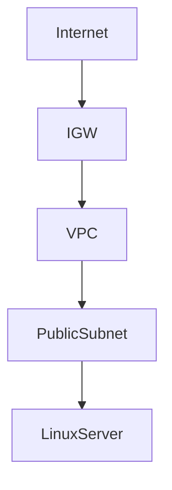
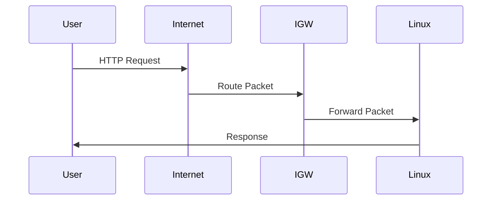
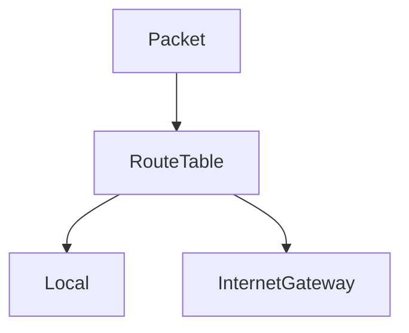
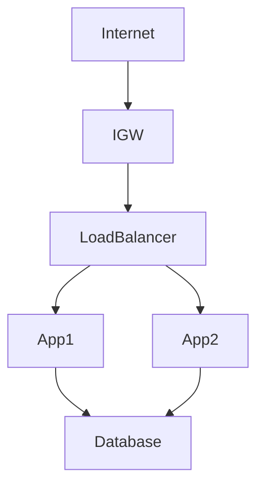
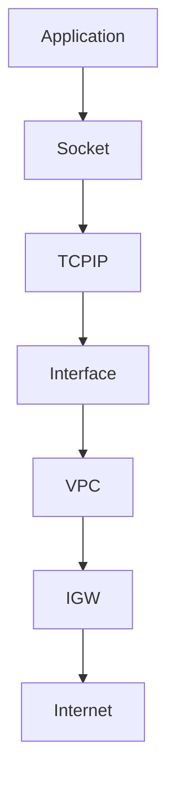

# Internet Gateways (IGW)

# Why This Exists

One of the biggest misconceptions beginners have is:

> Internet Gateway gives internet access.

Technically true.

But incomplete.

Internet Gateway is much more important than that.

It represents one of the biggest shifts in modern infrastructure:

> Physical routers became software.

Without Internet Gateways:

- Web applications cannot be accessed
- APIs cannot serve users
- Linux servers cannot communicate with external systems
- Cloud infrastructure becomes isolated

This chapter teaches Internet Gateways from first principles.

---

# The Problem It Solves

Imagine a Linux server inside a VPC.

```text
Linux

↓

10.0.1.10
```

It has a private IP.

Can users access it?

No.

Private networks are isolated.

The internet cannot directly see them.

We need a bridge.

Internet Gateway solves this.

---

# Mental Model

Imagine a private city.

```text
City

↓

Road Network

↓

City Boundary
```

People inside can communicate.

But nobody can enter or leave.

We need a highway connecting the city to the world.

That highway is an Internet Gateway.

---

# First Principles

Networks are isolated by default.

Communication requires:

```text
Addressing

Routing

Translation

Connectivity
```

Internet Gateway provides external connectivity.

---

# What Is An Internet Gateway?

An Internet Gateway is:

> A highly available software-defined router that connects a VPC to the public internet.

Think:

```text
Private Network

↓

Internet Gateway

↓

Internet
```

It is the bridge.

---

# Big Picture Architecture



---

# Data Center Evolution

## Traditional

```text
Internet

↓

Physical Router

↓

Switch

↓

Servers
```

---

## Cloud

```text
Internet

↓

Internet Gateway

↓

VPC

↓

Linux
```

The router became software.

---

# Networking Hierarchy

```text
Internet

↓

Internet Gateway

↓

VPC

↓

Subnet

↓

Linux

↓

Docker

↓

Containers
```

Internet Gateway sits near the top.

---

# Linux Perspective

Linux networking still exists.

Cloud simply virtualized it.

Linux still uses:

```text
IP Addresses

Interfaces

Routing Tables

Firewalls

Sockets
```

Nothing changes.

---

# Traffic Flow

Suppose a user opens your website.

```text
Laptop

↓

Internet

↓

Internet Gateway

↓

Load Balancer

↓

Linux Server

↓

Application
```

Every packet crosses the gateway.

---

# How Packets Travel

Step 1

User sends request.

```text
Laptop

↓

Packet
```

---

Step 2

Internet routes packet.

```text
Internet

↓

Internet Gateway
```

---

Step 3

Gateway forwards packet.

```text
Internet Gateway

↓

VPC
```

---

Step 4

Linux server receives request.

```text
Linux

↓

Application
```

---

# Visualization



---

# Internet Gateway Is Bidirectional

Traffic flows both ways.

```text
Inbound

Internet

↓

Linux

----------------

Outbound

Linux

↓

Internet
```

Both directions are supported.

---

# Route Tables Are Mandatory

Internet Gateway alone does nothing.

Routes are required.

Example:

```text
Destination      Target

10.0.0.0/16      Local

0.0.0.0/0        IGW
```

This says:

> Send unknown traffic to the internet.

---

# Traffic Visualization



Routing decides everything.

---

# Public Subnets Use IGW

Public subnet definition:

> A subnet whose route table points to an Internet Gateway.

Architecture:

```text
Public Subnet

↓

0.0.0.0/0

↓

Internet Gateway
```

That's what makes it public.

---

# Private Subnets Do Not Use IGW

Architecture:

```text
Private Subnet

↓

No Direct Route

↓

No Internet Access
```

Private means private.

---

# Production Example

Good architecture:



Only frontend resources are exposed.

---

# Never Expose Databases

Bad:

```text
Internet

↓

Database
```

Very dangerous.

---

# Good Architecture

```text
Internet

↓

Load Balancer

↓

Application

↓

Database
```

Layered security.

---

# Linux Commands Still Matter

Inside Linux:

View networking.

```bash
ip addr

ip route

ss -tulnp
```

Inspect firewall.

```bash
sudo nft list ruleset

sudo iptables -L
```

Test connectivity.

```bash
ping

traceroute

curl
```

---

# Linux Networking Visualization



Cloud never replaces Linux networking.

---

# Security Layers

Internet Gateway is NOT security.

Huge misconception.

Security layers:

```text
IAM

↓

VPC

↓

Subnets

↓

Security Groups

↓

Linux Firewall

↓

Application Security
```

Defense in depth.

---

# Internet Gateway Is Stateless

It forwards traffic.

It is not:

```text
Firewall

IDS

Authentication System
```

Its job:

```text
Connectivity
```

Only.

---

# Distributed Systems Perspective

Internet Gateway enables distributed communication.

Example:

```text
Users

↓

Internet

↓

Cloud Infrastructure

↓

Linux Systems
```

Without IGW, global systems cannot exist.

---

# Docker Relationship

Docker creates internal networks.

```text
Internet

↓

IGW

↓

Linux

↓

Docker Network

↓

Containers
```

Networking exists at multiple layers.

---

# Kubernetes Relationship

Kubernetes also depends on networking.

```text
Internet

↓

IGW

↓

Load Balancer

↓

Linux Nodes

↓

Pods
```

The chain continues.

---

# Production MERN Example

Architecture:

```text
Users

↓

Cloud CDN

↓

Internet Gateway

↓

Load Balancer

↓

Node.js Servers

↓

Redis

↓

PostgreSQL

↓

Storage
```

Common production pattern.

---

# Performance Considerations

Watch:

```text
Latency

Bandwidth

Packet Loss

Routing Delays
```

Network bottlenecks are common.

---

# Security Considerations

Never expose:

```text
Redis

Databases

Internal APIs
```

Expose only entry points.

---

# Scalability Considerations

Internet Gateways scale automatically.

But applications behind them may not.

Design horizontally.

```text
1 App Server ❌

10 App Servers ✅
```

---

# Observability Considerations

Monitor:

```text
Requests

Bandwidth

Latency

Packet Errors
```

Networking is invisible without metrics.

---

# Troubleshooting Workflow

Application unreachable.

Check:

```text
DNS

↓

Internet Gateway

↓

Route Table

↓

Security Group

↓

Linux Firewall

↓

Application
```

Debug layer by layer.

---

# Common Mistakes

## Mistake 1

Thinking IGW is security.

Wrong.

It only routes traffic.

---

## Mistake 2

Attaching databases to public subnets.

Huge risk.

---

## Mistake 3

Ignoring route tables.

Traffic depends on routes.

---

## Mistake 4

Ignoring Linux networking.

Linux still powers communication.

---

## Mistake 5

Making everything public.

Private systems should stay private.

---

# Engineering Mindset

Beginner:

> Internet Gateway gives internet access.

Engineer:

> Internet Gateway connects networks.

Senior:

> Internet Gateway is a software-defined router.

Architect:

> Internet Gateway is an infrastructure boundary.

Founder:

> Infrastructure should expose only what users need.

---

# Interview Questions

## Beginner

1. What is an Internet Gateway?

2. Why does it exist?

3. What problem does it solve?

4. What makes a subnet public?

5. Why are private IPs not reachable?

---

## Intermediate

6. Explain route table relationships.

7. Explain traffic flow.

8. Explain Linux networking underneath.

9. Explain public vs private architectures.

10. Explain security implications.

---

## Advanced

11. Design a production network architecture.

12. Explain Internet Gateway from first principles.

13. Explain software-defined networking.

14. Explain Kubernetes relationships.

15. Explain cloud networking as software.

---

# Cheat Sheet

```text
Internet Gateway = Software Defined Router

Purpose

Connect VPC

↓

Internet

Hierarchy

Internet

↓

IGW

↓

VPC

↓

Subnet

↓

Linux

↓

Docker

↓

Containers

Remember

IGW ≠ Security

IGW = Connectivity

Production Pattern

Internet

↓

Load Balancer

↓

Application

↓

Database
```

# Final Thought

Internet Gateway is another example of cloud turning hardware into software.

Before cloud:

We installed routers.

Today:

We describe connectivity.

Software creates routers.

That shift changed networking forever.

Cloud networking is simply traditional networking expressed as code at massive scale.
