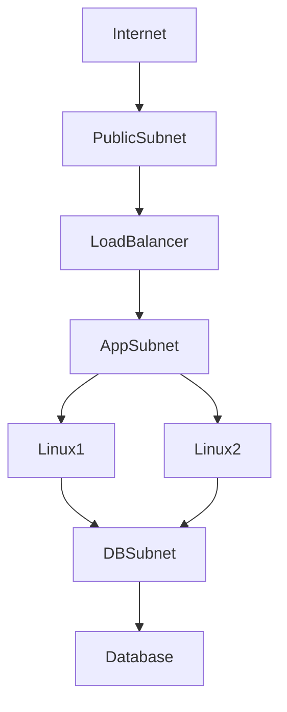
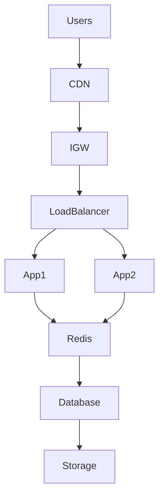
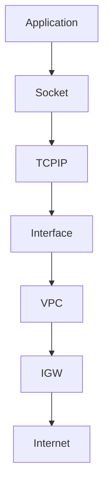
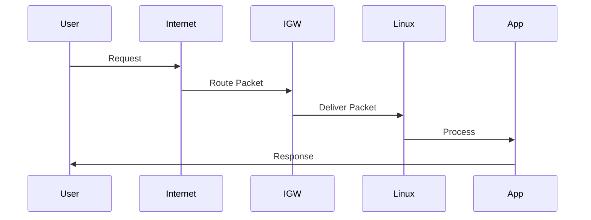
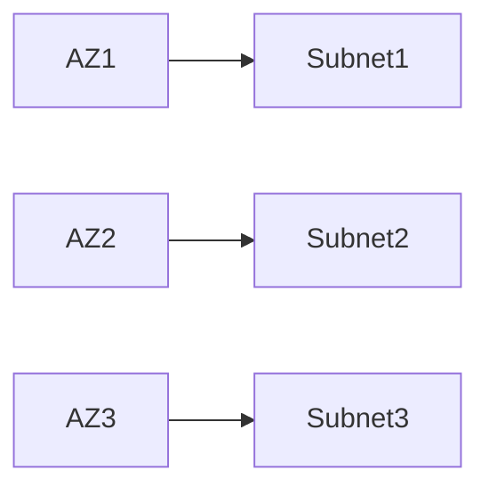
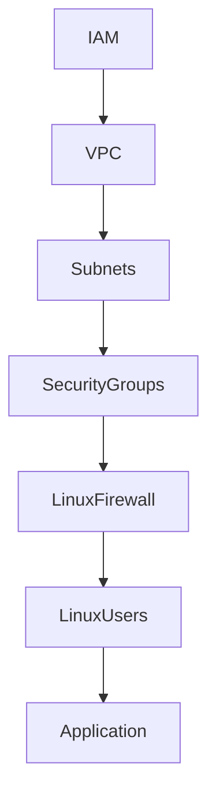
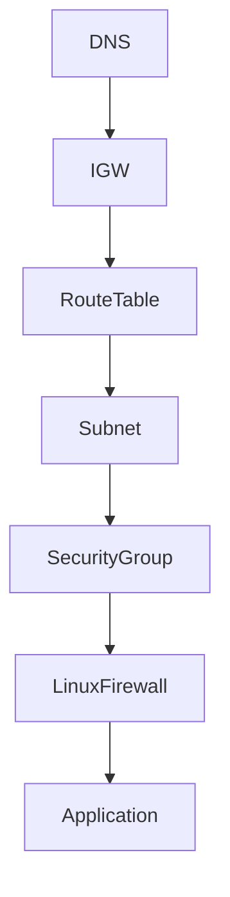
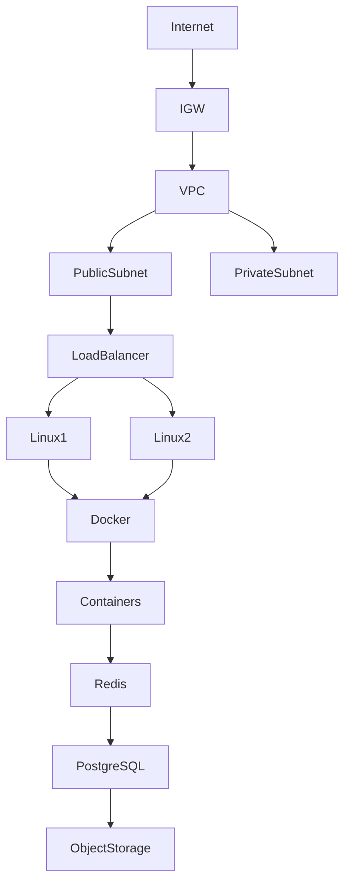

# Internet Visuals

> Cloud networking is simply Linux networking expressed at data center scale.

---

# 1. Big Picture: User To Linux Server

```text
User

↓

Internet

↓

Internet Gateway

↓

VPC

↓

Subnet

↓

Linux Server

↓

Application
```

---

# 2. Complete Cloud Networking Hierarchy

```text
Cloud Provider

↓

Region

↓

Availability Zone

↓

VPC

↓

Subnet

↓

Linux Instance

↓

Docker Network

↓

Container
```

---

# 3. Internet Gateway Mental Model

```text
World

↓

Highway

↓

Private City

↓

Buildings

↓

People
```

Equivalent:

```text
Internet

↓

Internet Gateway

↓

VPC

↓

Linux Servers
```

---

# 4. Traditional Networking vs Cloud Networking

## Traditional

```text
Internet

↓

Physical Router

↓

Switch

↓

Servers
```

## Cloud

```text
Internet

↓

Internet Gateway

↓

VPC

↓

Subnets

↓

Linux
```

---

# 5. VPC Visualization

```text
Cloud Provider

┌─────────────────────────────┐
│             VPC             │
│                             │
│  10.0.0.0/16                │
│                             │
│  ┌──────────┐ ┌──────────┐   │
│  │Subnet A  │ │Subnet B  │   │
│  └──────────┘ └──────────┘   │
│                             │
└─────────────────────────────┘
```

---

# 6. Subnet Division

```text
10.0.0.0/16

↓

10.0.1.0/24

10.0.2.0/24

10.0.3.0/24

10.0.4.0/24
```

---

# 7. CIDR Hierarchy

```text
10.0.0.0/16

↓

65,536 IPs

↓

256 Subnets

↓

256 IPs Each
```

---

# 8. Public vs Private Subnets

```text
Public

Internet

↓

Load Balancer

--------------------

Private

Application

↓

Database
```

---

# 9. Three Tier Architecture

```text
Internet

↓

Public Subnet

↓

Load Balancer

↓

Private Subnet

↓

Application Servers

↓

Private Subnet

↓

Database
```

---

# 10. Three Tier Mermaid



---

# 11. Complete Production Architecture

```text
Users

↓

Cloud CDN

↓

Internet Gateway

↓

Load Balancer

↓

Application Servers

↓

Redis

↓

Database

↓

Object Storage
```

---

# 12. Production Architecture Mermaid



---

# 13. Linux Networking Inside Cloud

```text
Application

↓

Socket

↓

TCP/IP

↓

Network Interface

↓

VPC

↓

Internet Gateway

↓

Internet
```

---

# 14. Linux Network Stack Mermaid



---

# 15. Route Table Visualization

```text
Packet

↓

Route Table

↓

Destination Match

↓

Forward Packet
```

---

# 16. Example Route Table

```text
Destination       Target

10.0.0.0/16       Local

0.0.0.0/0         IGW
```

---

# 17. Packet Journey

```text
Laptop

↓

Internet

↓

Internet Gateway

↓

VPC

↓

Linux

↓

Application

↓

Response

↓

Laptop
```

---

# 18. Packet Journey Mermaid



---

# 19. Internal Communication

```text
Linux A

↓

10.0.2.10

↓

Linux B

↓

10.0.2.20
```

No internet required.

---

# 20. Multi Availability Zone Architecture

```text
AZ1

↓

Subnet A

-----------------

AZ2

↓

Subnet B

-----------------

AZ3

↓

Subnet C
```

---

# 21. Multi AZ Mermaid



---

# 22. Security Layers

```text
IAM

↓

VPC

↓

Subnets

↓

Security Groups

↓

Linux Firewall

↓

Linux Users

↓

Applications
```

---

# 23. Defense In Depth Mermaid



---

# 24. Good Architecture

```text
Internet

↓

Load Balancer

↓

Application

↓

Database
```

---

# 25. Bad Architecture

```text
Internet

↓

Database
```

Never do this.

---

# 26. Docker Networking Relationship

```text
Cloud

↓

VPC

↓

Subnet

↓

Linux

↓

Docker Bridge

↓

Containers
```

---

# 27. Kubernetes Networking Relationship

```text
Cloud

↓

VPC

↓

Subnets

↓

Linux Nodes

↓

Pods

↓

Services
```

---

# 28. Cloud Networking Layer Cake

```text
Users

↓

Internet

↓

IGW

↓

VPC

↓

Subnet

↓

Linux

↓

Docker

↓

Containers

↓

Application
```

---

# 29. Troubleshooting Flow

```text
Application Down

↓

DNS

↓

Internet Gateway

↓

Route Table

↓

Subnet

↓

Security Group

↓

Linux Firewall

↓

Application
```

---

# 30. Network Troubleshooting Mermaid



---

# 31. Modern Infrastructure Stack

```text
Physical Data Center

↓

Cloud Infrastructure

↓

VPC

↓

Linux

↓

Docker

↓

Kubernetes

↓

Microservices

↓

Users
```

---

# 32. Cloud Networking Mental Model

```text
Physical World

City

↓

District

↓

Building

↓

Floor

↓

Apartment

-----------------------

Cloud World

VPC

↓

Subnet

↓

Linux

↓

Docker

↓

Container
```

---

# 33. Full Cloud Networking Ecosystem



---

# 34. The Entire Engineering Mental Model

```text
Internet

↓

Gateways

↓

Networks

↓

Linux

↓

Containers

↓

Orchestrators

↓

Applications

↓

Businesses
```

# Final Thought

Cloud networking is not new networking.

It is:

Linux Networking

+

Data Center Networking

+

Software Defined Networking

+

Automation

at planetary scale.
