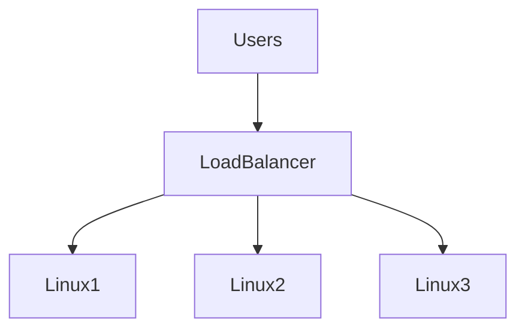
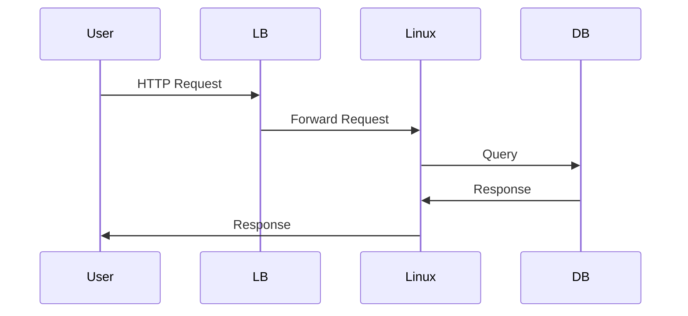
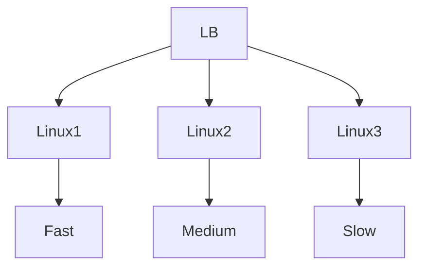
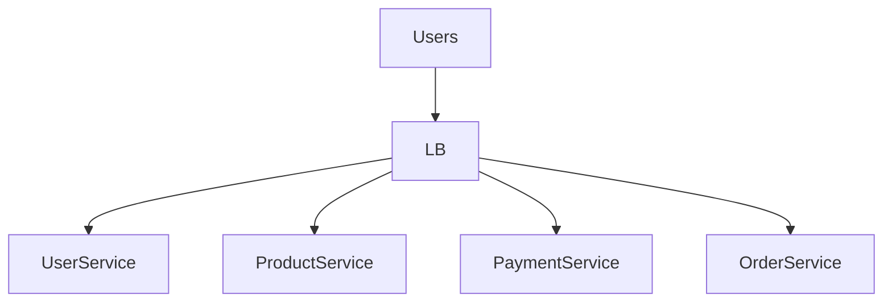

# Load Balancers

# Why This Exists

Without load balancers, the modern internet would not exist.

Every major system depends on them.

Examples:

```text
Google

Netflix

YouTube

Amazon

Instagram

GitHub

OpenAI

Uber
```

All use load balancing.

Without load balancing:

```text
1 Server

↓

Millions Of Users

↓

Server Crashes
```

Load balancers solved one of the biggest problems in computing:

> How do we distribute work among many machines?

This chapter teaches load balancing from first principles.

---

# The Problem It Solves

Imagine this architecture.

```text
100,000 Users

↓

1 Linux Server
```

Problems:

```text
CPU overload

Memory exhaustion

Network bottlenecks

Downtime

Poor reliability
```

One machine cannot serve the world.

We need multiple machines.

But users should not know those machines exist.

Load balancers solve this.

---

# Mental Model

Imagine a supermarket.

Without load balancing:

```text
100 Customers

↓

1 Cashier
```

Chaos.

With load balancing:

```text
100 Customers

↓

Traffic Manager

↓

Cashier 1

Cashier 2

Cashier 3

Cashier 4
```

The manager distributes work.

That manager is a load balancer.

---

# First Principles

Every application receives requests.

```text
Users

↓

Requests

↓

Servers
```

As users increase:

Requests increase.

Eventually one server becomes a bottleneck.

The solution:

```text
Many Servers

+

Traffic Distribution
```

---

# What Is A Load Balancer?

A load balancer is:

> A traffic distribution system that intelligently routes requests across multiple resources.

Think:

```text
Users

↓

Load Balancer

↓

Linux Servers
```

---

# Big Picture Architecture



---

# Data Center Evolution

## Traditional

```text
Users

↓

One Server
```

---

## Modern

```text
Users

↓

Load Balancer

↓

Many Servers
```

Distributed systems became possible.

---

# Why Load Balancers Exist

They solve six problems.

```text
Scalability

Availability

Reliability

Performance

Fault Tolerance

Traffic Management
```

Everything revolves around these.

---

# The Modern Internet Stack

```text
Users

↓

DNS

↓

CDN

↓

Load Balancer

↓

Linux

↓

Docker

↓

Kubernetes

↓

Applications
```

Load balancers sit near the top.

---

# Request Journey

Suppose a user opens your website.

```text
Browser

↓

DNS

↓

Load Balancer

↓

Linux Server

↓

Application

↓

Database

↓

Response
```

Every request passes through a load balancer.

---

# Visualization



---

# Core Responsibilities

Load balancers perform many jobs.

```text
Traffic Distribution

Health Checks

SSL Termination

Autoscaling Integration

Routing

Observability
```

---

# Traffic Distribution Algorithms

Load balancers make decisions.

---

# Round Robin

Simple rotation.

```text
Request 1 → Server1

Request 2 → Server2

Request 3 → Server3

Request 4 → Server1
```

---

# Least Connections

Send traffic to the least busy server.

```text
Server1 → 100 connections

Server2 → 20 connections

↓

Send to Server2
```

---

# Least Response Time

Choose the fastest server.

---

# Weighted Routing

Powerful servers get more traffic.

```text
Linux1 → Weight 5

Linux2 → Weight 2

Linux3 → Weight 1
```

---

# Visualization



---

# Health Checks

Load balancers continuously inspect systems.

Question:

```text
Is Server Healthy?
```

Example:

```text
GET /health

↓

200 OK
```

Healthy.

---

# If A Server Fails

Suppose:

```text
Linux2

↓

Crash
```

Load balancer removes it.

```text
Users

↓

Load Balancer

↓

Linux1

Linux3
```

Traffic continues.

---

# High Availability

This is one of the biggest benefits.

Without load balancing:

```text
One Failure

↓

Entire System Down
```

With load balancing:

```text
One Failure

↓

Traffic Redirected

↓

System Survives
```

---

# Linux Perspective

Linux servers become workers.

Old mindset:

```text
My Server
```

Modern mindset:

```text
My Fleet Of Linux Machines
```

Huge difference.

---

# Stateless Applications

Load balancing works best with stateless systems.

Good:

```text
Any Server

↓

Can Serve Any Request
```

Bad:

```text
User Must Return To Same Server
```

Avoid this.

---

# Session Problem

Bad architecture:

```text
Server1 Stores Session
```

If Server1 dies:

```text
User Logged Out
```

Bad experience.

---

# Better Architecture

Move state outside servers.

```text
User

↓

Load Balancer

↓

Linux

↓

Redis
```

Redis stores sessions.

Any server can respond.

---

# Sticky Sessions

Sometimes users stay attached to one server.

```text
User A

↓

Linux1
```

Useful sometimes.

Avoid when possible.

---

# Layer 4 Load Balancers

Operates at transport layer.

Works with:

```text
TCP

UDP
```

Does not inspect application data.

Fast.

---

# Layer 7 Load Balancers

Operates at application layer.

Works with:

```text
HTTP

HTTPS

gRPC
```

Can inspect requests.

Smarter.

---

# Comparison

| Feature | Layer 4 | Layer 7 |
|---------|---------|---------|
| Protocol | TCP/UDP | HTTP/HTTPS |
| Speed | Faster | Slightly slower |
| URL Routing | No | Yes |
| SSL Termination | Limited | Yes |
| Application Awareness | No | Yes |

---

# URL Routing

Example:

```text
/api/*

↓

Backend API

----------------

/images/*

↓

Image Service
```

Traffic becomes intelligent.

---

# Modern Microservices Architecture



---

# SSL Termination

HTTPS is expensive.

Load balancers often handle encryption.

```text
HTTPS

↓

Load Balancer

↓

HTTP Internal Traffic
```

This reduces server work.

---

# Autoscaling Relationship

Load balancers and autoscaling work together.

Architecture:

```text
Traffic

↓

Load Balancer

↓

Linux1

Linux2

↓

Autoscaler

↓

Linux3

Linux4
```

Dynamic systems become possible.

---

# Kubernetes Relationship

Kubernetes heavily uses load balancing.

Architecture:

```text
Internet

↓

Ingress

↓

Service

↓

Pods
```

Load balancing exists everywhere.

---

# Docker Relationship

Containers also use internal load balancing.

```text
Load Balancer

↓

Linux

↓

Docker

↓

Containers
```

Multiple layers exist.

---

# Production Example: MERN Stack

```text
Users

↓

CDN

↓

Load Balancer

↓

Node.js Servers

↓

Redis

↓

PostgreSQL
```

Very common architecture.

---

# Performance Considerations

Monitor:

```text
Latency

Requests Per Second

Bandwidth

Connection Count

Error Rates
```

Load balancers can become bottlenecks too.

---

# Security Considerations

Load balancers are often first security boundaries.

Tasks:

```text
TLS

Rate Limiting

IP Filtering

WAF

DDoS Protection
```

Never expose applications directly.

---

# Scalability Considerations

Bad:

```text
1 Linux Server
```

Good:

```text
10 Linux Servers
```

Excellent:

```text
Autoscaling Linux Fleet
```

---

# Observability Considerations

Monitor:

```text
Request Rate

Latency

Errors

Health Checks

Bandwidth
```

Three pillars remain mandatory.

```text
Logs

Metrics

Traces
```

---

# Troubleshooting Workflow

Application is slow.

Check:

```text
DNS

↓

CDN

↓

Load Balancer

↓

Linux

↓

Application

↓

Database
```

Never jump layers.

---

# Common Mistakes

## Mistake 1

Thinking load balancers are optional.

Modern systems depend on them.

---

## Mistake 2

Keeping state inside servers.

Bad architecture.

---

## Mistake 3

Ignoring health checks.

They are critical.

---

## Mistake 4

Ignoring Linux fundamentals.

Linux still powers applications.

---

## Mistake 5

Thinking load balancers solve scaling alone.

Applications must be scalable too.

---

# Engineering Mindset

Beginner:

> A load balancer distributes traffic.

Engineer:

> A load balancer orchestrates traffic.

Senior:

> A load balancer enables distributed systems.

Architect:

> A load balancer is a reliability boundary.

Founder:

> Infrastructure should scale with customers.

---

# Interview Questions

## Beginner

1. What is a load balancer?

2. Why does it exist?

3. What problems does it solve?

4. What are health checks?

5. What is high availability?

---

## Intermediate

6. Explain Round Robin.

7. Explain Least Connections.

8. Explain sticky sessions.

9. Explain Layer 4 vs Layer 7.

10. Explain autoscaling relationships.

---

## Advanced

11. Design a load-balanced architecture for 10 million users.

12. Explain stateless systems.

13. Explain Kubernetes load balancing.

14. Explain distributed systems relationships.

15. Explain load balancing from first principles.

---

# Cheat Sheet

```text
Load Balancer = Traffic Orchestrator

Responsibilities

Distribute Traffic

Health Checks

SSL Termination

Routing

Observability

Algorithms

Round Robin

Least Connections

Least Response Time

Weighted Routing

Modern Stack

Users

↓

DNS

↓

CDN

↓

Load Balancer

↓

Linux

↓

Docker

↓

Kubernetes

↓

Applications

Mindset

Load balancers make distributed systems possible.
```

# Final Thought

Load balancers are one of the technologies that transformed computing from:

```text
One Machine

↓

One Application
```

into:

```text
Millions Of Users

↓

Thousands Of Machines

↓

One System
```

That transformation is the foundation of the modern internet.

Distributed systems are simply many Linux machines coordinated by networking, and load balancers are one of the conductors of that orchestra.
