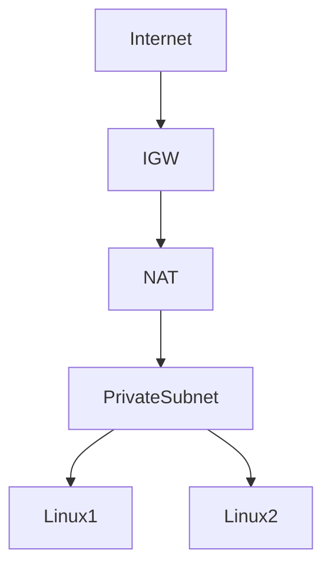
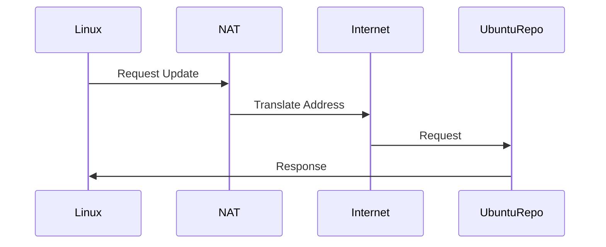
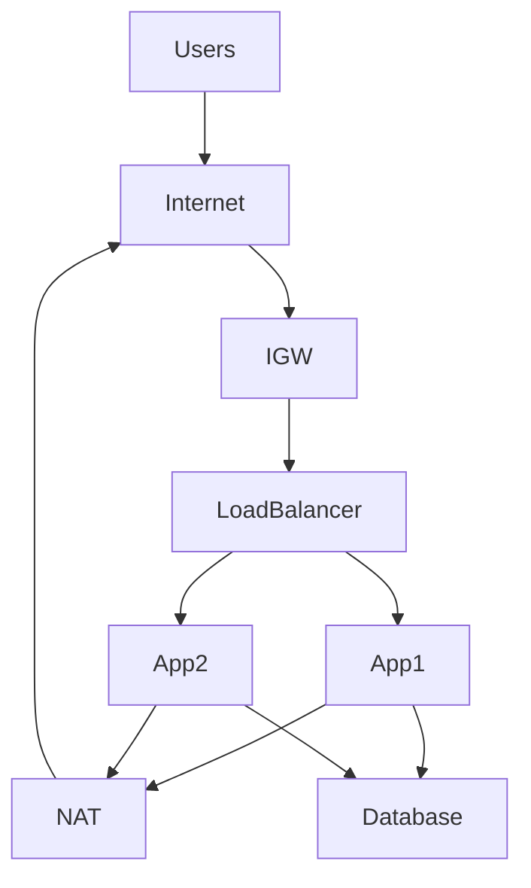
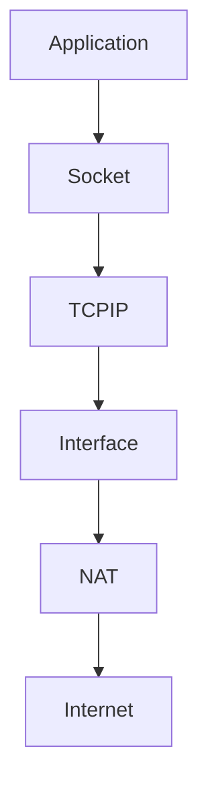

# NAT Gateways

# Why This Exists

One of the biggest mistakes beginners make is thinking:

> Private servers cannot use the internet.

This is wrong.

The real question is:

> How can private infrastructure safely access the internet without exposing itself?

This is exactly why NAT Gateways exist.

Without NAT Gateways:

- Linux servers cannot download updates
- Containers cannot pull images
- Applications cannot call external APIs
- Kubernetes nodes cannot function properly

But exposing everything directly to the internet is dangerous.

NAT Gateways solve this problem.

---

# The Problem It Solves

Imagine a production application.

```text
Internet

↓

Application Servers

↓

Database
```

Your application server needs to:

```text
Download OS updates

Call Payment APIs

Call Email APIs

Pull Docker Images

Send Analytics Data
```

Should we make it public?

No.

That creates a huge attack surface.

We need controlled access.

---

# Mental Model

Imagine a company office.

Employees need to go outside.

But outsiders should not freely enter the office.

So the company creates:

```text
One Main Exit Gate

↓

Employees Can Exit

↓

Visitors Cannot Enter
```

That gate is NAT.

---

# First Principles

Networking has two directions.

## Inbound

```text
Internet

↓

Your Infrastructure
```

---

## Outbound

```text
Your Infrastructure

↓

Internet
```

Production systems should minimize inbound traffic.

Outbound traffic is much safer.

---

# What Is NAT?

NAT stands for:

```text
Network Address Translation
```

It translates addresses.

Private addresses become public addresses.

---

# What Is A NAT Gateway?

A NAT Gateway is:

> A managed service that allows private resources to initiate outbound internet communication while preventing inbound internet access.

Think:

```text
Private Servers

↓

NAT Gateway

↓

Internet
```

---

# Big Picture Architecture



---

# Traditional Data Center Equivalent

Before cloud:

```text
Linux

↓

Firewall

↓

Router

↓

Internet
```

Today:

```text
Linux

↓

NAT Gateway

↓

Internet
```

Hardware became software.

---

# Why Private Servers Need Internet

Examples:

## Linux Updates

```bash
sudo apt update
```

Needs internet.

---

## Docker Images

```bash
docker pull nginx
```

Needs internet.

---

## External APIs

```text
Stripe

Twilio

OpenAI

Google APIs
```

Need internet.

---

# The Security Problem

Bad architecture:

```text
Internet

↓

Linux Server
```

Everyone can reach it.

---

# Better Architecture

```text
Linux

↓

NAT Gateway

↓

Internet
```

Linux initiates communication.

Internet cannot initiate communication.

---

# The Networking Hierarchy

```text
Internet

↓

Internet Gateway

↓

NAT Gateway

↓

Private Subnet

↓

Linux

↓

Docker

↓

Containers
```

---

# NAT Traffic Flow

Suppose Linux needs updates.

```text
Linux

↓

NAT Gateway

↓

Internet

↓

Ubuntu Repository

↓

Response

↓

Linux
```

Communication succeeds.

---

# Visualization



---

# Why Inbound Traffic Is Blocked

Suppose an attacker tries.

```text
Internet

↓

Private Linux
```

There is no route.

Connection fails.

This is intentional.

---

# Public vs Private Subnets

## Public

```text
Internet

↓

Internet Gateway

↓

Load Balancer
```

Publicly accessible.

---

## Private

```text
Linux

↓

NAT Gateway

↓

Internet
```

Outbound only.

---

# Production Architecture

Industry standard.



---

# Multi-Tier Architecture

```text
Internet

↓

Public Subnet

↓

Load Balancer

↓

Private Subnet

↓

Application

↓

Private Subnet

↓

Database
```

Very common.

---

# Linux Perspective

Linux networking still exists.

Cloud does not replace Linux.

Linux still uses:

```text
IP Addresses

Interfaces

Routing Tables

Sockets

Firewalls
```

---

# Linux Network Stack



---

# Route Tables Make NAT Work

Private subnet route table.

```text
Destination      Target

10.0.0.0/16      Local

0.0.0.0/0        NAT Gateway
```

This means:

```text
Unknown traffic

↓

Send to NAT
```

---

# NAT Translation Example

Private Linux:

```text
10.0.2.10
```

NAT Public IP:

```text
54.220.x.x
```

Internet sees:

```text
54.220.x.x
```

Not:

```text
10.0.2.10
```

Address translation occurred.

---

# Visualization

```text
10.0.2.10

↓

NAT

↓

54.220.x.x

↓

Internet
```

---

# Linux Security Layers

Defense in depth.

```text
IAM

↓

VPC

↓

Subnets

↓

Security Groups

↓

Linux Firewall

↓

Applications
```

NAT is not security itself.

It reduces exposure.

---

# NAT vs Internet Gateway

| Feature | Internet Gateway | NAT Gateway |
|---------|-----------------|-------------|
| Internet access | Yes | Outbound only |
| Inbound traffic | Yes | No |
| Outbound traffic | Yes | Yes |
| Used by | Public subnet | Private subnet |
| Security | Lower | Higher |

---

# NAT And Kubernetes

Kubernetes nodes often live in private subnets.

Architecture:

```text
Internet

↓

NAT Gateway

↓

Linux Nodes

↓

Pods
```

Pods need internet access.

---

# NAT And Docker

Containers often need internet.

```text
Container

↓

Docker Network

↓

Linux

↓

NAT

↓

Internet
```

Example:

```bash
docker pull postgres
```

Needs outbound access.

---

# Production Example: MERN Stack

```text
Users

↓

CDN

↓

Load Balancer

↓

Node.js Servers

↓

Redis

↓

PostgreSQL
```

Node.js servers live in private subnets.

When Node.js calls:

```text
Stripe API

↓

NAT Gateway

↓

Internet
```

This is extremely common.

---

# Data Flow Example

User purchases an item.

```text
User

↓

Load Balancer

↓

Node.js

↓

Stripe API

↓

NAT Gateway

↓

Internet

↓

Stripe

↓

Response
```

---

# Performance Considerations

Watch:

```text
Bandwidth

Latency

Connection Limits

Traffic Volume
```

Heavy workloads may require multiple NAT gateways.

---

# Security Considerations

Good:

```text
Private Infrastructure

↓

Outbound Only
```

Bad:

```text
Everything Public
```

Reduce attack surfaces.

---

# Scalability Considerations

Avoid:

```text
Single Availability Zone NAT
```

Prefer:

```text
One NAT per AZ
```

Improves resilience.

---

# Observability Considerations

Monitor:

```text
Connections

Bandwidth

Latency

Errors

Dropped Traffic
```

Networking problems are invisible without monitoring.

---

# Troubleshooting Workflow

Linux cannot access internet.

Check:

```text
Route Table

↓

NAT Gateway

↓

Internet Gateway

↓

Security Group

↓

Linux Firewall

↓

DNS
```

Debug layer by layer.

---

# Common Mistakes

## Mistake 1

Making everything public.

Huge security risk.

---

## Mistake 2

Thinking NAT is a firewall.

Wrong.

NAT translates addresses.

---

## Mistake 3

Ignoring route tables.

Traffic depends on routes.

---

## Mistake 4

Ignoring Linux networking.

Linux still powers communication.

---

## Mistake 5

Putting databases in public subnets.

Never do this.

---

# Engineering Mindset

Beginner:

> NAT gives internet access.

Engineer:

> NAT provides outbound communication.

Senior:

> NAT reduces attack surfaces.

Architect:

> NAT enables secure distributed infrastructure.

Founder:

> Infrastructure should minimize risk while enabling growth.

---

# Interview Questions

## Beginner

1. What is NAT?

2. Why does NAT exist?

3. What is a NAT Gateway?

4. Why do private servers need internet?

5. What problem does NAT solve?

---

## Intermediate

6. Explain address translation.

7. Explain NAT architecture.

8. Explain route tables.

9. Explain public vs private subnets.

10. Explain Linux networking underneath NAT.

---

## Advanced

11. Design a production network architecture.

12. Explain NAT from first principles.

13. Explain Kubernetes relationships.

14. Explain security implications.

15. Explain software-defined networking.

---

# Cheat Sheet

```text
NAT = Network Address Translation

Purpose

Private Infrastructure

↓

Outbound Internet Access

↓

No Inbound Access

Hierarchy

Internet

↓

IGW

↓

NAT

↓

Private Subnet

↓

Linux

↓

Docker

↓

Containers

Production Pattern

Internet

↓

Load Balancer

↓

Application

↓

Database

Mindset

NAT = Controlled Outbound Communication
```

# Final Thought

NAT Gateway is another example of cloud transforming hardware into software.

Before cloud:

We bought routers.

Today:

We declare networking policies.

Software builds the network.

Modern infrastructure is not about exposing machines.

It is about exposing only what is necessary and protecting everything else.
