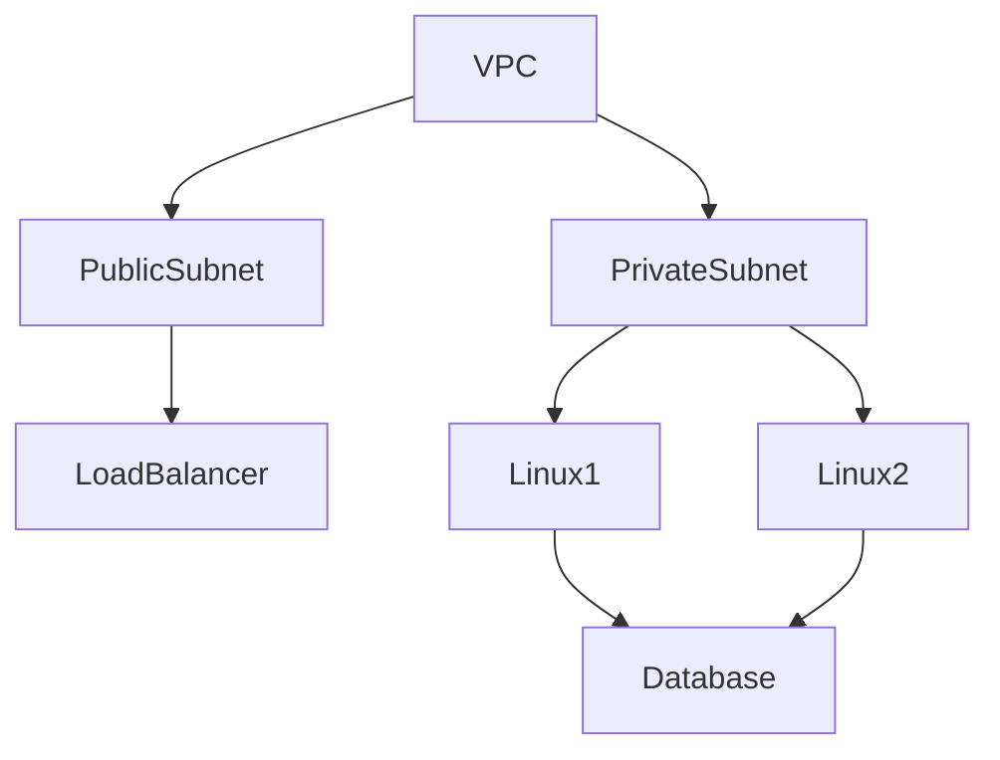
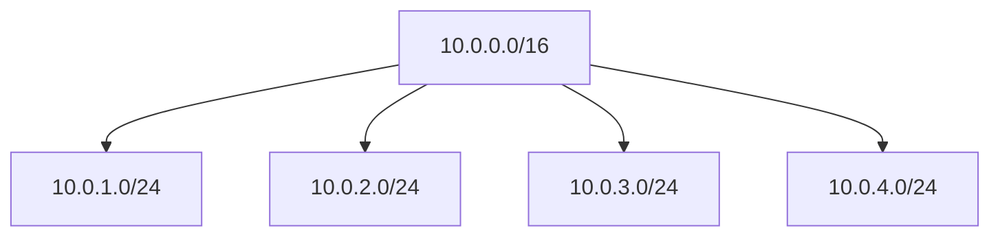
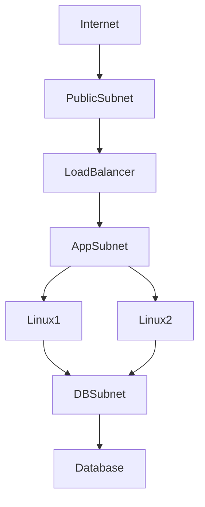
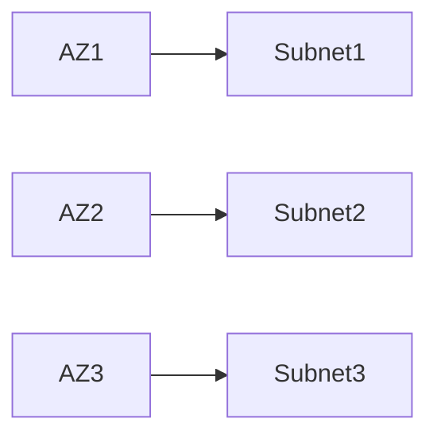
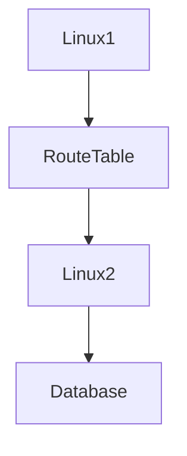

# Subnets

# Why This Exists

One of the biggest misconceptions beginners have is:

> A subnet is just a smaller network.

Technically true.

But completely insufficient.

Subnets are one of the most important engineering concepts in networking.

Without subnets:

- Large systems become chaotic
- Security becomes difficult
- Scaling becomes difficult
- Traffic management becomes difficult
- Distributed systems become fragile

Subnets exist to create order.

Cloud simply brought subnetting into software.

This chapter teaches subnets from first principles.

---

# The Problem It Solves

Imagine a company with:

```text
1000 Servers

100 Databases

200 Containers

100 Kubernetes Nodes
```

Everything inside one giant network.

```text
10.0.0.0/16
```

Problems:

```text
Broadcast complexity

Security issues

Traffic congestion

Operational chaos

Difficult troubleshooting
```

We need segmentation.

Subnets solve this.

---

# Mental Model

Imagine a city.

Without districts:

```text
1 Giant City
```

Chaos.

With districts:

```text
Residential

Commercial

Industrial

Government
```

Everything becomes organized.

Subnets do exactly this.

---

# First Principles

Networks need:

```text
Organization

Isolation

Security

Scalability
```

Subnetting creates boundaries.

---

# What Is A Subnet?

A subnet is:

> A smaller network created from a larger network.

Think:

```text
VPC

↓

Smaller Sections

↓

Subnets
```

Each subnet gets its own IP range.

---

# Big Picture Architecture



---

# Data Center Evolution

## Traditional

```text
Physical Network

↓

Switches

↓

VLANs

↓

Servers
```

---

## Cloud

```text
VPC

↓

Subnets

↓

Linux Instances
```

Networking became software.

---

# Why Subnets Exist

Subnets solve four problems.

```text
Organization

Security

Scalability

Traffic Control
```

Everything revolves around these.

---

# Linux Perspective

Linux already understands networking.

Cloud simply virtualizes it.

Linux concepts still exist.

```text
IP Addresses

Routing

Interfaces

Sockets

Firewalls
```

Subnets build on these concepts.

---

# Network Hierarchy

```text
Cloud Provider

↓

VPC

↓

Subnet

↓

Linux Instance

↓

Docker Network

↓

Containers
```

Networking exists at multiple layers.

---

# CIDR Refresher

Suppose your VPC is:

```text
10.0.0.0/16
```

Available:

```text
65,536 IPs
```

You divide it.

---

# Example Subnet Division

```text
10.0.0.0/16

↓

10.0.1.0/24

10.0.2.0/24

10.0.3.0/24

10.0.4.0/24
```

Each subnet contains:

```text
256 IP addresses
```

---

# Visualization



---

# Public Subnets

Public subnets can reach the internet.

Typically contain:

```text
Load Balancers

Reverse Proxies

API Gateways
```

Example:

```text
10.0.1.0/24
```

---

# Private Subnets

Private subnets cannot directly access the internet.

Typically contain:

```text
Application Servers

Redis

Databases
```

Example:

```text
10.0.2.0/24
```

Production systems heavily use these.

---

# Three-Tier Architecture

Industry standard architecture.

```text
Public Subnet

↓

Load Balancer

↓

Private Subnet

↓

Application Servers

↓

Private Subnet

↓

Databases
```

---

# Visualization



---

# Linux Inside Subnets

Linux still manages networking.

```text
IP

↓

Interface

↓

Routing

↓

Firewall

↓

Sockets
```

Cloud never replaces Linux networking.

---

# Internal Communication

Servers communicate using private IPs.

Example:

```text
Linux1

↓

10.0.2.10

↓

Linux2

↓

10.0.2.20
```

Fast and secure.

---

# Availability Zones

Production systems spread subnets.

Example:

```text
AZ1

↓

Subnet A

----------------

AZ2

↓

Subnet B

----------------

AZ3

↓

Subnet C
```

This improves reliability.

---

# Multi-AZ Visualization



Never put everything in one zone.

---

# Routing Between Subnets

Traffic uses routing tables.

Example:

```text
Linux1

↓

Route Table

↓

Linux2
```

Packets always consult routes.

---

# Traffic Flow



Routing is everywhere.

---

# Security Boundaries

Subnets are security boundaries.

Example:

```text
Internet

↓

Public Subnet

↓

Private Subnet

↓

Database Subnet
```

Each layer adds protection.

---

# Linux Security Layers

Security stack:

```text
IAM

↓

Subnet Isolation

↓

Security Groups

↓

Linux Firewall

↓

Linux Users

↓

Applications
```

Defense in depth.

---

# Kubernetes Relationship

Kubernetes depends heavily on networking.

Architecture:

```text
VPC

↓

Subnets

↓

Linux Nodes

↓

Pods

↓

Services
```

Subnets host Kubernetes nodes.

---

# Docker Relationship

Docker also creates internal networks.

```text
VPC

↓

Subnet

↓

Linux

↓

Docker Bridge

↓

Containers
```

Multiple network layers exist.

---

# Production Example: MERN Stack

Architecture:

```text
Users

↓

Load Balancer

↓

Node.js Servers

↓

Redis

↓

PostgreSQL

↓

Storage
```

Deployment:

```text
Public Subnet

↓

Load Balancer

↓

Private Subnet

↓

Node.js

↓

Private Subnet

↓

Database
```

Very common.

---

# Large Enterprise Architecture

```text
VPC

├── Public Subnet
├── API Subnet
├── Backend Subnet
├── Cache Subnet
├── Database Subnet
└── Analytics Subnet
```

Large companies separate responsibilities.

---

# Performance Considerations

Watch:

```text
Latency

Bandwidth

Routing Complexity

Cross-Zone Traffic
```

Poor subnet design creates bottlenecks.

---

# Security Considerations

Never place databases here:

```text
Internet

↓

Database
```

Always isolate.

Good:

```text
Internet

↓

Load Balancer

↓

Application

↓

Database
```

---

# Scalability Considerations

Plan IP ranges carefully.

Bad:

```text
10.0.1.0/28
```

Tiny.

Good:

```text
10.0.0.0/16
```

Leave room for growth.

---

# Observability Considerations

Monitor:

```text
Latency

Packet Drops

Bandwidth

Errors
```

Networking failures are common.

---

# Troubleshooting Workflow

Application cannot connect.

Check:

```text
DNS

↓

Subnet

↓

Route Table

↓

Security Group

↓

Linux Firewall

↓

Application
```

Debug layer by layer.

---

# Common Mistakes

## Mistake 1

Making everything public.

Huge security risk.

---

## Mistake 2

Poor IP planning.

Future growth becomes difficult.

---

## Mistake 3

Ignoring routing.

Networking depends on routes.

---

## Mistake 4

Ignoring Linux networking.

Linux still powers communication.

---

## Mistake 5

Putting databases in public subnets.

Never do this.

---

# Engineering Mindset

Beginner:

> A subnet is a smaller network.

Engineer:

> A subnet organizes infrastructure.

Senior:

> A subnet is a security boundary.

Architect:

> Subnets define distributed system topology.

Founder:

> Networks should safely enable growth.

---

# Interview Questions

## Beginner

1. What is a subnet?

2. Why do subnets exist?

3. What is a public subnet?

4. What is a private subnet?

5. What is CIDR?

---

## Intermediate

6. Explain subnet architecture.

7. Explain subnet routing.

8. Explain subnet security.

9. Explain subnet isolation.

10. Explain Linux networking inside subnets.

---

## Advanced

11. Design a production subnet architecture.

12. Explain Kubernetes networking relationships.

13. Explain subnetting from first principles.

14. Explain availability zone design.

15. Explain cloud networking as software.

---

# Cheat Sheet

```text
Subnet = Organized Network Boundary

Hierarchy

Cloud

↓

VPC

↓

Subnet

↓

Linux

↓

Docker

↓

Containers

Types

Public

Private

Common Architecture

Internet

↓

Load Balancer

↓

Application

↓

Database

Goals

Organization

Security

Scalability

Isolation

Mindset

Subnets create order.
```

# Final Thought

Subnets are not an AWS concept.

Subnets are not a cloud feature.

Subnets are how engineers bring order to large systems.

As infrastructure grows:

One network becomes impossible.

Networks become neighborhoods.

Neighborhoods become systems.

That idea powers modern cloud engineering.
