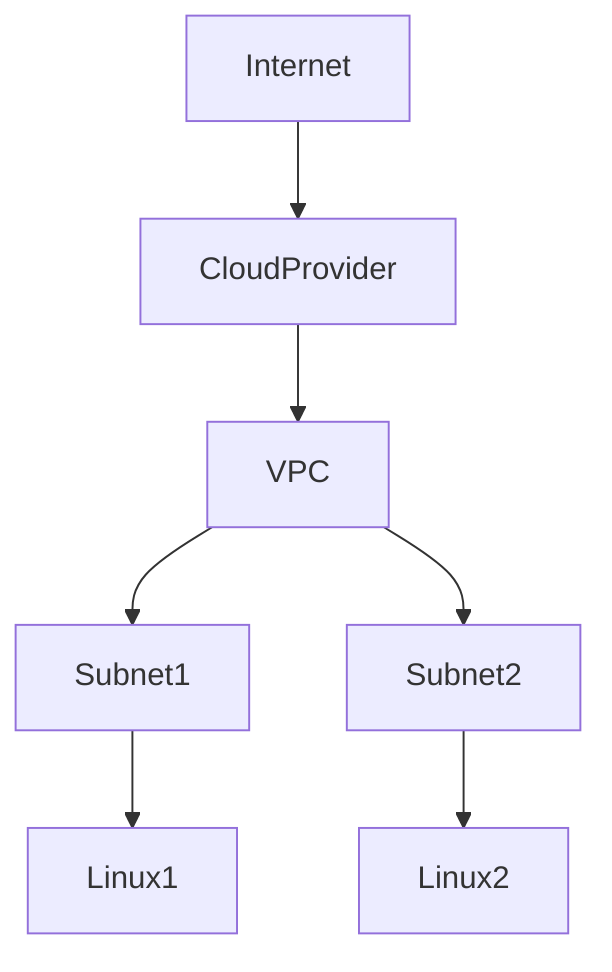
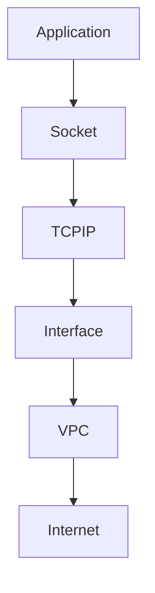
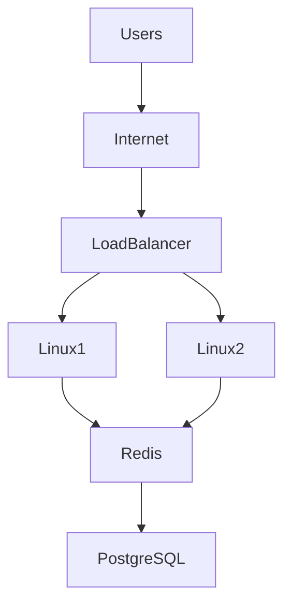
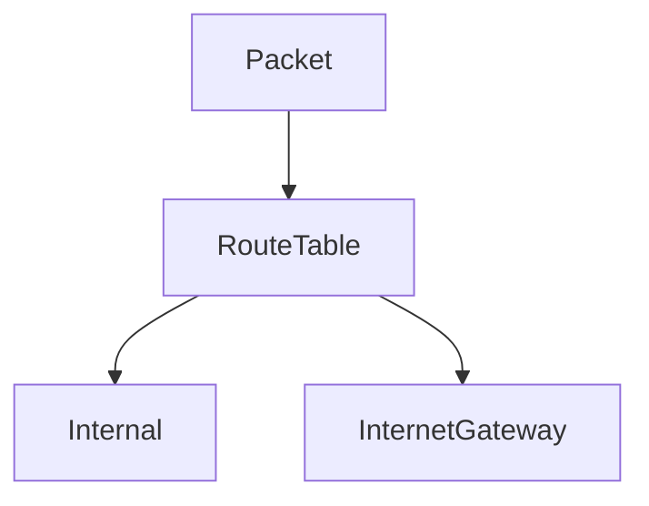

# Virtual Private Cloud (VPC)

# Why This Exists

One of the biggest misconceptions beginners have is:

> VPC is an AWS feature.

This is wrong.

VPC is an engineering concept.

Every cloud provider has some version of it.

```text
AWS → VPC

Azure → VNet

GCP → VPC
```

The names differ.

The idea is the same.

A VPC is one of the most important concepts in cloud engineering because it transforms networking into software.

Without VPCs:

- Cloud could not isolate customers
- Cloud security would be difficult
- Multi-tenancy would break
- Distributed systems would become dangerous

This chapter teaches VPCs from first principles.

---

# The Problem It Solves

Imagine cloud providers without VPCs.

```text
Customer A Servers

Customer B Servers

Customer C Servers

All Inside One Giant Network
```

Problems:

```text
No Isolation

Security Risks

IP Conflicts

Traffic Leakage

Operational Chaos
```

We need isolation.

VPC solves this.

---

# Mental Model

Think of an apartment complex.

```text
Big Building

↓

Apartment A

Apartment B

Apartment C
```

Everyone lives in the same building.

But everyone has private space.

A VPC is your private apartment inside a massive cloud building.

---

# First Principles

Every application needs networking.

Networking means:

```text
Devices

↓

IP Addresses

↓

Routing

↓

Communication
```

Cloud providers virtualized all of these.

Networking became software.

---

# What Is A VPC?

A VPC is:

> A logically isolated private network inside a cloud provider.

Think:

```text
Your Private Data Center

Inside

A Massive Public Data Center
```

---

# Big Picture Architecture



---

# Data Center Evolution

## Traditional

```text
Physical Data Center

↓

Switches

↓

Routers

↓

Servers
```

---

## Modern Cloud

```text
Software Defined Data Center

↓

VPC

↓

Subnets

↓

Linux Instances
```

Everything became programmable.

---

# What Exists Inside A VPC?

A VPC contains:

```text
IP Address Range

Subnets

Routing Tables

Gateways

Security Rules

Linux Instances
```

Think of it as an entire private network.

---

# VPC Components

```text
VPC

├── CIDR Block
├── Subnets
├── Route Tables
├── Internet Gateway
├── NAT Gateway
├── Security Groups
├── Network ACLs
└── Linux Instances
```

---

# CIDR Blocks

A VPC begins with IP allocation.

Example:

```text
10.0.0.0/16
```

This means:

```text
65,536 IP Addresses
```

The VPC owns this space.

---

# Visualization

```text
10.0.0.0/16

↓

10.0.1.0/24

10.0.2.0/24

10.0.3.0/24
```

The network gets divided later.

---

# Linux Perspective

Linux already knows networking.

Linux concepts still apply.

```text
IP Address

Routing

Firewalls

Sockets

Interfaces
```

Cloud simply virtualizes them.

---

# Linux Networking Stack



Linux networking still exists underneath.

---

# VPC Is Software Defined Networking (SDN)

Old networking:

```text
Cable

↓

Switch

↓

Router
```

Cloud networking:

```text
API

↓

Software

↓

Virtual Network
```

Huge shift.

---

# VPC Isolation

Customers cannot see each other.

```text
Cloud Provider

↓

VPC A

↓

Linux A

------------------

VPC B

↓

Linux B
```

Isolation is the key feature.

---

# Data Flow Example

```text
User

↓

Internet

↓

VPC

↓

Load Balancer

↓

Linux Server

↓

Database
```

Traffic stays controlled.

---

# Internal Communication

Inside a VPC:

Servers communicate privately.

```text
Linux1

↓

10.0.1.10

↓

Linux2

↓

10.0.2.20
```

No internet required.

---

# Why Private Networks Matter

Benefits:

```text
Security

Performance

Low Latency

Reduced Cost
```

Internal traffic is faster.

---

# Public IP vs Private IP

## Public IP

Reachable from internet.

Example:

```text
34.120.x.x
```

---

## Private IP

Only inside VPC.

Example:

```text
10.0.1.10
```

Production systems prefer private IPs.

---

# Example Production Architecture



All backend systems stay private.

---

# Multi-Tier Architecture

Very common.

```text
Internet

↓

Public Layer

↓

Application Layer

↓

Database Layer
```

Each layer is isolated.

---

# Three Tier Visualization

```text
Public Subnet

↓

Load Balancer

↓

Private Subnet

↓

Linux Servers

↓

Private Subnet

↓

Database
```

This is industry standard.

---

# VPC And Linux Security

Multiple security layers.

```text
IAM

↓

VPC

↓

Security Groups

↓

Linux Firewall

↓

Linux Users

↓

Applications
```

Never trust one layer.

---

# Routing Tables

Routing decides traffic movement.

Example:

```text
Destination

↓

Where To Send Traffic
```

Think GPS for packets.

---

# Example Route Table

```text
Destination      Target

10.0.0.0/16      Local

0.0.0.0/0        Internet Gateway
```

---

# Traffic Flow Visualization



Every packet uses routing rules.

---

# VPC And Kubernetes

Kubernetes heavily depends on networking.

Architecture:

```text
VPC

↓

Linux Nodes

↓

Pods

↓

Services
```

Everything lives inside networks.

---

# VPC And Docker

Docker also creates networks.

```text
Cloud VPC

↓

Linux

↓

Docker Network

↓

Containers
```

Networking exists at multiple layers.

---

# VPC Hierarchy

```text
Cloud Provider

↓

VPC

↓

Subnet

↓

Linux Instance

↓

Docker

↓

Container
```

Each layer adds isolation.

---

# Production Example: MERN Stack

Architecture:

```text
Users

↓

Cloud CDN

↓

Load Balancer

↓

Node.js Linux Servers

↓

Redis

↓

PostgreSQL

↓

Object Storage
```

All resources live inside one VPC.

---

# Performance Considerations

Watch:

```text
Network Latency

Bandwidth

Packet Loss

Routing Complexity
```

More layers = more complexity.

---

# Security Considerations

Never expose databases publicly.

Bad:

```text
Internet

↓

Database
```

Good:

```text
Internet

↓

Load Balancer

↓

Application

↓

Database
```

Keep databases private.

---

# Scalability Considerations

Design for growth.

Bad:

```text
Tiny CIDR

10.0.0.0/28
```

Good:

```text
10.0.0.0/16
```

Leave room for future systems.

---

# Observability Considerations

Monitor networking.

Collect:

```text
Traffic Metrics

Latency

Packet Drops

Errors
```

Networking failures are common.

---

# Troubleshooting Workflow

Application cannot communicate.

Check:

```text
DNS

↓

VPC

↓

Route Tables

↓

Security Groups

↓

Linux Firewall

↓

Application
```

Always debug layer by layer.

---

# Common Mistakes

## Mistake 1

Thinking VPC is AWS specific.

Wrong.

It's an engineering concept.

---

## Mistake 2

Making everything public.

Huge security risk.

---

## Mistake 3

Ignoring IP planning.

This causes future pain.

---

## Mistake 4

Ignoring routing.

Networking depends on routing.

---

## Mistake 5

Ignoring Linux networking.

Linux still powers communication.

---

# Engineering Mindset

Beginner:

> VPC is a cloud feature.

Engineer:

> VPC is a private network.

Senior:

> VPC is software-defined networking.

Architect:

> VPC is a distributed infrastructure boundary.

Founder:

> Networks should safely enable business growth.

---

# Interview Questions

## Beginner

1. What is a VPC?

2. Why does it exist?

3. Why is isolation important?

4. What is a CIDR block?

5. What is a private IP?

---

## Intermediate

6. Explain software-defined networking.

7. Explain route tables.

8. Explain VPC architecture.

9. Explain Linux networking inside VPCs.

10. Explain public vs private communication.

---

## Advanced

11. Design a production VPC.

12. Explain multi-tier architecture.

13. Explain VPC and Kubernetes relationships.

14. Explain VPC from first principles.

15. Explain cloud networking as software.

---

# Cheat Sheet

```text
VPC = Software Defined Private Data Center

Components

CIDR

Subnets

Route Tables

Internet Gateway

NAT Gateway

Security Groups

Linux Instances

Hierarchy

Cloud

↓

VPC

↓

Subnet

↓

Linux

↓

Docker

↓

Containers

Mindset

Cloud networking = Linux networking at scale.
```

# Final Thought

VPC is one of the moments where infrastructure became software.

Before cloud:

Engineers built networks.

Today:

Engineers describe networks.

Software builds them.

That shift changed infrastructure forever.

If Linux networking is the language, VPC is simply that language spoken at cloud scale.
