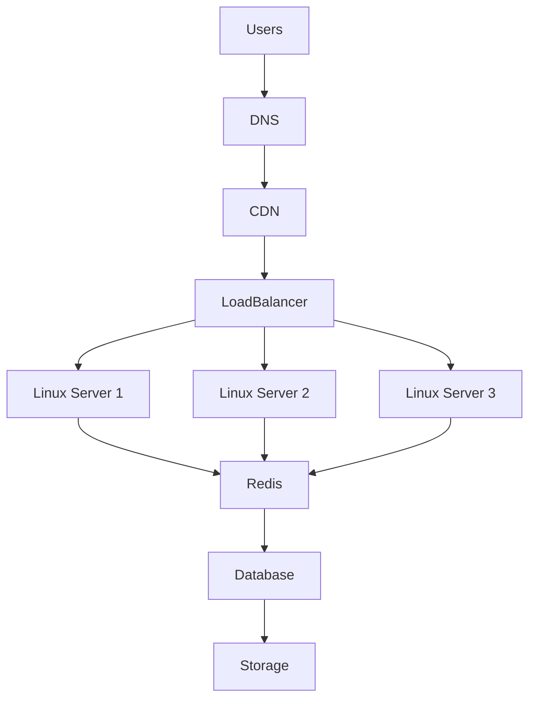
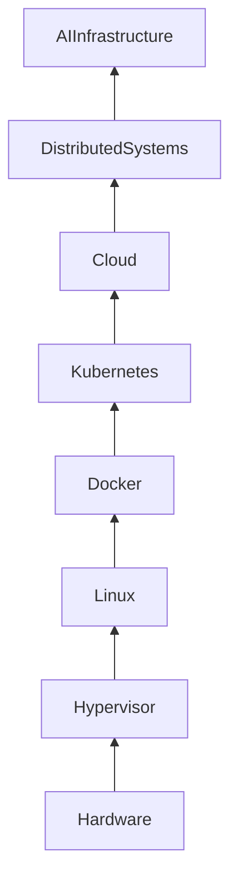

# ☁️ Cloud Linux Engineering Handbook

> Linux is no longer just an operating system installed on a physical machine.
>
> Today, Linux is the operating system that powers the modern world.
>
> Almost every cloud, data center, container platform, AI infrastructure, database cluster, and distributed system runs on Linux.

---

# Welcome to Cloud Linux

This section bridges two worlds:

- Linux Engineering
- Cloud Engineering

Many people learn these separately.

This repository intentionally teaches them together.

Because modern cloud engineering is simply Linux engineering at massive scale.

If you understand Linux deeply, cloud becomes intuitive.

If Linux is weak, cloud becomes memorization.

---

# Why This Folder Exists

Most cloud courses teach:

"Click this button in AWS."

"Create a VM."

"Launch a load balancer."

"Create a VPC."

People memorize services without understanding the underlying systems.

This creates engineers who can deploy things but cannot troubleshoot them.

This folder exists to fix that.

We will build cloud intuition from first principles.

We will answer questions like:

- Why did cloud exist?
- Why wasn't Linux enough?
- Why do companies migrate from on-premise?
- Why do VPCs exist?
- Why are subnets necessary?
- Why do load balancers exist?
- Why does autoscaling exist?
- Why do cloud bills explode?
- Why is IAM difficult?
- Why do Kubernetes and Docker fit naturally into cloud?

This is not an AWS course.

This is Cloud Engineering through Linux thinking.

---

# Learning Philosophy

We always follow this sequence:

```
Problem
 ↓
Why
 ↓
Mental Model
 ↓
First Principles
 ↓
Architecture
 ↓
Implementation
 ↓
Production Engineering
```

Never memorize services.

Always understand systems.

---

# The Big Picture

```text
Traditional Linux

Your Laptop
    │
    │
One Linux Server
    │
    │
Application Runs


Modern Cloud Linux

Millions of Users
        │
        │
Internet
        │
        │
Load Balancer
        │
        │
Virtual Network
        │
        │
Autoscaling Linux Servers
        │
        │
Containers
        │
        │
Databases
        │
        │
Storage Systems
```

---

# Cloud Is Just Someone Else's Data Center

This famous phrase is partially true.

But cloud is much more than that.

Cloud solves several huge engineering problems.

## Traditional Data Center Problems

```text
Buy server
 ↓
Wait weeks
 ↓
Install Linux
 ↓
Configure networking
 ↓
Configure storage
 ↓
Configure backups
 ↓
Configure redundancy
 ↓
Configure security
 ↓
Configure monitoring
 ↓
Deploy application
```

Every step is expensive.

Every step is manual.

Every step is risky.

---

# What Cloud Actually Provides

Cloud converts infrastructure into software.

Instead of:

"I need a server."

You say:

"I need compute."

Instead of:

"I need a hard disk."

You say:

"I need storage."

Instead of:

"I need network cables."

You say:

"I need a virtual network."

Infrastructure becomes programmable.

This changed engineering forever.

---

# Mental Model

Think of cloud as layers.

```text
Applications

↑

Containers

↑

Linux

↑

Virtual Machines

↑

Virtual Networks

↑

Physical Data Centers

↑

Power + Cooling + Hardware
```

Cloud providers automate everything below Linux.

Engineers focus on building systems above Linux.

---

# Why Linux Dominates Cloud

Because Linux was built around principles that scale.

Linux is:

- Modular
- Scriptable
- Network-centric
- Stable
- Open
- Resource efficient
- Automation friendly

Linux naturally fits cloud computing.

---

# Modern World Architecture



---

# Cloud Engineering Is Actually Multiple Engineering Domains Combined

```text
Cloud Engineering

├── Linux Engineering
├── Networking
├── Storage Engineering
├── Security Engineering
├── Observability
├── Distributed Systems
├── Automation
├── Containers
├── Kubernetes
├── Databases
├── Cost Optimization
└── Reliability Engineering
```

---

# Learning Journey Inside This Folder

# Phase 1: Cloud Foundations

Goal:

Understand WHY cloud exists.

Files:

```text
cloud-fundamentals.md
on-premise-vs-cloud.md
iaas-paas-saas.md
```

You will learn:

- Cloud evolution
- Economics
- Resource abstraction
- Shared responsibility

---

# Phase 2: Linux Inside Cloud

Goal:

Understand how Linux powers cloud.

Files:

```text
linux-in-aws.md
linux-in-azure.md
linux-in-gcp.md
```

You will learn:

- Linux images
- Linux boot process
- SSH
- Cloud-init
- Linux observability
- Production management

---

# Phase 3: Compute Systems

Goal:

Understand how cloud servers work.

Files:

```text
virtual-machines.md
cloud-instances.md
autoscaling.md
```

You will learn:

- Hypervisors
- Virtualization
- Elastic compute
- Scaling systems

---

# Phase 4: Cloud Networking

Goal:

Understand software-defined networking.

Files:

```text
vpc.md
subnets.md
internet-gateways.md
nat-gateways.md
load-balancers.md
```

You will learn:

- Virtual networks
- Public/private architecture
- Network isolation
- Traffic routing

---

# Phase 5: Storage Systems

Goal:

Understand storage choices.

Files:

```text
object-storage.md
block-storage.md
file-storage.md
```

You will learn:

- Storage tradeoffs
- Persistence
- Scalability

---

# Phase 6: Identity Systems

Goal:

Understand cloud security.

Files:

```text
iam-fundamentals.md
```

You will learn:

- Authentication
- Authorization
- Least privilege
- Policies

---

# Phase 7: Production Engineering

Goal:

Think like senior engineers.

Files:

```text
cloud-architecture-patterns.md
cloud-cost-optimization.md
```

You will learn:

- System design
- Reliability
- Scaling
- Cost engineering

---

# How This Connects To Other Repository Sections

```text
Linux Fundamentals Repository

01-linux-introduction
        │
        ▼

02-linux-architecture
        │
        ▼

03-filesystem
        │
        ▼

04-file-operations
        │
        ▼

05-users-and-groups
        │
        ▼

06-permissions
        │
        ▼

07-process-management
        │
        ▼

08-networking
        │
        ▼

09-storage-management
        │
        ▼

10-services-systemd
        │
        ▼

11-bash-scripting
        │
        ▼

12-docker
        │
        ▼

13-kubernetes
        │
        ▼

14-cloud-linux
```

Cloud is not separate.

Cloud sits on top of everything.

---

# Modern Technology Stack Relationship



---

# Production Scenario

Imagine your startup reaches 5 million users.

Your infrastructure might become:

```text
DNS

↓

CDN

↓

Load Balancer

↓

20 Linux Instances

↓

Docker Containers

↓

Kubernetes Cluster

↓

Redis Cache

↓

PostgreSQL

↓

Object Storage

↓

Monitoring Stack

↓

Backup Systems
```

Every component will be covered in this repository.

---

# Engineering Mindset

Never think:

"I am learning AWS."

Think:

"I am learning infrastructure abstraction."

Never think:

"I am learning EC2."

Think:

"I am learning distributed Linux compute."

Never think:

"I am learning S3."

Think:

"I am learning infinitely scalable object storage."

Never think:

"I am learning VPC."

Think:

"I am learning software-defined networking."

Services change.

Engineering principles remain.

---

# Skills You Will Develop

By completing this folder, you should be able to:

✅ Explain cloud from first principles

✅ Design production Linux infrastructure

✅ Build scalable systems

✅ Understand cloud networking

✅ Understand cloud storage

✅ Understand IAM

✅ Reduce cloud costs

✅ Troubleshoot cloud systems

✅ Understand Kubernetes infrastructure

✅ Understand distributed systems

✅ Think like an SRE

✅ Think like a Platform Engineer

✅ Think like a System Architect

---

# Recommended Learning Order

```text
1. cloud-fundamentals.md

2. on-premise-vs-cloud.md

3. iaas-paas-saas.md

4. linux-in-aws.md

5. linux-in-azure.md

6. linux-in-gcp.md

7. virtual-machines.md

8. cloud-instances.md

9. autoscaling.md

10. vpc.md

11. subnets.md

12. internet-gateways.md

13. nat-gateways.md

14. load-balancers.md

15. object-storage.md

16. block-storage.md

17. file-storage.md

18. iam-fundamentals.md

19. cloud-architecture-patterns.md

20. cloud-cost-optimization.md

21. interview-questions.md

22. references.md
```

---

# Final Goal

By the end of this folder, you should stop seeing cloud as:

> AWS, Azure, GCP services.

And start seeing cloud as:

> Linux + Networking + Storage + Security + Automation + Distributed Systems running at planetary scale.

That is true Cloud Engineering.
