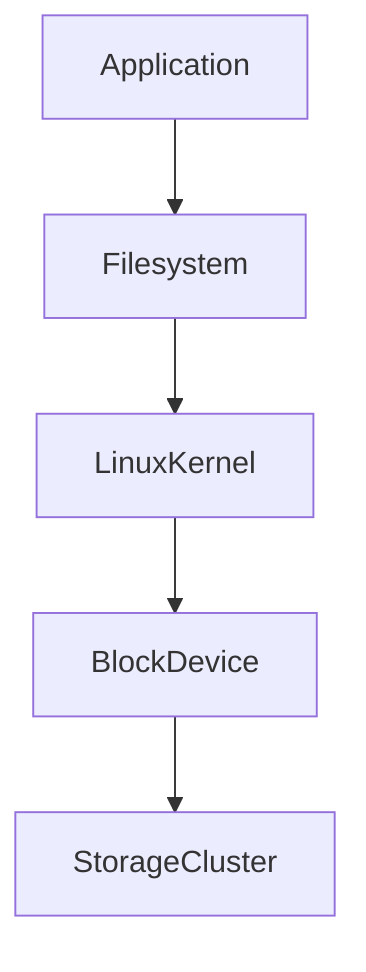
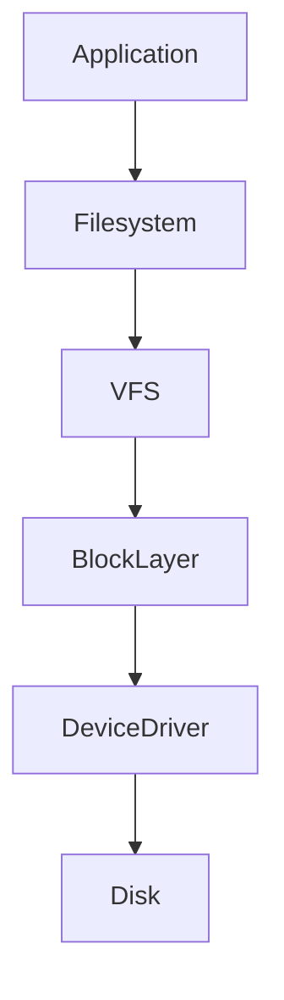
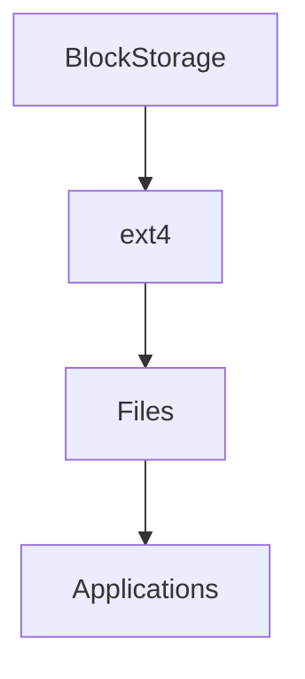

# Block Storage

# Why This Exists

One of the biggest misconceptions beginners have is:

> Block storage is cloud storage.

Wrong.

Block storage is actually one of the oldest storage concepts in computing.

Cloud providers simply virtualized it.

Without block storage:

```text
Linux Servers

Virtual Machines

Databases

Kubernetes Nodes

Application Servers
```

could not function.

Block storage is one of the fundamental building blocks of modern infrastructure.

---

# The Problem It Solves

Imagine a Linux server.

It needs to store:

```text
Operating System

Applications

Logs

Databases

Configurations
```

Where does this data live?

Not in object storage.

Not in RAM.

It needs a disk.

Cloud solved this by virtualizing disks.

---

# Mental Model

Think of block storage as empty land.

Before building anything:

```text
Raw Land
```

After construction:

```text
Land

↓

Roads

↓

Buildings

↓

Cities
```

Similarly:

```text
Block Storage

↓

Filesystem

↓

Files

↓

Applications
```

Block storage is raw infrastructure.

---

# First Principles

Applications need persistent storage.

Requirements:

```text
Read Data

Write Data

Modify Data

Delete Data
```

The operating system needs a place to do this.

Block storage provides it.

---

# Evolution Of Storage

## Physical World

```text
SSD

↓

Linux

↓

Filesystem

↓

Applications
```

---

## Cloud World

```text
Virtual Disk

↓

Linux

↓

Filesystem

↓

Applications
```

The disk became software.

---

# What Is Block Storage?

Block storage is:

> Raw storage divided into fixed-size blocks that the operating system can manage.

Think:

```text
Disk

↓

Blocks

↓

Filesystem

↓

Files
```

---

# Big Picture Architecture



---

# What Is A Block?

A block is a chunk of data.

Example:

```text
4 KB

8 KB

16 KB
```

Thousands or millions of blocks create a disk.

---

# Visualization

```text
Disk

┌────┬────┬────┬────┬────┐

│B1 │B2 │B3 │B4 │B5 │

└────┴────┴────┴────┴────┘
```

Everything is blocks.

---

# Linux Perspective

Linux loves block storage.

Linux sees block devices as:

```bash
/dev/sda

/dev/sdb

/dev/nvme0n1
```

These are devices.

Not files.

---

# Linux Storage Stack



Cloud did not replace Linux storage.

It virtualized it.

---

# Block Storage Lifecycle

```text
Create Volume

↓

Attach To Linux

↓

Partition

↓

Create Filesystem

↓

Mount

↓

Use
```

Very important lifecycle.

---

# Example Linux Workflow

Suppose a new disk appears.

Check it.

```bash
lsblk
```

Create partition.

```bash
fdisk /dev/nvme1n1
```

Create filesystem.

```bash
mkfs.ext4 /dev/nvme1n1p1
```

Mount it.

```bash
mount /dev/nvme1n1p1 /data
```

Now applications can use it.

---

# Cloud Architecture

```text
Physical SSD

↓

Storage Cluster

↓

Virtual Disk

↓

Linux VM

↓

Filesystem

↓

Applications
```

Cloud providers hide complexity.

---

# Block Storage Examples

AWS:

```text
EBS
```

Azure:

```text
Managed Disk
```

GCP:

```text
Persistent Disk
```

Same concept.

Different names.

---

# Linux Still Controls Everything

Linux still manages:

```text
Filesystem

Caching

Buffers

Journaling

Permissions

Mounting
```

Cloud providers only provide the disk.

---

# Data Flow Example

Application writes data.

```text
Application

↓

Filesystem

↓

Linux Kernel

↓

Block Layer

↓

Storage Cluster
```

Response:

```text
Success
```

---

# Why Databases Love Block Storage

Databases need:

```text
Low Latency

Fast Random Access

Reliable Storage
```

Block storage is optimized for this.

Examples:

```text
PostgreSQL

MySQL

MongoDB
```

---

# Object Storage vs Block Storage

## Object Storage

```text
Photos

Videos

Backups

AI Datasets
```

---

## Block Storage

```text
Operating Systems

Databases

Applications

Logs
```

Different responsibilities.

---

# Linux Filesystem Relationship

Filesystem sits on top.

Example:

```text
Block Storage

↓

ext4

↓

Files

↓

Applications
```

The filesystem organizes blocks.

---

# Visualization



---

# Virtual Machines Depend On Block Storage

VMs boot from disks.

Architecture:

```text
Cloud

↓

Block Storage

↓

Linux VM

↓

Applications
```

No disk = no VM.

---

# Kubernetes Relationship

Kubernetes uses Persistent Volumes.

Architecture:

```text
Storage Cluster

↓

Persistent Volume

↓

Pod

↓

Application
```

Very common.

---

# Docker Relationship

Containers are ephemeral.

Persistent data goes here.

```text
Container

↓

Volume

↓

Block Storage
```

---

# Production Example: PostgreSQL

Architecture:

```text
Users

↓

Application

↓

PostgreSQL

↓

Block Storage
```

Databases heavily depend on it.

---

# Block Storage Is Not Shared Storage

Huge misconception.

Most block storage is attached to one machine at a time.

Think:

```text
One Disk

↓

One Linux Server
```

Sharing requires special systems.

---

# Snapshots

Snapshots create backups.

```text
Volume

↓

Snapshot

↓

Backup
```

Common production pattern.

---

# Performance Metrics

Storage performance uses:

```text
IOPS

Throughput

Latency
```

Very important.

---

# IOPS

Input Output Operations Per Second.

Example:

```text
10000 IOPS
```

Higher = faster.

---

# Throughput

Amount of data transferred.

Example:

```text
500 MB/s
```

---

# Latency

Time to complete operations.

Example:

```text
2 ms
```

Lower is better.

---

# Performance Bottlenecks

Watch:

```text
Slow Queries

Disk Saturation

Queue Depth

Fragmentation
```

Storage bottlenecks are common.

---

# Security Considerations

Protect:

```text
Encryption

Access Policies

Backups

Snapshots
```

Data is critical.

---

# Scalability Considerations

Block storage scales vertically.

```text
100 GB

↓

500 GB

↓

2 TB
```

But there are limits.

Distributed systems eventually require object storage.

---

# Observability Considerations

Monitor:

```text
IOPS

Latency

Disk Usage

Errors

Queue Length
```

Storage systems require visibility.

---

# Troubleshooting Workflow

Application is slow.

Check:

```text
Filesystem

↓

Disk Usage

↓

IOPS

↓

Latency

↓

Application
```

Always inspect storage.

---

# Common Mistakes

## Mistake 1

Treating block storage as object storage.

Wrong.

---

## Mistake 2

Ignoring Linux filesystems.

Filesystems are critical.

---

## Mistake 3

Ignoring snapshots.

Backups are mandatory.

---

## Mistake 4

Ignoring IOPS.

Storage speed matters.

---

## Mistake 5

Sharing block storage incorrectly.

Not designed for many systems simultaneously.

---

# Engineering Mindset

Beginner:

> Block storage is a cloud disk.

Engineer:

> Block storage is raw programmable storage.

Senior:

> Block storage powers infrastructure.

Architect:

> Block storage powers stateful systems.

Founder:

> Data durability is business durability.

---

# Interview Questions

## Beginner

1. What is block storage?

2. Why does it exist?

3. What is a block?

4. Why do Linux systems need it?

5. What is a filesystem?

---

## Intermediate

6. Explain Linux block devices.

7. Explain block storage architecture.

8. Explain snapshots.

9. Explain IOPS.

10. Explain database relationships.

---

## Advanced

11. Explain block storage from first principles.

12. Explain Linux storage internals.

13. Explain Kubernetes persistent volumes.

14. Explain performance bottlenecks.

15. Design storage for a production PostgreSQL system.

---

# Cheat Sheet

```text
Block Storage = Programmable Raw Disk

Stack

Applications

↓

Filesystem

↓

Linux

↓

Block Storage

↓

Storage Cluster

Great For

OS

Databases

Applications

Logs

Metrics

IOPS

Latency

Throughput

Mindset

Block storage powers stateful systems.
```

# Final Thought

Block storage is one of the technologies that transformed storage from:

```text
Physical Disk

↓

One Machine
```

into:

```text
Programmable Disk

↓

Cloud Infrastructure
```

Modern cloud engineers don't buy disks.

They provision storage systems.

But underneath all abstractions, Linux still sees:

```bash
/dev/sdX
```

The abstraction changed.

The fundamentals did not.
