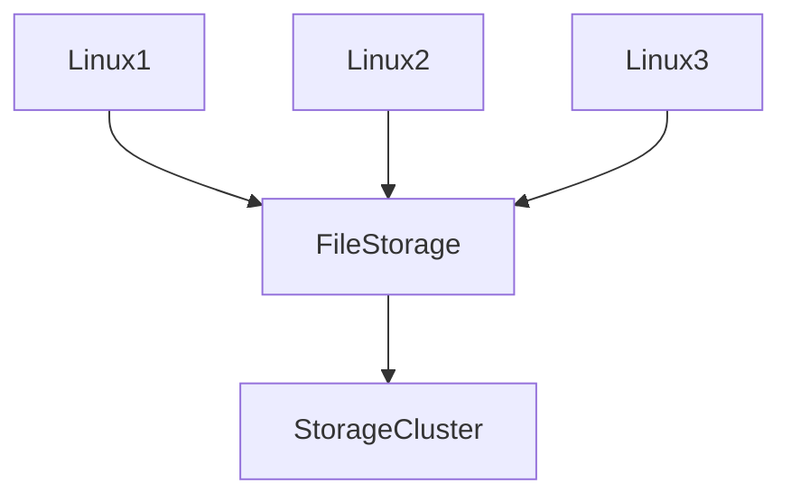
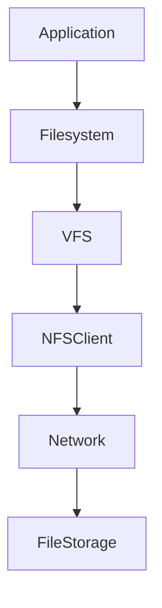
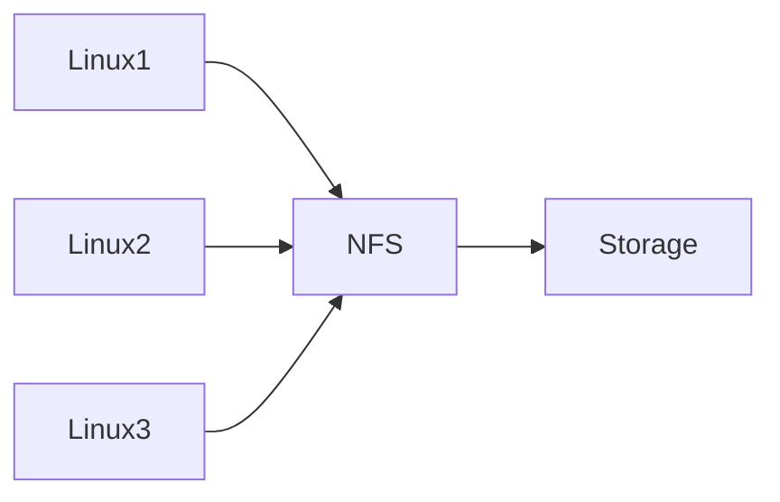

# File Storage

# Why This Exists

One of the biggest misconceptions beginners have is:

> File storage is the same as block storage.

Wrong.

They solve different problems.

Modern infrastructure has a huge challenge.

Imagine this architecture:

```text
Linux Server A

Linux Server B

Linux Server C
```

How do all three access the same files?

Without file storage:

```text
File Synchronization Problems

Duplicate Data

Operational Complexity

Inconsistent State
```

File storage solves this.

---

# The Problem It Solves

Suppose a company runs:

```text
5 Application Servers
```

Users upload images.

Question:

```text
Where should images be stored?
```

If stored locally:

```text
User Uploads

↓

Linux1

↓

Linux2 Cannot See It
```

Problem.

We need shared storage.

---

# Mental Model

Think of a company office.

Every employee needs access to the same documents.

Bad:

```text
Employee A Laptop

Employee B Laptop

Employee C Laptop
```

Everyone has separate copies.

Good:

```text
Shared Drive

↓

Everyone Accesses Same Files
```

That's file storage.

---

# First Principles

Applications need:

```text
Store Files

Share Files

Read Files

Write Files

Collaborate
```

File storage optimizes sharing.

---

# Evolution Of Storage

## Local Linux

```text
Disk

↓

Filesystem

↓

Files

↓

Applications
```

---

## Shared Infrastructure

```text
Storage Server

↓

Network

↓

Multiple Linux Servers
```

Storage became collaborative.

---

# What Is File Storage?

File storage is:

> Shared storage exposed over a network using a filesystem interface.

Think:

```text
Many Linux Systems

↓

One Shared Filesystem
```

---

# Big Picture Architecture



---

# Core Idea

Applications still see:

```text
Directories

Files

Permissions
```

Nothing changes.

But the filesystem is remote.

---

# Linux Perspective

Linux already understands file storage.

Linux uses:

```text
Mount Points

Directories

Permissions

Ownership
```

Cloud simply shares them.

---

# Linux Filesystem Stack



Very important architecture.

---

# What Applications See

Applications cannot tell the difference.

Example:

```text
/var/www/uploads
```

Could be:

```text
Local Disk

OR

Remote File Storage
```

The application doesn't care.

---

# The Mount Process

Very important concept.

```text
Remote Storage

↓

Mount

↓

Local Directory

↓

Application Access
```

---

# Example Linux Workflow

Mount remote storage.

```bash
sudo mount server:/data /mnt/shared
```

Now:

```bash
cd /mnt/shared
```

Works like a normal folder.

---

# Network File Systems (NFS)

NFS is the most common protocol.

NFS means:

```text
Network File System
```

It allows Linux machines to share files.

Architecture:

```text
Linux Client

↓

NFS

↓

Storage Server
```

---

# Visualization



---

# File Storage Internals

Internally:

```text
Physical SSDs

↓

Linux Filesystems

↓

Distributed Storage Layer

↓

NFS Server

↓

Linux Clients
```

Linux still powers everything.

---

# File Storage Hierarchy

```text
Applications

↓

Filesystem

↓

Linux

↓

Network Protocol

↓

Storage Cluster
```

Many layers exist.

---

# File Storage Characteristics

Optimized for:

```text
Shared Access

Collaboration

Consistency

POSIX Compatibility
```

---

# POSIX Compatibility

Very important.

Applications expect:

```text
open()

read()

write()

chmod()

chown()
```

File storage supports these.

---

# Shared Access Example

Suppose:

```text
Linux1

Linux2

Linux3
```

Linux1 creates:

```text
report.pdf
```

Immediately:

```text
Linux2 Can See It

Linux3 Can See It
```

Shared state.

---

# Production Example: Web Applications

Architecture:

```text
Users

↓

Load Balancer

↓

Linux1

Linux2

Linux3

↓

File Storage
```

Stores:

```text
Images

PDFs

Uploads
```

Very common.

---

# Kubernetes Relationship

Kubernetes heavily uses shared storage.

Architecture:

```text
Pods

↓

Persistent Volume

↓

File Storage
```

Useful for:

```text
Shared Content

ML Models

Configuration Files
```

---

# Docker Relationship

Containers may use shared volumes.

Architecture:

```text
Container

↓

Linux

↓

File Storage
```

---

# AI Relationship

AI systems share:

```text
Models

Datasets

Embeddings

Artifacts
```

Shared storage is useful.

---

# Cloud Examples

AWS:

```text
EFS
```

Azure:

```text
Azure Files
```

GCP:

```text
Filestore
```

Different names.

Same concept.

---

# File Storage vs Block Storage

## Block Storage

```text
One Machine

↓

One Disk
```

---

## File Storage

```text
Many Machines

↓

One Filesystem
```

Huge difference.

---

# File Storage vs Object Storage

## Object Storage

```text
API Based
```

---

## File Storage

```text
Filesystem Based
```

Different use cases.

---

# Comparison Table

| Feature | Block | File | Object |
|---------|------|------|--------|
| Shared | Difficult | Easy | Easy |
| Filesystem | Required | Built-in | No |
| API Based | No | No | Yes |
| Great For | Databases | Shared Apps | Massive Scale |

---

# Data Flow Example

User uploads image.

```text
User

↓

Application

↓

File Storage

↓

Storage Cluster
```

Second server reads it.

```text
Application

↓

File Storage

↓

Response
```

---

# Performance Considerations

Watch:

```text
Latency

Throughput

Concurrent Connections

Network Bottlenecks
```

Network speed matters.

---

# Security Considerations

Protect:

```text
Permissions

Encryption

Access Policies

Identity
```

Shared systems need strong access control.

---

# Scalability Considerations

Scale horizontally.

```text
Storage Node1

Storage Node2

Storage Node3
```

Clusters grow over time.

---

# Observability Considerations

Monitor:

```text
Latency

Connections

Bandwidth

Storage Usage

Errors
```

Storage systems require visibility.

---

# Troubleshooting Workflow

Application cannot access files.

Check:

```text
Mount

↓

NFS

↓

Permissions

↓

Network

↓

Application
```

Debug layer by layer.

---

# Common Mistakes

## Mistake 1

Treating file storage like object storage.

Wrong.

---

## Mistake 2

Using file storage for huge video platforms.

Object storage is better.

---

## Mistake 3

Ignoring network bottlenecks.

File storage depends on networks.

---

## Mistake 4

Ignoring Linux permissions.

Permissions still matter.

---

## Mistake 5

Ignoring observability.

Shared systems need monitoring.

---

# Engineering Mindset

Beginner:

> File storage stores files.

Engineer:

> File storage shares files.

Senior:

> File storage enables collaboration.

Architect:

> File storage powers shared infrastructure.

Founder:

> Data should be accessible everywhere.

---

# Interview Questions

## Beginner

1. What is file storage?

2. Why does it exist?

3. What problem does it solve?

4. What is NFS?

5. What is shared storage?

---

## Intermediate

6. Explain file storage architecture.

7. Explain mount points.

8. Explain POSIX compatibility.

9. Explain Kubernetes relationships.

10. Explain Linux networking underneath.

---

## Advanced

11. Explain file storage from first principles.

12. Explain NFS internals.

13. Explain distributed file systems.

14. Explain performance bottlenecks.

15. Design shared storage for a production application.

---

# Cheat Sheet

```text
File Storage = Shared Linux Filesystem

Stack

Applications

↓

Filesystem

↓

Linux

↓

NFS

↓

Storage Cluster

Great For

Shared Uploads

Configurations

AI Models

Collaboration

Cloud Examples

AWS → EFS

Azure → Azure Files

GCP → Filestore

Mindset

File storage = Linux filesystem over a network.
```

# Final Thought

File storage is one of the technologies that transformed storage from:

```text
My Files

↓

My Machine
```

into:

```text
Our Files

↓

Many Machines
```

Modern systems are collaborative.

And collaborative systems need shared storage.

At its core, file storage is simply Linux filesystems extended across a network.

That idea powers countless production systems today.
