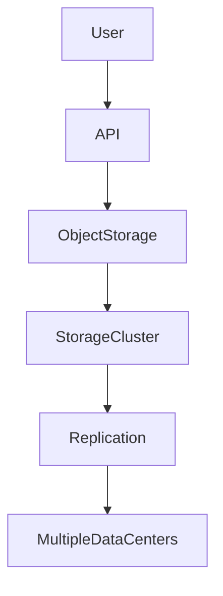
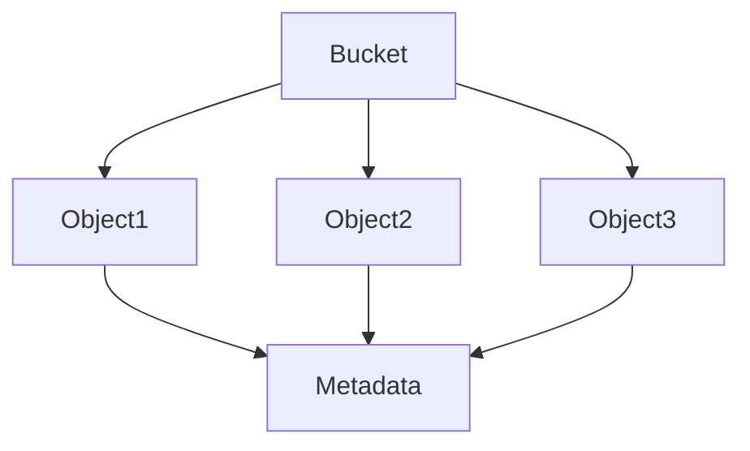
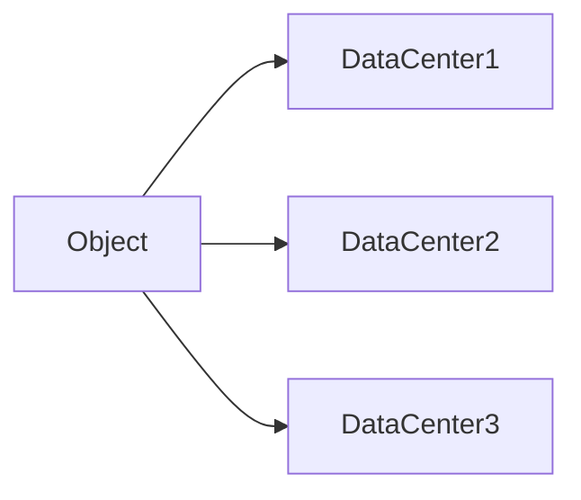
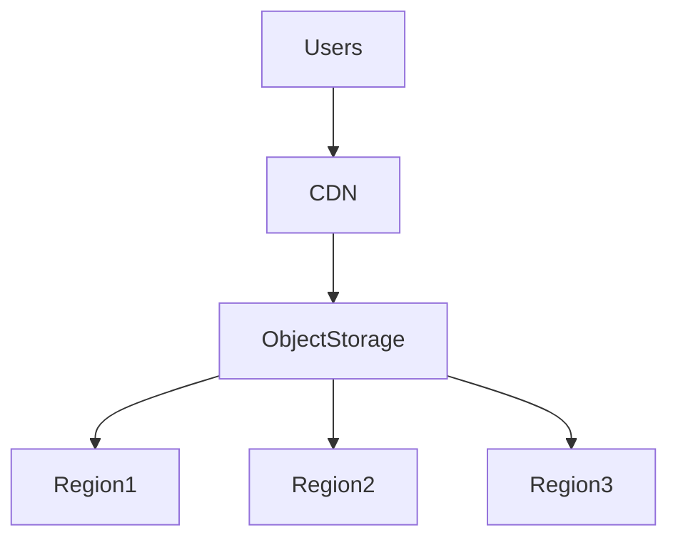

# Object Storage

# Why This Exists

One of the biggest mistakes engineers make is treating object storage like a hard drive.

They think:

```text
S3 = Cloud Disk
```

Wrong.

Object storage is an entirely different storage philosophy.

Object storage was invented because traditional filesystems could not scale to internet-sized systems.

Without object storage:

```text
Netflix

YouTube

Instagram

TikTok

AI Systems

Data Lakes

Cloud Backups
```

would become extremely difficult.

Object storage is one of the foundational technologies of modern cloud computing.

---

# The Problem It Solves

Imagine YouTube.

Every day users upload:

```text
Videos

Images

Subtitles

Metadata

Thumbnails
```

Millions of files.

Would a Linux server disk work?

No.

Problems:

```text
Disk Limits

Scaling Problems

Replication Complexity

Global Distribution Problems

Operational Overhead
```

We need a new model.

---

# Mental Model

Think of object storage as a giant global warehouse.

Traditional filesystem:

```text
Folders

↓

Subfolders

↓

Files
```

Object storage:

```text
Warehouse

↓

Unique Objects

↓

Metadata

↓

Global Access
```

The system cares less about location.

It cares about identity.

---

# First Principles

Data must satisfy several requirements.

```text
Store Data

Scale Data

Protect Data

Distribute Data

Retrieve Data
```

Object storage optimizes all five.

---

# Evolution Of Storage

## Traditional Linux

```text
Disk

↓

Filesystem

↓

Directories

↓

Files
```

---

## Modern Cloud

```text
Objects

↓

Distributed Storage

↓

Global Infrastructure
```

Storage became distributed.

---

# What Is Object Storage?

Object storage is:

> A distributed storage system that stores data as objects instead of blocks or files.

Each object contains:

```text
Data

Metadata

Unique Identifier
```

---

# Big Picture Architecture



---

# Object Anatomy

Every object contains:

```text
Object

├── Data
├── Metadata
└── Unique ID
```

Example:

```text
profile-image.jpg

↓

Binary Data

↓

Upload Time

↓

Owner

↓

Permissions

↓

UUID
```

---

# Linux Filesystem vs Object Storage

## Linux

```text
/

↓

home

↓

vipul

↓

images

↓

cat.jpg
```

Hierarchical.

---

## Object Storage

```text
bucket

↓

user-123/profile-image.jpg
```

Flat.

Hierarchy is an illusion.

---

# Visualization



---

# Buckets

Buckets are containers.

Think:

```text
Warehouse Sections
```

Examples:

```text
images

videos

logs

backups

datasets
```

Buckets organize objects.

---

# Object Keys

Objects are retrieved using keys.

Example:

```text
images/profile.jpg
```

This is not a directory.

It's simply a string.

---

# Object IDs

Internally:

```text
Bucket

+

Object Key

↓

Unique Identity
```

Everything is lookup-based.

---

# Why Object Storage Scales

Traditional filesystems struggle.

Object storage distributes data.

```text
Object

↓

Storage Node

↓

Replica

↓

Replica

↓

Replica
```

Everything is replicated.

---

# Durability

Object storage prioritizes durability.

Durability means:

> Your data should never disappear.

Modern systems target:

```text
11 nines

99.999999999%
```

Very durable.

---

# Replication

Data exists in multiple locations.



Failures become survivable.

---

# Availability

Availability means:

> Can users access the data?

Different from durability.

Data can exist but be temporarily unreachable.

---

# Linux Perspective

Linux filesystems still exist underneath.

Somewhere inside cloud providers:

```text
Physical SSD

↓

Linux Filesystem

↓

Distributed Storage Layer

↓

Object Storage API
```

Linux still powers storage.

---

# Data Flow Example

Upload image.

```text
User

↓

API

↓

Object Storage

↓

Replication

↓

Storage Nodes
```

Download image.

```text
User

↓

CDN

↓

Object Storage

↓

Response
```

---

# Why APIs Instead Of Mounting?

Object storage is network native.

You use APIs.

Example:

```text
PUT

GET

DELETE
```

Instead of:

```bash
cp

mv

mkdir
```

---

# Common Operations

Upload.

```text
PUT
```

Download.

```text
GET
```

Delete.

```text
DELETE
```

List.

```text
LIST
```

---

# Global Architecture



This powers the modern internet.

---

# CDN Relationship

Object storage and CDN work together.

Example:

```text
User

↓

CDN

↓

Object Storage
```

CDN reduces latency.

---

# AI Relationship

AI heavily depends on object storage.

Stores:

```text
Datasets

Embeddings

Models

Training Images

Videos
```

Object storage became AI infrastructure.

---

# Data Lake Relationship

Data lakes are built on object storage.

Example:

```text
Logs

Images

CSV

JSON

Parquet

Videos
```

Everything can coexist.

---

# Kubernetes Relationship

Kubernetes usually doesn't use object storage for databases.

But uses it for:

```text
Backups

Artifacts

Logs

ML Models

Static Assets
```

---

# Docker Relationship

Docker registries depend on object storage.

Stores:

```text
Container Layers

Images

Artifacts
```

Very common.

---

# Production Example: MERN Stack

```text
Users

↓

Load Balancer

↓

Node.js

↓

PostgreSQL

↓

Object Storage
```

Object storage stores:

```text
Profile Images

Videos

PDFs

Documents
```

Do NOT store these in databases.

---

# Database vs Object Storage

## Database

Stores:

```text
Structured Data

Relationships

Transactions
```

---

## Object Storage

Stores:

```text
Large Files

Media

Backups

Logs
```

Different responsibilities.

---

# Performance Considerations

Great for:

```text
Large Files

Massive Scale

Global Distribution
```

Bad for:

```text
Low Latency Database Workloads
```

---

# Security Considerations

Protect:

```text
Buckets

Permissions

Encryption

Access Policies
```

Never make everything public.

---

# Scalability Considerations

Object storage scales horizontally.

Architecture:

```text
Node1

Node2

Node3

Node4
```

Add nodes.

Increase capacity.

---

# Observability Considerations

Monitor:

```text
Requests

Latency

Errors

Storage Usage

Bandwidth
```

Storage systems require visibility.

---

# Troubleshooting Workflow

File inaccessible.

Check:

```text
Permissions

↓

Bucket Policy

↓

Object Key

↓

CDN

↓

Application
```

Debug layer by layer.

---

# Common Mistakes

## Mistake 1

Treating object storage as a disk.

Wrong.

---

## Mistake 2

Treating object keys as folders.

They're strings.

---

## Mistake 3

Storing videos inside databases.

Huge mistake.

---

## Mistake 4

Making buckets public.

Security risk.

---

## Mistake 5

Ignoring CDN integration.

Global systems need caching.

---

# Engineering Mindset

Beginner:

> Object storage stores files.

Engineer:

> Object storage stores globally accessible objects.

Senior:

> Object storage powers internet-scale systems.

Architect:

> Object storage is a distributed storage platform.

Founder:

> Data should scale with the business.

---

# Interview Questions

## Beginner

1. What is object storage?

2. Why does it exist?

3. What is an object?

4. What is a bucket?

5. What is metadata?

---

## Intermediate

6. Explain object storage architecture.

7. Explain durability.

8. Explain replication.

9. Explain object keys.

10. Explain CDN relationships.

---

## Advanced

11. Explain object storage from first principles.

12. Explain distributed storage.

13. Explain object storage and AI.

14. Explain data lakes.

15. Design storage for a YouTube-like platform.

---

# Cheat Sheet

```text
Object Storage = Distributed Data Warehouse

Object

↓

Data

Metadata

Unique ID

Great For

Images

Videos

Logs

Backups

AI Datasets

Data Lakes

Modern Stack

Users

↓

CDN

↓

Object Storage

↓

Distributed Infrastructure

Mindset

Storage is no longer a disk.

Storage is a globally distributed system.
```

# Final Thought

Object storage is one of the technologies that transformed storage from:

```text
One Disk

↓

One Server
```

into:

```text
Planet Scale Data

↓

Thousands Of Machines

↓

One Storage System
```

Modern engineers no longer think:

> Where is my file?

Modern engineers think:

> How does data flow through a globally distributed system?

That mindset is the foundation of cloud storage engineering.
