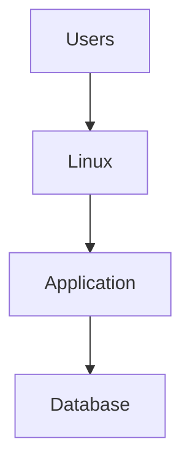
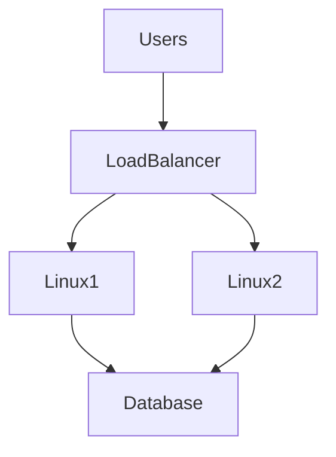
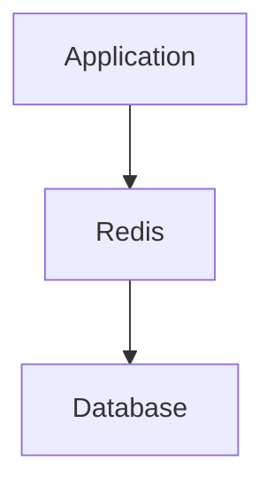
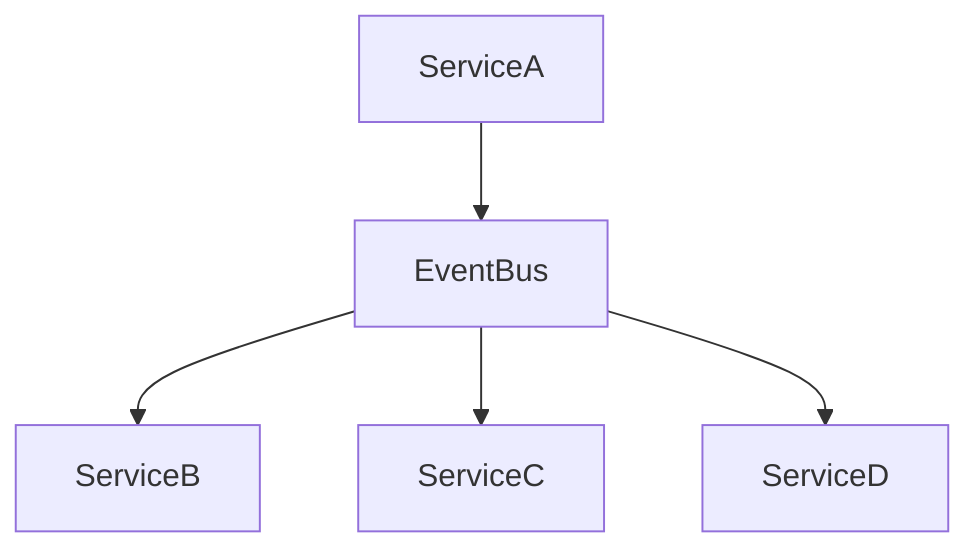
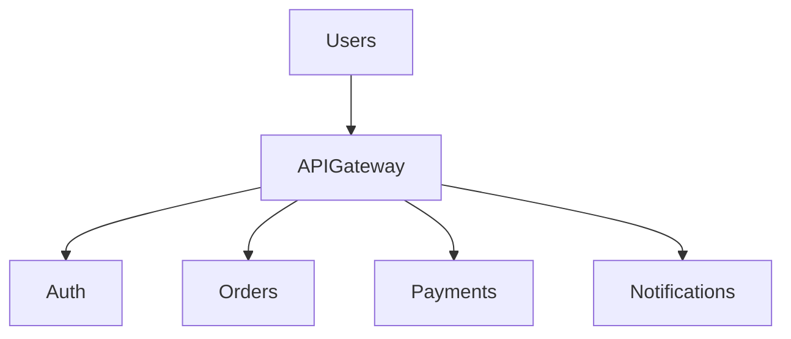
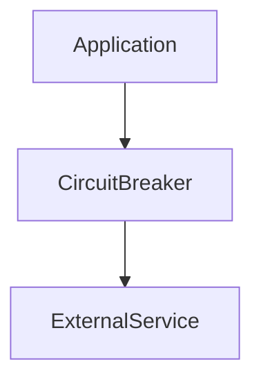
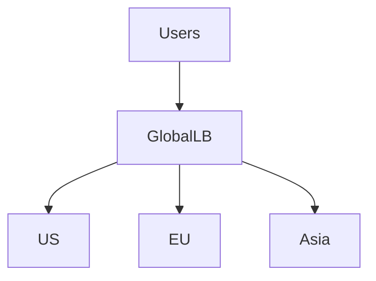

# Cloud Architecture Patterns

# Why This Exists

Cloud services are tools.

Architecture patterns are strategies.

Beginners often think:

> Learning AWS services = learning cloud architecture.

Wrong.

Knowing services does not teach system design.

Cloud architecture patterns answer:

> How should we combine infrastructure pieces to solve recurring problems?

Modern systems repeatedly solve:

```text
Scalability

Availability

Fault Tolerance

Performance

Security

Global Distribution
```

Patterns are reusable solutions.

---

# The Problem It Solves

Imagine building infrastructure from scratch every time.

```text
User Authentication

↓

Invent Architecture

-------------------

Payment System

↓

Invent Architecture

-------------------

Video Platform

↓

Invent Architecture
```

This is inefficient.

Patterns reduce complexity.

---

# Mental Model

Think of architecture patterns as LEGO blueprints.

You already know pieces.

```text
Linux

Networks

Databases

Storage

Containers
```

Architecture tells you:

> How to assemble them.

---

# First Principles

Every system solves five problems.

```text
Receive Traffic

Process Data

Store Data

Secure Data

Scale Infrastructure
```

Everything else is implementation.

---

# The Universal Architecture

Almost every modern system follows this.

```text
Users

↓

Traffic Layer

↓

Application Layer

↓

Cache Layer

↓

Database Layer

↓

Storage Layer
```

---

# The Modern Infrastructure Stack

```text
Users

↓

DNS

↓

CDN

↓

Load Balancer

↓

Linux

↓

Docker

↓

Kubernetes

↓

Microservices

↓

Databases

↓

Storage
```

---

# Pattern 1: Single Server Architecture

# Mental Model

Everything lives on one machine.

```text
Users

↓

Linux

↓

Application

↓

Database
```

---

# Visualization



---

# Advantages

```text
Simple

Cheap

Easy To Learn
```

---

# Problems

```text
No Scalability

Single Point Of Failure

Poor Reliability
```

Good for:

```text
Learning

Tiny Startups

MVPs
```

---

# Pattern 2: Three-Tier Architecture

Industry classic.

```text
Presentation Layer

↓

Application Layer

↓

Database Layer
```

---

# Visualization



---

# Layers

## Presentation

```text
Frontend

CDN

Load Balancer
```

---

## Application

```text
Node.js

Python

Java

Go
```

---

## Data

```text
PostgreSQL

MySQL

MongoDB
```

---

# Pattern 3: Stateless Architecture

Store no state in servers.

Bad:

```text
Server Stores User Session
```

Good:

```text
Server

↓

Redis Stores Session
```

Benefits:

```text
Easy Scaling

High Availability
```

---

# Pattern 4: Cache-Aside Pattern

Problem:

Databases are slow.

Solution:

```text
Application

↓

Redis

↓

Database
```

---

# Workflow

```text
Request

↓

Redis

↓

Found?

↓

Yes → Return

↓

No

↓

Database

↓

Save To Redis

↓

Return
```

---

# Visualization



---

# Pattern 5: CQRS

Command Query Responsibility Segregation.

Separate reads and writes.

---

# Traditional

```text
Application

↓

Database
```

---

# CQRS

```text
Writes

↓

Write Database

----------------

Reads

↓

Read Database
```

Benefits:

```text
Scalable

Faster Reads
```

---

# Pattern 6: Event Driven Architecture

Systems communicate via events.

---

# Traditional

```text
Service A

↓

Service B
```

Tightly coupled.

---

# Event Driven

```text
Service A

↓

Event Bus

↓

Service B

Service C

Service D
```

Loose coupling.

---

# Visualization



---

# Pattern 7: Queue Based Architecture

Problem:

Traffic spikes.

Solution:

```text
Users

↓

Queue

↓

Workers
```

Examples:

```text
Emails

Videos

AI Jobs
```

---

# Pattern 8: Autoscaling Architecture

Infrastructure grows dynamically.

```text
Users

↓

Load Balancer

↓

Linux Fleet

↓

Autoscaler
```

---

# Pattern 9: Immutable Infrastructure

Old:

```text
SSH

↓

Fix Server
```

Modern:

```text
Destroy

↓

Recreate
```

Infrastructure becomes disposable.

---

# Pattern 10: Microservices Architecture

Large systems become independent services.

```text
Auth

Payments

Orders

Notifications

Users
```

---

# Visualization



---

# Pattern 11: API Gateway Pattern

Central entry point.

Responsibilities:

```text
Authentication

Rate Limiting

Routing

Caching

Observability
```

---

# Pattern 12: Sidecar Pattern

Common in Kubernetes.

```text
Application

↓

Logging Container

↓

Monitoring Container
```

---

# Visualization


---

# Pattern 13: Bulkhead Pattern

Prevent one failure from destroying everything.

Ship analogy.

```text
Compartment A

Compartment B

Compartment C
```

One leak.

Ship survives.

Infrastructure:

```text
Service Isolation
```

---

# Pattern 14: Circuit Breaker Pattern

Stop cascading failures.

Example:

```text
Payment Service Down

↓

Stop Sending Requests
```

Protects systems.

---

# Visualization



---

# Pattern 15: Multi-Region Architecture

Global systems.

```text
Users

↓

Global Load Balancer

↓

US

EU

Asia
```

---

# Visualization



---

# Pattern 16: Data Lake Architecture

AI pattern.

```text
Logs

CSV

Images

Videos

Parquet

↓

Object Storage

↓

Analytics
```

---

# Pattern 17: AI Infrastructure Pattern

Modern systems.

```text
Users

↓

API

↓

AI Models

↓

GPU Cluster

↓

Vector DB
```

---

# Linux Everywhere

Linux powers:

```text
VMs

Containers

Databases

Kubernetes

AI Infrastructure
```

Cloud abstractions never replace Linux.

---

# Pattern Selection Matrix

| Pattern | Use Case |
|---------|----------|
| Single Server | MVP |
| Three Tier | Traditional Apps |
| Cache Aside | Performance |
| Event Driven | Distributed Systems |
| Queue Based | Async Work |
| Microservices | Large Systems |
| Multi Region | Global Systems |
| AI Infrastructure | AI Products |

---

# Startup Evolution Pattern

## Stage 1

```text
Linux

↓

Node.js

↓

PostgreSQL
```

---

## Stage 2

```text
Load Balancer

↓

2 Linux Servers

↓

Database
```

---

## Stage 3

```text
Redis

↓

Autoscaling
```

---

## Stage 4

```text
Docker

↓

Kubernetes

↓

Microservices
```

---

## Stage 5

```text
Global Infrastructure
```

This is a common evolution path.

---

# Performance Considerations

Watch:

```text
Latency

CPU

Memory

Network

Storage

Database Bottlenecks
```

---

# Security Considerations

Always implement:

```text
IAM

VPC

Subnets

Encryption

Secrets

Zero Trust
```

---

# Scalability Considerations

Prefer:

```text
Horizontal Scaling
```

Avoid:

```text
One Huge Machine
```

---

# Observability Considerations

Monitor:

```text
Logs

Metrics

Traces
```

Every architecture requires observability.

---

# Troubleshooting Workflow

```text
DNS

↓

CDN

↓

Load Balancer

↓

Linux

↓

Application

↓

Cache

↓

Database

↓

Storage
```

Debug layer by layer.

---

# Common Mistakes

## Mistake 1

Starting with microservices.

Don't.

---

## Mistake 2

Ignoring caching.

Databases become bottlenecks.

---

## Mistake 3

Keeping state inside servers.

Bad architecture.

---

## Mistake 4

SSHing into production.

Automate everything.

---

## Mistake 5

Ignoring observability.

Invisible systems fail silently.

---

# Engineering Mindset

Beginner:

> I deploy applications.

Engineer:

> I build systems.

Senior:

> I design architectures.

Architect:

> I design resilient distributed systems.

Founder:

> Infrastructure should accelerate business growth.

---

# Interview Questions

## Beginner

1. What is an architecture pattern?

2. Why do patterns exist?

3. What is three-tier architecture?

4. What is a load balancer?

5. What is a cache?

---

## Intermediate

6. Explain cache-aside.

7. Explain event driven architecture.

8. Explain immutable infrastructure.

9. Explain API gateways.

10. Explain microservices.

---

## Advanced

11. Explain circuit breakers.

12. Explain CQRS.

13. Explain bulkheads.

14. Design infrastructure for 100 million users.

15. Explain architecture evolution for a startup.

---

# Cheat Sheet

```text
Architecture Pattern = Reusable Infrastructure Solution

Core Problems

Traffic

Processing

Storage

Security

Scaling

Modern Stack

Users

↓

Networking

↓

Linux

↓

Containers

↓

Applications

↓

Data

Mindset

Services are tools.

Patterns are strategies.
```

# Final Thought

Cloud architecture is not about AWS services.

It is about solving recurring engineering problems.

The best engineers don't memorize products.

They recognize patterns.

Eventually you'll realize:

```text
Netflix

Uber

Instagram

Amazon

YouTube
```

are all combinations of the same architectural patterns assembled differently.

That realization is the beginning of systems thinking.
