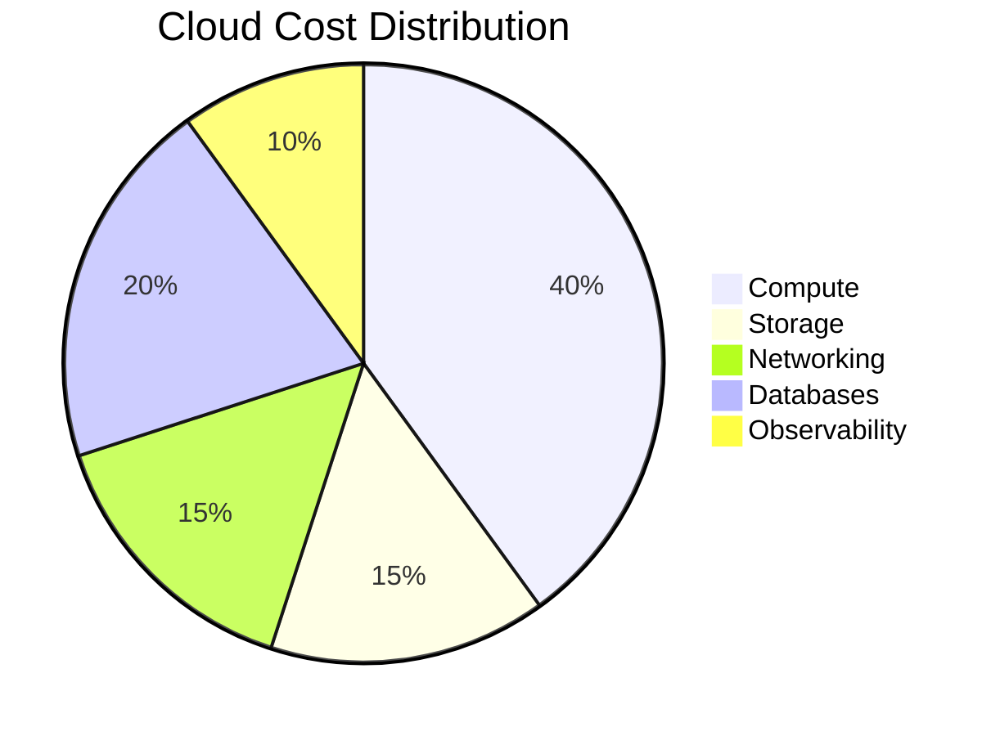
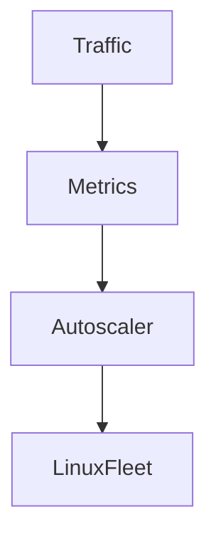
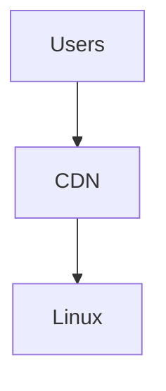
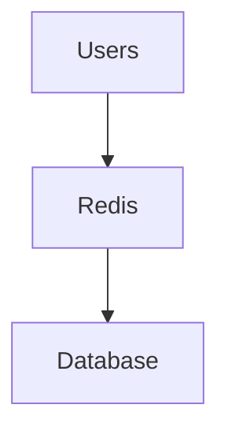
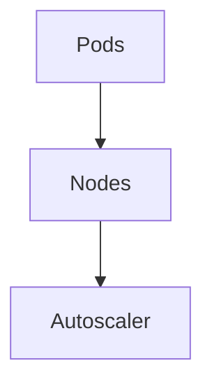
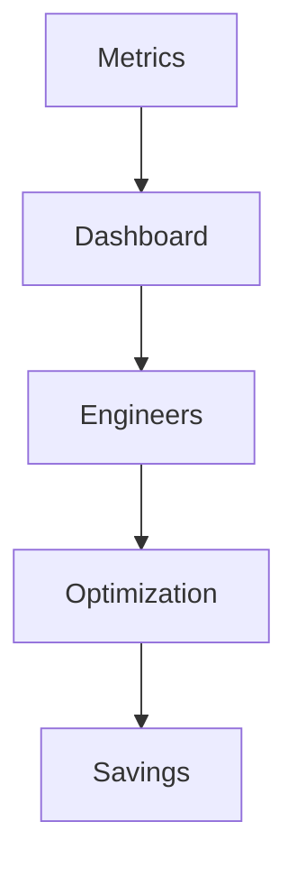

# Cloud Cost Optimization

# Why This Exists

One of the biggest misconceptions beginners have is:

> Cloud is cheap.

Wrong.

Cloud is extremely expensive when used incorrectly.

Cloud providers charge for:

```text
Compute

Storage

Networking

Databases

Observability

AI Workloads
```

Poor architecture can destroy a company's finances.

Cloud cost optimization is not about spending less money.

It is about:

> Building efficient systems.

Modern engineers must optimize both:

```text
Performance

AND

Cost
```

This chapter teaches cloud cost optimization from first principles.

---

# The Problem It Solves

Imagine this infrastructure.

```text
20 Servers

24 Hours

365 Days
```

But traffic only exists:

```text
8 Hours Per Day
```

The company wastes:

```text
16 Hours Daily
```

Money disappears.

Resource waste becomes business risk.

---

# Mental Model

Think of cloud like electricity.

Bad:

```text
Lights ON

Entire Day

Nobody Home
```

Good:

```text
Lights ON

Only When Needed
```

Cloud should behave the same way.

---

# First Principles

Cloud charges for resource consumption.

Resources:

```text
CPU

Memory

Storage

Network

GPU

Requests
```

Unused resources are wasted money.

---

# The Core Equation

Cloud cost is:

```text
Cost

=

Resources

×

Time

×

Scale
```

Three variables drive everything.

---

# The Modern Infrastructure Stack

```text
Users

↓

Traffic

↓

Linux

↓

Containers

↓

Applications

↓

Data
```

Every layer has costs.

---

# Where Money Goes

```text
Compute

Storage

Networking

Databases

Monitoring

AI Infrastructure
```

Most bills come from these.

---

# Visualization



Percentages vary.

But compute usually dominates.

---

# Cost Optimization Philosophy

Ask one question continuously:

> Is this resource necessary right now?

Everything else follows.

---

# Pillar 1: Right Sizing

Biggest beginner mistake.

Bad:

```text
64 CPU

256 GB RAM

10 Users
```

Good:

```text
2 CPU

4 GB RAM
```

Measure first.

Then scale.

---

# Linux Perspective

Linux already tells you utilization.

Check CPU:

```bash
top
```

Check memory:

```bash
free -h
```

Check disk:

```bash
df -h
```

Check processes:

```bash
htop
```

Cloud optimization starts with Linux observability.

---

# Example

Bad:

```text
CPU Usage = 10%

Memory Usage = 15%

Huge Server Running
```

Waste.

---

# Pillar 2: Autoscaling

Do not pay for idle infrastructure.

Bad:

```text
20 Servers

24 Hours
```

Good:

```text
2 Servers

↓

20 Servers

↓

2 Servers
```

Infrastructure should adapt.

---

# Visualization



---

# Pillar 3: Horizontal Scaling

Avoid giant machines.

Bad:

```text
1 Huge Server
```

Good:

```text
5 Small Servers
```

Benefits:

```text
Cheaper

Safer

More Flexible
```

---

# Pillar 4: Spot Capacity

Sometimes infrastructure can disappear.

Use cheap machines.

Great for:

```text
CI/CD

AI Training

Data Processing

Workers
```

Avoid for:

```text
Critical Databases
```

---

# Pillar 5: Storage Tiering

Not all data is equal.

Hot data:

```text
Frequently Accessed
```

Warm data:

```text
Sometimes Accessed
```

Cold data:

```text
Rarely Accessed
```

Move data appropriately.

---

# Storage Hierarchy

```text
SSD

↓

Standard Storage

↓

Archive Storage
```

Older data becomes cheaper.

---

# Pillar 6: CDN Optimization

Never send global traffic to one server.

Bad:

```text
India

↓

USA Server
```

High latency.

Expensive.

Good:

```text
India

↓

India Edge Server
```

Faster.

Cheaper.

---

# Visualization



---

# Pillar 7: Cache Everything

Databases are expensive.

Bad:

```text
Users

↓

Database
```

Good:

```text
Users

↓

Redis

↓

Database
```

---

# Visualization



---

# Pillar 8: Reduce Data Transfer

Networking is expensive.

Bad:

```text
Region A

↓

Region B

↓

Region C

↓

Constant Data Movement
```

Move computation closer to data.

---

# Pillar 9: Eliminate Idle Resources

Common waste:

```text
Unused VMs

Unused Databases

Unused Disks

Unused IPs

Unused Load Balancers
```

Delete aggressively.

---

# Pillar 10: Infrastructure As Code

Manual systems waste money.

Bad:

```text
Engineer Creates Resources

↓

Forgets Them
```

Good:

```text
Code

↓

Infrastructure

↓

Version Controlled
```

Everything becomes visible.

---

# Kubernetes Cost Optimization

Common waste:

```text
Huge Node

↓

Tiny Pods
```

Optimize:

```text
Pod Requests

Pod Limits

Node Sizing
```

---

# Kubernetes Visualization



---

# Container Optimization

Huge waste:

```text
5 GB Images
```

Optimize:

```text
Alpine Images

Multi Stage Builds

Smaller Images
```

Benefits:

```text
Less Storage

Less Network

Faster Deployments
```

---

# Database Optimization

Databases are expensive.

Optimize:

```text
Indexes

Caching

Read Replicas

Archiving
```

Never over-provision.

---

# AI Cost Optimization

AI systems are expensive.

Optimize:

```text
GPU Usage

Batch Processing

Model Quantization

Caching
```

GPU waste becomes extremely expensive.

---

# Startup Evolution Example

## Stage 1

```text
Linux

↓

Node.js

↓

PostgreSQL
```

Cheap.

---

## Stage 2

```text
Load Balancer

↓

Autoscaling

↓

Redis
```

Moderate cost.

---

## Stage 3

```text
Kubernetes

↓

Microservices
```

Expensive.

Needs optimization.

---

# Cost Optimization Data Flow

```text
Metrics

↓

Observability

↓

Analysis

↓

Optimization

↓

Savings
```

Continuous loop.

---

# FinOps

FinOps means:

> Financial Operations

Combines:

```text
Engineering

Finance

Business
```

Three teams collaborate.

---

# Observability Is Mandatory

You cannot optimize invisible systems.

Monitor:

```text
CPU

Memory

Storage

Bandwidth

Requests

Latency
```

Everything requires measurement.

---

# Visualization



---

# Cost Anti Patterns

## Anti Pattern 1

Always running maximum infrastructure.

---

## Anti Pattern 2

Ignoring observability.

---

## Anti Pattern 3

One giant database.

---

## Anti Pattern 4

Ignoring caching.

---

## Anti Pattern 5

Unused resources everywhere.

---

# Linux Cost Optimization Checklist

CPU:

```bash
top
```

Memory:

```bash
free -h
```

Disk:

```bash
df -h
```

IO:

```bash
iostat
```

Processes:

```bash
htop
```

Network:

```bash
sar -n DEV
```

Linux metrics drive cloud decisions.

---

# Performance Tradeoffs

Cheap is not always good.

Optimize:

```text
Cost

Performance

Reliability
```

Balance all three.

---

# Security Tradeoffs

Never reduce cost by sacrificing:

```text
Backups

Encryption

Monitoring

Security Controls
```

Security is mandatory.

---

# Troubleshooting Workflow

Cloud bill exploded.

Check:

```text
Compute

↓

Storage

↓

Networking

↓

Databases

↓

Observability

↓

AI Infrastructure
```

Find bottlenecks.

---

# Common Mistakes

## Mistake 1

Overprovisioning everything.

---

## Mistake 2

Ignoring autoscaling.

---

## Mistake 3

Ignoring caching.

---

## Mistake 4

Ignoring networking costs.

---

## Mistake 5

Ignoring observability.

---

# Engineering Mindset

Beginner:

> I deploy infrastructure.

Engineer:

> I optimize infrastructure.

Senior:

> I optimize systems.

Architect:

> I optimize ecosystems.

Founder:

> Every infrastructure decision impacts business survival.

---

# Interview Questions

## Beginner

1. What is cloud cost optimization?

2. Why is cloud expensive?

3. What is right sizing?

4. What is autoscaling?

5. What is FinOps?

---

## Intermediate

6. Explain storage tiering.

7. Explain CDN optimization.

8. Explain cache optimization.

9. Explain Kubernetes cost optimization.

10. Explain idle resources.

---

## Advanced

11. Explain FinOps from first principles.

12. Explain cost vs performance tradeoffs.

13. Design infrastructure for 10 million users with cost constraints.

14. Explain AI infrastructure costs.

15. Explain optimization as an engineering discipline.

---

# Cheat Sheet

```text
Cost Formula

Resources

×

Time

×

Scale

Optimize

Compute

Storage

Network

Database

Observability

AI

Loop

Measure

↓

Analyze

↓

Optimize

↓

Repeat

Mindset

Cloud cost optimization = Resource efficiency engineering.
```

# Final Thought

Cloud cost optimization is one of the moments where engineers begin thinking like founders.

Junior engineers ask:

> Can it work?

Senior engineers ask:

> Can it scale?

Architects ask:

> Can it survive?

Founders ask:

> Can the business afford it?

The best systems optimize all four simultaneously.

Modern engineering is no longer just building systems.

It is building efficient systems.
