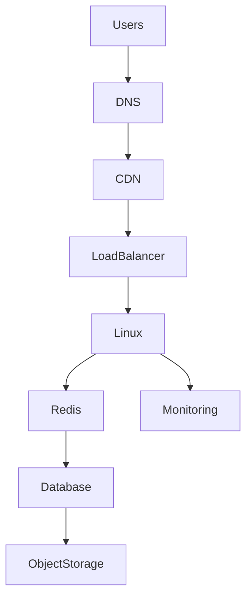

# Cloud Mind Map

> Cloud is not AWS, Azure, or GCP.

> Cloud = Linux + Networking + Storage + Security + Automation + Distributed Systems at data center scale.

---

# Master Cloud Engineering Mind Map

```mermaid
mindmap

root((Cloud Engineering))

    Cloud Foundations

        Cloud Computing

        On Premise vs Cloud

        IaaS

        PaaS

        SaaS

    Linux

        Linux Servers

        Linux Networking

        Linux Storage

        Linux Security

        Linux Observability

    Cloud Providers

        AWS

        Azure

        GCP

    Compute

        Virtual Machines

        Cloud Instances

        Autoscaling

    Networking

        VPC

        Subnets

        Internet Gateway

        NAT Gateway

        Load Balancers

    Storage

        Block Storage

        File Storage

        Object Storage

    Identity

        IAM

        RBAC

        ABAC

        Zero Trust

    Production

        Architecture Patterns

        Cost Optimization

        Observability

        High Availability
```

---

# Layered Cloud Architecture Mind Map

```mermaid
mindmap

root((Cloud Layers))

    Users

    DNS

    CDN

    Load Balancers

    Linux

    Docker

    Kubernetes

    Applications

    Databases

    Storage

    AI Systems
```

---

# Linux To Cloud Evolution Mind Map

```mermaid
mindmap

root((Linux Evolution))

    Linux Machine

    Virtualization

    Virtual Machines

    Cloud Instances

    Autoscaling

    Containers

    Kubernetes

    Distributed Systems

    Platform Engineering

    System Architecture
```

---

# Networking Mind Map

```mermaid
mindmap

root((Cloud Networking))

    Internet

    Internet Gateway

    VPC

    Subnets

    Route Tables

    NAT Gateway

    Load Balancers

    Linux Networking

    Kubernetes Networking

    Container Networking
```

---

# Storage Mind Map

```mermaid
mindmap

root((Cloud Storage))

    Block Storage

        Databases

        Operating Systems

        Virtual Machines

    File Storage

        Shared Data

        Collaboration

        NFS

    Object Storage

        Images

        Videos

        Backups

        Data Lakes

        AI Datasets
```

---

# Security Mind Map

```mermaid
mindmap

root((Cloud Security))

    IAM

    Authentication

    Authorization

    RBAC

    ABAC

    Zero Trust

    Least Privilege

    Audit Logs

    Secrets
```

---

# Compute Mind Map

```mermaid
mindmap

root((Compute))

    Physical Servers

    Hypervisors

    Virtual Machines

    Cloud Instances

    Autoscaling

    Immutable Infrastructure
```

---

# Distributed Systems Mind Map

```mermaid
mindmap

root((Distributed Systems))

    Load Balancers

    Stateless Applications

    Caching

    Event Driven Systems

    Queues

    Microservices

    High Availability

    Fault Tolerance
```

---

# Production Architecture Mind Map

```mermaid
mindmap

root((Production Architecture))

    Users

    DNS

    CDN

    Load Balancer

    Linux Fleet

    Redis

    Databases

    Storage

    Monitoring
```

---

# Startup Evolution Mind Map

```mermaid
mindmap

root((Startup Growth))

    MVP

        Linux

        Nodejs

        PostgreSQL

    Growth

        Load Balancer

        Multiple Linux Servers

    Scaling

        Redis

        Autoscaling

    Expansion

        Docker

        Kubernetes

        Microservices

    Global

        Multi Region

        Distributed Systems
```

---

# Cloud Cost Optimization Mind Map

```mermaid
mindmap

root((FinOps))

    Right Sizing

    Autoscaling

    Caching

    Storage Tiering

    CDN

    Observability

    Resource Cleanup

    Infrastructure As Code
```

---

# Observability Mind Map

```mermaid
mindmap

root((Observability))

    Logs

    Metrics

    Traces

    Dashboards

    Alerting

    SLO

    SLI

    SLA
```

---

# AI Infrastructure Mind Map

```mermaid
mindmap

root((AI Infrastructure))

    Users

    AI APIs

    GPU Clusters

    Vector Databases

    Object Storage

    Kubernetes

    Distributed Systems
```

---

# The Complete Request Journey



---

# The Complete Cloud Hierarchy

```text
Physical Data Center

↓

Virtualization

↓

Cloud Providers

↓

VPC

↓

Subnets

↓

Linux

↓

Docker

↓

Kubernetes

↓

Applications

↓

Businesses
```

---

# The Ultimate Mental Model

```text
Users

↓

Internet

↓

Networks

↓

Linux

↓

Containers

↓

Applications

↓

Data

↓

Businesses
```

---

# Engineer Evolution Map

```text
Beginner

↓

Linux User

↓

Linux Administrator

↓

Backend Engineer

↓

DevOps Engineer

↓

Cloud Engineer

↓

SRE

↓

Platform Engineer

↓

System Architect

↓

Founder
```

---

# Final Thought

Most people see:

```text
AWS

Azure

GCP
```

Engineers see:

```text
Linux

↓

Networking

↓

Storage

↓

Security

↓

Automation

↓

Distributed Systems
```

Architects see:

```text
Business Systems
```

This repository is designed to guide readers through that entire evolution.
