# Cloud Visuals

> Cloud = Linux + Networking + Storage + Security + Automation + Distributed Systems at Data Center Scale

---

# 1. Cloud Big Picture

```text
Users

↓

Internet

↓

Cloud Provider

↓

Linux Infrastructure

↓

Applications

↓

Data

↓

Businesses
```

---

# 2. Modern Cloud Stack

```text
Users

↓

DNS

↓

CDN

↓

Load Balancer

↓

Linux

↓

Docker

↓

Kubernetes

↓

Applications

↓

Databases

↓

Storage
```

---

# 3. Cloud Evolution

```text
Traditional Data Center

↓

Virtualization

↓

Cloud Computing

↓

Containers

↓

Kubernetes

↓

Platform Engineering

↓

AI Infrastructure
```

---

# 4. Cloud Evolution Mermaid

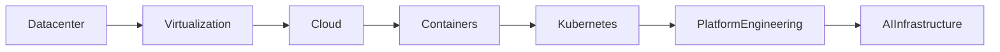

---

# 5. On-Premise vs Cloud

```text
On Premise

Company

↓

Servers

↓

Networking

↓

Storage

↓

Applications

----------------------

Cloud

Cloud Provider

↓

Infrastructure

↓

Linux

↓

Applications
```

---

# 6. IaaS PaaS SaaS

```text
SaaS

↓

PaaS

↓

IaaS

↓

Virtualization

↓

Hardware
```

---

# 7. Cloud Provider Architecture

```text
Cloud Provider

↓

Regions

↓

Availability Zones

↓

VPC

↓

Subnets

↓

Linux
```

---

# 8. Cloud Provider Mermaid

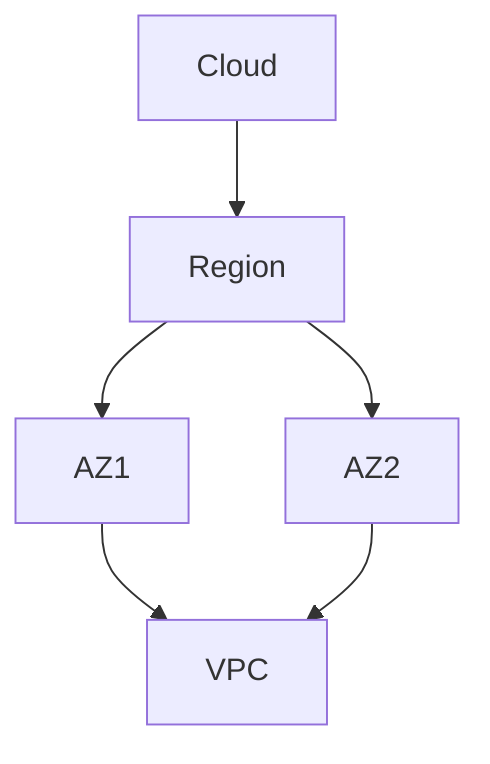

---

# 9. Linux In Cloud

```text
Cloud

↓

Linux

↓

Docker

↓

Kubernetes

↓

Applications
```

---

# 10. Virtual Machine Stack

```text
Applications

↓

Linux

↓

Virtual Machine

↓

Hypervisor

↓

Hardware
```

---

# 11. Virtual Machine Mermaid

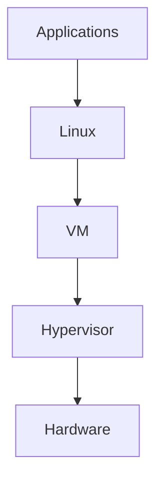

---

# 12. Cloud Instance Lifecycle

```text
Create

↓

Boot

↓

Configure

↓

Run

↓

Scale

↓

Terminate
```

---

# 13. Autoscaling

```text
Traffic

↓

Metrics

↓

Autoscaler

↓

Linux Fleet
```

---

# 14. Autoscaling Mermaid

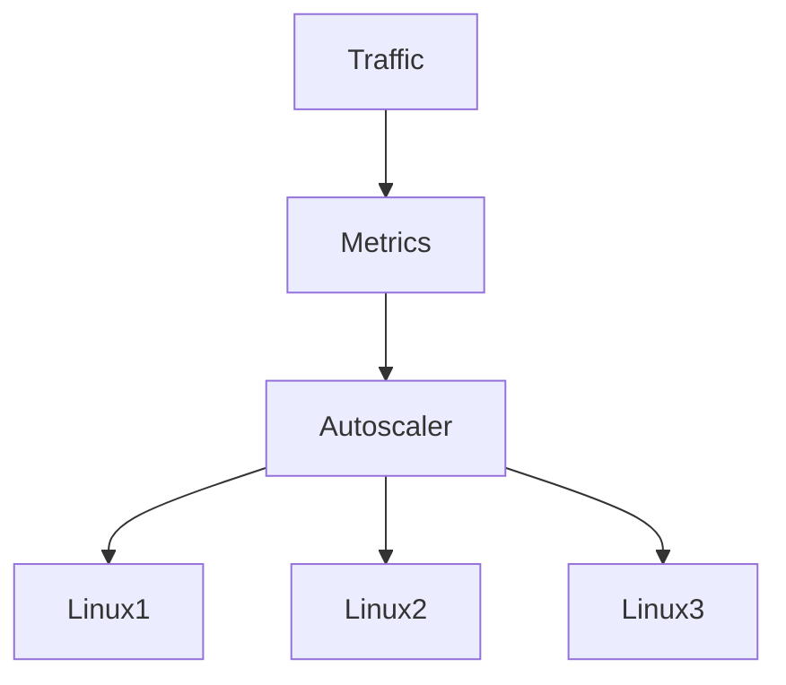

---

# 15. Networking Hierarchy

```text
Internet

↓

Internet Gateway

↓

VPC

↓

Subnets

↓

Linux

↓

Docker

↓

Containers
```

---

# 16. VPC Architecture

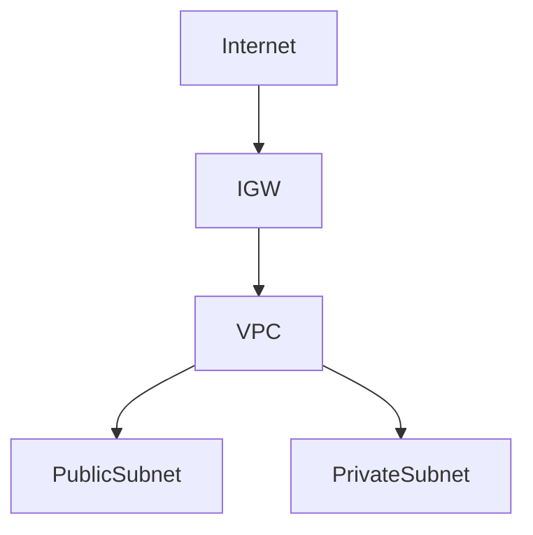

---

# 17. Subnet Architecture

```text
VPC

↓

Public Subnet

↓

Private Subnet

↓

Database Subnet
```

---

# 18. Three Tier Architecture

```text
Internet

↓

Load Balancer

↓

Application Servers

↓

Database
```

---

# 19. Three Tier Mermaid

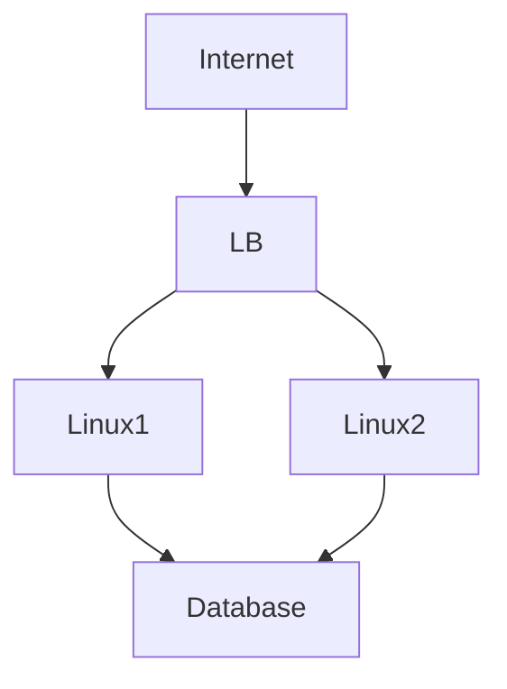

---

# 20. NAT Gateway Architecture

```text
Linux

↓

NAT Gateway

↓

Internet
```

---

# 21. NAT Gateway Mermaid

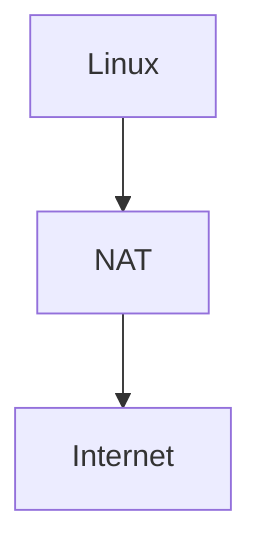

---

# 22. Load Balancer Architecture

```text
Users

↓

Load Balancer

↓

Linux Fleet
```

---

# 23. Load Balancer Mermaid

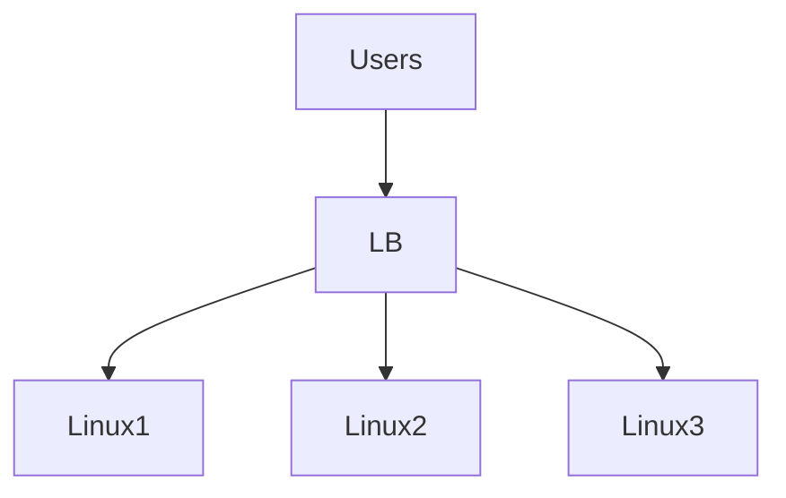

---

# 24. Storage Hierarchy

```text
Storage

├── Block Storage

├── File Storage

└── Object Storage
```

---

# 25. Storage Comparison

```text
Block

↓

Filesystem

↓

Applications

----------------

File

↓

Shared Filesystem

↓

Applications

----------------

Object

↓

API

↓

Objects
```

---

# 26. Block Storage Architecture

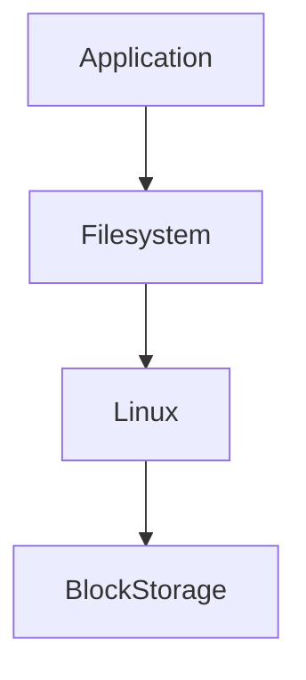

---

# 27. File Storage Architecture

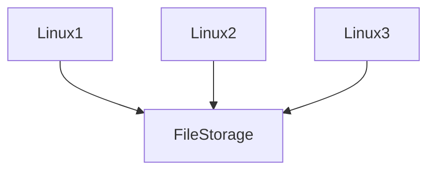

---

# 28. Object Storage Architecture

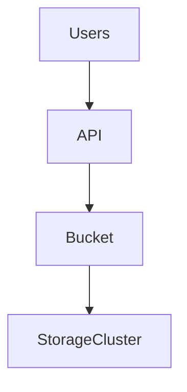

---

# 29. IAM Architecture

```text
Identity

↓

Policy

↓

Decision

↓

Resource
```

---

# 30. IAM Mermaid

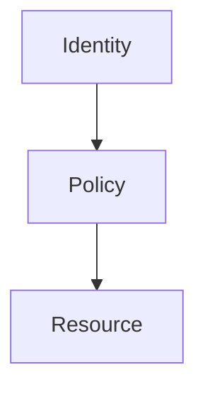

---

# 31. Defense In Depth

```text
IAM

↓

VPC

↓

Subnets

↓

Security Groups

↓

Linux Firewall

↓

Applications
```

---

# 32. Security Mermaid

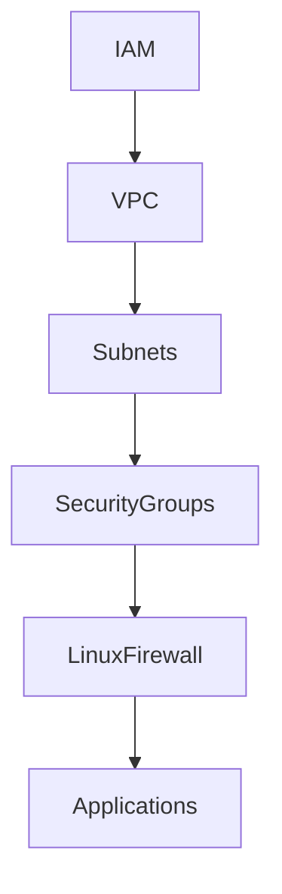

---

# 33. Kubernetes Relationship

```text
Cloud

↓

Linux

↓

Containers

↓

Kubernetes

↓

Applications
```

---

# 34. Kubernetes Mermaid

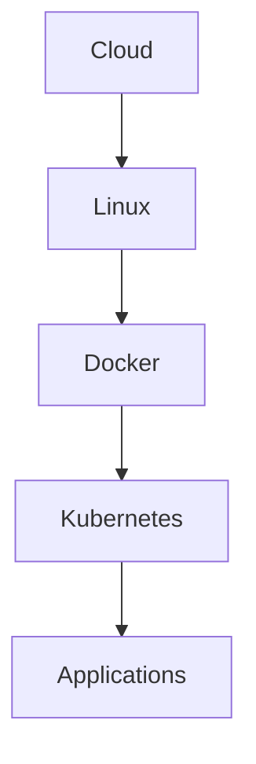

---

# 35. Docker Relationship

```text
Linux

↓

Docker

↓

Containers
```

---

# 36. Distributed Systems

```text
Users

↓

Load Balancer

↓

Linux Fleet

↓

Databases
```

---

# 37. Distributed Systems Mermaid

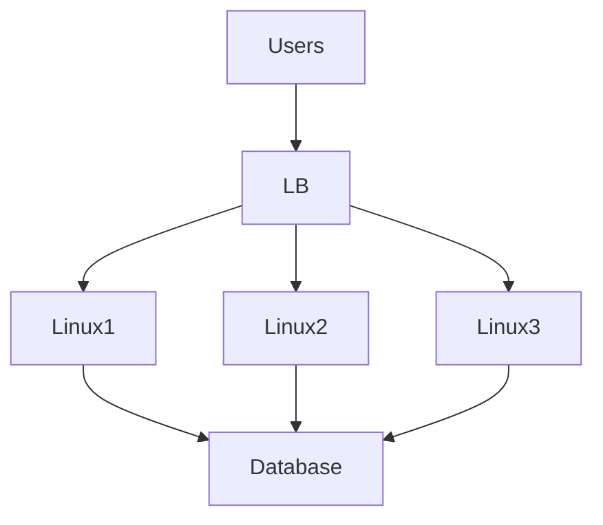

---

# 38. Production MERN Architecture

```text
Users

↓

CDN

↓

Load Balancer

↓

Node.js

↓

Redis

↓

PostgreSQL

↓

Object Storage
```

---

# 39. Production MERN Mermaid

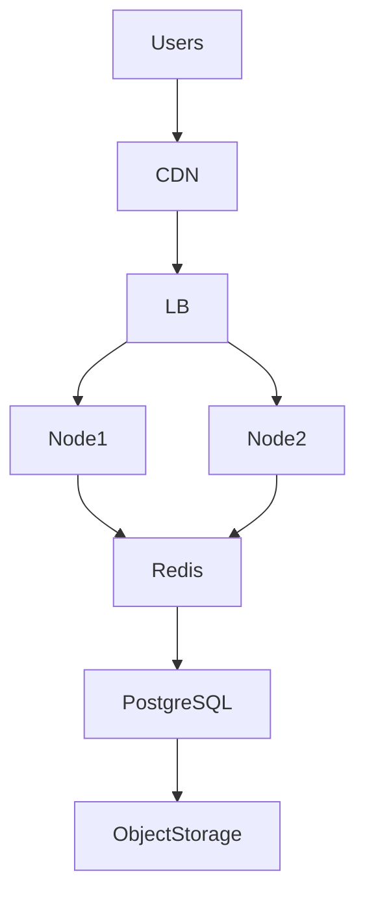

---

# 40. Startup Evolution

```text
Linux

↓

Multiple Linux Servers

↓

Docker

↓

Kubernetes

↓

Global Infrastructure
```

---

# 41. Founder View

```text
Users

↓

Infrastructure

↓

Applications

↓

Revenue
```

---

# 42. Complete Cloud Ecosystem

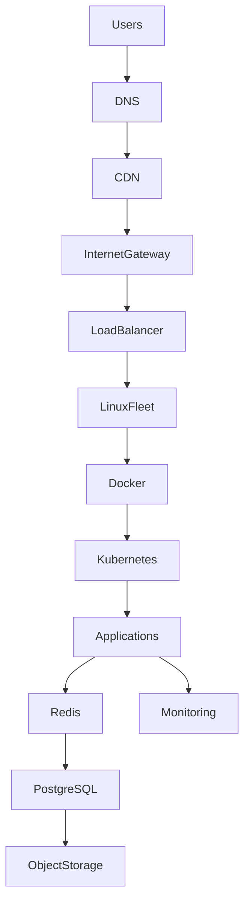

---

# 43. Complete Layer Cake

```text
Users

↓

Internet

↓

Networking

↓

Linux

↓

Containers

↓

Applications

↓

Data

↓

Business
```

---

# 44. Engineer Evolution

```text
Beginner

↓

Linux User

↓

Linux Engineer

↓

Cloud Engineer

↓

DevOps Engineer

↓

SRE

↓

Platform Engineer

↓

System Architect

↓

Founder
```

---

# 45. Ultimate Mental Model

```text
Physical Data Center

↓

Virtualization

↓

Cloud

↓

Linux

↓

Containers

↓

Distributed Systems

↓

Businesses
```

# Final Thought

Most people see:

```text
AWS

Azure

GCP
```

Great engineers see:

```text
CPU

↓

Memory

↓

Storage

↓

Network

↓

Linux

↓

Distributed Systems

↓

Business Systems
```

That is the purpose of this repository.
