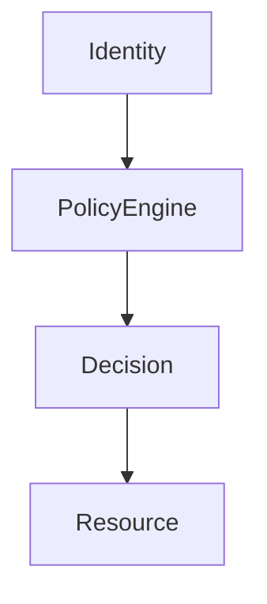
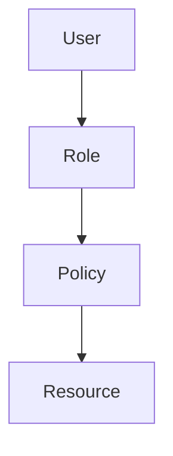
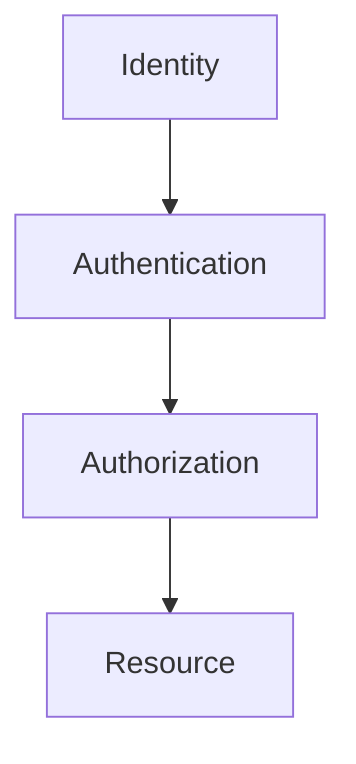

# IAM Fundamentals (Identity And Access Management)

# Why This Exists

One of the biggest misconceptions beginners have is:

> IAM is a cloud feature.

Wrong.

IAM is a security engineering concept.

Cloud providers simply implemented it at planetary scale.

Without IAM:

```text
Anyone

↓

Can Access

↓

Everything
```

Chaos.

Modern systems require control.

Questions every system must answer:

```text
Who are you?

What can you access?

When can you access it?

From where can you access it?

What actions can you perform?
```

IAM answers all of them.

---

# The Problem It Solves

Imagine a company.

Infrastructure:

```text
100 Linux Servers

50 Databases

20 Kubernetes Clusters

Thousands Of Employees
```

Question:

> Who can access what?

Without IAM:

```text
Everyone

↓

Everything
```

Huge security disaster.

We need boundaries.

IAM creates those boundaries.

---

# Mental Model

Think of a giant office building.

Different people exist.

```text
Employees

Managers

Security Team

CEO

Visitors
```

Not everyone can enter every room.

Access is controlled.

IAM works the same way.

---

# First Principles

Every secure system answers four questions.

```text
Who?

What?

Where?

When?
```

These become:

```text
Identity

Authorization

Context

Policies
```

---

# What Is IAM?

IAM is:

> A system that controls who can access resources and what actions they can perform.

Think:

```text
Identity

+

Policies

+

Permissions

=

Secure Infrastructure
```

---

# Big Picture Architecture



---

# The Four Pillars

IAM consists of:

```text
Identity

Authentication

Authorization

Auditing
```

Everything builds on these.

---

# Identity

Question:

> Who are you?

Examples:

```text
Human User

Service Account

Application

Machine

AI Agent
```

Everything gets an identity.

---

# Authentication

Question:

> Can you prove who you are?

Examples:

```text
Password

SSH Key

MFA

Certificate

Token
```

---

# Authorization

Question:

> What can you do?

Examples:

```text
Read

Write

Delete

Create

Modify
```

---

# Auditing

Question:

> What happened?

Everything gets logged.

```text
Who

When

What

Where
```

---

# Linux Relationship

Linux already has IAM concepts.

Linux users:

```text
alice

bob

postgres
```

Linux groups:

```text
developers

admins

database
```

Linux permissions:

```text
rwx
```

Cloud IAM simply scales this idea.

---

# Evolution

## Linux

```text
User

↓

Group

↓

Permissions
```

---

## Cloud

```text
Identity

↓

Policies

↓

Resources

↓

Infrastructure
```

Same philosophy.

Larger scale.

---

# IAM Components

```text
IAM

├── Users
├── Groups
├── Roles
├── Policies
├── Permissions
├── Service Accounts
└── Audit Logs
```

---

# Users

Humans.

Examples:

```text
Developer

Admin

Engineer

Manager
```

---

# Groups

Collections of users.

Examples:

```text
Backend Team

DevOps Team

Security Team
```

Never manage individuals one by one.

---

# Roles

Roles define responsibilities.

Examples:

```text
ReadOnly

Developer

DatabaseAdmin

Administrator
```

Roles simplify permissions.

---

# Policies

Policies define rules.

Example:

```text
Allow

↓

Read Storage

Deny

↓

Delete Database
```

Policies are the brain of IAM.

---

# Permission Flow



---

# Service Accounts

Very important.

Machines also need identities.

Examples:

```text
Applications

Containers

VMs

Kubernetes Pods

CI/CD Systems
```

Machines should not impersonate humans.

---

# Why Machines Need IAM

Suppose:

```text
Node.js

↓

Database
```

Question:

> How does Node.js prove its identity?

Service accounts solve this.

---

# Linux Perspective

Old thinking:

```text
SSH Into Server

↓

Use Root
```

Modern thinking:

```text
Identity

↓

Temporary Permissions

↓

Least Privilege
```

Huge shift.

---

# Principle Of Least Privilege

One of the most important concepts.

Give only necessary access.

Bad:

```text
Administrator

To Everyone
```

Good:

```text
Read Access

To Readers

Write Access

To Writers
```

Minimal permissions.

---

# Zero Trust Architecture

Old mindset:

```text
Inside Network

↓

Trusted
```

Wrong.

Modern mindset:

```text
Verify Everything
```

Always verify identity.

---

# Zero Trust Visualization



Trust is never assumed.

---

# RBAC

Role Based Access Control.

Permissions based on roles.

Example:

```text
Developer

↓

Read Code

Deploy App

No Database Delete
```

---

# ABAC

Attribute Based Access Control.

Permissions depend on context.

Examples:

```text
Time

Region

Device

Department
```

Smarter systems use ABAC.

---

# Policy Evaluation

The engine asks:

```text
Who?

↓

What?

↓

Resource?

↓

Context?

↓

Allow Or Deny?
```

---

# Data Flow Example

Developer accesses database.

```text
Developer

↓

IAM

↓

Policy Engine

↓

Decision

↓

Database
```

---

# Kubernetes Relationship

Kubernetes heavily depends on IAM.

Architecture:

```text
Identity

↓

RBAC

↓

Namespaces

↓

Pods
```

Everything uses identities.

---

# Docker Relationship

Containers should never run as root.

Bad:

```text
Root Container
```

Good:

```text
Dedicated Identity
```

---

# Cloud Relationship

Every cloud system uses IAM.

Examples:

```text
AWS IAM

Azure Entra ID

GCP IAM
```

Different names.

Same philosophy.

---

# Production Example: MERN Stack

Architecture:

```text
Users

↓

Frontend

↓

Backend

↓

Database

↓

Storage
```

Permissions:

```text
Frontend

↓

Backend Only

Backend

↓

Database Access

Database

↓

No Public Access
```

Everything is controlled.

---

# AI Relationship

AI systems need IAM too.

Examples:

```text
AI Models

Datasets

GPU Clusters

Inference Systems
```

AI infrastructure is infrastructure.

---

# Security Layers

Defense in depth.

```text
IAM

↓

VPC

↓

Subnets

↓

Security Groups

↓

Linux Firewall

↓

Applications
```

Many layers exist.

---

# Performance Considerations

Watch:

```text
Policy Complexity

Token Validation

Authentication Latency
```

Overly complex IAM slows systems.

---

# Security Considerations

Always enforce:

```text
Least Privilege

MFA

Temporary Credentials

Audit Logs

Zero Trust
```

---

# Scalability Considerations

Never manage:

```text
1000 Users Individually
```

Manage:

```text
Groups

Roles

Policies
```

Scale abstractions.

---

# Observability Considerations

Monitor:

```text
Logins

Permission Changes

Failures

Token Usage

Suspicious Activity
```

Security systems require visibility.

---

# Troubleshooting Workflow

Access denied.

Check:

```text
Identity

↓

Authentication

↓

Role

↓

Policy

↓

Resource
```

Always debug layer by layer.

---

# Common Mistakes

## Mistake 1

Giving everyone admin access.

Huge security risk.

---

## Mistake 2

Using permanent credentials.

Use temporary credentials.

---

## Mistake 3

Sharing accounts.

Never do this.

---

## Mistake 4

Ignoring audit logs.

Very dangerous.

---

## Mistake 5

Trusting internal networks.

Zero trust is the future.

---

# Engineering Mindset

Beginner:

> IAM manages users.

Engineer:

> IAM manages permissions.

Senior:

> IAM secures infrastructure.

Architect:

> IAM is a distributed authorization system.

Founder:

> Security enables business continuity.

---

# Interview Questions

## Beginner

1. What is IAM?

2. Why does IAM exist?

3. What is authentication?

4. What is authorization?

5. What is least privilege?

---

## Intermediate

6. Explain IAM architecture.

7. Explain RBAC.

8. Explain ABAC.

9. Explain service accounts.

10. Explain zero trust.

---

## Advanced

11. Explain IAM from first principles.

12. Explain policy engines.

13. Explain distributed authorization.

14. Explain Kubernetes security.

15. Design IAM for a startup with 1000 employees.

---

# Cheat Sheet

```text
IAM = Distributed Authorization System

Questions

Who?

What?

Where?

When?

Core Components

Identity

Authentication

Authorization

Auditing

Modern Stack

Identity

↓

Policies

↓

Resources

↓

Infrastructure

Security Principles

Least Privilege

Zero Trust

Temporary Credentials

Audit Everything

Mindset

IAM = Linux Users & Groups at planetary scale.
```

# Final Thought

IAM is one of the technologies that transformed security from:

```text
One User

↓

One Server
```

into:

```text
Millions Of Identities

↓

Millions Of Resources

↓

One Secure System
```

Modern infrastructure is not built around machines.

It is built around identities.

In the future:

> Everything will have an identity.

Humans.

Applications.

Containers.

AI Agents.

Machines.

The engineers who understand IAM deeply will understand the foundation of modern security engineering.
