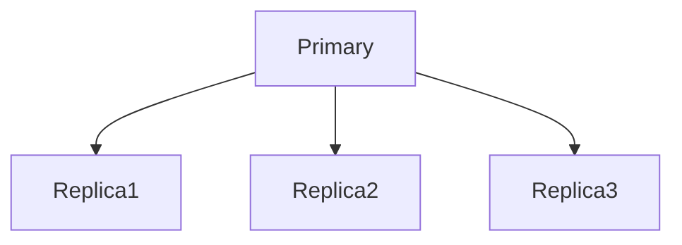
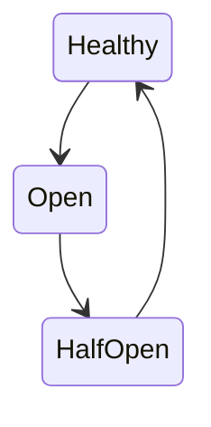
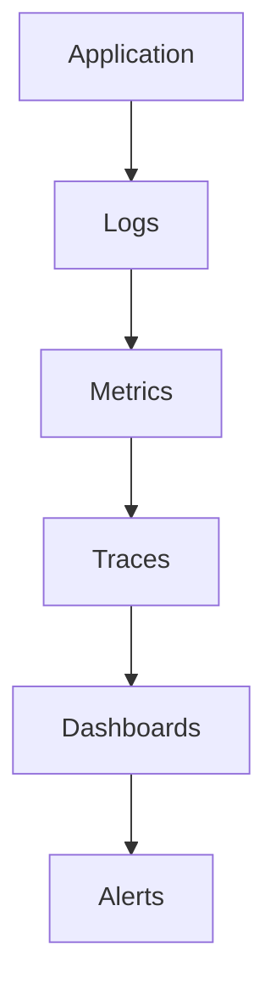

# Building Reliable Systems From Unreliable Components

# Why this file exists

This file may be the single most important philosophy file in the entire distributed systems repository.

Because this sentence explains almost the entire field.

> Distributed systems is the art of building reliable experiences from unreliable components.

The internet is built on unreliable things.

Servers fail.

Disks fail.

Networks fail.

DNS fails.

Regions fail.

Humans fail.

Yet users expect this:

```text
Fast

Reliable

Always available
```

This file exists to answer one question.

> How do we create reliable systems when every individual component is unreliable?

This is the central problem of modern engineering.

---

# The Biggest Misconception

Beginners think:

```text
Reliable computers

↓

Reliable systems
```

Wrong.

Reality:

```text
Unreliable computers

↓

Reliable systems
```

That is engineering.

---

# Mental Model: Building An Airplane

Imagine an airplane.

Every component has a probability of failure.

```text
Engine

Sensor

Computer

Electrical system

Hydraulics
```

Yet passengers expect:

```text
Safe flight
```

Why?

Because airplanes are engineered around failures.

Distributed systems work the same way.

---

## Visual

```mermaid
flowchart TD

UnreliableParts

↓

Engineering

↓

ReliableAirplane
```

---

# The Universal Truth

Every component eventually fails.

No exceptions.

---

# What Can Fail?

```text
CPU

Memory

Disk

Network

Services

Containers

Databases

Regions

Humans
```

---

## Visual

```mermaid
mindmap

root((Failures))

CPU

Memory

Disk

Network

DNS

Services

Databases

Regions

Humans
```

Failures are normal.

---

# The Reliability Equation

Users expect:

```text
99.99% uptime
```

Reality:

```text
0% reliable components do not exist
```

Therefore:

```text
Reliability

≠

Perfect machines
```

Reliability is architecture.

---

# The Universal Architecture

```mermaid
flowchart TD

UnreliableMachines

↓

Redundancy

↓

Replication

↓

Retries

↓

LoadBalancing

↓

Observability

↓

ReliableExperience
```

This diagram explains most of distributed systems.

---

# Mental Model: The Human Body

Humans are excellent examples.

Cells die constantly.

Yet humans survive.

Why?

Because humans have redundancy.

Examples:

```text
Two lungs

Two kidneys

Millions of cells
```

Nature builds reliable systems from unreliable components.

Engineering copies nature.

---

## Visual

```mermaid
mindmap

root((Human Redundancy))

Lung1

Lung2

Kidney1

Kidney2

MillionsOfCells
```

---

# Principle 1

# Redundancy

Never trust one machine.

Bad:

```text
1 server
```

Good:

```text
3 servers
```

---

## Visual


If one dies.

System survives.

---

# Principle 2

# Replication

Copy important data.

Never store one copy.

---

## Visual



Replication is insurance.

---

# Principle 3

# Load Balancing

Distribute traffic.

Bad:

```text
100000 users

↓

1 server
```

Good:

```text
100000 users

↓

10 servers
```

---

## Visual

```mermaid
flowchart TD

Users

↓

LoadBalancer

↓

Server1

LoadBalancer --> Server2

LoadBalancer --> Server3

LoadBalancer --> Server4
```

---

# Principle 4

# Health Checks

Detect unhealthy systems.

---

## Visual

```mermaid
flowchart TD

LoadBalancer

↓

HealthCheck

HealthCheck --> Healthy

HealthCheck -.Fail.-> RemoveNode
```

Bad nodes are removed.

---

# Principle 5

# Automatic Recovery

Do not depend on humans.

Systems should heal themselves.

---

## Visual

```mermaid
flowchart TD

Failure

↓

Detection

↓

Replacement

↓

Recovery
```

Automation increases reliability.

---

# Principle 6

# Retries

Temporary failures happen.

Retry carefully.

---

## Visual

```mermaid
flowchart TD

Request

↓

Failure

↓

Retry

↓

Success
```

Retries are useful.

But dangerous.

---

# Retry Storm Problem

Bad retries kill systems.

---

## Visual

```mermaid
flowchart TD

SlowAPI

↓

Timeout

↓

Retry

↓

TrafficExplosion

↓

Outage
```

Retries need limits.

---

# Principle 7

# Timeouts

Never wait forever.

Bad:

```text
Infinite waiting
```

Good:

```text
5 second timeout
```

---

## Visual

```mermaid
flowchart TD

Request

↓

Timeout

↓

Fallback
```

Timeouts prevent cascading failures.

---

# Principle 8

# Circuit Breakers

Stop talking to broken systems.

---

## Visual



Circuit breakers protect systems.

---

# Principle 9

# Isolation

Failures should stay local.

---

# Bad Architecture

```mermaid
flowchart TD

Database

↓

EverythingFails
```

Single points of failure are dangerous.

---

# Good Architecture

```mermaid
flowchart TD

Failure

↓

SmallComponent

↓

ContainedImpact
```

Reduce blast radius.

---

# Principle 10

# Observability

Invisible systems cannot become reliable.

Observe:

```text
Logs

Metrics

Traces

Alerts
```

---

## Visual



Observability creates visibility.

---

# Principle 11

# Graceful Degradation

Not everything must fail.

Example:

Bad:

```text
Recommendation engine down

↓

Entire website down
```

Good:

```text
Recommendation engine down

↓

Hide recommendations

↓

Website works
```

---

## Visual

```mermaid
flowchart TD

RecommendationFailure

↓

DisableFeature

↓

ApplicationContinues
```

---

# Principle 12

# Eliminate Single Points Of Failure

Always ask:

```text
If this dies

Does everything die?
```

If yes.

Fix it.

---

## Visual

```mermaid
flowchart TD

SinglePointOfFailure

↓

GlobalOutage
```

Avoid this.

---

# Reliability Hierarchy

```mermaid
flowchart TD

SingleServer

↓

ReplicatedServers

↓

Clusters

↓

MultiAZ

↓

MultiRegion

↓

GlobalInfrastructure
```

Reliability increases gradually.

---

# Reliability Is Layers

No single tool creates reliability.

---

## Visual

```mermaid
flowchart TD

Redundancy

↓

Replication

↓

LoadBalancing

↓

Caching

↓

Observability

↓

Automation

↓

ReliableExperience
```

Layers create reliability.

---

# Reliability Is A Probability Game

Question:

```text
What is the probability all machines fail simultaneously?
```

With one server:

```text
High risk
```

With three servers:

```text
Lower risk
```

Probability becomes your friend.

---

# Why Netflix Is Reliable

Netflix assumes failures happen constantly.

Solutions:

```text
CDNs

Replication

Caching

Health checks

Traffic rerouting
```

Failures are normal operations.

---

## Visual

```mermaid
flowchart TD

Users

↓

CDN

↓

Gateway

↓

Services

↓

Cache

↓

Databases

↓

Storage
```

Many layers create reliability.

---

# Why Google Is Reliable

Google never trusts one component.

Everything is redundant.

---

# The Reliability Pyramid

```text
Reliable User Experience

Observability

Automation

Redundancy

Replication

Linux

Hardware
```

---

# Linux Connection

Linux is reliability infrastructure.

Linux manages:

```text
Processes

Networking

Memory

Storage

Security

Isolation
```

Linux failures become distributed failures.

---

## Visual

```mermaid
flowchart TD

Application

↓

Linux

Linux --> CPU

Linux --> Memory

Linux --> Disk

Linux --> Network
```

Linux is the foundation.

---

# Linux Reliability Tools

Process management:

```bash
systemctl

journalctl
```

Resource monitoring:

```bash
top

htop

free -h

vmstat
```

Networking:

```bash
ping

ss

ip route

tcpdump
```

Storage:

```bash
iostat

df -h
```

Observability:

```bash
sar
```

---

# The Reliability Maturity Model

Level 1:

```text
Hope it works.
```

Level 2:

```text
Monitor failures.
```

Level 3:

```text
Recover automatically.
```

Level 4:

```text
Users never notice failures.
```

---

## Visual

```mermaid
flowchart TD

Hope

↓

Monitor

↓

Automate

↓

InvisibleFailures
```

---

# Performance Implications

Reliability is expensive.

It increases:

```text
Cost

Complexity

Coordination
```

Tradeoffs exist.

---

# Security Implications

Security also improves reliability.

Protect:

```text
Identity

Secrets

Certificates

Networks
```

Attackers are another failure source.

---

# Common Beginner Mistakes

## Mistake 1

Trusting one machine.

---

## Mistake 2

Ignoring failures.

---

## Mistake 3

Depending on humans.

---

## Mistake 4

Ignoring observability.

---

## Mistake 5

Creating single points of failure.

---

# Engineering Mindset

Junior engineer:

```text
How do I build this?
```

Mid engineer:

```text
How do I scale this?
```

Senior engineer:

```text
How does this fail?
```

Staff engineer:

```text
How does this recover?
```

Principal engineer:

```text
How do I make failures invisible?
```

---

# Interview Questions

## Beginner

1. Why are distributed systems built from unreliable components?

2. Why is redundancy important?

3. Why is replication necessary?

4. Why do load balancers exist?

5. Why is observability mandatory?

---

## Intermediate

6. Why do retries become dangerous?

7. Why are timeouts important?

8. Why are circuit breakers useful?

9. Why is graceful degradation important?

10. Why is automation necessary?

---

## Advanced

11. Why is reliability an architectural property?

12. Why is Netflix highly reliable?

13. Why do probabilities matter?

14. Why does Linux influence reliability?

15. Why do senior engineers design for invisible failures?

---

# Cheat Sheet

```text
Reliable Systems

=

Reliable Experiences

≠

Reliable Machines

Principles:

Redundancy

Replication

Load Balancing

Health Checks

Retries

Timeouts

Circuit Breakers

Isolation

Observability

Automation

Golden Rule:

Build reliable experiences

from unreliable components.
```

---

# Final Thought

This sentence summarizes the entire field.

```text
The internet is not built

from perfect computers.

It is built from imperfect computers

that are engineered

to fail safely.
```

That is distributed systems engineering.
